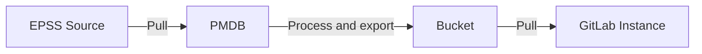
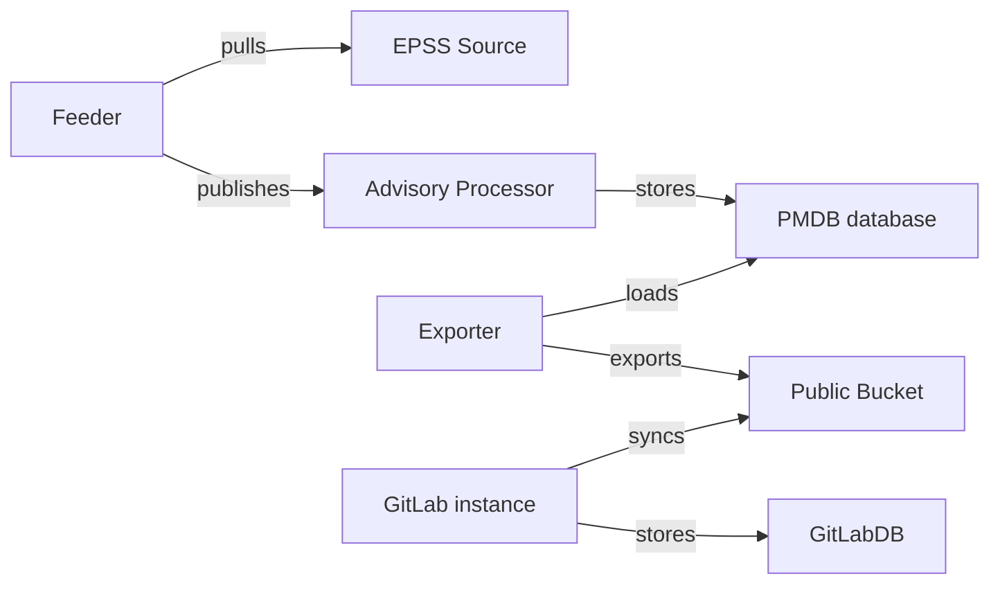

<!--
Before you start:

- Copy this file to a sub-directory and call it `index.md` for it to appear in
  the blueprint directory.
- Remove comment blocks for sections you've filled in.
  When your blueprint ready for review, all of these comment blocks should be
  removed.

To get started with a blueprint you can use this template to inform you about
what you may want to document in it at the beginning. This content will change
/ evolve as you move forward with the proposal.  You are not constrained by the
content in this template. If you have a good idea about what should be in your
blueprint, you can ignore the template, but if you don't know yet what should
be in it, this template might be handy.

- **Fill out this file as best you can.** At minimum, you should fill in the
  "Summary", and "Motivation" sections.  These can be brief and may be a copy
  of issue or epic descriptions if the initiative is already on Product's
  roadmap.
- **Create a MR for this blueprint.** Assign it to an Architecture Evolution
  Coach (i.e. a Principal+ engineer).
- **Merge early and iterate.** Avoid getting hung up on specific details and
  instead aim to get the goals of the blueprint clarified and merged quickly.
  The best way to do this is to just start with the high-level sections and fill
  out details incrementally in subsequent MRs.

Just because a blueprint is merged does not mean it is complete or approved.
Any blueprint is a working document and subject to change at any time.

When editing blueprints, aim for tightly-scoped, single-topic MRs to keep
discussions focused. If you disagree with what is already in a document, open a
new MR with suggested changes.

If there are new details that belong in the blueprint, edit the blueprint. Once
a feature has become "implemented", major changes should get new blueprints.

The canonical place for the latest set of instructions (and the likely source
of this file) is [here](/doc/architecture/blueprints/_template.md).

Blueprint statuses you can use:

- "proposed"
- "accepted"
- "ongoing"
- "implemented"
- "postponed"
- "rejected"

-->

<!-- Blueprints often contain forward-looking statements -->
<!-- vale gitlab.FutureTense = NO -->

# EPSS Support

<!--
This is the title of your blueprint. Keep it short, simple, and descriptive. A
good title can help communicate what the blueprint is and should be considered
as part of any review.
-->

<!--
For long pages, consider creating a table of contents.
The `[_TOC_]` function is not supported on docs.gitlab.com.
-->

## Summary

[EPSS](https://www.first.org/epss/faq) scores specify the likelihood a CVE will be exploited in the next 30 days. This data may be used to improve and simplify prioritization efforts when remediating vulnerabilities in a project. EPSS support requirements are outlined in [the EPSS epic](https://gitlab.com/groups/gitlab-org/-/epics/11544) along with an overview of EPSS. This document focuses on the technical implementation of EPSS support.

EPSS scores may be populated from the [EPSS Data page](https://www.first.org/epss/data_stats) or through their provided API. Ultimately, EPSS scores should be reachable through the GitLab GraphQL API, as seen on the vulnerability report and details pages, and be filterable and usable when setting policies.

Package metadata database (PMDB, also known as license-db), an existing advisory pull-and-enrichment method, is for this purpose. The flow is as follows:

<!--
This section is very important, because very often it is the only section that
will be read by team members. We sometimes call it an "Executive summary",
because executives usually don't have time to read entire document like this.
Focus on writing this section in a way that anyone can understand what it says,
the audience here is everyone: executives, product managers, engineers, wider
community members.

A good summary is probably at least a paragraph in length.
-->

## Motivation

The classic approach to vulnerability prioritization is using severity based on [CVSS](https://www.first.org/cvss/). This approach provides some guidance, but is too unrefined—more than half of all published CVEs have a high or critical score. Other metrics need to be employed to reduce remediation fatigue and help developers prioritize their work better. EPSS provides a metric to identify which vulnerabilities are most likely to be exploited in the near future. Combined with existing prioritization methods, EPSS helps to focus remediation efforts better and reduce remediation workload. By adding EPSS to the information presented to users, we deliver these benefits to the GitLab platform.

<!--
This section is for explicitly listing the motivation, goals and non-goals of
this blueprint. Describe why the change is important, all the opportunities,
and the benefits to users.

The motivation section can optionally provide links to issues that demonstrate
interest in a blueprint within the wider GitLab community. Links to
documentation for competing products and services is also encouraged in cases
where they demonstrate clear gaps in the functionality GitLab provides.

For concrete proposals we recommend laying out goals and non-goals explicitly,
but this section may be framed in terms of problem statements, challenges, or
opportunities. The latter may be a more suitable framework in cases where the
problem is not well-defined or design details not yet established.
-->

### Goals

- Enable users to use EPSS scores on GitLab as another metric for their vulnerability prioritization efforts.
- Provide scalable means of efficiently repopulating recurring EPSS scores to minimize system load.

#### Phase 1 (MVC)

- Enable access to EPSS scores through GraphQL API.

#### Phase 2

- Show EPSS scores in vulnerability report and details pages.

#### Phase 3

- Allow filtering vulnerabilities based on EPSS scores.
- Allow creating policies based on EPSS scores.

<!--
List the specific goals / opportunities of the blueprint.

- What is it trying to achieve?
- How will we know that this has succeeded?
- What are other less tangible opportunities here?
-->

### Non-Goals

- Dictate priority to users based on EPSS (or any other metric).

<!--
Listing non-goals helps to focus discussion and make progress. This section is
optional.

- What is out of scope for this blueprint?
-->

## Proposal

Support EPSS on the GitLab platform.

Following the discussions in the [EPSS epic](https://gitlab.com/groups/gitlab-org/-/epics/11544), the proposed flow is:

1. PMDB database is extended with a new table to store EPSS scores.
1. PMDB infrastructure runs the feeder daily in order to pull and process EPSS data. 
1. The advisory-processor receives the EPSS data and stores them to the PMDB DB.
1. PMDB exports EPSS data to existing PMDB advisories bucket.
    - Create a new directory in the existing bucket to store EPSS data.
    - Delete former EPSS data once new data is uploaded, as the old data is no longer needed.
    - Truncate EPSS scores to two digits after the dot.
1. GitLab instances pull data from the PMDB bucket.
    - Create a new table in rails DB to store EPSS data.
1. GitLab instances expose EPSS data through GraphQL API and present data in vulnerability report and details pages.

<!--
This is where we get down to the specifics of what the proposal actually is,
but keep it simple!  This should have enough detail that reviewers can
understand exactly what you're proposing, but should not include things like
API designs or implementation. The "Design Details" section below is for the
real nitty-gritty.

You might want to consider including the pros and cons of the proposed solution so that they can be
compared with the pros and cons of alternatives.
-->

## Design and implementation details

### Important notes

- All EPSS scores get updated on a daily basis. This is pivotal to this feature's design.
- The [fields retrieved](https://www.first.org/epss/data_stats) from the EPSS source are `cve`, `score`, `percentile`. 9 digits after the dot are maintained.
  - To reduce the amount of upserts, based on a [spike to check magnitude of change](https://gitlab.com/gitlab-org/gitlab/-/issues/468286), we will truncate EPSS scores to two digits after the dot.

### PMDB

- Create a new EPSS table in [PMDB](https://gitlab.com/gitlab-org/security-products/license-db) with an advisory identifier and the EPSS score. This includes changing the [schema](https://gitlab.com/gitlab-org/security-products/license-db/schema) and any necessary migrations.
- Ingest EPSS data into new PMDB table. We want to keep the EPSS data structure as close as possible to the origin so all of the data may be available to the exporter, and the exporter may choose how to process it. Therefore we will save scores and percentiles with their complete values.
- Export EPSS scores in separate directory in the advisories bucket.
  - Delete the previous day's export as it is no longer needed after the new one is added.
- Add new pubsub topics to deployment to be used by PMDB components, using existing terraform modules.

### GitLab Rails backend

- Create table in rails backend to hold EPSS scores.
- Configure Rails sync to ingest EPSS exports and save to new table.
- Include EPSS data attributes in GraphQL API Occurrence objects.

### GitLab UI

- Add EPSS data to vulnerability report page.
- Add EPSS data to vulnerability details page.
- Allow filtering by EPSS score.
- Allow creating policies based on EPSS score.

<!--
This section should contain enough information that the specifics of your
change are understandable. This may include API specs (though not always
required) or even code snippets. If there's any ambiguity about HOW your
proposal will be implemented, this is the place to discuss them.

If you are not sure how many implementation details you should include in the
blueprint, the rule of thumb here is to provide enough context for people to
understand the proposal. As you move forward with the implementation, you may
need to add more implementation details to the blueprint, as those may become
an important context for important technical decisions made along the way. A
blueprint is also a register of such technical decisions. If a technical
decision requires additional context before it can be made, you probably should
document this context in a blueprint. If it is a small technical decision that
can be made in a merge request by an author and a maintainer, you probably do
not need to document it here. The impact a technical decision will have is
another helpful information - if a technical decision is very impactful,
documenting it, along with associated implementation details, is advisable.

If it's helpful to include workflow diagrams or any other related images.
Diagrams authored in GitLab flavored markdown are preferred. In cases where
that is not feasible, images should be placed under `images/` in the same
directory as the `index.md` for the proposal.
-->

## Alternative Solutions

<!--
It might be a good idea to include a list of alternative solutions or paths considered, although it is not required. Include pros and cons for
each alternative solution/path.

"Do nothing" and its pros and cons could be included in the list too.
-->
