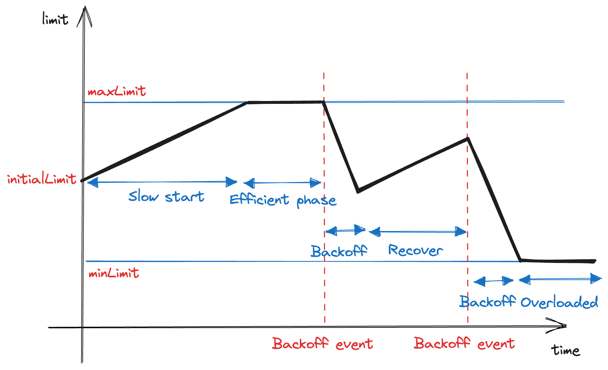

# Gitaly Adaptive Concurrency Limit

## Summary

Gitaly, a Git server, needs to push back on its clients to reduce the risk of
incidents. In the past, we introduced per-RPC concurrency limit and pack-objects
concurrency limit. Both systems were successful, but the configurations were
static, leading to some serious drawbacks. This blueprint proposes an adaptive
concurrency limit system to overcome the drawbacks of static limits. The
algorithm primarily uses the [Additive Increase/Multiplicative Decrease](https://en.wikipedia.org/wiki/Additive_increase/multiplicative_decrease)
approach to gradually increase the limit during normal processing but quickly
reduce it during an incident. The algorithm focuses on lack of resources and
serious latency degradation as criteria for determining when Gitaly is in
trouble.

## Motivation

To reduce the risk of incidents and protect itself, Gitaly should be able to
push back on its clients when it determines some limits have been reached. In
the [prior attempt](https://gitlab.com/groups/gitlab-org/-/epics/7891), we laid
out some foundations for [backpressure](https://gitlab.com/gitlab-org/gitaly/-/blob/382d1e57b2cf02763d3d65e31ff4d38f467b797c/doc/backpressure.md)
by introducing two systems: per-RPC concurrency limits and pack-objects
concurrency limits.

Per-RPC concurrency limits allows us to configure a maximum amount of in-flight
requests simultaneously. It scopes the limit by RPC and repository. Pack-objects
concurrency limit restricts the concurrent Git data transfer request by IP. One
note, the pack-objects concurrency limit is applied on cache misses, only. If
this limit is exceeded, the request is either put in a queue or rejected if the
queue is full. If the request remains in the queue for too long, it will also be
rejected.

Although both of them yielded promising results on GitLab.com, the
configurations, especially the value of the concurrency limit, are static. There
are some drawbacks to this:

- It's tedious to maintain a sane value for the concurrency limit. Looking at
  this [production configuration](https://gitlab.com/gitlab-com/gl-infra/chef-repo/-/blob/db11ef95859e42d656bb116c817402635e946a32/roles/gprd-base-stor-gitaly-common.json),
  each limit is heavily calibrated based on clues from different sources. When the
  overall scene changes, we need to tweak them again.
- Static limits are not good for all usage patterns. It's not feasible to pick a
  fit-them-all value. If the limit is too low, big users will be affected. If the
  value is too loose, the protection effect is lost.
- A request may be rejected even though the server is idle as the rate is not
  necessarily an indicator of the load induced on the server.

To overcome all of those drawbacks while keeping the benefits of concurrency
limiting, one promising solution is to make the concurrency limit adaptive to
the currently available processing capacity of the node. We call this proposed
new mode "Adaptive Concurrency Limit".

## Goals

- Make Gitaly smarter in push-back traffic when it's under heavy load, thus enhancing the reliability and resiliency of Gitaly.
- Minimize the occurrences of Gitaly saturation incidents.
- Decrease the possibility of clients inaccurately reaching the concurrency limit, thereby reducing the ResourceExhausted error rate.
- Facilitate seamless or fully automated calibration of the concurrency limit.

## Non-goals

- Increase the workload or complexity of the system for users or administrators. The adaptiveness proposed here aims for the opposite.

## Proposal

The proposed Adaptive Concurrency Limit algorithm primarily uses the Additive
Increase/Multiplicative Decrease ([AIMD](https://en.wikipedia.org/wiki/Additive_increase/multiplicative_decrease))
approach. This method involves gradually increasing the limit during normal
process functioning but quickly reducing it when an issue (backoff event)
occurs. There are various criteria for determining whether Gitaly is in trouble.
In this proposal, we focus on two things:

- Lack of resources, particularly memory and CPU, which are essential for
  handling Git processes.
- Serious latency degradation.

The proposed solution is heavily inspired by many materials about this subject
shared by folks from other companies in the industry, especially the following:

- TCP Congestion Control ([RFC-2581](https://www.rfc-editor.org/rfc/rfc2581), [RFC-5681](https://www.rfc-editor.org/rfc/rfc5681),
  [RFC-9293](https://www.rfc-editor.org/rfc/rfc9293.html#name-tcp-congestion-control), [Computer Networks: A Systems Approach](https://book.systemsapproach.org/congestion/tcpcc.html)).
- Netflix adaptive concurrency limit ([blog post](https://tech.olx.com/load-shedding-with-nginx-using-adaptive-concurrency-control-part-1-e59c7da6a6df)
  and [implementation](https://github.com/Netflix/concurrency-limits))
- Envoy Adaptive Concurrency
  ([doc](https://www.envoyproxy.io/docs/envoy/latest/configuration/http/http_filters/adaptive_concurrency_filter#config-http-filters-adaptive-concurrency))

We cannot blindly apply a solution without careful consideration and expect it
to function flawlessly. The suggested approach considers Gitaly's specific
constraints and distinguishing features, including cgroup utilization and
upload-pack RPC, among others.

The proposed solution does not aim to replace the existing limits in Gitaly
for [RPC concurrency](../../../administration/gitaly/concurrency_limiting.md#limit-rpc-concurrency)
and [pack object concurrency](../../../administration/gitaly/concurrency_limiting.md#limit-pack-objects-concurrency),
but automatically tweak the parameters. This means
that other aspects, such as queuing, in-queue timeout, queue length,
partitioning, and scoping, will remain unchanged. The proposed solution only
focuses on modifying the current **value** of the concurrency limit.

## Design and implementation details

### AIMD Algorithm

The Adaptive Concurrency Limit algorithm primarily uses the Additive
Increase/Multiplicative Decrease ([AIMD](https://en.wikipedia.org/wiki/Additive_increase/multiplicative_decrease))
approach. This method involves gradually increasing the limit during normal
process functioning but quickly reducing it when an issue occurs.

During initialization, we configure the following parameters:

- `initialLimit`: Concurrency limit to start with. This value is essentially
  equal to the current static concurrency limit.
- `maxLimit`: Maximum concurrency limit.
- `minLimit`: Minimum concurrency limit so that the process is considered as
  functioning. If it's equal to 0, it rejects all upcoming requests.
- `backoffFactor`: how fast the limit decreases when a backoff event occurs (`0 < backoff < 1`, default to `0.75`)

When the Gitaly process starts, it sets `limit = initialLimit`, in which `limit`
is the maximum in-flight requests allowed at a time.

Periodically, maybe once per 15 seconds, the value of the `limit` is
re-calibrated:

- `limit = limit + 1` if there is no backoff event since the last
  calibration. The new limit cannot exceed `maxLimit`.
- `limit = limit * backoffFactor` otherwise. The new limit cannot be lower than
  `minLimit`.

When a process can no longer handle requests or will not be able to handle them
soon, it is referred to as a back-off event. Ideally, we would love to see the
efficient state as long as possible. It's the state where Gitaly is at its
maximum capacity.

Ideally, min/max values are safeguards that aren't ever meant to be hit during
operation, even overload. In fact, hitting either probably means that something
is wrong and the dynamic algorithms aren't working well enough.

### How requests are handled

The concurrency limit restricts the total number of in-flight requests (IFR) at
a time.

- When `IFR < limit`, Gitaly handles new requests without waiting. After an
  increment, Gitaly immediately handles the subsequent request in the queue, if
  any.
- When `IFR = limit`, it means the limit is reached. Subsequent requests are
  queued, waiting for their turn. If the queue length reaches a configured limit,
  Gitaly rejects new requests immediately. When a request stays in the queue long
  enough, it is also automatically dropped by Gitaly.
- When `IRF > limit`, it's appropriately a consequence of backoff events. It
  means Gitaly handles more requests than the newly appointed limits. In addition
  to queueing upcoming requests similarly to the above case, Gitaly may start
  load-shedding in-flight requests if this situation is not resolved long enough.

At several points in time we have discussed whether we want to change queueing
semantics. Right now we admit queued processes from the head of the queue
(FIFO), whereas it was proposed several times that it might be preferable to
admit processes from the back (LIFO).

Regardless of the rejection reason, the client received a `ResourceExhausted`
response code as a signal that they would back off and retry later. Since most
direct clients of Gitaly are internal, especially GitLab Shell and Workhorse,
the actual users received some friendly messages. Gitaly can attach
[exponential pushback headers](https://gitlab.com/gitlab-org/gitaly/-/issues/5023)
to force internal clients to back off. However, that's a bit brutal and may lead
to unexpected results. We can consider that later.

### Backoff events

Each system has its own set of signals, and in the case of Gitaly, there are two
aspects to consider:

- Lack of resources, particularly memory and CPU, which are essential for
  handling Git processes like `git-pack-objects(1)`. When these resources are limited
  or depleted, it doesn't make sense for Gitaly to accept more requests. Doing so
  would worsen the saturation, and Gitaly addresses this issue by applying cgroups
  extensively. The following section outlines how accounting can be carried out
  using cgroup.
- Serious latency degradation. Gitaly offers various RPCs for different purposes
  besides serving Git data that is hard to reason about latencies. A significant
  overall latency decline is an indication that Gitaly should not accept more
  requests. Another section below describes how to assert latency degradation
  reasonably.

Apart from the above signals, we can consider adding more signals in the future
to make the system smarter. Some examples are Go garbage collector statistics,
networking stats, file descriptors, etc. Some companies have clever tricks, such
as [using time drifting to estimate CPU saturation](https://www.linkedin.com/blog/engineering/data-management/hodor-detecting-and-addressing-overload-in-linkedin-microservic).

#### Backoff events of Upload Pack RPCs

Upload Pack RPCs and their siblings PackObjects RPC are unique to Gitaly. They
are for the heaviest operations: transferring large volumes of Git data. Each
operation may take minutes or even hours to finish. The time span of each
operation depends on multiple factors, most notably the number of requested
objects and the internet speed of clients.

Thus, latency is a poor signal for determining the backoff event. This type of
RPC should only depend on resource accounting at this stage.

#### Backoff events of other RPCs

As stated above, Gitaly serves various RPCs for different purposes. They can
also vary in terms of acceptable latency as well as when to recognize latency
degradation. Fortunately, the current RPC concurrency limits implementation
scopes the configuration by RPC and repository individually. The latency signal
makes sense in this setting.

Apart from latency, resource usage also plays an important role. Hence, other
RPCs should use both latency measurement and resource accounting signals.

### Resource accounting with cgroup

The issue with saturation is typically not caused by Gitaly, itself but rather by the
spawned Git processes that handle most of the work. These processes are contained
within a [cgroup](https://gitlab.com/gitlab-org/gitaly/-/blob/382d1e57b2cf02763d3d65e31ff4d38f467b797c/doc/cgroups.md),
and the algorithm for bucketing cgroup can be
found [here](https://gitlab.com/gitlab-org/gitaly/-/blob/382d1e57b2cf02763d3d65e31ff4d38f467b797c/internal/cgroups/v1_linux.go#L166-166).
Typically, Gitaly selects the appropriate cgroup for a request based on the
target repository. There is also a parent cgroup to which all repository-level
cgroups belong to.

Cgroup statistics are widely accessible. Gitaly can trivially fetch both
resource capacity and current resource consumption via the following information
in [cgroup control file](https://www.kernel.org/doc/Documentation/cgroup-v1/memory.txt):

- `memory.limit_in_bytes`
- `memory.usage_in_bytes`
- `cpu.cfs_period_us`
- `cpu.cfs_quota_us`
- `cpuacct.usage`

Fetching those statistics may imply some overheads. It's not necessary to keep
them updated in real-time. Thus, they can be processed periodically in the limit
adjustment cycle.

In the past, cgroup has been reliable in preventing spawned processes from
exceeding their limits. It is generally safe to trust cgroup and allow processes
to run without interference. However, when the limits set by cgroup are reached
(at 100%), overloading can occur. This often leads to a range of issues such as
an increase in page faults, slow system calls, memory allocation problems, and
even out-of-memory kills. The consequences of such incidents are
highlighted in
[this example](https://gitlab.com/gitlab-com/gl-infra/production/-/issues/8713#note_1352403481). Inflight requests are significantly impacted, resulting in unacceptable delays,
timeouts, and even cancellations.

Besides, through various observations in the past, some Git processes such as
`git-pack-objects(1)` build up memory over time. When a wave of `git-pull(1)`
requests comes, the node can be easily filled up with various memory-hungry
processes. It's much better to stop this accumulation in the first place.

As a result, to avoid overloading, Gitaly employs a set of soft limits, such as
utilizing only 75% of memory capacity and 90% of CPU capacity instead of relying
on hard limits. Once these soft limits are reached, the concurrency adjuster
reduces the concurrency limit in a multiplicative manner. This strategy ensures
that the node has enough headroom to handle potential overloading events.

In theory, the cgroup hierarchy allows us to determine the overloading status
individually. Thus, Gitaly can adjust the concurrency limit for each repository
separately. However, this approach would be unnecessarily complicated in
practice. In contrast, it may lead to confusion for operators later.

As a good start, Gitaly recognizes an overloading event in _either_ condition:

- Soft limits of the parent cgroup are reached.
- Soft limits of **any** of the repository cgroup are reached

It is logical for the second condition to be in place since a repository's
capacity limit can be significant to the parent cgroup's capacity. This means
that when the repository cgroup reaches its limit, fewer resources are available
for other cgroups. As a result, reducing the concurrency limit delays the
occurrence of overloading.

#### Latency measurement

When re-calibrate the concurrency limit, latency is taken into account for RPCs
other than Upload Pack. Two things to consider when measuring latencies:

- How to record latencies
- How to recognize a latency degradation

It is clear that a powerful gRPC server such as Gitaly has the capability to
manage numerous requests per second per node. A production server can serve up
to thousands of requests per second. Keeping track and storing response times in
a precise manner is not practical.

The heuristic determining whether the process is facing latency degradation is
interesting. The most naive solution is to pre-define a static latency
threshold. Each RPC may have a different threshold. Unfortunately, similar to
static concurrency limiting, it's challenging and tedious to pick a reasonable
up-to-date value.

Fortunately, there are some famous algorithms for this line of problems, mainly
applied in the world of TCP Congestion Control:

- Vegas Algorithm ([CN: ASA - Chapter 6.4](https://book.systemsapproach.org/congestion/avoidance.html), [Reference implementation](https://Github.com/Netflix/concurrency-limits/blob/master/concurrency-limits-core/src/main/java/com/netflix/concurrency/limits/limit/VegasLimit.java))
- Gradient Algorithm ([Paper](https://link.springer.com/chapter/10.1007/978-3-642-20798-3_25), [Reference implementation](https://Github.com/Netflix/concurrency-limits/blob/master/concurrency-limits-core/src/main/java/com/netflix/concurrency/limits/limit/Gradient2Limit.java))

The two algorithms are capable of automatically determining the latency
threshold without any pre-defined configuration. They are highly efficient and
statistically reliable for real-world scenarios. In my opinion, both algorithms
are equally suitable for our specific use case.

### Load-shedding

Gitaly being stuck in the overloaded situation for too long can be denoted by
two signs:

- A certain amount of consecutive backoff events
- More in-flight requests than concurrency limit for a certain amount of them

In such cases, a particular cgroup or the whole Gitaly node may become
unavailable temporarily. In-flight requests are likely to either be canceled or
timeout. On GitLab.com production, an incident is triggered and called for human
intervention. We can improve this situation by load-shedding.

This mechanism deliberately starts to kill in-flight requests selectively. The
main purpose is to prevent cascading failure of all inflight requests.
Hopefully, after some of them are dropped, the cgroup/node can recover back to
the normal situation fast without human intervention. As a result, it leads to
net availability and resilience improvement.

Picking which request to kill is tricky. In many systems, request criticality is
considered. A request from downstream is assigned with a criticality point.
Requests with lower points are targeted first. Unfortunately, GitLab doesn't
have a similar system. We have an
[Urgency system](https://docs.Gitlab.com/ee/development/application_slis/rails_request.html),
but it is used for response time committing rather than criticality.

As a replacement, we can prioritize requests harming the system the most. Some
criteria to consider:

- Requests consuming a significant percentage of memory
- Requests consuming a significant of CPU over time
- Slow clients
- Requests from IPs dominating the traffic recently
- In-queue requests/requests at an early stage. We don’t want to reject requests that are almost finished.

To get started, we can pick the first two criteria first. The list can be
reinforced when learning from production later.

## References

- Linkedin HODOR system
  - [https://www.youtube.com/watch?v=-haM4ZpYNko](https://www.youtube.com/watch?v=-haM4ZpYNko)
  - [https://engineering.linkedin.com/blog/2022/hodor--detecting-and-addressing-overload-in-linkedin-microservic](https://engineering.linkedin.com/blog/2022/hodor--detecting-and-addressing-overload-in-linkedin-microservic)
- [https://www.linkedin.com/blog/engineering/infrastructure/hodor-overload-scenarios-and-the-evolution-of-their-detection-a](https://www.linkedin.com/blog/engineering/infrastructure/hodor-overload-scenarios-and-the-evolution-of-their-detection-a)
- Google SRE chapters about load balancing and overload:
  - [https://sre.google/sre-book/load-balancing-frontend/](https://sre.google/sre-book/load-balancing-frontend/)
  - [https://sre.google/sre-book/load-balancing-datacenter/](https://sre.google/sre-book/load-balancing-datacenter/)
  - [https://sre.google/sre-book/handling-overload/](https://sre.google/sre-book/handling-overload/)
  - [https://sre.google/sre-book/addressing-cascading-failures/](https://sre.google/sre-book/addressing-cascading-failures/)
  - [https://sre.google/workbook/managing-load/](https://sre.google/workbook/managing-load/)
- [Netflix Performance Under Load](https://netflixtechblog.medium.com/performance-under-load-3e6fa9a60581)
- [Netflix Adaptive Concurrency Limit](https://Github.com/Netflix/concurrency-limits)
- [Load Shedding with NGINX using adaptive concurrency control](https://tech.olx.com/load-shedding-with-nginx-using-adaptive-concurrency-control-part-1-e59c7da6a6df)
- [Overload Control for Scaling WeChat Microservices](http://web1.cs.columbia.edu/~junfeng/papers/dagor-socc18.pdf)
- [ReactiveConf 2019 - Jay Phelps: Backpressure: Resistance is NOT Futile](https://www.youtube.com/watch?v=I6eZ4ZyI1Zg)
- [AWS re:Invent 2021 - Keeping Netflix reliable using prioritized load shedding](https://www.youtube.com/watch?v=TmNiHbh-6Wg)
- [AWS Using load shedding to avoid overload](https://aws.amazon.com/builders-library/using-load-shedding-to-avoid-overload/)
- ["Stop Rate Limiting! Capacity Management Done Right" by Jon Moore](https://www.youtube.com/watch?v=m64SWl9bfvk)
- [Using load shedding to survive a success disaster—CRE life lessons](https://cloud.google.com/blog/products/gcp/using-load-shedding-to-survive-a-success-disaster-cre-life-lessons)
- [Load Shedding in Web Services](https://medium.com/helpshift-engineering/load-shedding-in-web-services-9fa8cfa1ffe4)
- [Load Shedding in Distributed Systems](https://blog.sofwancoder.com/load-shedding-in-distributed-systems)
