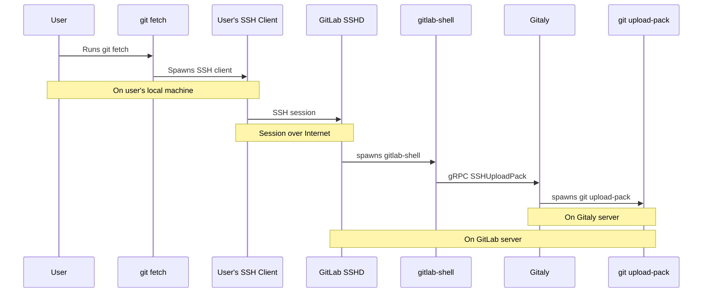
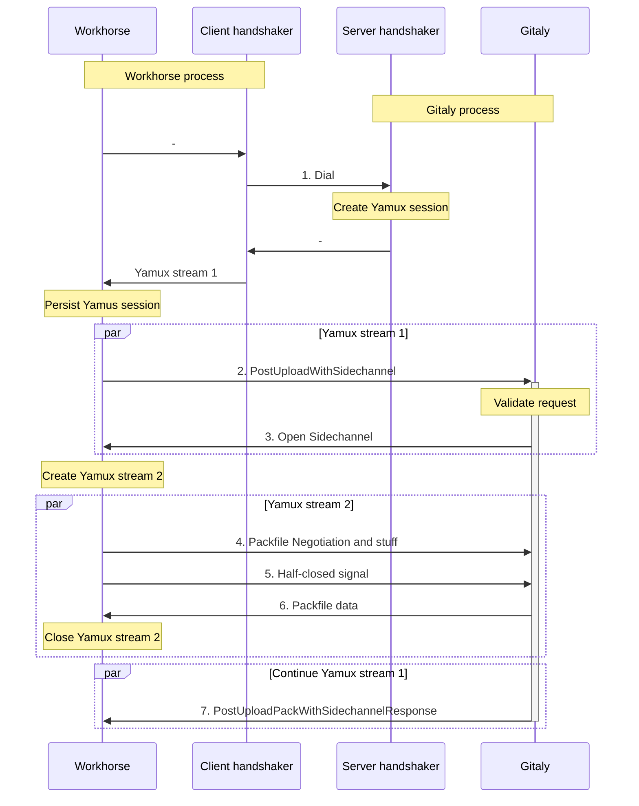
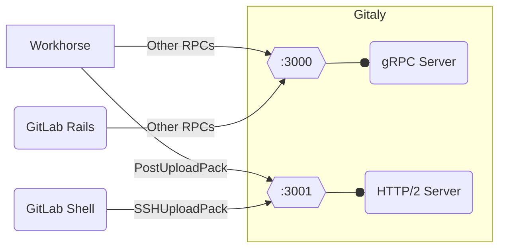
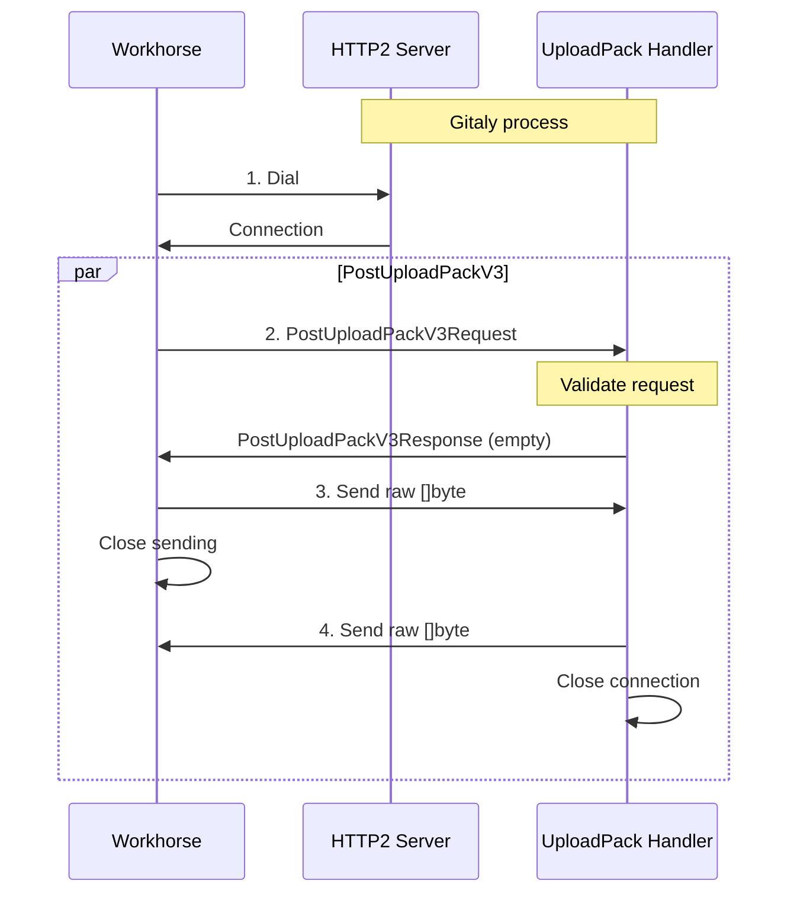

<!-- vale gitlab.FutureTense = NO -->
# Gitaly - Handle upload-pack traffic in a pure HTTP/2 server

## Summary

All Git data transferring operations that use HTTP/SSH are handled by upload-pack RPCs in Gitaly.

These RPCs use a unique application-layer protocol called Sidechannel, which takes over the handshaking process during client dialing of the Gitaly gRPC server. This
protocol allows for an out-of-band connection to transfer large data back to the client while serving the gRPC connection as normal.

Although it provides a huge performance improvement over using pure gRPC streaming calls, this protocol is unconventional, confusing, sophisticated, and hard to extend
or integrate into the next architecture of Gitaly. To address this, a new "boring" tech solution is proposed in this blueprint, which involves exposing a new HTTP/2 server
to handle all upload-pack traffic.

## Motivation

This section will explore how Git data transfers work, giving special attention to the role of Sidechannel optimization, and discussing both its advantages and
disadvantages. Our main goal is to make Git data transfers simpler while maintaining the performance improvements that Sidechannel optimization has
provided. We are looking for a solution that won't require us to completely rewrite the system and won't affect other parts of the systems and other RPCs.

### How Git data transfer works

Skip this part if you are familiar with how Git data transfer architecture at GitLab.

Git data transfer is undeniably one of the crucial services that a Git server can offer. It is a fundamental feature of Git that was originally developed for Linux
kernel development. As Git gained popularity, it continued to be recognized as a distributed system. However, the emergence of centralized Git services like GitHub or
GitLab resulted in a shift in usage patterns. Consequently, handling Git data transfer in hosted Git servers has become challenging.

Git supports transferring data in [packfiles](https://git-scm.com/book/en/v2/Git-Internals-Packfiles) over multiple protocols, notably HTTP and SSH. For more information, see
[pack-protocol](https://git-scm.com/docs/pack-protocol) and [http-protocol](https://git-scm.com/docs/http-protocol).

In short, the general flow involves the following steps:

1. Reference Discovery: the server advertises its refs to the client.
1. Packfile negotiation: the client negotiates the packfile necessary for the transport with the server by sending the list of refs it "haves", "wants", etc.
1. Transfer Packfile data: the server composes the requested data and sends it back to the client using Pack protocol.

Further details and optimizations can underlie these steps. Git servers have never had issues with reference discovery and Packfile negotiation. The most demanding aspect
of the process is the transfer of Packfile data, which is where the actual data exchange takes place.

For GitLab, Gitaly manages all Git operations. However, it is not accessible to external sources because Workhorse and GitLab Shell handle all external communications.
Gitaly offers a gRPC server for them through specific RPCs such as [SmartHTTP](https://gitlab.com/gitlab-org/gitaly/-/blob/master/proto/smarthttp.proto) and
[SSH](https://gitlab.com/gitlab-org/gitaly/-/blob/master/proto/ssh.proto). In addition, it provides numerous other RPCs for GitLab Rails and other services. The following
diagram illustrates a clone using SSH:



Source: shameless copy from [this doc](https://gitlab.com/gitlab-org/gitaly/-/blob/master/cmd/gitaly-ssh/README.md?plain=0)

### Git data transfer optimization with Sidechannel

In the past, we faced many performance problems when transferring huge amounts of data with gRPC. [Epic 463](https://gitlab.com/groups/gitlab-com/gl-infra/-/epics/463) tracks
the work of this optimization. More context surrounds it but, in summary, there are two main problems:

- The way gRPC is designed is ideal for transmitting a large number of messages that are relatively small in size. However, when it comes to cloning a medium-sized
  repository, it can result in transferring gigabytes of data. Protobuf struggles when dealing with large data, as confirmed by various sources
  (examples: <https://protobuf.dev/programming-guides/techniques/#large-data> and <https://github.com/protocolbuffers/protobuf/issues/7968>). It adds significant overhead
  and requires substantial CPU usage during encoding and decoding. Additionally, protobuf cannot read or write messages partially, which causes memory usage to skyrocket
  when the server receives multiple requests simultaneously.
- Secondly, `grpc-go` implementation also optimizes for a similar purpose. gRPC protocol is [built on HTTP/2](https://github.com/grpc/grpc/blob/master/doc/PROTOCOL-HTTP2.md).
  When the gRPC server writes into the wire, it wraps the data inside an HTTP/2 data frame. `grpc-go` implementation maintains an asynchronous control buffer. It allocates
  new memory, copies the data over, and appends to the control buffer ([client](https://github.com/grpc/grpc-go/blob/master/internal/transport/http2_client.go),
  [server](https://github.com/grpc/grpc-go/blob/master/internal/transport/http2_server.go)). So, even if we can overpass the protobuf problem with a
  [custom codec](https://github.com/grpc/grpc-go/blob/master/Documentation/encoding.md), `grpc-go` is still an unsolved problem.
  [Upstream discussion](https://github.com/grpc/grpc-go/issues/1455) (for read path only) about reusing memory is still pending.
  [An attempt to add pooled memory]( https://github.com/grpc/grpc-go/commit/642675125e198ce612ea9caff4bf75d3a4a45667) was reverted because it conflicts with typical
  usage patterns.

We have developed a protocol called Sidechannel, which enables us to communicate raw binary data with clients through an out-of-band channel, bypassing the `grpc-go`
implementation. For more information on Sidechannel, see [this document](https://gitlab.com/gitlab-org/gitaly/-/blob/master/doc/sidechannel.md). In summary, Sidechannel works
as follows:

- During the handshaking process of a gRPC server's acceptance of a client TCP connection, we use [Yamux](https://github.com/hashicorp/yamux) to multiplex the TCP
  connection at the application layer. This allows the gRPC server to operate on a virtual multiplexed connection called Yamux stream.
- When it becomes necessary for the server to transfer data, it establishes an additional Yamux stream. The data is transferred using that channel.



Sidechannel solved the original problem for us so far. We observed a huge improvement in Git transfer utilization and a huge reduction in CPU and memory usage. Of course, it comes with some tradeoffs:

- It's a clever trick, maybe too clever. `grpc-go` provides a handshaking hook solely for authentication purposes. It's not supposed to be used for connection modification.
- Because Sidechannel works on the connection level, all RPCs using that connection must establish the multiplexing, even if they are not targeted upload-pack ones.
- Yamux is an application-level multiplexer. It's heavily inspired by HTTP/2, especially the binary framing, flow control, etc. We can call it a slimmed-down version of HTTP/2.
  We are stacking two framing protocols when running gRPC on top of Yamux.
- The detailed implementation of Sidechannel is sophisticated. Apart from the aforementioned handshaking, when the server dials back, the client must start an invisible
  gRPC server for handshaking before handing it back to the handler. It also implements an asymmetric framing protocol inspired by `pktline`. This protocol is tailored
  for upload-pack RPC and overcomes the lack of the "half-closed" ability of Yamux.

All of those complexity adds up to the point that it becomes a burden for the maintenance and future evolution of Gitaly. When looking forward to the future Gitaly
Raft-based architecture, Sidechannel is usually a puzzle. Reasoning about the routing strategies and implementations must consider the compatibility with Sidechannel.
Sidechannel is an application-layer protocol so most client-side routing libraries don't work well with it. Besides, we must ensure the performance
gained by Sidechannel is reserved. Eventually, we can still find a way to fit Sidechannel in, but the choices are pretty limited, likely leading to another
clever hack.

Replacing Sidechannel with a simpler and widely adopted technology that maintains the same performance characteristics would be beneficial. One potential solution to address
all the issues would be to transfer all upload-pack RPCs to a pure HTTP/2 server.

### Goals

- Find an alternative to Sidechannel for upload-pack RPCs that is easier to use, uncomplicated, and widely adopted.
- The implementation must use supported API and use cases of popular libraries, frameworks, or Go's standard lib. No more hacking in the transportation layer.
- The new solution must work well with Praefect and be friendly to future routing mechanisms, load-balancers, and proxies.
- Have the same performance and low resource utilization as Sidechannel.
- Allow gradual rollout and full backwards compatibility with clients.

### Non-Goals

- Re-implement everything we invested into gRPC, such as authentication, observability, concurrency limiting, metadata propagation, etc. We don't want to maintain or
  replicate features between two systems simultaneously.
- Modify other RPCs or change how they are used in clients.
- Migrate all RPCs to a new HTTP/2 server.

## Proposal

A huge portion of this blueprint describes the historical contexts and why we should move on. The proposed solution is straightforward: Gitaly exposes a pure HTTP2 server
to handle all upload-pack RPCs. Other RPCs stay intact and are handled by the existing gRPC server.



As mentioned earlier, Sidechannel utilizes the Yamux multiplexing protocol, which can be seen as a streamlined version of HTTP/2. When HTTP/2 is used instead, the core
functionality remains unchanged, namely multiplexing, binary framing protocol, and flow control. This means that clients like Workhorse can efficiently exchange
large amounts of binary data over the same TCP connection without requiring a custom encoding and decoding layer like Protobuf. This was the intended use case for HTTP/2
from the start and, in theory, it can deliver the same level of performance as Sidechannel. Moreover, this replacement can eliminate the overhead for other direct
RPCs so the situation of gRPC over Yamux over TCP goes away.

In addition, Gitaly provides access to advanced HTTP/2 functionality through its officially-supported APIs. HTTP/2 is a first-class citizen and is officially supported by
Go's standard library. This protocol seamlessly integrates with off-the-shelf load balancers and proxies and is also supported by various libraries.

At the end of the day, both UploadPack RPC and other normal RPCs can co-exist on the same port using the technique described in the following section. However, migrating all
of them at one go is risky in terms of performance and functionality. There might be some unexpected consequeneces. Therefore, it would be wiser to perform the
migration gradually on GitLab.com, starting with UploadPack RPC. Other RPCs can be migrated after careful consideration. Self-managed instances can use the existing
single port without any modification, which means this change is transparent to users.

The next section describes the detailed implementation and the pros and cons of that approach.

## Design and implementation details

### Design

In summary, the proposal is for Gitaly to expose an HTTP2 server. At first glance, it looks like we'll need to implement a new handler and a series of interceptors. Fortunately,
gRPC Server provides [ServeHTTP](https://github.com/grpc/grpc-go/blob/642dd63a85275a96d172f446911fd04111e2c74c/server.go#L1001-L1001), allowing us to handle HTTP/2 in the
gRPC way. It implements the `http.Handler` interface to be plugged into a HTTP/2 server. Because gRPC protocol is built on top of HTTP/2, the HTTP/2 server receives and routes
the request to the handlers accordingly. We can use the header for redirecting:

```go
if r.ProtoMajor == 2 && strings.HasPrefix(
    r.Header.Get("Content-Type"), "application/grpc") {
    grpcServer.ServeHTTP(w, r)
} else {
    yourMux.ServeHTTP(w, r)
}
```

This approach brings the following benefits:

- `ServeHTTP` uses Go's HTTP/2 server implementation, which is totally separate from `grpc-go`'s HTTP/2 server. Digging into the implementation of both gRPC and HTTP/2
  implementation, the built-in implementation should solve the memory allocation issue mentioned in the above section.
- `ServeHTTP` implements the Go standard library's `http.Handler` interface. It allows writing the handler as a gRPC handler, in which we can transfer raw binary data and
  return status codes, including error details. Clients can receive a precise reason instead of a broken pipe error in Sidechannel when something goes wrong with the data
  transferring process.
- Most, if not all, interceptors could be re-used without modification. Other built-in tools, such as stats reporter, [channelz](https://grpc.io/blog/a-short-introduction-to-channelz/),
  and client-side load-balancing, also work out of the box. Observability toolkits, such as logging, and metrics work well.
- An upload-pack request becomes a pure streaming call on one connection. No need to open another out-of-band transportation anymore.
- Clients (Workhorse and GitLab Shell) continue to use gRPC clients. A request using this approach is considered to be a normal gRPC call. Hence, it should work well
  with Praefect, with minimal modifications.

Of course, using `ServeHTTP` comes with a cost in which requests and responses are Protobuf structs. A custom codec can overcome these performance penalties. An ideal
solution is to implement the handler as an HTTP handler so that we can have raw access to the connection. That solution entails re-implementing all gRPC-specific
components though. As a result, the proposed solution makes a reasonable tradeoff to ease the evolution of this architecture.



The proposed solution is to:

- Implement a "raw codec" that passes-through input binary data.
- Create a new `PostUploadPackV3` gRPC call and implement a corresponding server handler similar to other gRPC handlers.
- Implement an HTTP/2 server that calls to gRPC's `ServeHTTP`. This server is treated as another gRPC server. In fact, Gitaly now starts up to 4 gRPC servers
  (internally and externally) over different transportation channels. This HTTP2 server can blend into the fleet and use Gitaly's existing process management, and
  graceful shutdowns and upgrades.

I implemented two POC merge requests in Gitaly and Workhorse to demonstrate the solution:

- Gitaly: [merge request 5885](https://gitlab.com/gitlab-org/gitaly/-/merge_requests/5885).
- Workhorse: [merge request 123764](https://gitlab.com/gitlab-org/gitlab/-/merge_requests/123764).

These POC MRs make the tests green for a non-Praefect setup. The early benchmarks on the local environment show that this approach:

- Is slightly faster than the Sidechannel approach.
- Reduces peak CPU consumption by **10-20%**.
- Maintains the same memory utilization.

The POC is not complete, but it shows the simplification using "boring" techniques. The performance improvement is totally unexpected though.

The existing Sidechannel solution can co-exist with the new one. That makes gradual adoption feasible.

Apart from external traffic, a Gitaly server also handles internal requests. They come from Git processes spawned by Gitaly. One typical example is
`PackObjectsHookWithSidechannel` RPC, triggered by `git-upload-pack(1)` for generating Packfile. The proposed solution also benefits these internal RPCs.

### Considerations

A major issue with the proposed solution is that it opens up HTTP/2 through a separate port. While `ServeHTTP` enables us to integrate the gRPC handler into an existing
HTTP/2 server, it doesn't support the other way around. A new port exposure leads to some extra setup, such as firewall, NAT, etc, in a restrictive environment. A typical
setup doesn't need any infrastructure change. As mentioned above, the two-port situation occurs during the migration only. When it's done, we can unify them into one and
release to self-managed instances. Users don't need to change anything.

As previously mentioned, the newly-introduced HTTP/2 server is managed by the Gitaly process. It operates consistently with the existing gRPC servers for starting,
restarting, shutting down, and upgrading. This also implies that load-balancing, service discovery, domain management, and other configurations will work seamlessly
if they are set up for the current gRPC server. The new server can utilize most of the configurations of the current gRPC servers, including TLS and authentication. The
only new configuration required is the address for the HTTP server to bind to. Therefore, exposing a new port should not be a hindrance.

Another concern is that Workhorse and GitLab Shell must maintain a separate connection pool. At the moment, they maintain one connection to each Gitaly node. This number
will be doubled to two connections to each Gitaly node. This shouldn't be a big issue. Eventually, the traffic splits between two connections in which most heavy operations
are handled by the HTTP/2 server. GitLab Rails stay intact as it doesn't handle UploadPack.
