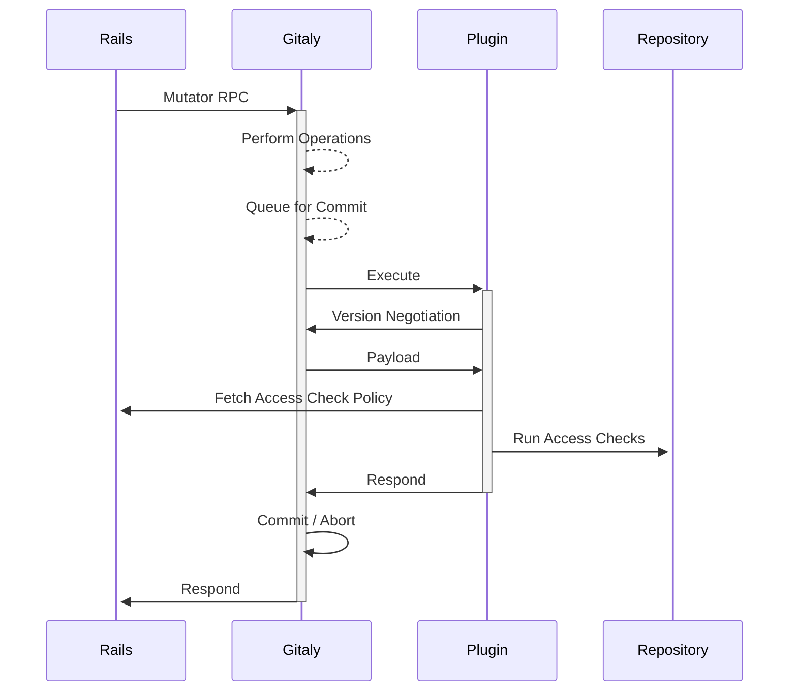

# Gitaly Plugins

## Summary

This blueprint describes a plugin interface for Gitaly. Plugins would be executables that Gitaly invokes before and after committing a transaction.

Plugins would allow for implementing access check logic locally on the Gitaly node. Performing the access checks locally on the Gitaly node improves performance. Plugins would reduce complexity by hiding internal details that are currently leaking through Gitaly's API.

The hard-coded access check logic and custom hooks would be replaced by plugins.

## Motivation

### Background

Gitaly is a database system for storing Git repositories and strives to be decoupled from rest of GitLab. While separation of concerns in general is a good practice, Gitaly is also used outside of GitLab. The decoupling functions as a guideline on what sort of functionality should be implemented in Gitaly. Only functionality supporting Gitaly's main goal of providing repository storage and access should be implemented directly in Gitaly.

Some use cases require tighter integration with Gitaly's write flows. For example:

- Authorization checks must run before Gitaly accepts a write in order to reject unauthorized writes.
- Notifications should be sent after writes in order to trigger CI jobs.

This logic is not built directly into Gitaly to separate concerns. Gitaly calls [the Rails application's internal API](../../../development/internal_api/index.md) for both cases:

- Before accepting a write, Gitaly calls `/internal/allowed`. The response from the endpoint decides whether or not Gitaly accepts the write.
- After accepting a write, Gitaly calls `/internal/post_receive`.

In addition to calling Rails application's internal API, Gitaly supports [custom hooks](../../../administration/server_hooks.md). Custom hooks are
executables Gitaly invokes before and after accepting a write and conform to the interface of
[Git hooks](https://git-scm.com/book/en/v2/Customizing-Git-Git-Hooks). The `pre-receive` hook can reject a write, `update` hook can drop single reference
update, and `post-receive` can be used to be notified of accepted writes.

'Custom logic' is used to refer to both of the internal API calls and custom hooks in the blueprint.

### Problems

#### Overlapping functionality

Both the internal API and custom hooks are invoked in the same locations, and have similar functionality. They provide redundant functionality with the main difference being the author of the logic:

- Internal API is used by GitLab.
- Custom hooks are used on self-managed instances to plug in custom logic.

Maintaining redundant functionality is a burden. Custom hooks not being used by GitLab means they are not thoroughly exercised in production on GitLab.com.
The internal API calls are essentially GitLab-specific hooks that are hard-coded into Gitaly.

#### Not all writes can be hooked into

Gitaly is hard-coded to invoke the custom logic only during certain write operations. These operations are decided by where GitLab needs to invoke custom
logic. Roughly, these points are:

- The various `*ReceivePack` variants that invoke custom logic. These are used to run the custom logic on pushes.
- `OperationService` RPCs that are invoked by Rails when a user performs changes in a repository. Custom logic is invoked during these because the Rails
  application wants to run authorization checks to see whether the user is allowed to make the change.

Custom logic is not invoked for other writes as GitLab doesn't need it. For example, excluded writes include repository creations, repository deletions, and reference updates through `WriteRef`.

This creates a tight coupling with the needs of GitLab.

#### Custom hooks interface determined by Git

Custom hooks conform to the interface of Git's hooks. This can be limiting and has led to an inconsistent interface:

- Reference updates are streamed through stdin.
- Other variables are passed in through environment variables.
- Custom prefixes required on error messages to pass them through Gitaly to the user.
- Invoking `update` hook for each reference is inefficient.
- No natural point to extend the payload to cover other supported writes than reference updates.

A better interface could be defined as Gitaly executes the custom hooks. There's no need to conform to the interface Git uses for hooks.

#### Performance issues

Rails performs authorization checks in the internal API by fetching data through Gitaly's public API. This leads to performance issues as Rails may need to fetch the complete write to perform its checks. For example, [pre-receive secret detection](../secret_detection/index.md) would require fetching all new blobs in a write to perform its checks. This could be avoided if there was a way to run the check locally on the Gitaly node.

#### Leaking internals

Before a write is accepted, Gitaly holds the new objects in a quarantine directory. These objects should not be accessible through Gitaly's API for other users. The authorization checks need access to these objects though. This is handled by sending the path of the quarantine directory to Rails, and Rails passes this to Gitaly in follow-up calls. This leaks internal details:

- The quarantines are exposed in the public API.
- On Gitaly Cluster, the quarantine directory is in a different location on each node. This requires Praefect to support force routing calls to the primary replica so the quarantine path points to the correct location in the follow-up calls.
- This gets even more complicated with [transactions](../gitaly_transaction_management/index.md). The quarantine paths are relative to the transaction's snapshot. In order for the quarantine paths to apply, the relative path sent in the request should be the snapshot repository's relative path. Praefect however requires the original relative path of the repository to route the request to the correct Gitaly node.

Leaking internals adds complexity and has to be worked around.

#### Complexity

In addition to the performance issues and leaking internal, the current access check flow has proven to be complex and difficult to understand:

1. The Rails application calling Gitaly for an RPC.
1. Gitaly calling back to the Rails application for access checks.
1. The Rails application calling Gitaly multiple times again to fetch data required by the access checks.

This complexity could be reduced by not fanning out multiple other RPCs from a given RPC but instead keeping all of the checks in the context of
currently-executing RPC.

## Solution

Define a plugin interface in Gitaly that enables efficient implementation of pre-commit checks without leaking internal details to the API.

### Goals

- Single plugin interface to replace calls to internal API and custom hooks.
- Enable efficient execution of access checks.
  - Enables execution of the checks close to the data on the Gitaly node.
  - Do not dictate the implementation, and enable the plugin authors to implement their plugin
    in the best manner for the use case.
- Remove GitLab-specific assumptions from the API.
  - Hard-coded calls to the internal API removed and moved behind the plugin interface.
  - Invoke the plugin for every write.
  - Remove GitLab specific fields such as `gl_repository` and `gl_project_path` from Gitaly's API.
- Do not leak internal details.
  - Remove quarantine directories from the API.
  - Remove force routing to primary.
  - Remove the need to pipe the transaction's snapshot path through the public API.
- A clean, well-defined interface set by the needs of Gitaly and its users, not Git.

## Proposal

The proposal is written with Gitaly's upcoming [transaction management](../gitaly_transaction_management/index.md) in mind.

### Plugins

Plugins would be executables that Gitaly invokes at certain points during transaction execution. Plugins being executables ensures:

- Protection: plugins would run in separate processes. Gitaly would be guarded against memory leaks and crashes in the plugins.
- Flexibility:
  - Plugins could be implemented using whatever tools the authors prefer.
  - Plugins could be implemented as one-off executables, or may call into a server daemon.
- Separation of concerns: Gitaly would just need to execute an executable and defers other responsibility to it.

Plugins would be invoked at two points during transaction execution:

- `before-commit`:
  - Invoked before a transaction is committed.
  - Allows for rejecting a transaction.
- `after-commit`:
  - Invoked after a transaction is committed.
  - Transaction is already committed, so this just serves as a notification.

The names are chosen to disambiguate from Git's `pre-commit` and `post-commit` hooks. `Plugin` is used to further disambiguate from Git's hooks.

Gitaly would allow for configuring a single plugin. Gitaly would be relieved from deciding whether to execute multiple plugins concurrently or sequentially, in
which order, and whether a single plugin failing the write stops the execution of further plugins. These decisions would be delegated to plugins. Support for
running multiple plugin executables can be implemented in a plugin if truly needed.

The single plugin covers all partitions/repositories. Repository-specific logic can be implemented in the plugin to support similar use cases previously served by repository-specific custom hooks.

Gitaly and the plugin would communicate over `stdin` and `stdout` of the plugin process. Each message written to the other process would be prefixed with an `uint64` describing
the length of the payload that follows. This would make for a simple message passing protocol. Protocol buffers would be used to define the schema and serialize the payload.

When the plugin is invoked, it would writes its supported protocol version to `stdout` as a big-endian encoded `uint16`. This would enable Gitaly to evolve the API in
backwards-incompatible manner by supporting multiple versions of the protocol side-by-side. If the plugin's protocol was not supported, Gitaly would kill the plugin and fail
the write. If the protocol is supported, Gitaly would proceed.

The initial version of the protocol is described below.

After the version negotiation, Gitaly sends messages to the plugin via `stdin`. Below is the message schema:

```protobuf
// PluginRequest is the payload that describes the transaction being executed.
message PluginRequest {
  // ReferenceChanges describes reference changes of the transaction.
  message ReferenceChanges {
    // Change describes a single reference change made in the transaction.
    message Change {
      // reference_name is the name of the reference being changed.
      bytes  reference_name = 1;
      // old_oid is the reference's previous object ID. Zero OID indicates the reference did not exist.
      string old_oid        = 2;
      // new_oid is the reference's new object ID. Zero OID indicates a reference deletion.
      string new_oid        = 3;
    }

    repeated Change changes = 1;
  }

  // Header contains details of the plugin's execution environment and the transaction.
  message Header {
    // storage is the name of the target storage of the transaction.
    string storage = 1;
    // relative_path is the relative path of the target repository of the transaction.
    string relative_path = 2;
    // push_options contains the push options sent by the client during a push, if any.
    repeated bytes push_options = 3;
    // client_metadata contains a blob sent by the client to Gitaly to pass through to
    // the plugin. It allows the client to send parameters to the plugin transparently
    // through Gitaly. The metadata is sent by the client by setting the gRPC metadata
    // header `gitaly-plugin-metadata-bin` in the request to Gitaly.
    //
    // This can be used to pipe GitLab specific data from Rails to the plugin, such as
    // `gl_project` and `gl_user`.
    bytes plugin_metadata = 4;

    // git_command_path contains the absolute path to the Git command that should be used to
    // access the repository.
    string git_command_path = 5;
    // repository_path contains the absolute path of the transaction's target repository. It
    // points a snapshot of the actual repository.
    string repository_path = 6;
    // git_object_directory is an absolute path to the transaction's quarantine directory
    // where the new objects are written. It must be set for the Git invocations as an
    // environment variable through `GIT_OBJECT_DIRECTORY` for the objects to be readable.
    string git_object_directory = 7;
    // git_alternate_object_directories points to the object database that contains the objects
    // that existed prior to the transaction. It must be set for the Git invocation as an
    // environment variable through `GIT_ALTERNATE_OBJECT_DIRECTORIES` for the objects to be
    // readable.
    //
    // `GIT_ALTERNATE_OBJECT_DIRECTORIES` can be left unset if the Git invocation should only
    // read the new objects introduced in the transaction. This can be useful for some operations
    // that may for example want to scan only new blobs.
    string git_alternate_object_directories = 8;
  }

  oneof message  {
    // header is always the first message sent to the plugin.
    Header header = 1;
    // reference_changes are the reference_changes being performed by this transaction. reference_changes
    // may be chunked over multiple messages.
    ReferenceChanges reference_changes = 2;
  }
```

The header is always sent in the first message. Reference changes follow the header and may be chunked over multiple messages. Gitaly closes the plugin's `stdin` once it is done sending messages.

The initial protocol supports only hooking into reference changes of a single repository as hooks currently do. The protocol can later be extended as needed to support for example:

- Other write types, such as repository creations and deletions.
- Transactions targeting multiple repositories.

After receiving the payload, the plugin would run its logic. It would access the Git repository at the given path through the provided Git command to
retrieve the data it needs. On finishing, the plugin would write a response to stdout that contains
[a status](https://github.com/googleapis/googleapis/blob/master/google/rpc/status.proto#L35) to indicate whether or not the transaction should be committed
or aborted.

```protobuf
// PluginResponse is the response message the plugin passes back to Gitaly after finishing.
message PluginResponse {
  // status indicates whether the transaction should succeed or fail.
  google.rpc.Status status = 1
}
```

- If the status has code `OK`, the transaction is committed.
- If the status has any other code, the transaction is aborted. The status is passed back
  to the client as is. This enables the plugin to communicate a rejection reason with an
  accurate status code, message, and additional details.

The plugin should return a zero exit code if it executed successfully. This should be done even if the transaction is rejected.

If the plugin returns a non-zero exit code, the plugin is considered to have failed. This is different from the plugin rejecting a write. When the plugin fails, `stdout` is ignored and an error is returned to the client. Gitaly logs an error with the contents of `stderr` and rejects the write.

If the plugin is taking too long, as defined by RPC deadlines, Gitaly kills the plugin. This is handled as a plugin failure as described above.

#### Compatibility guarantees

Gitaly would guarantee the repository at the given path is accessible through the `git` command at the given path. All access to the repository must go through the provided
`git` binary.

The repository's layout, location, file formats, and storage details are not included in the compatibility guarantee. This enables Gitaly to iterate freely
on the storage formats. Modifying the repository is not supported.

The payload's format should be guaranteed to remain backwards compatible within a protocol version. New keys may be introduced without bumping the version.

#### Custom hooks

Because Gitaly would support only configuring a single plugin, a question may arise on how the GitLab plugin could be configured along with a custom one. While running multiple
plugins wouldn't be directly supported, a custom plugin could be configured and the plugin could invoke the GitLab plugin. This would allow for plugging in custom logic
alongside the GitLab access check plugin. Because the custom plugin would control calling the GitLab plugin, it would have full control on whether to run GitLab plugin before,
after, or concurrently with its own logic.

### Migration

Migration to plugins would take a few steps:

1. Create a project for the GitLab access check plugin. This is where the existing internal API logic will be migrated.
1. Package the plugin in the distributions and deploy and configure it on the Gitaly nodes.
1. Migrate the internal API calling logic from Gitaly to the plugin.
1. At this point, we'd have the existing internal API calling logic from Gitaly executed as a plugin.
1. We can now begin migrating the access checks step by step into the plugin.

All access to the new objects of a transaction should go through the plugin. Gitaly provides just the interface to hook into its writes.

How exactly the access checks are performed is left up to the teams responsible for the access checks. The access checks could fetch only policy from Rails and run the checks locally if the check in question depends heavily on the Git data. This improves efficiency by removing the loopback calls and accessing the data directly on the Gitaly node. Some access check logic could still remain in Rails if it is best fit for it.

Once all of repository access in access checks goes through the plugin, the quarantine directories and the force-route-to-primary functionality can be removed from the API of Gitaly.

#### End state

The following diagram demonstrates the desired end state:

1. Gitaly no longer calls to Rails directly.
1. The plugin fetches only access check policy from Rails. The access checks are run locally on the repository.
1. Gitaly commits or aborts the transaction based on the plugin's result.



### Considerations

#### Security

The plugins should only be configurable by administrators only and are considered trusted. There are no plans to sandbox them.

#### Subprocesses

If the plugin launches a subprocess, it should keep it in the same process group so Gitaly can kill the entire process group if it wants to terminate the plugin. Gitaly should consider running the plugins in their own cgroups so we can guarantee killing all subprocesses.

#### `update` hook's functionality is not supported

The plugin currently does not support dropping certain reference updates as is possible with `update` hook. Support for the hook was left out as it's not clear how useful it is. If necessary, it could be supported by having the plugin write messages to Gitaly on which references to drop from the update.

### Future opportunities

#### Guaranteed post-receive notification deliveries ([#5411](https://gitlab.com/gitlab-org/gitaly/-/issues/5411))

Currently Gitaly does not guarantee the delivery of post-receive notifications. The delivery could fail for any reason. For example, Gitaly could crash or
the Rails application could be unavailable. This can lead to unexpected behavior.

1. The notifications trigger CI pipelines after writes. If the delivery fails, the pipelines may not be triggered.
1. Code search indexes new changes based on the notifications. If the delivery fails, the indexes can become stale.

With transactions stored in the write-ahead log, Gitaly could guarantee the delivery of the `after-commit` notifications after a crash by recovering the transactions from the log and reattempting delivery. To facilitate this, all necessary information should be stored in the log entry, for example the push options.
