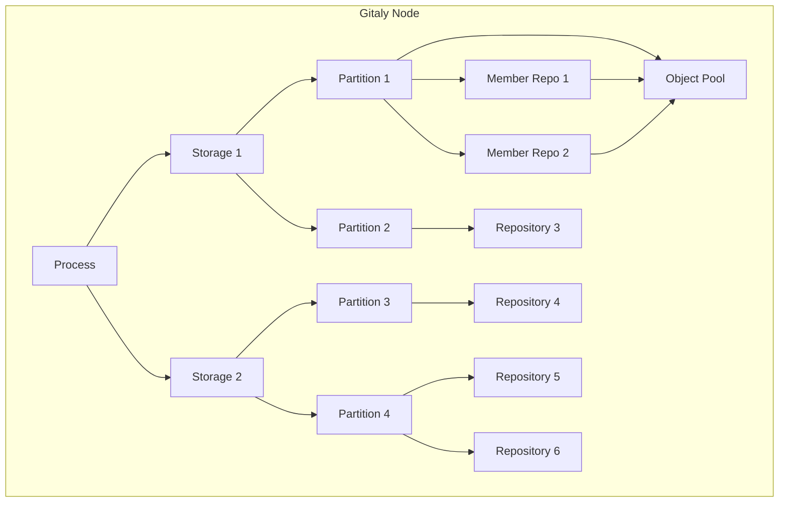
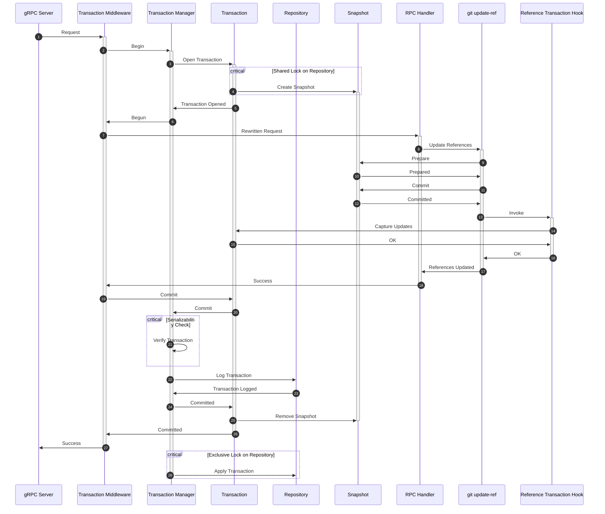

# Transaction management in Gitaly

## Summary

Gitaly is a database system for storing Git repositories. This blueprint covers implementing transaction management in Gitaly that guarantees
ACID-properties by introducing:

- Write-ahead logging. Work on this is already underway and tracked in [Implement write-ahead logging in Gitaly](https://gitlab.com/groups/gitlab-org/-/epics/8911).
- Serializable snapshot isolation through multiversion concurrency control.

The goal is to improve reliability when dealing with concurrent access and interrupted writes. Transaction management makes it easier to contribute to Gitaly because transactions
deal with the concurrency and failure-related anomalies.

This is the first stage of implementing a [decentralized Raft-based architecture for Gitaly Cluster](https://gitlab.com/groups/gitlab-org/-/epics/8903).

## Motivation

Transaction management in Gitaly is lacking. Gitaly doesn't provide the guarantees typically expected from database-like software. Databases typically guarantee the ACID
properties:

- Atomicity: all changes in a transaction happen completely or not at all.
- Consistency: all changes leave the data in a consistent state.
- Isolation: concurrent transactions execute as if they were the only transaction running in the system.
- Durability: changes in a transaction persist and survive system crashes once acknowledged.

Gitaly does not access storage transactionally and violates these properties in countless ways. To give some examples:

- Atomicity:
  - References are updated one by one with Git. If the operation is interrupted, some references
    may be updated and some not.
  - Objects may be written into a repository but fail to be referenced.
  - Custom hooks are updated by moving their old directory out of the way and moving the new one in place. If this operation fails half way, the repository's
    existing hooks are removed but new ones are not written.
- Consistency:
  - Gitaly migrates objects from a quarantine directory to the main repository. It doesn't consider the dependencies between objects while doing so. If this process is interrupted, and an object missing its dependencies is later referenced, the repository ends up corrupted.
  - Crashes might leave stale locks on the disk that prevent further writes.
- Isolation:
  - Any operation can fail due to the repository being deleted concurrently.
  - References and object database contents can be modified while another operation is reading them.
  - Backups can be inconsistent due to concurrent write operations modifying the data. Backups can even end up containing state that never existed on the
    server, which can happen if custom hooks are updated while they are being backed up.
  - Modifying and executing custom hooks concurrently can lead to custom hooks not being executed. This can happen if the execution happens between the old
    hooks being removed and new ones being put in place.
- Durability: multiple missing fsyncs were recently discovered in Gitaly.

Not adhering to ACID properties can lead to:

- Inconsistent reads.
- Inconsistent backups that contain state that never existed on the server.
- Repository corruption.
- Writes missing after crashes.
- Stale locks that lead to unavailability.

Lack of isolation makes some features infeasible. These are generally long running read operations, such as online checksums for verifying data and online backups. The data being modified concurrently can cause these to yield incorrect results.

The list is not exhaustive. Compiling an exhaustive list is not fruitful due to the large number of various scenarios that can happen due to concurrent interactions and
write interruptions. However, there is a clear need to solve these problems in a systematic manner.

## Solution

The solution is to implement a transaction manager in Gitaly that guarantees ACID-properties. This centralizes the transactional logic into a single component.

All operations accessing user data will run in a transaction with the transaction manager upholding transactional guarantees. This eases developing Gitaly as the RPC handlers can be developed as if they were the only one running in the system with durability and atomicity of changes guaranteed on commit.

### Goals

- Transaction management that guarantees ACID-properties.
- Transactional guarantees cover access to all user data:
  - References
  - Objects
  - Custom hooks
- Write-ahead log for durability and atomicity.
- Serializable Snapshot Isolation (SSI). Multiversion concurrency control (MVCC) for non-blocking concurrency.
- Minimal changes to existing code in Gitaly.
- Make it easier to contribute to Gitaly.
- Enable future use cases:
  - [Backups with WAL archiving](#continuous-backups-with-wal-archiving).
  - [Replication with Raft](#raft-replication).
  - [Expose transactional interface to Gitaly clients](#expose-transactions-to-clients).

## Proposal

The design below is the end state we want to reach. The in-progress implementation in Gitaly deviates in some aspects. We'll gradually get closer to the end state as the work progresses.

### Partitioning

The user data in Gitaly is stored in repositories. These repositories are accessed independently from each other.

Each repository lives on a single storage. Gitaly identifies repositories with a composite key of `(storage_name, relative_path)`. Storage names are unique. Two storages may contain a repository with the same relative path. Gitaly considers these two distinct repositories.

The synchronization required for guaranteeing transactional properties has a performance impact. To reduce the impact, a transaction only spans a subset of the data stored on a Gitaly node.

The first boundary is the storage. The storages are independent of each other and host distinct repositories. Transactions never span across storages.

Storages are further divided into partitions:

- Transactional properties are maintained within a partition. Transactions never span across partitions.
- A partition stores some data and provides access to that data with transactional guarantees. The data will generally be repositories. Partitions may also
  store key-value data, which will be used in future with [the new cluster architecture](#raft-replication) to store cluster metadata.
- Partitions will be the unit of replication with [Raft](#raft-replication).

Repositories:

- Within a storage might depend on each other. This is the case with objects pools and the repositories that borrow from them. Their operations must be
  synchronized because changes in the pool would affect the object database content of the borrowing repository.
- That are not borrowing from an object pool are independent from each other. They are also accessed independently.
- That depend on each other go in the same partition. This generally means object pools and their borrowers. Most repositories will have their own partition.

The logical data hierarchy looks as follows:

### Transaction management

Transactional properties are guaranteed within a partition. Everything described here is within the scope of a single partition.

Each partition will have a transaction manager that manages the transactions operating on data in the partition. Higher-level concepts used in the
transaction management are covered below.

#### Serializable snapshot isolation

Prior to transactions, Gitaly didn't isolate concurrent operations from each other. Reads could read an in-between state due to writes running concurrently. Reading the same data multiple times could lead to different results if a concurrent operation modified the data in-between the two reads. Other anomalies were also possible.

The transaction manager provides serializable snapshot isolation (SSI) for transactions. Each transaction is assigned a read snapshot when it begins. The read snapshot contains the latest committed data for a repository. The data remains the same despite any concurrent changes being committed.

Multiversion concurrency control (MVCC) is used for non-blocking concurrency. MVCC works by always writing updates into a new location, leaving the old
versions intact. With multiple versions maintained, the reads are isolated from the updates as they can keep reading the old versions. The old versions are
garbage collected after there are no transactions reading them anymore.

The snapshot covers all user data:

- References
- Objects
- Custom hooks

Git doesn't natively provide tools to implement snapshot isolation. Therefore, repository snapshots are implemented on the file system by copying the directory
structure of the repository into a temporary directory and hard linking the contents of the repository in place. Git never updates references or objects in
place but always writes new files so the hard-linked files remain unchanged in the snapshots. The correct version of custom hooks for the read snapshot is
also linked into place. For information on performance concerns, see [Performance Considerations](#performance-considerations).

The snapshot works for both reading and writing because it is a normal Git repository. The Git writes performed in the snapshot are captured through the
reference transaction hook. After the transaction commits, the performed changes are write-ahead logged and ultimately applied to the repository from the log.
After the transaction commits or aborts, the transaction's temporary state, including the snapshot, is removed. Old files are automatically removed by the
file system after they are not linked to by the repository nor any transaction's snapshot.

To maintain consistency, writes into the actual repository are blocked while the snapshot is taken. The transaction manager is the single-writer to the
repository, which means that only the log application is blocked while a snapshot is taken.

#### Serializability

Serializability is a strong correctness guarantee. It ensures that the outcome of concurrent transactions is equal to some serial execution of them. Guaranteeing serializability makes life easy for users of the transactions. They can perform their changes as if they were the only user of the system and trust that the result is correct regardless of any concurrent activity.

The transaction manager provides serializability through optimistic locking.

Each read and write is operating on a snapshot of the repository. The locks acquired by Git are targeting different snapshot repositories, which allows all of
the transactions to proceed concurrently, staging their changes because they are not operating on shared resources.

When committing a transaction, the transaction manager checks whether any resources being updated or read were changed by an overlapping transaction that committed. If so, the later transaction is rejected due to a serialization violation. If there are no conflicts, the transaction is appended to the log. Once the transaction is logged, it is successfully committed. The transaction gets ultimately applied to the repository from the log. This locking mechanism allows all transactions to proceed unblocked until commit. It is general enough for identifying write conflicts of any resource.

For true serializability, we would also have to track reads performed. This is to prevent write skew, where a transaction bases its update on a stale read of
another value that was updated by a concurrent transaction. Git does not provide a way to track which references were read as part of a command. Because we
don't have a general way to track references a transaction read, write skew is permitted.

Predicate locks can be explicity acquired in a transaction. These provide hints to the transaction manager that allow it to prevent write skew to the extent
they are used.

#### Write-ahead log

Prior to transactions, the writes updated the target data on the disk directly. This creates a problem if the writes are interrupted while they are being performed.

For example, given a write:

- `ref-a new-oid old-oid`
- `ref-b new-oid old-oid`

If the process crashes after updating `ref-a` but not yet updating `ref-b`, the state now contains a partially-applied transaction. This violates atomicity.

The transaction manager uses a write-ahead log to provide atomicity and durability. Transaction's changes are written into a write-ahead log on commit prior to applying them to log's projections. If a crash occurs, the transaction is recovered from the log and performed to completion.

All writes into a partition go through the write-ahead log. Once a transaction is logged, it's applied from the log to:

- The Git repository. The repository's current state is constructed from the logged transactions.
- An embedded database shared between all partitions on a storage. Write-ahead logging-related bookkeeping state is kept here.

Most writes are fully self-contained in the log entry. Reference updates that include new objects are not. The new objects are logged in a packfile. The objects in a packfile may
depend on existing objects in the repository. This is problematic for two reasons:

- The dependencies might be garbage collected while the packfile is in the log waiting for application.
- The dependencies in the actual repository's object database might be garbage collected while a transaction is verifying connectivity of new objects against
  its snapshot.

Both of these issues can be solved by writing internal references to the packfile's dependencies before committing the log entry. These internal references
can be cleared when the log entry is pruned. For more information, see [issue 154](https://gitlab.com/gitlab-org/git/-/issues/154) on the GitLab fork of Git.

### Integration

Gitaly contains over 150 RPCs. We want to plug in the transaction management without having to modify all of them. This can be achieved by plugging in a
gRPC interceptor that handles opening and committing transactions before each handler. The interceptor:

1. Begins the transaction.
1. Rewrites the repository in the request to point to the transaction's snapshot repository.
1. Invokes the RPC handler with the rewritten repository.
1. Commits or rolls back the transaction depending on whether the handler returns successfully or not.

The existing code in the handlers already knows how to access the repositories from the request. Because we rewrite the repository to point to the snapshot,
they'll be automatically snapshot-isolated because their operations will target the snapshot.

RPCs that perform non-Git writes, such as `SetCustomHooks`, will need to be adapted because we don't have a way to hook into their writes like we do with
the reference transaction hook. However, these however are a small minority, namely:

- Custom hook updates.
- Repository creations.
- Repository deletions.

To support integrating these, we'll provide a helper function to include the data in the transaction. We'll pipe the transaction through the request context.

The biggest concern with integrating the transaction management is missing some locations that write to the repository without respecting the transaction logic. Because
we are rewriting the request's repository to the snapshot repository, this is not an issue. The RPC handlers do not know the real location of the repository so they can't
accidentally write there. Any writes they perform to the snapshot repository that are not included in the transaction will be discarded. This should fail tests and alert
us to the problem.

There may be some locations in Gitaly that would benefit from having the real repository's relative path. An example could be a cache, such as the pack objects cache, that uses the relative path as cache key. It would be problematic if each transaction has a their own snapshot repository and thus a different relative path. If needed, the real relative path could be piped through the request context. The snapshots can be shared between multiple read only transactions which would keep the relative path stable. This should work for at least some of the cases where the cache should expire anyway when the data changes.

The pre-receive hook would send the rewritten repositories to the authorization endpoint at `internal/allowed`. The follow up requests from the endpoint to Gitaly would already contain the relative path pointing to the snapshot repository with a quarantine configured. The transaction middleware can detect this and not start another transaction.

To retain backwards compatibility with Prafect, the transaction manager will cast votes to Praefect when committing a transaction. Reference transaction hooks won't because
the changes there are only captured in the transaction, not actually committed yet.

Housekeeping must be integrated with the transaction processing. Most of the clean up-related housekeeping tasks, such as removing temporary files or stale locks, are no longer needed. All of the trash left by Git on failures is contained in the snapshots and removed with them when the transaction finishes.

That leaves reference and object repacking, object pruning, and building the various indexes. All of these can be done in transactions. The new packs, for
example, can be computed in a snapshot. When committing, the transaction manager can check whether their changes conflict with any other concurrently-committed transaction.
For example, an object that was pruned in a snapshot could be concurrently referenced from another transaction. If there are conflicts, the transaction manager either:

- Resolves the conflict if possible.
- Aborts the transaction and retries the housekeeping task.

The transaction manager should keep a track of how many packfiles and loose references there are in a repository, and trigger a repack when necessary.

The above allows for almost completely transparent integration with the existing code in Gitaly. We only have to update a couple of write RPCs to include the data in the transaction if it is set. This keeps the migrationary period manageable with minimal conditional logic spread throughout the code base.

### Performance considerations

The most glaring concern is the cost of snapshotting a repository. We are copying the directory structure of the repository and hard linking the files in
place before a request is processed. This might not be as problematic as it first sounds because:

- The snapshotting is essentially only creating directory entries. These are quick syscalls. The number of files in the repository increases the number of
  directory entries and links we need to create in the snapshot. This can be mitigated by maintaining the repositories in good shape by repacking objects
  and references. Reftables will also eventually help reduce the number of loose references. The write-ahead log only writes objects into the repository
  as packfiles so loose objects won't be a concern in the future.
- These will be in-memory operations. They'll target the page cache and don't need to be fsynced.
- The snapshots can be shared between read-only transactions because they don't perform any modifications in them. This means that we only have to create
  snapshots for writes, and for reads when a new version was committed after creating the previous read-only snapshot. Writes are relatively rare.
- The isolation level can be configurable on a per-transaction level for performance. Snapshot isolation is not needed when an RPC fetches a single blob.

Serializing the writes requires them to be committed one by one, which could become a bottleneck. However:

- The data partitioning minimizes this bottleneck:
  - We only have to serialize writes within a partition.
  - Most repositories will have their own partition.
  - Object pools and their borrowers must be in the same partition. This could result in large partitions which may lead to a performance degradation. However:
    - The object pools are currently undergoing a redesign. See [the blueprint](../object_pools/index.md) for more details.
    - The partition assignments of the object pools, the origin repository, and the forks are better handled in context of the object deduplication design.
      Some possible approaches include:
      - Keeping the origin repository in its own partition. This ensures forking a repository does not lead to performance degradation for the forked repository.
      - Splitting the forks into multiple partitions with each having their own copy of the object pool. This ensures the forks will retain acceptable
        performance at the cost of increased storage use due to object pool duplication.
- Checking for write conflicts can be done entirely in memory because the transaction manager can keep track of which resources have been modified by
  concurrent transactions. This allows for finer-grained locking than Git supports, especially when it comes to reference deletions.

The snapshot isolation requires us to keep multiple versions of data. This will increase storage usage. The actual impact depends on the amount of the new data written and the open transactions that are holding on to the old data.

On the other hand, the snapshot isolation brings performance benefits:

- `fsync` can be turned off for most writes because they target the snapshots. The writes that are committed to the real repository will be `fsync`ed by the transaction manager.
- Transactions never block each other because they'll write locks in their own snapshot. For example, transactions can concurrently delete references because they each have
  their own `packed-refs` file.
- Writes into the main repository can be batched together. For example, if multiple reference deletions are committed around the same time, they can be applied to the repository
  in a single write, resulting in rewriting the `packed-refs` file only once.

Snapshot isolation also enables features that were not previously feasible. These are generally long-running read operations:

- Online checksumming requires that the data doesn't change during the checksumming operation. This would previously require a lock on the repository. This can be done without
  any blocking because the checksum can be computed from the snapshot.
- Online (consistent) backups become possible because they can be built from the snapshot.

## Life of a transaction

The diagram below models the flow of a write transaction that updates some references. The diagram shows the key points of how the transactions are handled:

- Each transaction has a snapshot of the repository.
- The RPC handlers never operate on the repository itself.
- The changes performed in the snapshot are captured in the transaction.
- The changes are committed after the RPC has returned successfully.
- The transaction is asynchronously applied to the repository from the log.

Beginning and committing a transaction may block other transactions. Open transactions proceed concurrently without blocking:

1. Shared lock is acquired on the repository when the snapshot is being created. Multiple snapshots can be taken at the same time but the no changes can be written into
   the repository.
1. Transactions run concurrently without any blocking until the commit call where the serializability checks are done.
1. Log application acquires an exclusive lock on the repository, which blocks snapshotting.

## Future opportunities

### Expose transactions to clients

Once Gitaly internally has transactions, the next natural step is to expose them to the clients. For example, Rails could run multiple operations in a single transaction. This would
extend the ACID guarantees to the clients, which would solve a number of issues:

- The clients would have ability to commit transactions atomically. Either all changes they make are performed or none are.
- The operations would automatically be guarded against races through the serializability guarantees.

For Gitaly maintainers, extending the transactions to clients enables reducing our API surface. Gitaly has multiple RPCs that perform the same operations. For example, references
are updated in multiple RPCs. This increases complexity. If the clients can begin, stage changes, and commit a transaction, we can have fewer, more fine grained RPCs. For
example, `UserCommitFiles` could be modeled with more fine grained commands as:

- `Begin`
- `WriteBlob`
- `WriteTree`
- `WriteCommit`
- `UpdateReference`
- `Commit`

This makes the API composable because the clients can use the single-purpose RPCs to compose more complex operations. This might lead to a concern that each operation requires
multiple RPC calls, increasing the latency due to roundtrips. This can be mitigated by providing an API that allows for batching commands.

Other databases provide these features through explicit transactions and a query language.

### Continuous backups with WAL archiving

Incremental backups are currently prohibitively slow because they must always compute the changes between the previous backup and the current state of the repository. Because
all writes to a partition go through the write-ahead log, it's possible to stream the write-ahead log entries to incrementally back up the repository. For more information,
see [Repository Backups](../repository_backups/index.md).

### Raft replication

The transactions provide serializability on a single partition. The partition's write-ahead log can be replicated using a consensus algorithm such as Raft. Because Raft
guarantees linearizability for log entry commits, and the transaction manager ensures serializability of transactions prior to logging them, all operations across the replicas
get serializability guarantees. For more information, see [epic 8903](https://gitlab.com/groups/gitlab-org/-/epics/8903).

## Alternative solutions

No alternatives have been proposed to the transaction management. The current state of squashing concurrency- and write interruption-related bugs one by one is not scalable.

### Snapshot isolation with reftables

Our preliminary designs for snapshot isolation relied on reftables, a new reference backend in Git. Reftables have been a work in progress for years and there doesn't seem to
be a clear timeline for when they'll actually land in Git. They have a number of shortcomings compared to the proposed solution here:

- Reftables only cover references in a snapshot. The snapshot design here covers the complete repository, most importantly object database content.
- Reftables would require heavy integration as each Git invocation would have to be wired to read the correct version of a reftable. The file system -based snapshot design
  here requires no changes to the existing Git invocations.
- The design here gives a complete snapshot of a repository, which enables running multiple RPCs on the same transaction because the transaction's state is stored on the disk
  during the transaction. Each RPC is able to read the transaction's earlier writes but remain isolated from other transactions. It's unclear how this would be implemented with
  reftables, especially when it comes to object isolation. This is needed if we want to extend the transaction interface to the clients.
- The snapshots are independent from each other. This reduces synchronization because each transaction can proceed with staging their changes without being blocked by any
  other transactions. This enables optimistic locking for better performance.

Reftables are still useful as a more efficient reference backend but they are not needed for snapshot isolation.
