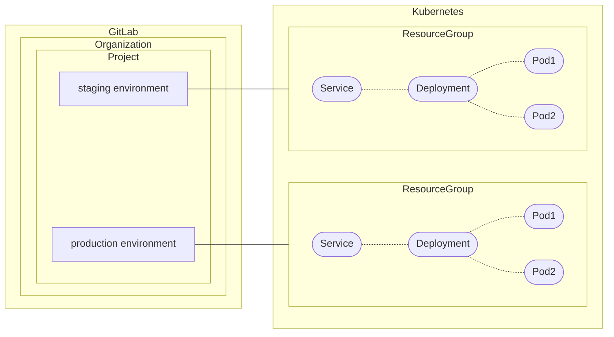
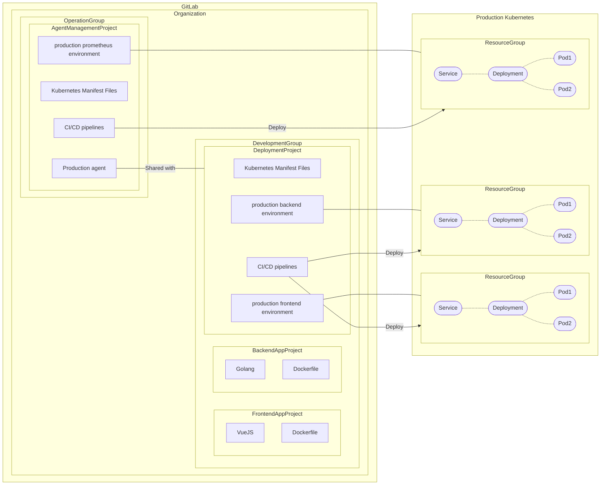
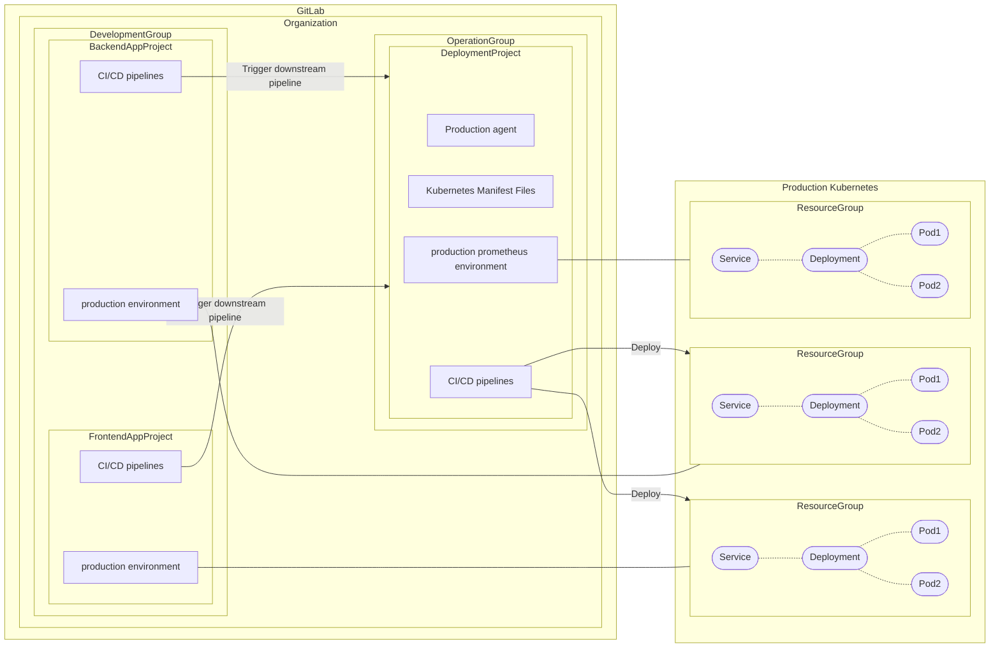
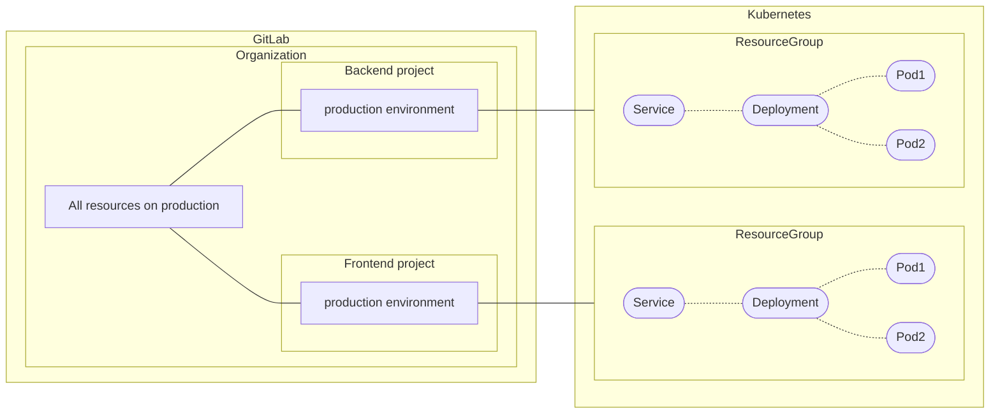

<!-- vale gitlab.FutureTense = NO -->

# View and manage resources deployed by GitLab Agent For Kuberenetes

## Summary

As part of the [GitLab Kubernetes Dashboard](https://gitlab.com/groups/gitlab-org/-/epics/2493) epic,
users want to view and manage their resources deployed by GitLab Agent For Kuberenetes.
Users should be able to interact with the resources through GitLab UI, such as Environment Index/Details page.

This blueprint describes how the association is established and how these domain models interact with each other.

## Motivation

### Goals

- The proposed architecture can be used in [GitLab Kubernetes Dashboard](https://gitlab.com/groups/gitlab-org/-/epics/2493).
- The proposed architecture can be used in [Organization-level Environment dashboard](https://gitlab.com/gitlab-org/gitlab/-/issues/241506).
- The cluster resources and events can be visualized per [GitLab Environment](../../../ci/environments/index.md).
  An environment-specific view scoped to the resources managed either directly or indirectly by a deployment commit.
- Support both [GitOps mode](../../../user/clusters/agent/gitops.md#gitops-configuration-reference) and [CI Access mode](../../../user/clusters/agent/ci_cd_workflow.md#authorize-the-agent).
  - NOTE: At the moment, we focus on the solution for CI Access mode. GitOps mode will have significant architectural changes _outside of_ this blueprint,
    such as [Flux switching](https://gitlab.com/gitlab-org/gitlab/-/issues/357947) and [Manifest projects outside of the Agent configuration project](https://gitlab.com/groups/gitlab-org/-/epics/7704). In order to derisk potential rework, we'll revisit the GitOps mode after these upstream changes have been settled.

### Non-Goals

- The design details of [GitLab Kubernetes Dashboard](https://gitlab.com/groups/gitlab-org/-/epics/2493) and [Organization-level Environment dashboard](https://gitlab.com/gitlab-org/gitlab/-/issues/241506).
- Support Environment/Deployment features that rely on GitLab CI/CD pipelines, such as [Protected Environments](../../../ci/environments/protected_environments.md), [Deployment Approvals](../../../ci/environments/deployment_approvals.md), [Deployment safety](../../../ci/environments/deployment_safety.md), and [Environment rollback](../../../ci/environments/index.md#environment-rollback). These features are already available in CI Access mode, however, it's not available in GitOps mode.

## Proposal

### Overview

- GitLab Environment and Agent-managed Resource Group have 1-to-1 relationship.
- Agent-managed Resource Group tracks all resources produced by the connected [agent](../../../user/clusters/agent/index.md). This includes not only resources written in manifest files but also subsequently generated resources (e.g. `Pod`s created by `Deployment` manifest file).
- Agent-managed Resource Group renders dependency graph, such as `Deployment` => `ReplicaSet` => `Pod`. This is for providing ArgoCD-style resource view.
- Agent-managed Resource Group has the Resource Health status that represents a summary of resource statuses, such as `Healthy`, `Progressing` or `Degraded`.



### Existing components and relationships

- [GitLab Project](../../../user/project/working_with_projects.md) and GitLab Environment have 1-to-many relationship.
- GitLab Project and Agent have 1-to-many _direct_ relationship. Only one project can own a specific agent.
- [GitOps mode](../../../user/clusters/agent/gitops.md#gitops-configuration-reference)
  - GitLab Project and Agent do _NOT_ have many-to-many _indirect_ relationship yet. This will be supported in [Manifest projects outside of the Agent configuration project](https://gitlab.com/groups/gitlab-org/-/epics/7704).
  - Agent and Agent-managed Resource Group have 1-to-1 relationship. Inventory IDs are used to group Kubernetes resources. This might be changed in [Flux switching](https://gitlab.com/gitlab-org/gitlab/-/issues/357947).
- [CI Access mode](../../../user/clusters/agent/ci_cd_workflow.md#authorize-the-agent)
  - GitLab Project and Agent have many-to-many _indirect_ relationship. The project owning the agent can [share the access with the other proejcts](../../../user/clusters/agent/ci_cd_workflow.md#authorize-the-agent-to-access-projects-in-your-groups). (NOTE: Technically, only running jobs inside the project are allowed to access the cluster due to job-token authentication.)
  - Agent and Agent-managed Resource Group do _NOT_ have relationships yet.

### Issues

- Agent-managed Resource Group should have environment ID as the foreign key, which must be unique across resource groups.
- Agent-managed Resource Group should have parameters how to group resources in the associated cluster, for example, `namespace`, `lable` and `inventory-id` (GitOps mode only) can passed as parameters.
- Agent-managed Resource Group should be able to fetch all relevant resources, including both default resource kinds and other [Custom Resources](https://kubernetes.io/docs/concepts/extend-kubernetes/api-extension/custom-resources/).
- Agent-managed Resource Group should be aware of dependency graph.
- Agent-managed Resource Group should be able to compute Resource Health status from the associated resources.

### Example: Pull-based deployment (GitOps mode)

NOTE:
At the moment, we focus on the solution for CI Access mode. GitOps mode will have significant architectural changes _outside of_ this blueprint,
such as [Flux switching](https://gitlab.com/gitlab-org/gitlab/-/issues/357947) and [Manifest projects outside of the Agent configuration project](https://gitlab.com/groups/gitlab-org/-/epics/7704). In order to derisk potential rework, we'll revisit the GitOps mode after these upstream changes have been settled.

### Example: Push-based deployment (CI access mode)

This is an example of how the architecture works in push-based deployment.
The feature is documented [here](../../../user/clusters/agent/ci_cd_workflow.md) as CI access mode.



### Further details

#### Multi-Project Deployment Pipelines

The microservice project setup can be improved by [Multi-Project Deployment Pipelines](https://gitlab.com/groups/gitlab-org/-/epics/8483):

- Deployment Project can behave as the shared deployment engine for any upstream application projects and environments.
- Environments can be created within the application projects. It gives more visibility of environments for developers.
- Deployment Project can be managed under Operator group. More segregation of duties.
- Users don't need to setup [RBAC to restrict CI/CD jobs](../../../user/clusters/agent/ci_cd_workflow.md#restrict-project-and-group-access-by-using-impersonation).
- This is especitially helpful for [dynamic environments](../../../ci/environments/index.md#create-a-dynamic-environment), such as Review Apps.



#### View all Agent-managed Resource Groups on production environment

At the group-level, we can accumulate all environments match a specific tier, for example,
listing all environments with `production` tier from subsequent projects.
This is useful to see the entire Agent-managed Resource Groups on production environment.
The following diagram examplifies the relationship between GitLab group and Kubernetes resources:



A few notes:

- In the future, we'd have more granular filters for resource search.
  For example, there are two environments `production/us-region` and `production/eu-region` in each project
  and show only resources in US region at the group-level.
  This could be achivable by query filtering in PostgreSQL or label/namespace filtering in Kubernetes.
- Please see [Add dynamically populated organization-level environments page](https://gitlab.com/gitlab-org/gitlab/-/issues/241506) for more information.

## Design and implementation details

NOTE:
The following solution might be only applicable for CI Access mode. GitOps mode will have significant architectural changes _outside of_ this blueprint,
such as [Flux switching](https://gitlab.com/gitlab-org/gitlab/-/issues/357947) and [Manifest projects outside of the Agent configuration project](https://gitlab.com/groups/gitlab-org/-/epics/7704). In order to derisk potential rework, we'll revisit the GitOps mode after these upstream changes have been settled.

### Associate Environment with Agent

As a preliminary step, we allow users to explicitly define "which deployment job" uses "which agent" and deploy to "which namespace". The following keywords are supported in `.gitlab-ci.yml`.

- `environment:kubernetes:agent` ... Define which agent the deployment job uses. It can select the appropriate context from the `KUBE_CONFIG`.
- `environment:kubernetes:namespace` ... Define which namespace the deployment job deploys to. It injects `KUBE_NAMESPACE` predefined variable into the job. This keyword already [exists](../../../ci/yaml/index.md#environmentkubernetes).

Here is an example of `.gitlab-ci.yml`.

```yaml
deploy-production:
  environment:
    name: production
    kubernetes:
      agent: path/to/agent/repository:agent-name
      namespace: default
  script: 
    - helm --context="$KUBE_CONTEXT" --namespace="$KUBE_NAMESPACE" upgrade --install
```

When a deployment job is created, GitLab persists the relationship of specified agent, namespace and deployment job. If the CI job is NOT authorized to access the agent (Please refer [`Clusters::Agents::FilterAuthorizationsService`](https://gitlab.com/gitlab-org/gitlab/-/blob/master/app/services/clusters/agents/filter_authorizations_service.rb) for more details), this relationship aren't recorded. This process happens in [`Deployments::CreateForBuildService`](https://gitlab.com/gitlab-org/gitlab/-/blob/master/app/services/deployments/create_for_build_service.rb). The database table scheme is:

```plaintext
agent_deployments:
  - deployment_id (bigint/FK/NOT NULL/Unique)
  - agent_id (bigint/FK/NOT NULL)
  - kubernetes_namespace (character varying(255)/NOT NULL)
```

To idenfity an associated agent for a specific environment, `environment.last_deployment.agent` can be used in Rails.

### Fetch resources through `user_access`

When user visits an environment page, GitLab frontend fetches an environment via GraphQL. Frontend additionally fetches the associated agent-ID and namespace through deployment relationship, which being tracked by the `agent_deployments` table.

Here is an example of GraphQL query:

```graphql
{
  project(fullPath: "group/project") {
    id
    environment(name: "<environment-name>") {
      slug
      lastDeployment(status: SUCCESS) {
        agent {
          id
          name
          project
          kubernetesNamespace
        }
      }
    }
  }
}
```

GitLab frontend authenticate/authorize the user access with [browser cookie](https://gitlab.com/gitlab-org/cluster-integration/gitlab-agent/-/blob/master/doc/kubernetes_user_access.md#browser-cookie-on-gitlab-frontend). If the access is forbidden, frontend shows an error message that `You don't have access to an agent that deployed to this environment. Please contact agent administrator if you are allowed in "user_access" in agent config file. See <troubleshooting-doc-link>`.

After the user gained access to the agent, GitLab frontend fetches available API Resource list in the Kubernetes and fetches the resources with the following parameters:

- `namespace` ... `#{environment.lastDeployment.agent.kubernetesNamespace}`
- `labels`
  - `app.gitlab.com/project_id=#{project.id}` _AND_
  - `app.gitlab.com/environment_slug: #{environment.slug}`

If no resources are found, this is likely that the users have not embedded these lables into their resources. In this case, frontend shows an warning message `There are no resources found for the environment. Do resources have GitLab preserved labels? See <troubleshooting-doc-link>`.

### Dependency graph

- GitLab frontend uses [Owner References](https://kubernetes.io/docs/concepts/overview/working-with-objects/owners-dependents/) to idenfity the dependencies between resources. These are embedded in resources as `metadata.ownerReferences` field.
- For the resoruces that don't have owner references, we can use [Well-Known Labels, Annotations and Taints](https://kubernetes.io/docs/reference/labels-annotations-taints/) as complement. e.g. `EndpointSlice` doesn't have `metadata.ownerReferences`, but has `kubernetes.io/service-name` as a reference to the parent `Service` resource.

### Health status of resources

- GitLab frontend computes the status summary from the fetched resources. Something similar to ArgoCD's [Resource Health](https://argo-cd.readthedocs.io/en/stable/operator-manual/health/) e.g. `Healthy`, `Progressing`, `Degraded` and `Suspended`. The formula is TBD.
