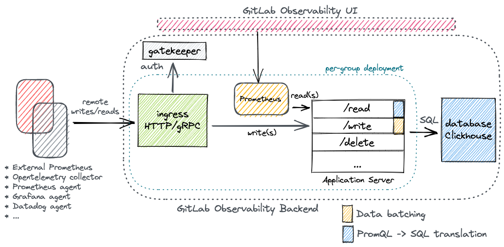

<!-- vale gitlab.FutureTense = NO -->

# GitLab Observability Backend - Metrics

## Summary

Developing a multi-user system to store & query observability data typically formatted in widely accepted, industry-standard formats using Clickhouse as underlying storage, with support for long-term data retention and aggregation.

## Motivation

From the six pillars of Observability, commonly abbreviated as `TEMPLE` - Traces, Events, Metrics, Profiles, Logs & Errors, Metrics constitute one of the most important pillars of observability data for modern day systems, helping their users gather insights about their operational posture.

Metrics which are commonly structured as timeseries data have the following characteristics:

- indexed by their corresponding timestamps;
- continuously expanding in size;
- usually aggregated, down-sampled, and queried in ranges; and
- have very write-intensive requirements.

Within GitLab Observability Backend, we aim to add the support for our customers to ingest and query observability data around their systems & applications, helping them improve the operational health of their systems.

### Goals

With the development of the proposed system, we have the following goals:

- Scalable, low latency & cost-effective monitoring system backed by Clickhouse whose performance has been proven via repeatable benchmarks.

- Support for long-term storage for Prometheus/OpenTelemetry formatted metrics, ingested via Prometheus remote_write API and queried via Prometheus remote_read API, PromQL or SQL with support for metadata and exemplars.

The aformentioned goals can further be broken down into the following four sub-goals:

#### Ingesting data

- For the system to be capable of ingesting large volumes of writes and reads, we aim to ensure that it must be horizontally scalable & provide durability guarantees to ensure no writes are dropped once ingested.

#### Persisting data

- We aim to support ingesting telemetry/data sent using Prometheus `remote_write` protocol. Any persistence we design for our dataset must be multi-tenant by default, ensuring we can store observability data for multiple tenants/groups/projects within the same storage backend.

- We aim to develop a test suite for data correctness, seeking inspiration from how Prometheus compliance test suite checks the correctness of a given Metrics implementation and running it as a part of our CI setup.

NOTE:
Although remote_write_sender does not test the correctness of a remote write receiver itself as is our case, it does bring some inspiration to implement/develop one within the scope of this project.

- We aim to also ensure compatibility for special Prometheus data types, e.g. Prometheus histogram(s), summary(s).

#### Reading data

- We aim to support querying data using PromQL which means translating PromQL queries into Clickhouse SQL. To do this, [PromQL](https://github.com/prometheus/prometheus/tree/main/promql/parser) or [MetricsQL](https://github.com/VictoriaMetrics/metricsql) parsers are good alternatives.

- We aim to provide additional value by exposing all ingested data via the native Clickhouse SQL interface subject to the following reliability characteristics:
  - query validation, sanitation
  - rate limiting
  - resource limiting - memory, cpu, network bandwidth

- We aim to pass Prometheus test suits for correctness via the [Prometheus Compliance test suite](https://github.com/prometheus/compliance/tree/main/promql) with a target goal of 100% success rate.

#### Deleting data

- We aim to support being able to delete any ingested data should such a need arise. This is also in addition to us naturally deleting data when a configured TTL expires and/or respective retention policies are enforced. We must, within our schemas, build a way to delete data by labels OR their content, also add to our offering the necessary tooling to do so.

### Non-Goals

With the goals established above, we also want to establish what specific things are non-goals with the current proposal. They are:

- We do not aim to support ingestion using OpenTelemetry/OpenMetrics formats with our first iteration, though our users can still use the Opentelemetry exporters(s) internally consuming the standard Prometheus `remote_write` protocol. More information [here](https://github.com/open-telemetry/opentelemetry-collector-contrib/tree/main/exporter/prometheusremotewriteexporter).

- We do not aim to support ingesting Prometheus exemplars in our first iteration, though we do aim to account for them in our design from the beginning.

NOTE:
Worth noting that we intend to model exemplars the same way we’re modeling metric-labels, so building on top of the same data structure should help implementt support for metadata/exemplars rather easily.

## Proposal

We intend to use GitLab Observability Backend as a framework for the Metrics implementation so that its lifecycle is also managed via already existing Kubernetes controllers e.g. scheduler, tenant-operator.



From a development perspective, what’s been marked as our “Application Server” above needs to be developed as a part of this proposal while the remaining peripheral components either already exist or can be provisioned via existing code in `scheduler`/`tenant-operator`.

**On the write path**, we expect to receive incoming data via `HTTP`/`gRPC` `Ingress` similar to what we do for our existing services, e.g. errortracking, tracing.

NOTE:
Additionally, since we intend to ingest data via Prometheus `remote_write` API, the received data will be Protobuf-encoded, Snappy-compressed. All received data therefore needs to be decompressed & decoded to turn it into a set of `prompb.TimeSeries` objects, which the rest of our components interact with.

We also need to make sure to avoid writing a lot of small writes into Clickhouse, therefore it’d be prudent to batch data before writing it into Clickhouse.

We must also make sure ingestion remains decoupled with `Storage` so as to reduce undue dependence on a given storage implementation. While we do intend to use Clickhouse as our backing storage for any foreseeable future, this ensures we do not tie ourselves in into Clickhouse too much should future business requirements warrant the usage of a different backend/technology. A good way to implement this in Go would be our implementations adhering to a standard interface, the following for example:

```go
type Storage interface {
  Read(
    ctx context.Context,
    request *prompb.ReadRequest
  ) (*prompb.ReadResponse, error)
  Write(
    ctx context.Context,
    request *prompb.WriteRequest
  ) error
}
```

NOTE:
We understand this couples the implementation with Prometheus data format/request types, but adding methods to the interface to support more data formats should be trivial looking forward with minimal changes to code.

**On the read path**, we aim to allow our users to use the Prometheus `remote_read` API and be able to query ingested data via PromQL & SQL. Support for `remote_read` API should be trivial to implement, while supporting PromQL would need translating it into SQL. We can however employ the usage of already existing [PromQL](https://github.com/prometheus/prometheus/tree/main/promql/parser) parsing libraries.

We aim to focus on implementing query validation & sanitation, rate-limiting and regulating resource-consumption to ensure underlying systems, esp. storage, remain in good operational health at all times.

### Supported deployments

In this first iteration of the metrics backend, we intend to support a generic deployment model that makes sure we can capture as much usage as possible and begin dogfooding the product as soon as possible. This is well illustrated in the [aforementioned architecture diagram](#proposal).

In its most vanilla form, metrics support in GitLab Observability Backend can be used via the Prometheus remote read & write APIs. If a user already uses Prometheus as their monitoring abstraction, it can be configured to use this backend directly.

- remote_write: [configuration](https://prometheus.io/docs/prometheus/latest/configuration/configuration/#remote_write)
- remote_read: [configuration](https://prometheus.io/docs/prometheus/latest/configuration/configuration/#remote_read)

For users of the system that do not use a Prometheus instance for scraping their telemetry data, they can export their metrics via a multitude of collectors/agents such as the OpenTelemetry collector or the Prometheus Agent for example, all of which can be configured to use our remote_write endpoint. For reads however, we intend to run a Prometheus within GOB (alongside the application server) itself, then hook it up automatically with the GitLab Observability UI (GOUI) preconfigured to consume our remote_read endpoint.

Notably, the ability to use a GOB-run Prometheus instance is applicable while we can only support remote_read API for running queries. Looking forward towards our next iteration, we should be able to get rid of this additional component altogether when we have full support for executing PromQL and/or SQL queries directly from GOUI.

**Per-group deployments**: From a scalability perspective, we deploy an instance of Ingress, a Prometheus instance & the application server per group to make sure we can scale them subject to traffic volumes of the respective tenant. It also helps isolate resource consumption across tenants in an otherwise multi-tenant system.

### Metric collection and storage

It is important to separate metric collection on the client side with the storage we provision at our end.

### State of the art for storage

Existing long-term Prometheus compatible metrics vendors provide APIs that are compatible with Prometheus remote_write.

### State of the art for Prometheus clients

Metric collection clients such as Prometheus itself, Grafana Cloud Agent, Datadog Agent, etc. will scrape metrics endpoints typically from within a firewalled environment, store locally scraped metrics in a [Write Ahead Log (WAL)](https://en.wikipedia.org/wiki/Write-ahead_logging) and then batch send them to an external environment (i.e. the vendor or an internally managed system like Thanos) via the Prometheus `remote_write` protocol.

- A client-side collector is an important part of the overall architecture, though it's owned by the customer/user since it needs to run in their environment. This gives the end user full control over their data because they control how it is collected and to where it is delivered.

- It's **not** feasible to provide an external vendor with credentials to access and scrape endpoints within a user's firewalled environment.

- It's also critically important that our `remote_write` APIs respond correctly with the appropriate rate-limiting status codes so that Prometheus Clients can respect them.

[Here](https://grafana.com/blog/2021/05/26/the-future-of-prometheus-remote-write/) is a good background/history on Prometheus `remote_write` and its importance in Prometheus based observability.

## Design and implementation details

Following are details of how we aim to design & implement the proposed solution. To that end, a reference implementation was also developed to understand the scope of the problem and provide early data to ensure our proposal was drafted around informed decisions and/or results of our experimentation.

## Reference implementation(s)

- [Application server](https://gitlab.com/gitlab-org/opstrace/opstrace/-/merge_requests/1823)
- [Metrics generator](https://gitlab.com/ankitbhatnagar/metrics-gen/-/blob/main/main.go)

## Target environments

Keeping inline with our current operational structure, we intend to deploy the metrics offering as a part of GitLab Observability Backend, deployed on the following two target environments:

- kind cluster (for local development)
- GKE cluster (for staging/production environments)

## Schema Design

### **Proposed solution**: Fully normalized tables for decreased redundancy & increased read performance

### primary, denormalized data table

```sql
CREATE TABLE IF NOT EXISTS samples ON CLUSTER '{cluster}' (
  series_id UUID,
  timestamp DateTime64(3, ‘UTC’) CODEC(Delta(4), ZSTD),
  value Float64 CODEC(Gorilla, ZSTD)
) ENGINE = ReplicatedMergeTree()
PARTITION BY toYYYYMMDD(timestamp)
ORDER BY (series_id, timestamp)
```

### metadata table to support timeseries metadata/exemplars

```sql
CREATE TABLE IF NOT EXISTS samples_metadata ON CLUSTER '{cluster}' (
  series_id UUID,
  timestamp DateTime64(3, ‘UTC’) CODEC(Delta(4), ZSTD),
  metadata Map(String, String) CODEC(ZSTD),
) ENGINE = ReplicatedMergeTree()
PARTITION BY toYYYYMMDD(timestamp)
ORDER BY (series_id, timestamp)
```

### lookup table(s)

```sql
CREATE TABLE IF NOT EXISTS labels_to_series ON CLUSTER '{cluster}' (
  labels Map(String, String) CODEC(ZSTD)
  series_id UUID
) engine=ReplicatedMergeTree
PRIMARY KEY (labels, series_id)
```

```sql
CREATE TABLE IF NOT EXISTS group_to_series ON CLUSTER ‘{cluster}’ (
  group_id Uint64,
  series_id UUID,
) ORDER BY (group_id, series_id)
```

### Refinements

- sharding considerations for a given tenant when ingesting/persisting data if we intend to co-locate data specific to multiple tenants within the same database tables. To simplify things, segregating tenant-specific data to their own dedicated set of tables would make a lot of sense.

- structural considerations for “timestamps” when ingesting data across tenants.

- creation_time vs ingestion_time

- No support for transactions in the native client yet, to be able to effectively manage writes across multiple tables.

NOTE:
Slightly non-trivial but we can potentially investigate the possibility of using ClickHouse/ch-go directly, it supposedly promises a better performance profile too.

### Pros - multiple tables

- Normalised data structuring allows for efficient storage of data, removing any redundancy across multiple samples for a given timeseries. Evidently, for the “samples” schema, we expect to store 32 bytes of data per metric point.

- Better search complexity when filtering timeseries by labels/metadata, via the use of better indexed columns.

- All data is identifiable via a unique identifier, which can be used to maintain data consistency across tables.

### Cons - multiple tables

- Writes are trivially expensive considering writes across multiple tables.

- Writes across tables also need to be implemented as a transaction to guarantee consistency when ingesting data.

### Operational characteristics - multiple tables

### Storage - multiple tables

A major portion of our writes are made into the `samples` schema which contains a tuple containing three data points per metric point written:
|column|data type|byte size|
|---|---|---|
|series_id|UUID|16 bytes|
|timestamp|DateTime64|8 bytes|
|value|Float64|8 bytes|

Therefore, we estimate to use 32 bytes per sample ingested.

### Compression - multiple tables

Inspecting the amount of compression we’re able to get with the given design on our major schemas, we see it as a good starting point. Following measurements for both primary tables:

**Schema**: `labels_to_series` containing close to 12k unique `series_id`, each mapping to a set of 10-12 label string pairs

```sql
SELECT
    table,
    column,
    formatReadableSize(sum(data_compressed_bytes) AS x) AS compressedsize,
    formatReadableSize(sum(data_uncompressed_bytes)) AS uncompressed
FROM system.parts_columns
WHERE table LIKE 'labels_to_series_1'
GROUP BY
    database,
    table,
    column
ORDER BY x ASC

Query id: 723b4145-14f7-4e74-9ada-01c17c2f1fd5

┌─table──────────────┬─column────┬─compressedsize─┬─uncompressed─┐
│ labels_to_series_1 │ labels    │ 586.66 KiB     │ 2.42 MiB     │
│ labels_to_series_1 │ series_id │ 586.66 KiB     │ 2.42 MiB     │
└────────────────────┴───────────┴────────────────┴──────────────┘
```

**Schema**: `samples` containing about 20k metric samples each containing a tuple comprising `series_id` (16 bytes), `timestamp` (8 bytes) and `value` (8 bytes).

```sql
SELECT
    table,
    column,
    formatReadableSize(sum(data_compressed_bytes) AS x) AS compressedsize,
    formatReadableSize(sum(data_uncompressed_bytes)) AS uncompressed
FROM system.parts_columns
WHERE table LIKE 'samples_1'
GROUP BY
    database,
    table,
    column
ORDER BY x ASC

Query id: 04219cea-06ea-4c5f-9287-23cb23c023d2

┌─table─────┬─column────┬─compressedsize─┬─uncompressed─┐
│ samples_1 │ value     │ 373.21 KiB     │ 709.78 KiB   │
│ samples_1 │ timestamp │ 373.21 KiB     │ 709.78 KiB   │
│ samples_1 │ series_id │ 373.21 KiB     │ 709.78 KiB   │
└───────────┴───────────┴────────────────┴──────────────┘
```

### Performance - multiple tables

From profiling our reference implementation, it can also be noted that most of our time right now is spent in the application writing data to Clickhouse and/or its related operations. A “top” pprof profile sampled from the implementation looked like:

```shell
(pprof) top
Showing nodes accounting for 42253.20kB, 100% of 42253.20kB total
Showing top 10 nodes out of 58
      flat  flat%   sum%        cum   cum%
13630.30kB 32.26% 32.26% 13630.30kB 32.26%  github.com/ClickHouse/clickhouse-go/v2/lib/compress.NewWriter (inline)
11880.92kB 28.12% 60.38% 11880.92kB 28.12%  github.com/ClickHouse/clickhouse-go/v2/lib/compress.NewReader (inline)
 5921.37kB 14.01% 74.39%  5921.37kB 14.01%  bufio.NewReaderSize (inline)
 5921.37kB 14.01% 88.41%  5921.37kB 14.01%  bufio.NewWriterSize (inline)
 1537.69kB  3.64% 92.04%  1537.69kB  3.64%  runtime.allocm
 1040.73kB  2.46% 94.51%  1040.73kB  2.46%  github.com/aws/aws-sdk-go/aws/endpoints.init
 1024.41kB  2.42% 96.93%  1024.41kB  2.42%  runtime.malg
  768.26kB  1.82% 98.75%   768.26kB  1.82%  go.uber.org/zap/zapcore.newCounters
  528.17kB  1.25%   100%   528.17kB  1.25%  regexp.(*bitState).reset
         0     0%   100%  5927.73kB 14.03%  github.com/ClickHouse/clickhouse-go/v2.(*clickhouse).Ping
```

As is evident above from our preliminary analysis, writing data into Clickhouse can be a potential bottleneck. Therefore, on the write path, it'd be prudent to batch our writes into Clickhouse so as to reduce the amount of work the application server ends up doing making the ingestion path more efficient.

On the read path, it’s also possible to parallelize reads for the samples table either by series_id(s) OR by blocks of time between the queried start and end timestamps.

### Caveats

- When dropping labels from already existing metrics, we treat their new counterparts as completely new series and hence attribute them to a new series_id. This avoids having to merge series data and/or values. The old series, if not actively written into, should eventually fall off their retention and get deleted.

- We have not yet accounted for any data aggregation. Our assumption is that the backing store (in Clickhouse) should allow us to keep a “sufficient” amount of data in its raw form and that we should be able to query against it within our query latency SLOs.

### **Rejected alternative**: Single, centralized table

### single, centralized data table

```sql
CREATE TABLE IF NOT EXISTS metrics ON CLUSTER ‘{cluster}’ (
  group_id UInt64,
  name LowCardinality(String) CODEC(ZSTD),
  labels Map(String, String) CODEC(ZSTD),
  metadata Map(String, String) CODEC(ZSTD),
  value Float64 CODEC (Gorilla, ZSTD),
  timestamp DateTime64(3, ‘UTC’) CODEC(Delta(4),ZSTD)
) ENGINE = ReplicatedMergeTree()
PARTITION BY toYYYYMMDD(timestamp)
ORDER BY (group_id, name, timestamp);
```

### Pros - single table

- Single source of truth, so all metrics data lives in one big table.

- Querying data is easier to express in terms of writing SQL queries without having to query data across multiple tables.

### Cons - single table

- Huge redundancy built into the data structure since attributes such as name, labels, metadata are stored repeatedly for each sample collected.

- Non-trivial complexity to search timeseries with values for labels/metadata given how they’re stored when backed by Maps/Arrays.

- High query latencies by virtue of having to scan large amounts of data per query made.

### Operational Characteristics - single table

### Storage - single table

|column|data type|byte size|
|---|---|---|
|group_id|UUID|16 bytes|
|name|String|-|
|labels|Map(String, String)|-|
|metadata|Map(String, String)|-|
|value|Float64|8 bytes|
|timestamp|DateTime64|8 bytes|

NOTE:
Strings are of an arbitrary length, the length is not limited. Their value can contain an arbitrary set of bytes, including null bytes. We will need to regulate what we write into these columns application side.

### Compression - single table

**Schema**: `metrics` containing about 20k metric samples each consisting of a `group_id`, `metric name`, `labels`, `metadata`, `timestamp` & corresponding `value`.

```sql
SELECT count(*)
FROM metrics_1

Query id: e580f20b-b422-4d93-bb1f-eb1435761604

┌─count()─┐
│   12144 │


SELECT
    table,
    column,
    formatReadableSize(sum(data_compressed_bytes) AS x) AS compressedsize,
    formatReadableSize(sum(data_uncompressed_bytes)) AS uncompressed
FROM system.parts_columns
WHERE table LIKE 'metrics_1'
GROUP BY
    database,
    table,
    column
ORDER BY x ASC

Query id: b2677493-3fbc-46c1-a9a7-4524a7a86cb4

┌─table─────┬─column────┬─compressedsize─┬─uncompressed─┐
│ metrics_1 │ labels    │ 283.02 MiB     │ 1.66 GiB     │
│ metrics_1 │ metadata  │ 283.02 MiB     │ 1.66 GiB     │
│ metrics_1 │ group_id  │ 283.02 MiB     │ 1.66 GiB     │
│ metrics_1 │ value     │ 283.02 MiB     │ 1.66 GiB     │
│ metrics_1 │ name      │ 283.02 MiB     │ 1.66 GiB     │
│ metrics_1 │ timestamp │ 283.02 MiB     │ 1.66 GiB     │
└───────────┴───────────┴────────────────┴──────────────┘
```

Though we see a good compression factor for the aforementioned schema, the amount of storage needed to store the corresponding dataset is approximately 300MiB. We also expect to see this footprint increase linearly given the redundancy baked into the schema design itself, also one of the reasons we intend **not** to proceed with this design further.

### Performance - single table

```shell
(pprof) top
Showing nodes accounting for 12844.95kB, 100% of 12844.95kB total
Showing top 10 nodes out of 40
      flat  flat%   sum%        cum   cum%
 2562.81kB 19.95% 19.95%  2562.81kB 19.95%  runtime.allocm
 2561.90kB 19.94% 39.90%  2561.90kB 19.94%  github.com/aws/aws-sdk-go/aws/endpoints.init
 2374.91kB 18.49% 58.39%  2374.91kB 18.49%  github.com/ClickHouse/clickhouse-go/v2/lib/compress.NewReader (inline)
 1696.32kB 13.21% 71.59%  1696.32kB 13.21%  bufio.NewWriterSize (inline)
 1184.27kB  9.22% 80.81%  1184.27kB  9.22%  bufio.NewReaderSize (inline)
 1184.27kB  9.22% 90.03%  1184.27kB  9.22%  github.com/ClickHouse/clickhouse-go/v2/lib/compress.NewWriter (inline)
  768.26kB  5.98% 96.01%   768.26kB  5.98%  go.uber.org/zap/zapcore.newCounters
  512.20kB  3.99%   100%   512.20kB  3.99%  runtime.malg
         0     0%   100%  6439.78kB 50.13%  github.com/ClickHouse/clickhouse-go/v2.(*clickhouse).Ping
         0     0%   100%  6439.78kB 50.13%  github.com/ClickHouse/clickhouse-go/v2.(*clickhouse).acquire
```

Writes against this schema perform much better in terms of compute, given it's concentrated on one table and does not need looking up `series_id` from a side table.

### General storage considerations - Clickhouse

The following sections intend to deep-dive into specific characteristics of our schema design and/or their interaction with Clickhouse - the database system.

- table engines

  - [MergeTree](https://clickhouse.com/docs/en/engines/table-engines/mergetree-family/mergetree/)
  - [S3 Table Engine](https://clickhouse.com/docs/en/engines/table-engines/integrations/s3/)

- efficient partitioning and/or sharding

  - Configuring our schemas with the right partitioning keys so as to have the least amount of blocks scanned when reading back the data.
  - Sharding here would refer to how we design our data placement strategy to make sure the cluster remains optimally balanced at all times.

- data compression

As is visible from the aforementioned preliminary results, we see good compression results with dictionary and delta encoding for strings and floats respectively. When storing labels with a `Map` of `LowCardinality(String)`s, we were able to pack data efficiently.

- materialized views

Can be updated dynamically as the need be, help make read paths performant

- async inserts

- batch inserts

- retention/TTLs

We should only store data for a predetermined period of time, post which we either delete data, aggregate it or ship it to an archival store to reduce operational costs of having to store data for longer periods of time.

- data aggregation/rollups

- index granularity

- skip indexes

- `max_server_memory_usage_to_ram_ratio`

### Data access via SQL

While our corpus of data is PromQL-queryable, it would be prudent to make sure we make the SQL interface “generally available” as well. This capability opens up multiple possibilities to query resident data and allows our users to slice and dice their datasets whichever way they prefer to and/or need to.

#### Challenges

- Resource/cost profiling.
- Query validation and sanitation.

### Illustrative example(s) of data access

### Writes

On the write path, we first ensure registering a given set labels to a unique `series_id` and/or re-using one should we have seen the timeseries already in the past. For example:

```plaintext
redis{region="us-east-1",'os':'Ubuntu15.10',...} <TIMESTAMP> <VALUE> 
```

**Schema**: labels_to_series

```sql
SELECT *
FROM labels_to_series_1
WHERE series_id = '6d926ae8-c3c3-420e-a9e2-d91aff3ac125'
FORMAT Vertical

Query id: dcbc4bd8-0bdb-4c35-823a-3874096aab6e

Row 1:
──────
labels:    {'arch':'x64','service':'1','__name__':'redis','region':'us-east-1','os':'Ubuntu15.10','team':'LON','service_environment':'production','rack':'36','service_version':'0','measurement':'pubsub_patterns','hostname':'host_32','datacenter':'us-east-1a'}
series_id: 6d926ae8-c3c3-420e-a9e2-d91aff3ac125

1 row in set. Elapsed: 0.612 sec.
```

Post which, we register each metric point in the `samples` table attributing it to the corresponding `series_id`.

**Schema**: samples

```sql
SELECT *
FROM samples_1
WHERE series_id = '6d926ae8-c3c3-420e-a9e2-d91aff3ac125'
LIMIT 1
FORMAT Vertical

Query id: f3b410af-d831-4859-8828-31c89c0385b5

Row 1:
──────
series_id: 6d926ae8-c3c3-420e-a9e2-d91aff3ac125
timestamp: 2022-11-10 12:59:14.939
value:     0
```

### Reads

On the read path, we first query all timeseries identifiers by searching for the labels under consideration. Once we have all the `series_id`(s), we then look up all corresponding samples between the query start timestamp and end timestamp.

For e.g.

```plaintext
kernel{service_environment=~"prod.*", measurement="boot_time"}
```

which gets translated into first looking for all related timeseries:

```sql
SELECT *
FROM labels_to_series
WHERE
((labels['__name__']) = 'kernel') AND
match(labels['service_environment'], 'prod.*') AND
((labels['measurement']) = 'boot_time');
```

yielding a bunch of `series_id`(s) corresponding to the labels just looked up.

**Sidenote**, this mostly-static dataset can also be cached and built up in-memory gradually to reduce paying the latency cost the second time, which should reduce the number of lookups considerably.

To account for newer writes when maintaining this cache:

- Have an out-of-band process/goroutine maintain this cache, so even if a few queries miss the most recent data, subsequent ones eventually catch up.

- Have TTLs on the keys, jittered per key so as to rebuild them frequently enough to account for new writes.

Once we know which timeseries we’re querying for, from there, we can easily look up all samples via the following query:

```sql
SELECT *
FROM samples
WHERE series_id IN (
  'a12544be-0a3a-4693-86b0-c61a4553aea3',
  'abd42fc4-74c7-4d80-9b6c-12f673db375d',
  …
)
AND timestamp >= '1667546789'
AND timestamp <= '1667633189'
ORDER BY timestamp;
```

yielding all timeseries samples we were interested in.

We then render these into an array of `prometheus.QueryResult` object(s) and return back to the caller as a `prometheus.ReadResponse` object.

NOTE:
The queries have been broken down into multiple queries only during our early experimentation/iteration, it’d be prudent to use subqueries within the same roundtrip to the database going forward into production/benchmarking.

## Production Readiness

### Batching

Considering we’ll need to batch data before ingesting large volumes of small writes into Clickhouse, the design must account for app-local persistence to allow it to locally batch incoming data before landing it into Clickhouse in batches of a predetermined size in order to increase performance and allow the table engine to continue to persist data successfully.

We have considered the following alternatives to implement app-local batching:

- In-memory - non durable
- BadgerDB - durable, embedded, performant
- Redis - trivial, external dependency
- Kafka - non-trivial, external dependency but it can augment multiple other use-cases and help other problem domains at GitLab.

**Note**: Similar challenges have also surfaced with the CH interactions `errortracking` - the subsystem has in its current implementation. There have been multiple attempts to solve this problem domain in the past - [this MR](https://gitlab.com/gitlab-org/opstrace/opstrace/-/merge_requests/1660) implemented an in-memory alternative while [this one](https://gitlab.com/gitlab-org/opstrace/opstrace/-/merge_requests/1767) attempted an on-disk alternative.

Any work done in this area of concern would also benefit other subsystems such as errortracking, logging, etc.

### Scalability

We intend to start testing the proposed implementation with 10K metric-points per second to test/establish our initial hypothesis, though ideally, we must design the underlying backend for 1M points ingested per second.

### Benchmarking

We propose the following three dimensions be tested while benchmarking the proposed implementation:

- Data ingest performance
- On-disk storage requirements (accounting for replication if applicable)
- Mean query response times

For understanding performance, we’ll need to first compile a list of such queries given the data we ingest for our tests. Clickhouse query logging is super helpful while doing this.

NOTE:
Ideally, we aim to benchmark the system to be able to ingest >1M metric points/sec while consistently serving most queries under <1 sec.

### Past work & references

- [Benchmark ClickHouse for metrics](https://gitlab.com/gitlab-org/opstrace/opstrace/-/issues/1666)
- [Incubation:APM ClickHouse evaluation](https://gitlab.com/gitlab-org/incubation-engineering/apm/apm/-/issues/4)
- [Incubation:APM ClickHouse metrics schema](https://gitlab.com/gitlab-org/incubation-engineering/apm/apm/-/issues/10)
- [Our research around TimescaleDB](https://gitlab.com/gitlab-com/gl-infra/reliability/-/issues/14137)
- [Current Workload on our Thanos-based setup](https://gitlab.com/gitlab-com/gl-infra/reliability/-/issues/15420#current-workload)
- [Scaling-200m-series](https://opstrace.com/blog/scaling-200m-series)

### Cost-estimation

- We aim to make sure the system's not too expensive, especially given our biggest footprint is on Clickhouse and the underlying storage.

- We must consider the usage of multiple storage medium(s), especially:
  - Tiered storage
  - Object storage

### Tooling

- We aim to building visibility into high cardinality metrics to be able to assist with keeping our databases healthy by pruning/dropping unused metrics.

- Similarly, we aim to develop the ability to see unused metrics for the end-user, which can be easily & dynamically built into the system by parsing all read requests and building usage statistics.

- We aim to add monitoring for per-metric scrape frequencies to make sure the end-user is not ingesting data at a volume they do not need and/or find useful.

## Looking forward

### Linkage across telemetry pillars, exemplars

We must build the metrics system in a way to be able cross-reference ingested data with other telemetry pillars, such as traces, logs and errors, so as to provide a more holistic view of all instrumentation a system sends our way.

### User-defined SQL queries to aggregate data and/or generate materialized views

We should allow users of the system to be able to run user-defined, ad-hoc queries similar to how Prometheus recording rules help generate custom metrics from existing ones.

### Write Ahead Logs (WALs)

We believe that should we feel the need to start buffering data local to the ingestion application and/or move away from Clickhouse for persisting data, on-disk WALs would be a good direction to proceed into given their prevelant usage among other monitoring system.

### Custom DSLs or query builders

Using PromQL directly could be a steep learning curve for users. It would be really nice to have a query builder (as is common in Grafana) to allow building of the typical queries you'd expect to run and to allow exploration of the available metrics. It also serves as a way to learn the DSL, so more complex queries can be created later.

## Roadmap & Next Steps

The following section enlists how we intend to implement the aforementioned proposal around building Metrics support into GitLab Observability Service. Each corresponding document and/or issue contains further details of how each next step is planned to be executed.

- **DONE** [Research & draft design proposal and/or requirements](https://docs.google.com/document/d/1kHyIoWEcs14sh3CGfKGiI8QbCsdfIHeYkzVstenpsdE/edit?usp=sharing)
- **IN-PROGRESS** [Submit system/schema designs (proposal) & gather feedback](https://docs.google.com/document/d/1kHyIoWEcs14sh3CGfKGiI8QbCsdfIHeYkzVstenpsdE/edit?usp=sharing)
- **IN-PROGRESS** [Develop table definitions and/or storage interfaces](https://gitlab.com/gitlab-org/opstrace/opstrace/-/issues/1666)
- **IN-PROGRESS** [Prototype reference implementation, instrument key metrics](https://gitlab.com/gitlab-org/opstrace/opstrace/-/merge_requests/1823)
- [Benchmark Clickhouse and/or proposed schemas, gather expert advice from Clickhouse Inc.](https://gitlab.com/gitlab-org/opstrace/opstrace/-/issues/1666)
- Develop write path(s) - `remote_write` API
- Develop read path(s) - `remote_read` API, `PromQL`-based querier.
- Setup testbed(s) for repeatable benchmarking/testing
- Schema design and/or application server improvements if needed
- Production Readiness v1.0-alpha/beta
- Implement vanguarded/staged rollouts
- Run extended alpha/beta testing
- Release v1.0
