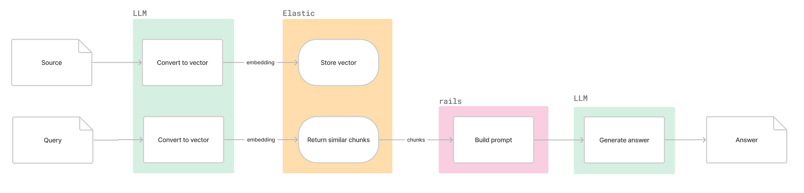
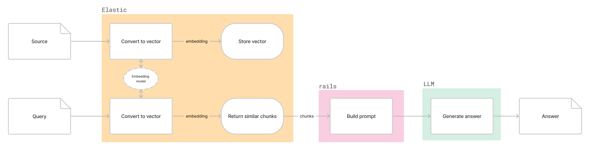
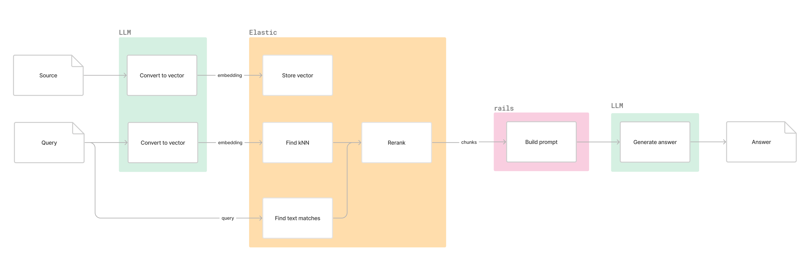
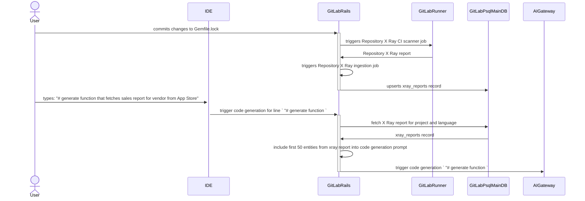

# Elasticsearch

Elasticsearch is a search engine and data store which allows generating, storing and querying vectors and performing keyword and semantic search at scale.

Elasticsearch employs a distributed architecture, where data is stored across multiple nodes. This allows for parallel processing of queries, ensuring fast results even with massive datasets.

## Using Elasticsearch as a vector store

Elasticsearch can be used to store embedding vectors up to 4096 dimensions and find the closest neighbours for a given embedding.



### Licensing

Does not require a paid license.

### Indexing embeddings

For every document type (e.g. `gitlab_documentation`), an index is created and stores the original source, embeddings and optional metadata such as URL. An initial backfill is required to index all current documents and a process to upsert or delete documents as the source changes.

For GitLab Duo Documentation, the current async process for generating and storing embeddings in the embeddings database can be altered to index into Elasticsearch.

Using the Advanced Search framework, database records are automatically kept up to date in Elasticsearch. [Issue 442197](https://gitlab.com/gitlab-org/gitlab/-/issues/442197) proposes changing the Elasticsearch framework to allow for other datasets to be indexed.

For documents with large sources that need to be split into chunks, [nested kNN search](https://www.elastic.co/guide/en/elasticsearch/reference/8.12/knn-search.html#nested-knn-search) can be used whereby a single top-level document contains nested objects each with a source and embedding. This enables searching for the top K documents with the most relevant chunks. It is not suited for cases where the top k chunks need to be searched within a single document. In such cases, every chunk should be stored as a separate document.

### Querying context-relevant information

A given question is passed to a model to generate embeddings. The vector is then sent to Elasticsearch to find the most relevant documents.

### Generation

The N most relevant documents are added to a prompt which is sent to an LLM to generate an answer for the original question.

## RAG in Elasticsearch using hosted models

Similar to the above but the question's embeddings are generated from within Elasticsearch.



### Licensing

Requires a paid license on every cluster.

### Model hosting

Requires model(s) used to be hosted on every cluster which adds effort and cost.

Elasticsearch supports the following models:

- ELSER (Elastic Learned Sparse Encoder): Built-in model provided by Elasticsearch used to generate text embeddings for semantic search.
- TensorFlow Models: Custom TensorFlow models can be deployed for semantic search using the ML APIs.
- Third-Party Models: Elasticsearch supports deploying models from Hugging Face and other providers. This provides access to a wider range of pre-trained models, but deployment and maintenance requires additional work.

## Hybrid Search

Hybrid search combines text and semantic search to return the most revelant sources. A reranker could be used to combine the results from both methods.



### Advanced text search features of Elasticsearch

1. Inverted Indexing: At its core, Elasticsearch relies on a powerful data structure called an inverted index. This index essentially flips the traditional approach, where each document contains a list of words. Instead, the inverted index catalogues every unique word across all documents and tracks where it appears in each one. This enables lightning-fast searches by finding relevant documents based on matching words instantly.

1. Advanced Text Analysis: Elasticsearch doesn't simply match whole words. It leverages text analyzers to break down and understand text intricacies. This includes handling:

   - Stemming and lemmatization: Reducing words to their root form (e.g., "running" and "ran" both matching "run").
   - Synonyms and related terms: Recognizing synonyms and similar words to expand search results.
   - Stop words: Ignoring common words like "the" and "a" that don't contribute much to meaning.
   - Custom analysis: Defining your own rules for specific domains or languages.

1. Powerful Query Capabilities: Elasticsearch goes beyond basic keyword searches. It supports complex queries using Boolean operators (AND, OR, NOT), proximity searches (finding words close together), fuzzy searches (handling typos), and more. You can also filter results based on other criteria alongside text matching.

### Reranking

Elasticsearch currently supports [Reciprocal rank fusion (RRF)](https://www.elastic.co/guide/en/elasticsearch/reference/current/rrf.html) which works out-the-box. They also released [Learning to Rank](https://elasticsearch-learning-to-rank.readthedocs.io/en/latest/) which uses ML to improve ranking.

## Running Elasticsearch

Elasticsearch is available on GitLab.com and can be integrated on Dedicated and Self-Managed instances. To use as a vector store only:

- [Install Elasticsearch version `8.12`](../../../integration/advanced_search/elasticsearch.md#install-elasticsearch) or upgrade to at least version `8.12`.
- Add URL, Username and Password on the Advanced Search settings page: `admin/application_settings/advanced_search`

After the integration is configured, instance admins don't need to do further work to use it as a vector store since the GitLab Elasticsearch framework handles setting mappings, settings and indexing data.

## Supported dimensions

Elasticsearch can store up to 4096 dimensions and OpenSearch up to 16000 dimensions, compared to `pg_vector` which can store up to 2000.

## Limitations

### Licensing

In order to use the ML capabilities offered by Elastic, every cluster has to have a valid license.

If Elastic is used only as a vector store and all embeddings generated outside of Elastic, a license is not required.

### Adoption

The Elastic integration is available to all GitLab instances to unlock Advanced Search but not all instances have chosen to run the integration. There is also an additional cost for every instance to host the integration.

## Performance and scalability

Elasticsearch is horizontally scalable and handles storing and querying at scale. An Elasticsearch cluster consists of multiple nodes each contributing resources.

## Cost

Elastic Cloud pricing for GitLab Documentation vector storage is about $38 per month and the price scales with storage requirements.

## Elasticseach vs. OpenSearch

### Features

Both offer storing vector embeddings and similarity search (kNN).

Elasticsearch supports custom TensorFlow models which OpenSearch does not offer. Both offer pre-trained models.

The APIs for kNN searching differ slightly between the two platforms but work in the same way.

### Supported platforms

Currently GitLab offers Advanced Search for both Elasticsearch and OpenSearch due to parity between the text search APIs. If both are supported for AI features, there would be a need to adapt to two different AI APIs.

## PoC: Repository X Ray

To test the viability of Elasticsearch for generating embeddings, a PoC was done with Repository X Ray project.

Repository X Ray hasn't yet implemented any semantic seach and this section is based soely on a [prototype implementation](https://gitlab.com/gitlab-org/gitlab/-/merge_requests/144715)

- Statistics (as of February 2024):
  - Data type: JSON document with source code libraries descriptions in natural language
  - Data access level: Red (each JSON document belongs to specific project, and data access rules should adhere to data access rules configure for that project)
  - Data source: Repository X Ray report CI artifact
  - Data size: N/A
  - Example of user input: "# generate function that fetches sales report for vendor from App Store"
  - Example of expected AI-generated response:
  
  ```python
  def sales_reports(vendor_id)\n  app_store_connect.sales_reports(\n  filter: {\n    report_type: 'SALES',\n    report_sub_type: 'SUMMARY',\n    frequency: 'DAILY',
    vendor_number: '123456'\n  }\n)\nend
    ```

### Synchronizing embeddings with data source

In a similar manner as with the [documentation example](../gitlab_duo_rag/elasticsearch.md#retrieve-gitlab-documentation) Repository X Ray report data is a derivative. It uses an underlying repository source code as a base, and it must be synchronised with it, whenever any changes to the source code occurs.

Right now there is no synchronisation mechanism that includes embeddings and vector storage. However there is an existing pipeline that generates and stores Repository X Ray reports.

The ingestion pipeline is performed in following steps:

1. A CI X Ray scanner job is triggered - a documentation [page](../../../user/project/repository/code_suggestions/repository_xray.md#enable-repository-x-ray) suggest limiting this job to be executed only when changes occur to the main repository branch. However repository maintainers may configure trigger rules differently.
   - An X Ray [scanner](https://gitlab.com/gitlab-org/code-creation/repository-x-ray) locates and process one of the supported [dependencies files](../../../user/project/repository/code_suggestions/repository_xray.md#supported-languages-and-package-managers), producing JSON report files.
1. After the X Ray scanner job finishes successfully, a [background job](https://gitlab.com/gitlab-org/gitlab/-/blob/c6b2f18eaf0b78a4e0012e88f28d643eb0dfb1c2/ee/app/workers/ai/store_repository_xray_worker.rb#L18) is triggered in GitLab Rails monolith that imports JSON report into [`Projects::XrayReport`](https://gitlab.com/gitlab-org/gitlab/-/blob/bc2ad40b4b026dd359e289cf2dc232de1a2d3227/ee/app/models/projects/xray_report.rb#L22).
   - There can be only one Repository X Ray report per project in the scope of programming language, duplicated records are being upserted during import process

As of today, there are 84 rows on `xray_reports` table on GitLab.com.

### Retrieval

After Repository X Ray report gets imported, when IDE extension sends request for a [code generation](../../../user/project/repository/code_suggestions/index.md),
Repository X Ray report is retrieved in the following steps:

1. GitLab Rails monotlith fetches corresponding `xray_reports` record from main database. `xray_reports` records are filiterd based on `project_id` foreign key, and `lang` columns.
1. From retrieved record first 50 dependencies are being added into a prompt that is forwarded to AI Gateway

### Current state overview



### Embeddings prospect application

As described in retrieval section above, currently Repository X Ray reports follow very naive approach, that does not include any metric for assessing relevance between Repository X Ray report content and
user instruction. Therefore applying embeddings and semantic search to X Ray report has a high potential of improving results by selecting limited set of related entries from Repository X Ray report based on user instruction.

To achieve that embeddings should be generated during Repository X Ray ingestion. Additionally an user instruction should be turned into embeddings vector to perform semantic search over stored Repository X Ray report data during retrieval process.

### Elasticsearch and PGVector comparison

Following paragraph is a result of [PoC](https://gitlab.com/gitlab-org/gitlab/-/merge_requests/144715) work.

From a product feature implementation point of view both solutions seems as viable ones, offering in the current state all necessary tools to support the product features requirements.
Given the Elasticsearch built in capabilities it is acknowledged that it might bring better long term support, enabling more powerful RAG solution in the future than `pg_vector` based ones.

The current Elasticsearch integration only indexes `ActiveRecord` models and
source code from Git repositories. Further work required to build more
generic abstractions to index other data (eg. X-Ray reports)
has been defined by [issue 442197](https://gitlab.com/gitlab-org/gitlab/-/issues/442197).
To prevent suboptimal workarounds of existing limitation
which will create technical debt, it is advised that [issue 442197](https://gitlab.com/gitlab-org/gitlab/-/issues/442197)
is completed before Elasticsearch is selected as main vector storage for RAG.
