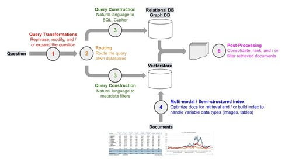

# Retrieval Augmented Generation (RAG) for GitLab

## Goals

The goal of this blueprint is to describe viable options for RAG at GitLab
across deployment types. The aim is to describe RAG implementations that provide
our AI features–and by extension our customers–with best-in-class user
experiences.

## Overview of RAG

RAG, or Retrieval Augmented Generation, involves several key process blocks:

- **Input Transformation**: This step involves processing the user's input,
  which can vary from natural language text to JSON or keywords. For effective
  query construction, we might utilize Large Language Models (LLMs) to format
  the input into a standard expected format or to extract specific keywords.
- **Retrieval**: Here, we fetch relevant data from specified data sources, which
  may include diverse storage engines like vector, graph, or relational
  databases. It's crucial to conduct [data access checks](#data-access-policy)
  during this phase. After retrieval, the data should be optimized for LLMs
  through post-processing to enhance the quality of the generated responses.
- **Generation**: This phase involves crafting a prompt with the retrieved data
  and submitting it to an LLM, which then generates an AI-powered response.

(Image from [Deconstructing RAG](https://blog.langchain.dev/deconstructing-rag/))

## Challenges of RAG

### Data for LLMs

Ensuring data is optimized for LLMs is crucial for consistently generating
high-quality AI responses. Several challenges exist when providing context to
LLMs:

- **Long Contexts:** Extensive contexts can degrade LLM performance, a
  phenomenon known as the Lost in the Middle problem. Employing Rerankers can
  enhance performance but may also increase computational costs due to longer
  processing times.
- **Duplicate Contents:** Repetitive content can reduce the diversity of search
  results. For instance, if a semantic search yields ten results indicating
  "Tom is a president" but the eleventh reveals "Tom lives in the United States,"
  solely using the top ten would omit critical information. Filtering out
  duplicate content, for example, through Maximal Marginal Relevance (MMR), can
  mitigate this issue.
- **Conflicting Information:** Retrieving conflicting data from multiple sources
  can lead to LLM "hallucinations." For example, mixing sources that define
  "RAG" differently can confuse the LLM. Careful source selection and content
  curation are essential.
- **Irrelevant Content:** Including irrelevant data can negatively impact LLM
  performance. Setting a threshold for relevance scores or considering that
  certain irrelevant contents might actually enhance output quality are
  strategies to address this challenge.

It's highly recommended to evaluate the optimal data format and size for
maximizing LLM performance, as the effects on performance and result quality can
vary significantly based on the data's structure.

References:

- [Benchmarking Methods for Semi-Structured RAG](https://youtu.be/KMZZh7Z5mno?si=-Gr-acXcjg7QXmBU)
- [Edge cases of semantic search](https://youtu.be/DY3sT4yIezs?feature=shared&t=1382)

#### Regenerating Embeddings

The AI field is evolving rapidly and new models and approaches seem to appear
daily that could improve our users' experience, we want to conscious of model
switching costs. If we decide to swap models or change our chunking strategy (as two examples),
we will need to wipe our existing embeddings and do a full
replacement with embeddings from the new model or with the new text chunks, etc.
Factors to consider which could trigger the need for a full regeneration of
embeddings for the affected data include:

- A change in the optimal text chunk size
- A change in a preprocessing step which perhaps adds new fields to a text chunk
- Exclusion of content, such as the removal of a field that was previously embedded
- Addition of new metadata that needs to be embedded

### Multi-source Retrieval

Addressing complex queries may require data from multiple sources. For instance,
queries linking issues to merge requests necessitate fetching details from both.
GitLab Duo Chat, utilizing the
[ReACT framework](https://arxiv.org/abs/2210.03629), sequentially retrieves data from
PostgreSQL tables, which can prolong the retrieval process due to the sequential
execution of multiple tools and LLM inferences.

## Searching for Data

Choosing the appropriate search method is pivotal for feature design and UX optimization. Here are common search techniques:

### Semantic Search using embeddings

Semantic search shines when handling complex queries that demand an
understanding of the context or intent behind the words, not just the words
themselves. It's particularly effective for queries expressed in natural
language, such as full sentences or questions, where the overall meaning
outweighs the importance of specific keywords. Semantic search excels at
providing thorough coverage of a topic, capturing related concepts that may not
be directly mentioned in the query, thus uncovering more nuanced or indirectly
related information.

In the realm of semantic search, the K-Nearest Neighbors (KNN) method is
commonly employed to identify data segments that are semantically closer to the
user's input by using embeddings. To measure the semantic proximity, various methods are used:

- **Cosine Similarity:** Focuses solely on the direction of vectors.
- **L2 Distance (Euclidean Distance):** Takes into account both the direction
  and magnitude of vectors. These vectors, known as "embeddings," are created by
  processing the data source through an embedding model. Currently, in GitLab
  production, we utilize the `textembedding-gecko` model provided by Vertex AI.
  However, there might be scenarios where you consider using alternative embedding
  models, such as those available on HuggingFace, to reduce costs. Opting for
  different models requires comprehensive evaluation and consultation,
  particularly with the legal team, to ensure the chosen model's usage complies
  with GitLab policies. See the
  [Security, Legal, and Compliance](https://gitlab.com/gitlab-org/gitlab/-/blob/52f4fcb033d13f3d909a777728ba8f3fa2c93256/doc/architecture/blueprints/gitlab_duo_rag/index.md#security-legal-and-compliance)
  section for more details. It's also important to note that multilingual support
  can vary significantly across different embedding models, and switching models
  may lead to regressions.

For large datasets, it's advisable to implement indexes to enhance query
performance. The HNSW (Hierarchical Navigable Small World) method, combined with
approximate nearest neighbors (ANN) search, is a popular strategy for this
purpose. For insights into HNSW's effectiveness, consider reviewing
[benchmarks on its performance in large-scale applications](https://supabase.com/blog/increase-performance-pgvector-hnsw).

Due to the existing framework and scalability of Elasticsearch, embeddings will
be stored on Elasticsearch for large datasets such as
[issues](https://gitlab.com/gitlab-org/gitlab/-/issues/451431), merge requests,
etc. This will be used to perform [Hybrid Search](https://gitlab.com/gitlab-org/gitlab/-/issues/440424)
but will also be useful for other features such as finding duplicates, similar results or
categorizing documents.

### Keyword Search

Keyword search is the go-to method for straightforward, specific queries where
users are clear about their search intent and can provide precise terms or
phrases. This method is highly effective for retrieving exact matches, making it
suitable for searches within structured databases or when looking for specific
documents, terms, or phrases.

Keyword search operates on the principle of matching the query terms directly
with the content in the database or document collection, prioritizing results
that have a high frequency of the query terms. Its efficiency and directness
make it particularly useful for situations where users expect quick and precise
results based on specific keywords or phrases.

Elasicsearch uses a BM25 algorigthm to perform keyword search.
If one of the existing [indexed document types](../../../integration/advanced_search/elasticsearch.md#advanced-search-index-scopes)
is not covered, a [new document type](../../../development/advanced_search.md#add-a-new-document-type-to-elasticsearch) can be added.

### Hybrid Search

Hybrid search combines the depth of semantic search with the precision of
keyword search, offering a comprehensive search solution that caters to both
context-rich and specific queries. By running both semantic and keyword searches
simultaneously, it integrates the strengths of both methods—semantic search's
ability to understand the context and keyword search's precision in identifying
exact matches.

The results from both searches are then combined, with their relevance scores
normalized to provide a unified set of results. This approach is particularly
effective in scenarios where queries may not be fully served by either method
alone, offering a balanced and nuanced response to complex search needs. The
computational demands of kNN searches, which are part of semantic search, are
contrasted with the relative efficiency of [BM25](https://pub.aimind.so/understanding-the-bm25-ranking-algorithm-19f6d45c6ce)
keyword searches, making hybrid search a strategic choice for optimizing
performance across diverse datasets.

The first hybrid search scope is for issues which combines keyword search with kNN matches using embeddings.

### Code Search

Like the other data types above, a source code search task can utilize different
search types, each more suited to address different queries.

Two code searches are available currrently: `Elasticsearch` and `Zoekt`.

Elasticsearch provides blob search which supports [Advanced Search Syntax](../../../drawers/advanced_search_syntax.md).

[Zoekt](../code_search_with_zoekt/index.md) is employed on GitLab.com to provide
exact match keyword search and regular expression search capabilities for source
code.

Semantic search and hybrid search functionalities are yet to be
implemented for code.

### ID Search

Facilitates data retrieval using specific resource IDs, such as issue links. For
example retrieving data from the specified resource ID, such as an Issue link or
a shortcut. See [ID search](postgresql.md#id-search) for more information.

### Knowledge Graph

Knowledge Graph search transcends the limitations of traditional search methods
by leveraging the interconnected nature of data represented in graph form.
Unlike semantic search, which focuses on content similarity, Knowledge Graph
search understands and utilizes the relationships between different data points,
providing a rich, contextual exploration of data.

This approach is ideal for queries that benefit from understanding the broader
context or the interconnectedness of data entities. Graph databases store
relationships alongside the data, enabling complex queries that can navigate
these connections to retrieve highly contextual and nuanced information.

Knowledge Graphs are particularly useful in scenarios requiring deep insight
into the relationships between entities, such as recommendation systems, complex
data analysis, and semantic querying, offering a dynamic way to explore and
understand large, interconnected datasets.

## Security, Legal and Compliance

### Data access policy

The retrieval process must comply with the
[GitLab Data Classification Standard](https://handbook.gitlab.com/handbook/security/data-classification-standard/).
If the user doesn't have access to the data, GitLab will not fetch the data for
building a prompt.

For example:

- When the data is GitLab Documentation (GREEN level), the data can be fetched
  without authorizations.
- When the data is customer data such as issues, merge requests, etc (RED level),
  the data must be fetched with proper authorizations based on permissions and roles.

If you're proposing to fetch data from an external public database
(e.g. fetching data from `arxiv.org` so the LLM can answer questions about
quantitative biology), please conduct a thorough review to ensure the external
data isn't inappropriate for GitLab to process.

### Data usage

Using a new embedding model or persisting data into a new storage would require
[legal reviews](https://handbook.gitlab.com/handbook/legal/). See the following
links for more information:

- [Data privacy](../../../user/gitlab_duo/data_usage.md#data-privacy)
- [Data retention](../../../user/gitlab_duo/data_usage.md#data-retention)
- [Training data](../../../user/gitlab_duo/data_usage.md#training-data)

## Evaluation

Evaluation is a crucial step in objectively determining the quality of the
retrieval process. Tailoring the retrieval process based on specific user
feedback can lead to biased optimizations, potentially causing regressions for
other users. It's essential to have a dedicated test dataset and tools for a
comprehensive quality assessment. For assistance with AI evaluation, please
reach out to the [AI Model Validation Group](https://handbook.gitlab.com/handbook/engineering/development/data-science/model-validation/).

## Before Implementing RAG

Before integrating Retrieval Augmented Generation (RAG) into your system, it's
important to evaluate whether it enhances the quality of AI-generated responses.
Consider these essential questions:

- **What does typical user input look like?**
  - For instance, "Which class should we use to make an external HTTP request in this repository?"
- **What is the desired AI-generated response?**
  - Example: "Within this repository, Class-A is commonly utilized for..."
- **What are the current responses from LLMs?** (This helps determine if the necessary knowledge is already covered by the LLM.)
  - Example: Receiving a "Sorry, I don't have an answer for that." from the Anthropic Claude 2.1 model.
- **What data is required in the LLM's context window?**
  - Example: The code for Class-A.
- **Consider the current search method used for similar tasks**. (Ask yourself: How would I currently search for this data with the tools at my disposal?)
  - Example: Navigate to the code search page and look for occurrences of "http."
- **Have you successfully generated the desired AI response with sample data?** Experiment in a third-party prompt playground or Google Colab to test.
- **If contemplating semantic search**, it's **highly recommended** that you
  develop a prototype first to ensure it meets your specific retrieval needs.
  Semantic search may interpret queries differently than expected, especially
  when the data source lacks natural language context, such as uncommented code.
  In such cases, semantic search might not perform as well as traditional
  keyword search methods. Here's [an example prototype](https://colab.research.google.com/drive/1K1gf6FibV-cjlXvTJPboQJtjYcSsyYi2?usp=sharing)
  that demonstrates semantic search for CI job configurations.

## Evaluated Solutions

The following solutions have been validated with PoCs to ensure they meet the
basic requirements of vector storage and retrieval for GitLab Duo Chat with
GitLab documentation. Click the links to learn more about each solutions
attributes that relate to RAG:

- [PostgreSQL with PGVector](postgresql.md)
- [Elasticsearch](elasticsearch.md)
- [Google Vertex](vertex_ai_search.md)

To read more about the [GitLab Duo Chat PoCs](../gitlab_duo_rag/index.md) conducted, see:

- [PGVector PoC](../gitlab_duo_rag/postgresql.md)
- [Elasticsearch PoC](../gitlab_duo_rag/elasticsearch.md)
- [Google Vertex PoC](../gitlab_duo_rag/vertex_ai_search.md)
