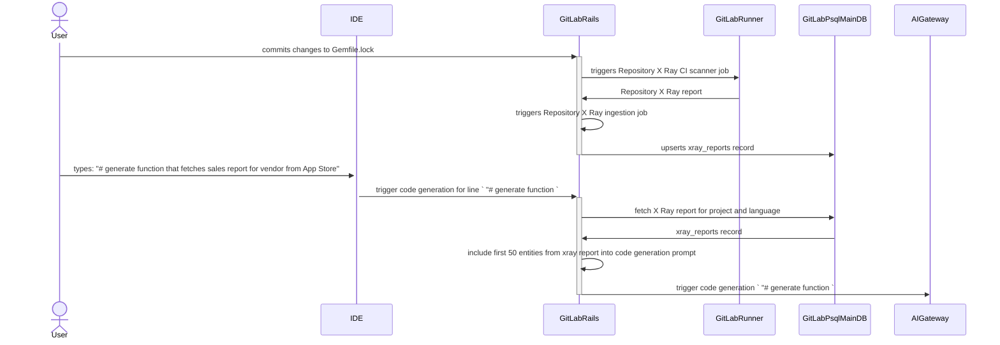

# PostgreSQL

This page explains how to retrieve data from PostgreSQL for [RAG](index.md).

## Semantic search

### Overview

1. Install [PgVector extension](#vector-store-with-pgvector) to the PostgreSQL database.
1. Add a `vector` column to a new or existing table.
1. Data <=> Embedding synchronization
   1. Load data which you want to search from.
   1. Pass the data to an embedding model and get an vector.
   1. Set the vector to the `vector` column.
1. Retrieval
   1. Pass the user input to an embedding model and get an vector.
   1. Get the nearest neighbors to the user input vector e.g. `SELECT * FROM a_table ORDER BY vector_column <-> '<user-input-vector>' LIMIT 5;`

### Vector store with PgVector

To store the embeddings for semantic search, we need to add a vector store in GitLab PostgreSQL.
This vector store can be added by installing [PgVector extension](https://github.com/pgvector/pgvector) (Postgres 12+ is required).
A vector store is currently running on GitLab.com and it's separately hosted from the main/CI databases.

Our current architecture of having a separate database for embeddings is probably ideal. We don't gain much by combining them and, as PGVector is all new and will likely require a lot of experimenting to get performance at scale (today we only have a tiny amount of data in it), we'll have a lot more options to experiment with without impacting overall GitLab.com stability (if PGVector is on a separate database). Having a separate database is recommended because it allows for experimentation without impacting performance of the main database.

### Limitations

- It could be locked down to a specific embedding model, because you must specify the dimensions of the vector column.
- Vectors with up to 2,000 dimensions can be indexed.

### Performance and scalability implications

- Is there any guidance on how much data we can add to the PostgreSQL (regardless of the vector data or normal data)?
  - Not really, as we do not usually just add data to the database, but rather it's a result of the instance being used. I don't see any specific [storage requirements](../../../install/requirements.md#storage). If the existing `vertex_gitlab_docs` table size is a good indicator, we probably can add this without causing much trouble, though having an option to opt-in or opt-out is preferable.

### Availability

- PostgreSQL is availble in all GitLab installations (both CNG and Omnibus).
- Most major cloud providers have added PgVector to their offerings by now: Google Cloud SQL and Alloy DB, DigitalOcean, AWS RDS and Aurora, Azure Flexible and Cosmos, etc. There might be a case where customers would need to upgrade to versions that support PGVector.

## ID search

### Overview

1. Execute a few-shot prompts to extract a resource identifier from the user input.
    - e.g. When user asks `Can you summarize #12312312?`, ResourceIdentifier is `12312312` as a GitLab-Issue.
1. Retrieve the record from the PostgreSQL. e.g. `Issue.find(12312312)`
1. Check if the user can read the resource.
1. Build a prompt with the retrieved data and passing it to an LLM to get a AI-generated response.

## PoC: Repository X Ray

Repository X Ray hasn't yet implemented any semantic seach and this section is based soely on a [prototype implementation](https://gitlab.com/gitlab-org/gitlab/-/merge_requests/142912)

- Statistics (as of February 2024):
  - Date type: JSON document with source code libraries desctiptions in natural language
  - Date access level: Red (each JSON document belongs to specific project, and data access rules should adhere to data access rules configure for that project)
  - Data source: Repository X Ray report CI artifact
  - Data size: N/A
  - Example of user input: "# generate function that fetches sales report for vendor from App Store"
  - Example of expected AI-generated response:
  
  ```python
  def sales_reports(vendor_id)\n  app_store_connect.sales_reports(\n  filter: {\n    report_type: 'SALES',\n    report_sub_type: 'SUMMARY',\n    frequency: 'DAILY',
    vendor_number: '123456'\n  }\n)\nend
    ```

### Synchronizing embeddings with data source

In symilar manner as with the [documentation example](../gitlab_duo_rag/postgresql.md#retrieve-gitlab-documentation) Repository X Ray report data is a derivative. It uses an underlaying repository source code as a base,
and it must be synchronised with it, whenever any changes to the source code occurs.

Right now there is no synchronisation mechanism that includes embeddings and vector storage. However there is an existing pipeline that generates and stores Repository X Ray reports

The ingestion pipeline is performed in following steps:

1. A CI X Ray scanner job is triggered - a documentation [page](../../../user/project/repository/code_suggestions/repository_xray.md#enable-repository-x-ray) suggest limiting this job to be executed only when changes occur to the main repository branch. However repository maintainers may configure trigger rules differently.
   1. An X Ray [scanner](https://gitlab.com/gitlab-org/code-creation/repository-x-ray) locates and process one of the supported [dependencies files](../../../user/project/repository/code_suggestions/repository_xray.md#supported-languages-and-package-managers), producing JSON report files
1. After the X Ray scanner job finishes successfully, a [background job](https://gitlab.com/gitlab-org/gitlab/-/blob/c6b2f18eaf0b78a4e0012e88f28d643eb0dfb1c2/ee/app/workers/ai/store_repository_xray_worker.rb#L18) is triggered in GitLab Rails monolith that imports JSON report into [`Projects::XrayReport`](https://gitlab.com/gitlab-org/gitlab/-/blob/bc2ad40b4b026dd359e289cf2dc232de1a2d3227/ee/app/models/projects/xray_report.rb#L22)
   1. There can be only one Repository X Ray report per project in the scope of programming language, duplicated records are being upserted during import process

As of today, there are 84 rows on `xray_reports` table on GitLab.com.

### Retrieval

After Repository X Ray report gets imported, when IDE extension sends request for a [code generation](../../../user/project/repository/code_suggestions/index.md), Repository X Ray report is retrieved, in following steps

1. Fetch embedding of the user input from `textembedding-gecko` model (768 dimensions).
1. Query to `vertex_gitlab_docs` table for finding the nearest neighbors. For example:

   ```sql
   SELECT *
   FROM vertex_gitlab_docs
   ORDER BY vertex_gitlab_docs.embedding <=> '[vectors of user input]'               -- nearest neighbors by cosine distance
   LIMIT 10
   ```

1. GitLab Rails monotlith fetches corresponding `xray_reports` record from main database. `xray_reports` records are filiterd based on `project_id` foreign key, and `lang` columns.
1. From retrieved record first 50 dependencies are being added into a prompt that is forwarded to AI Gateway

### Current state overview



### Embeddings prospect application

As described in retrieval section above, currently Repository X Ray reports follows very naive approach, that does not iclude any metric for assesing relevance between Repository X Ray report content and user instruction. Therefore applying embeddings and semantic search to X Ray report has a high potential of improving results by selecting limited set of related entries from Repository X Ray report based on user instruction.

To achieve that embeddings should be generated during Repository X Ray ingestion. Additionaly an user instruction should be turned into embeddings vector to perform semantic search over stored Repository X Ray report data during retrieval process.
