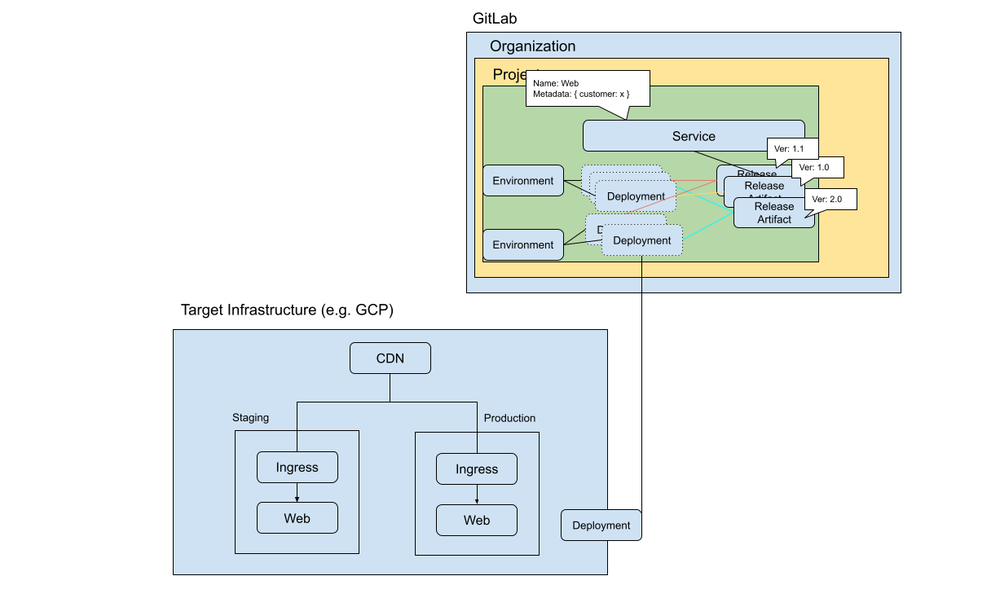
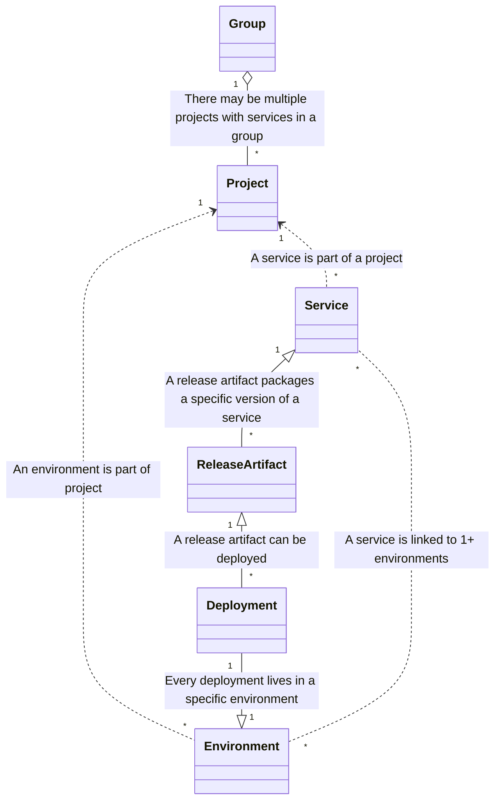

# Services

## Summary

To orthogonally capture the modern service-oriented deployment and environment managements,
GitLab needs to have [services](https://about.gitlab.com/direction/delivery/glossary.html#service) as the first-class concept.
This blueprint outlines how the service and related entities should be built in the GitLab CD solution.

## Motivation

As GitLab works towards providing a single platform for the whole DevSecOps cycle,
its offering should not stop at pipelines, but should include the deployment and release management, as well as
observability of user-developed and third party applications.

While GitLab offers some concepts, like the `environment` syntax in GitLab pipelines,
it does not offer any concept on what is running in a given environment. While the environment might answer the "where" is
something running, it does not answer the question of "what" is running there. We should
introduce [service](https://about.gitlab.com/direction/delivery/glossary.html#service) and [release artifact](https://about.gitlab.com/direction/delivery/glossary.html#release) to answer this question. The [Delivery glossary](https://about.gitlab.com/direction/delivery/glossary.html#service) defines
a service as

> a logical concept that is a (mostly) independently deployable part of an application that is loosely coupled with other services to serve specific functionalities for the application.

A service would connect to the SCM, registry or issues through release artifacts and would be a focused view into the [environments](https://about.gitlab.com/direction/delivery/glossary.html#environment) where
a specific version of the given release artifact is deployed (or being deployed).

Having a concept of services allows our users to track their applications in production, not only in CI/CD pipelines. This opens up possibilities, like cost management.
The current work in [Analyze:Observability](https://handbook.gitlab.com/handbook/product/categories/#observability-group) could be integrated into GitLab if it supports services.

### Goals

- Services are defined at the project level.
- A single project can hold multiple services.
- We should be able to list services at group and organization levels. We should make sure that our architecture is ready to support group-level features from day one. "Group-level environment views" are a feature customers are asking for many-many years now.
- Services are tied to environments. Every service might be present in multiple environments and every environment might host multiple services. Not every service is expected to be present in every environment and no environment is expected to host all the services.
- A service is a logical concept that groups several resources.
- A service is typically deployed independently of other services. A service is typically deployed in its entirety.
  - Deployments in the user interviews happened using CI via `Helm`, `helmfiles` or Flux and a `HelmRelease`.
  - Even in Kubernetes, there might be other tools (Kustomize, vanilla manifests) to deploy a service.
  - Outside of Kubernetes other tools might be used. e.g. Runway deploys using Terraform.
- We want to connect a [deployment](https://about.gitlab.com/direction/delivery/glossary.html#deployment) of a service to the MRs, containers, packages, linter results included in the [release artifact](https://about.gitlab.com/direction/delivery/glossary.html#release).
- A service contains a bunch of links to external (or internal) pages.

[src of the architecture diagram](https://docs.google.com/drawings/d/1TJinpfqc48jXZEw7rxe6mB-8AwDOW7o58wTAB_ljSNM/edit?usp=sharing)

(The dotted border for Deployment represents a projection to the Target Infrastructure)

### Non-Goals

- Metrics related to a service should be customizable and configurable by project maintainers (developers?). Metrics might differ from service to service both in the query and in the meaning. (e.g. traffic does not make sense for a queue).
- Metrics should integrate with various external tools, like OpenTelemetry/Prometheus, Datadog, etc.
- We don't want to tackle GitLab observability solution built by [Analyze:Observability](https://handbook.gitlab.com/handbook/product/categories/#observability-group). The proposal here should treat it as one observability integration backend.
- We don't want to cover alerting, SLOs, SLAs and incident management.
- Some infrastructures might already have better support within GitLab than others (Kubernetes is supported better than pure AWS). There is no need to discuss functionalities that we provide or plan to provide for Kubernetes and how to achieve feature parity with other infrastructures.
- Services can be filtered by metadata (e.g. tenant, region). These could vary by customer or even by group.

## Proposal

Introduce a Service model. This is a shallow model that contains the following parameters:

- **Name**: The name of the service (e.g. `Awesome API`)
- **Description**: Markdown field. It can contain links to external (or internal) pages.
- (TBD) **Metadata**: User-defined key-Value pairs to label the service, which later can be used for filtering at group or project level.
  - Example fields:
  - `Tenant: northwest`
  - `Component: Redis`
  - `Region: us-east-1`
- (TBD) **Deployment sequence**: To allow the promotion from dev to staging to production.
- (TBD) **Environment variables specific to services**: Variables within an environment, variables should be definable for services as well.

### DORA metrics

Users can observe DORA metrics through Services:

- Today, deployment frequency counts the deployments with an `environment_tier=production` or the job name being `prod` or `production`.
- It should be clear for end-users. It can be a convention, like restricting a pipeline to a single `environment_tier=production` job or the first `environment_tier=production` per environment. To be defined later.

### Aggregate environments and services at group level

At the group-level, GitLab fetches all of the project-level environments under the specific group,
and grouping it by the **name** of the environments. For example:

|                   | Frontend service        | Backend service       |
| ------            | ------                  | ------                |
| dev               |  Release Artifact v0.x  |                       |
| development       |  Release Artifact v0.y  |                       |
| production        |  Release Artifact v0.z  | Release Artifact v1.x |

### Entity relationships

- Service and Environment has many-to-many relationship.
- Deployment and Release Artifact have many-to-one relationship (for a specific version of the artifact). Focusing on a single environment, Deployment and Release Artifact have a one-to-one relationship.
- Environment and Deployment has one-to-many relationship. This allows to show a deployment history (past and running, no outstanding, roll-out status might be included) by Environment.
- Environment and Release Artifact has many-to-many relationship through Deployment.
- Service and Release Artifact has many-to-many relationship. This allows to show a history of releases (past, running and outstanding) by service
- Release Artifact and Artifact have one-to-many relationship (e.g. chart as artifact => value as artifact => image as artifact).

See [Glossary](https://about.gitlab.com/direction/delivery/glossary.html) for more information.

**Discussion:** It's TBD whether we should reuse existing entities such as [`Deployment`](https://gitlab.com/gitlab-org/gitlab/-/blob/master/app/models/deployment.rb) and [`Environment`](https://gitlab.com/gitlab-org/gitlab/-/blob/master/app/models/environment.rb) models. Reusing the existing entities could limit us in the long run, however, users should be able to adopt the new architecture seamlessly without changing their existing CI/CD workflow drastically. This decision should be made when we have clearer answer for the ideal structure and behavior of the entities, so that we can understand how far from it the existing entity is and how feasible to migrate.

## Alternative Solutions

- [Add dynamically populated organization-level environments page](https://gitlab.com/gitlab-org/gitlab/-/issues/241506).
  This approach was concluded as no-go in favor of Service concept.
- There is an alternative proposal to introduce [Group Environment entity](https://gitlab.com/gitlab-org/gitlab/-/merge_requests/129696#note_1557477581) for [Group-level environment views](#aggregate-environments-and-services-at-group-level).
