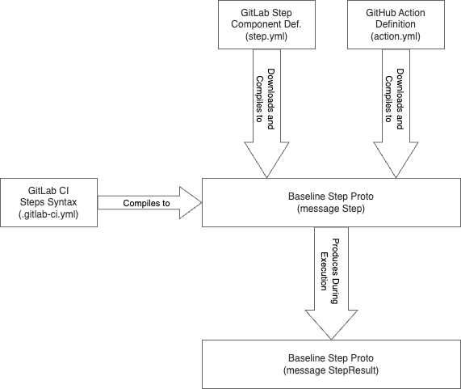
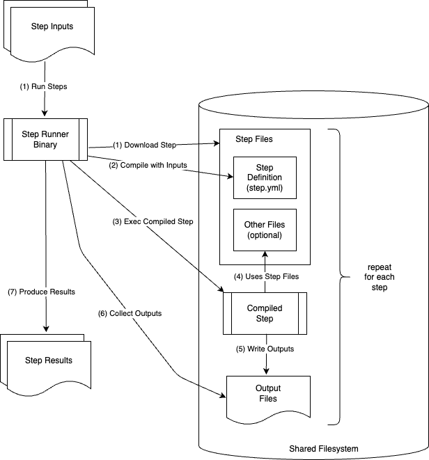

# Step Runner for executing GitLab Steps

## Summary

This document describes architecture of a new component called Step Runner, the GitLab Steps syntax it uses,
and how the GitHub Actions support will be achieved.

The competitive CI products [drone.io](https://drone.io/),
[GitHub Actions](https://docs.github.com/en/actions/creating-actions)
have a composable CI jobs execution in form of steps, or actions.

Their usage and our prior evaluation of [GitLab Runner Plugins](https://gitlab.com/gitlab-org/gitlab/-/issues/15067)
shows a need for a better way to define CI job execution.

## Glossary

- GitLab Steps: a name of GitLab CI feature to define and use reusable components
  within a single job execution context.
- Step Runner: a RFC implementation for GitLab Steps that provides compatibility with the GitHub Actions.
- GitHub Actions: similar to GitLab Steps, a reusable execution component used on GitHub.
- CI Catalog: a public or private component catalog that could be used to discover and use shared components.
- GitLab Rails: a main application responsible for pipeline execution, running on GitLab.com or on-premise installation.

## Motivation

Even though the current [`.gitlab-ci.yml`](../../../ci/index.md#the-gitlab-ciyml-file) is reasonably flexible, it easily becomes very
complex when trying to support complex workflows. This complexity is represented
with repetetitve patterns, a purpose-specific syntax, or a complex sequence of commands
to execute.

This is particularly challenging, because the [`.gitlab-ci.yml`](../../../ci/index.md#the-gitlab-ciyml-file)
is inflexible on more complex workflows that require fine-tuning or special behavior
for the CI job execution. Its prescriptive approach how to handle Git cloning,
when artifacts are downloaded, or how the shell script is being executed quite often
results in the need to work around the system for pipelines that are not "standard"
or when new features are requested.

This proves especially challenging when trying to add a new syntax to the
[`.gitlab-ci.yml`](../../../ci/index.md#the-gitlab-ciyml-file)
to support a specific feature, like [`secure files`](../../../ci/secure_files/index.md)
or `release:` keyword. Adding these special features on a syntax level
results in a more complex config, which is harder to maintain, and more complex
to deal with technical debt when requirements change.

An example of the `drone.io` and the `GitHub Actions` shows that a lot of workflows do not
have to be part of CI syntax. Instead, they can be provided in the form of reusable components
that are configured in a generic way in the CI config, and later downloaded and executed according
to inputs and parameters.

GitLab Steps is meant to fill that product-gap by following similar model to competitors
and to some extent staying compatible with them. The GitLab Steps is meant to replace all
purpose-specific syntax to handle specific features. By providing and using reusable components,
that are build outside of `.gitlab-ci.yml`, that are versioned, and requested when needed
this allows the customer much more flexibility, and allows us to iterate on a catalog much faster.

The reusable components that are part of a CI job execution could be used from a publicily hosted
repository on GitLab.com, from on-premise repository of steps, or be fetched from local project.

Each CI job would define a list of `steps:` to execute, that would reference GitLab Steps
or GitHub Actions. Those steps would be executed by the step runner directly in the context of
the target environment. GitLab Runner would be responsible to be connection between GitLab.com
(or on-premise installation) and Step Runner.

### Goals

GitLab Steps:

- GitLab Steps defines a syntax and structure for GitLab specific Steps implementation.
- GitLab Steps are published in CI Catalog.
- GitLab Steps can be used across instances (federation).
- GitLab Steps do define `inputs` and `outputs`.
- GitLab Steps needs to explicitly request sensitive informations with expected permissions.
  For example: secrets, variables, tokens.

GitLab Inc. managed repository of GitLab Steps:

- GitLab Inc. provides a repository of GitLab Steps that are a drop-in replacement
  for all current purpose-specific syntax: `artifacts:`, `cache:`, `release:`, etc.
- GitLab Inc. will provide a generic step to execute `shell` steps supporting various
  shells (`bash`, `powershell`).
- The usage of purpose-specific syntax might be eventually deprecated in favor of steps.

Step Runner:

- Step Runner is hosted in a separate project in `https://gitlab.com/gitlab-org`.
- Step Runner can be used to execute most of GitHub Actions.
- Step Runner is run as a process in a target environment.
- Step Runner can be used by user on their local machine to run steps of a specific CI job
  from locally stored `.gitlab-ci.yml`.
- Step Runner is external component to GitLab Runner, the GitLab Runner does provision
  environment, construct payload and pass execution to Step Runner.
- Step Runner is to replace all custom handling in GitLab Runner for `clone`, `artifacts`,
  `caches`, `script` and `after_script`, and custom handling for all different shells (`bash`, `powershell`).
- Step Runner is responsible for parsing and compiling GitLab Steps and GitHub Actions.
- Step Runner is responsible for downloading, and managing repositories required by GitLab Steps and GitHub Actions.
- Step Runner does control and monitor execution flow of individual steps of execution.
- Step Runner is required to be executable from the command-line interface (CLI). It means that it can be configured either via config file,
  or environment file, or be able to read `.gitlab-ci.yml`.
- Step Runner can expose gRPC or other programmable interface to run config or get trace from.

Steps Execution:

- Each Step is defined by a single published or locally defined GitLab Step, or GitHub Action.
- Each Step is executed depending on conditions that are defined by that step.
- Each Step is executed with least amount of information exposed. Exposed informations to step
  are requested explicitly by the step. For example: only environment variables explicitly
  requested by the step will be passed to the step.
- Each Step is considered untrusted. It means that even though some steps are trusted, the whole
  CI job should be considered untrusted, since system cannot guarantee trust.
- Each Step describes its execution in a form of preconditions, versions used, and output produced.
  This is meant to allow to sign steps execution for the purpose of creating reproducible builds.

Backward compatibility:

- All currently executable syntax (for example: `before_script:`, `script:`, `artifacts:`, `cache:`, etc.)
  should be convertible by GitLab (Rails)

## Non-Goals

TBD

## Proposal

Step Runner will be a new go binary which lives at `https://gitlab.com/gitlab-org/step-runner`.
It will be able to accept a number of input formats which are compiled to a standard proto format.
Output will be a standard proto trace which will include details for debugging and reproducing the build.

### Capabilities

- Read steps
  - from environment variable
  - from `.gitlab-ci.yml` file
  - from gRPC server in step-runner
  - from commandline JSON input
- Compile GitLab Steps and GitHub Actions to a baseline step definition
  - explicit inputs and outputs
  - explicit environment and exports
  - baseline steps can be type `exec` or more steps
- Download and run steps from:
  - Git repos
  - zip files
  - locally provided
- A job can be composed of different kinds of steps
  - steps can come from different sources and be run in different ways
  - steps can access environment exports and output of previous steps
- Produce a step-by-step trace of execution
  - including final inputs and outputs
  - including final environment and exports
  - including logs of each step
  - each step specifies the exact runtime and component used (hash)
  - (optional) masking sensitive inputs, outputs, environment and exports
- Replaying a trace
  - reuses the exact runtimes and components from trace
  - output of trace will be the same trace if build is deterministic

### Example invocations

#### Command line

- `STEPS=$(cat steps.yml) step-runner ci`
- `step-runner local .gitlab-ci.yml --format gitlab-ci --job-name hello-world --output-file trace.json`
- `step-runner replay trace.json`
- `step-runner ci --port 8080`

#### GitLab CI

```yaml
hello-world:
  image: registry.gitlab.com/gitlab-org/step-runner
  variables:
    STEPS: |
      - step: gitlab.com/josephburnett/component-hello-steppy@master
        inputs:
          greeting: "hello ${{ env.name }}"
        env:
          name: world
  script:
    - /step-runner ci
  artifacts:
    paths:
      - trace.json
```

### Basic compilation and execution process

Steps as expressed in GitLab CI are complied to the baseline step definition.
Referenced steps are loaded and compiled to produce an `exec` command,
or to produce an additional list of GitLab CI steps which are compiled recursively.
Each steps is executed immediately after compilation so its output will be available for subsequent compilations.



Steps return outputs and exports via files which are collected by Step Runner after each step.
Finally all the compiled inputs and outputs for each step are collected in a step trace.



### GitLab Steps definition and syntax

- [Step Definition](step-definition.md).
- [Syntactic Sugar extensions](steps-syntactic-sugar.md).

### Integration of GitLab Steps

- [Usage of the GitLab Steps with `.gitlab-ci.yml`](gitlab-ci.md).
- [Runner Integration](runner-integration.md).

## Design and implementation details

### 2023-11-28 - GitLab Steps ADR 001: Bootstrap Step Runner

- See the [GitLab Steps ADR 001: Bootstrap Step Runner](decisions/001_initial_support.md).
- See the [Baseline Step Proto](implementation.md).

## References

- [GitLab Issue #215511](https://gitlab.com/gitlab-org/gitlab/-/issues/215511)
- [Step Runner Code](https://gitlab.com/josephburnett/step-runner/-/tree/blueprint2).
  This is the exploratory code created during the writing of this blueprint.
  It shows the structure of the Step Runner binary and how the pieces fit together.
  It runs but doesn't quite do the right thing (see all the TODOs).
- [CI Steps / CI Events / Executors / Taskonaut (video)](https://youtu.be/nZoO547IISM).
  Some high-level discussion about how these 4 blueprints relate to each other.
  And a good prequel to the video about this MR.
- [Steps in Runner (video)](https://youtu.be/82WLQ4zHYts).
  A walk through of the Step Runner details from the code perspective.
- [CI YAML keywords](https://gitlab.com/gitlab-org/gitlab/-/issues/398129#note_1324467337).
  An inventory of affected keywords.
- [GitLab Epic 11535](https://gitlab.com/groups/gitlab-org/-/epics/11535)
