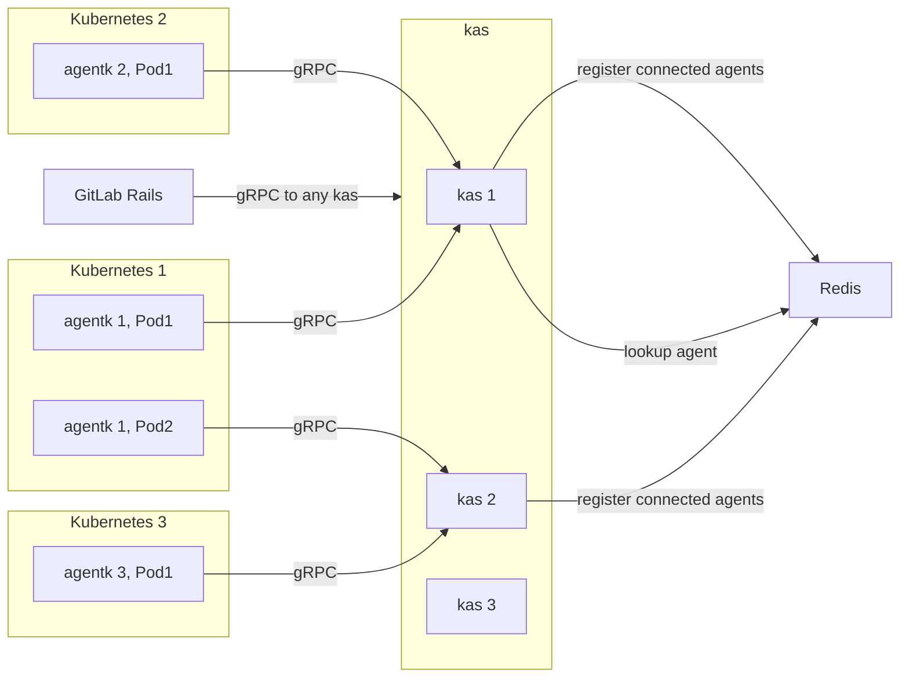

# GitLab to Kubernetes communication **(FREE)**

The goal of this document is to define how GitLab can communicate with Kubernetes
and in-cluster services through the GitLab Kubernetes Agent.

## Challenges

### Lack of network connectivity

For various features that exist today, GitLab communicates with Kubernetes by directly
or indirectly calling its API endpoints. This works well, as long as a network
path from GitLab to the cluster exists, which isn't always the case:

- GitLab.com and a self-managed cluster, where the cluster is not exposed to the Internet.
- GitLab.com and a cloud-vendor managed cluster, where the cluster is not exposed to the Internet.
- Self-managed GitLab and a cloud-vendor managed cluster, where the cluster is not
  exposed to the Internet and there is no private peering between the cloud network
  and the customer's network.

  This last item is the hardest to address, as something must give to create a network
  path. This feature gives the customer an extra option (exposing the `gitlab-kas` domain but
  not the whole GitLab) in addition to the existing options (peering the networks,
  or exposing one of the two sides).

Even if technically possible, it's almost always undesirable to expose a Kubernetes
cluster's API to the Internet for security reasons. As a result, our customers
are reluctant to do so, and are faced with a choice of security versus the features
GitLab provides for connected clusters.

This choice is true not only for Kubernetes' API, but for all APIs exposed by services
running on a customer's cluster that GitLab may need to access. For example,
Prometheus running in a cluster must be exposed for the GitLab integration to access it.

### Cluster-admin permissions

Both current integrations - building your own cluster (certificate-based) and GitLab-managed
cluster in a cloud - require granting full `cluster-admin` access to GitLab. Credentials
are stored on the GitLab side and this is yet another security concern for our customers.

For more discussion on these issues, read
[issue #212810](https://gitlab.com/gitlab-org/gitlab/-/issues/212810).

## GitLab Kubernetes Agent epic

To address these challenges and provide some new features, the Configure group
is building an active in-cluster component that inverts the
direction of communication:

1. The customer installs an agent into their cluster.
1. The agent connects to GitLab.com or their self-managed GitLab instance,
   receiving commands from it.

The customer does not need to provide any credentials to GitLab, and
is in full control of what permissions the agent has.

For more information, visit the
[GitLab Kubernetes Agent repository](https://gitlab.com/gitlab-org/cluster-integration/gitlab-agent) or
[the epic](https://gitlab.com/groups/gitlab-org/-/epics/3329).

### Request routing

Agents connect to the server-side component called GitLab Kubernetes Agent Server
(`gitlab-kas`) and keep an open connection that waits for commands. The
difficulty with the approach is in routing requests from GitLab to the correct agent.
Each cluster may contain multiple logical agents, and each may be running as multiple
replicas (`Pod`s), connected to an arbitrary `gitlab-kas` instance.

Existing and new features require real-time access to the APIs of the cluster
and (optionally) APIs of components, running in the cluster. As a result, it's difficult to pass
the information back and forth using the more traditional polling approach.

A good example to illustrate the real-time need is Prometheus integration.
If we wanted to draw real-time graphs, we would need direct access to the Prometheus API
to make queries and quickly return results. `gitlab-kas` could expose the Prometheus API
to GitLab, and transparently route traffic to one of the correct agents connected
at the moment. The agent then would stream the request to Prometheus and stream the response back.

## Proposal

Implement request routing in `gitlab-kas`. Encapsulate and hide all related
complexity from the main application by providing a clean API to work with Kubernetes
and the agents.

The above does not necessarily mean proxying Kubernetes' API directly, but that
is possible should we need it.

What APIs `gitlab-kas` provides depends on the features developed, but first
we must solve the request routing problem. It blocks any and all features
that require direct communication with agents, Kubernetes or in-cluster services.

Detailed implementation proposal with all technical details is in
[`kas_request_routing.md`](https://gitlab.com/gitlab-org/cluster-integration/gitlab-agent/-/blob/master/doc/kas_request_routing.md).

### Iterations

Iterations are tracked in [the dedicated epic](https://gitlab.com/groups/gitlab-org/-/epics/4591).

## Who

Proposal:

<!-- vale gitlab.Spelling = NO -->

| Role                         | Who
|------------------------------|-------------------------|
| Author                       |    Mikhail Mazurskiy    |
| Architecture Evolution Coach |    Andrew Newdigate     |
| Engineering Leader           |    Nicholas Klick       |
| Domain Expert                |    Thong Kuah           |
| Domain Expert                |    Graeme Gillies       |
| Security Expert              | Vitor Meireles De Sousa |

DRIs:

| Role                         | Who
|------------------------------|------------------------|
| Product Lead                 |    Viktor Nagy         |
| Engineering Leader           |    Nicholas Klick      |
| Domain Expert                |    Mikhail Mazurskiy   |

<!-- vale gitlab.Spelling = YES -->
