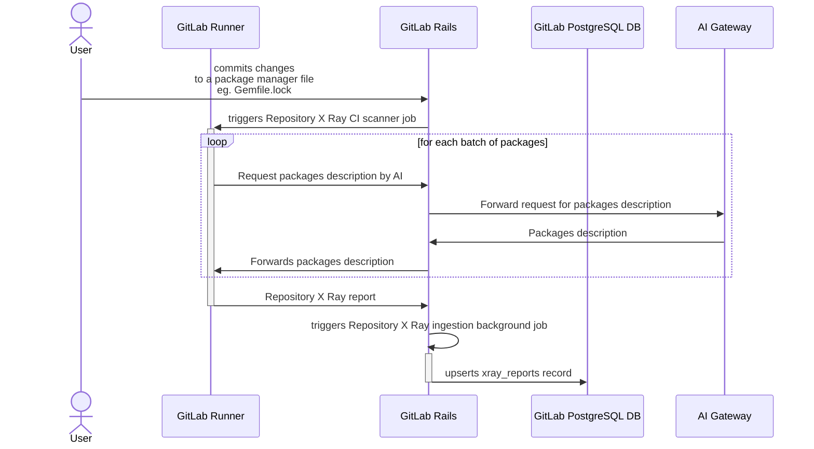
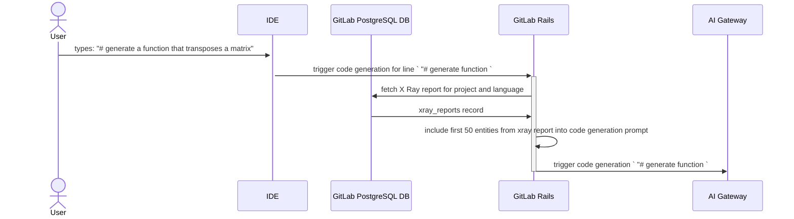
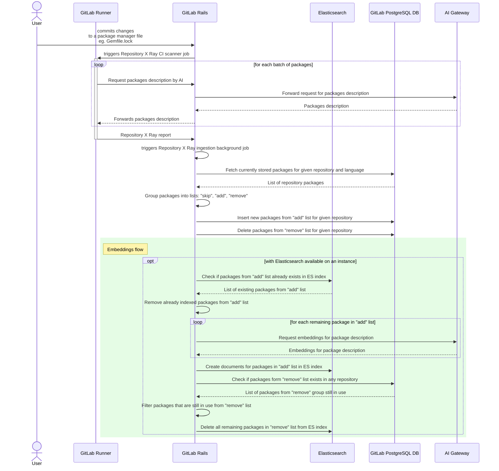
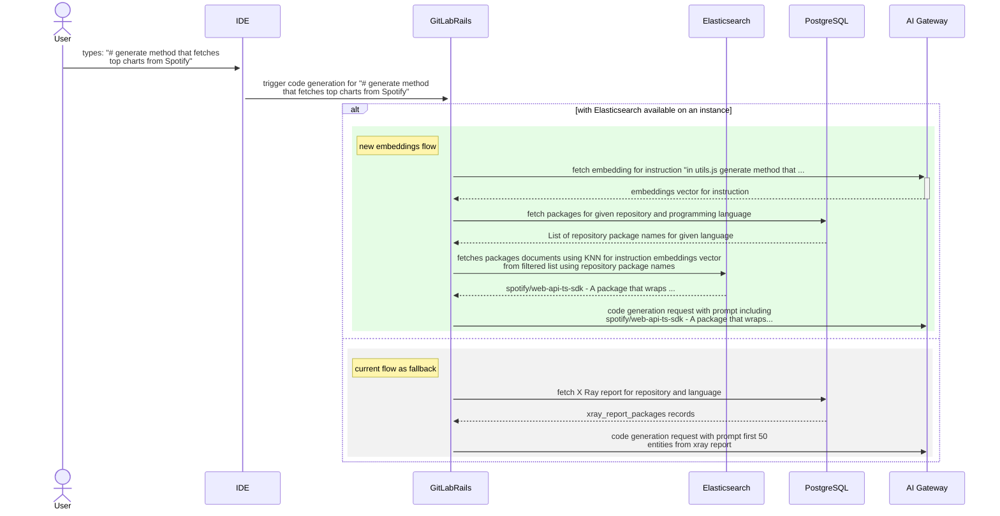

# Repository X-Ray RAG

Group ~"group::global search" is leading effort to build [RAG at GitLab](../gitlab_rag/index.md). Because this is a global effort, it is in the spirit of efficiency and collaboration values for ~"group::code creation" to join that effort and integrate [Repository X-Ray](https://gitlab.com/gitlab-org/code-creation/repository-x-ray#repository-x-ray) data into GitLab RAG. Doing so should not only result in more efficient resource allocation, but also enable other AI features to integrate and reuse Repository X-Ray data, for example users could ask questions to GitLab Duo Chat that could be answered with X-Ray report data.

## Goal

Integrate the existing Repository X-Ray scan flow with the RAG platform.

## Proof of Concept

Proof of concept has been built at [merge request 144715](https://gitlab.com/gitlab-org/gitlab/-/merge_requests/144715). This MR contains a large amount of information that can be helpful during implementation.

## Implementation 

### Current state

Currently, Repository X-Ray does not use semantic search. The MVC approach
naively selects first 50 entities from the X-Ray report and includes them into a code generation request.
For more details, see the following diagrams.

<details><summary> <bold>Current state of Repository X-Ray diagrams</bold> </summary>

The Repository X-Ray scan is processed as shown on the following diagram:



The report is later used as shown in the following diagram:



</details>

### Desired outcome

After this effort is completed, the Repository X-Ray scan is processed in the following manner:



Later on, the Repository X-Ray report is used as follows:



### Required changes

#### On X Ray write path

##### 1. Create new AI Gateway endpoint that generate embeddings

Embeddings for GitLab documentation are requested directly from GitLab Rails. That approach limits embeddings availability to GitLab.com only, and this is also misaligned with the architecture blueprint that outlines AI Gateway as a provider of AI services for GitLab features (for more information, see the related [AI Gateway epic 13024](https://gitlab.com/groups/gitlab-org/-/epics/13024)). To avoid similar problems for Repository X-Ray, a new endpoint should be added to AI Gateway API that accepts batches of strings, and responds with embeddings vectors.

In the following iterations, it is expected that the AI Gateway endpoint (as the central point which has complete overview of all connected instances traffic) will enforce rate limiting and manage token consumption. However, from the very start clients will be responsible for correctly handling rate limiting and token exhaustion type errors.

**Open question:**

[Embeddings](../gitlab_rag/postgresql.md) are generated with the `textembedding-gecko` model (768 dimensions). When adding a new API endpoint, we might be able to change model if needed, if so we should decide which one.
Because Repository X Ray report data has small volume and size (at this moment there are 379 reports on GitLab.com), the decision to switch model and rebuild embeddings data is low cost and can be deferred in order to unblock iteration.

##### 2. Store embeddings vectors for Repository X-Ray report

The current Elasticsearch framework uses ActiveRecord to keep the index up to date. It uses callbacks on create/update/delete to action the corresponding record in Elasticsearch.
Because `xray_reports` table in PostgreSQL main database stores whole reports as JSON blobs in order to persist generated embeddings vectors for each of report item (representing library used in given repository)
we would need to either:

- Modify the current Elastic framework as defined in [issue 442197](https://gitlab.com/gitlab-org/gitlab/-/issues/442197).
- If, due to higher urgency, migrate `xray_reports` table to a new structure, where each record represents a single entity (package/library) in the Repository X-Ray report, which would be compatible with the current Elasticsearch upload pipeline.

The index in Elasticsearch that stores Repository X-Ray packages has the following format:

```json
index: xray-packages
document: {
  id:
  name:
  language:
  description:
  embedding:
}
```

This index would store:

- Description.
- Name.
- The embeddings generated for the concatenated package name and description.
- Programming language.

This index will be shared between all repositories in a given GitLab instance. However, upon search the list of relevant packages will be filtered using prefetched lists of names of packages that belong to the given repository in a given programming language. That approach should:

- Reduce required storage capacity.
- Improve search performance.
- Reduce AI consumption used to generate embeddings.

###### Open question

We need to check if descriptions vary significantly depending on version, and decide whether to store records per package and its version, or just one per package.

##### 3. Modify storage on GitLab Rails layer

Right now Repository X-Ray packages are stored in `xray_reports` table at the main PostgreSQL DB.

```sql
CREATE TABLE xray_reports (
    id bigint NOT NULL,
    project_id bigint NOT NULL,
    created_at timestamp with time zone NOT NULL,
    updated_at timestamp with time zone NOT NULL,
    lang text NOT NULL,
    payload jsonb NOT NULL,
    file_checksum bytea NOT NULL,
);
```

In order to support sharing embeddings between repositories whilst providing way to remove stale data from Elasticsearch, we must create a new table, `xray_report_packages`.

```sql
CREATE TABLE xray_report_packages (
    id bigint NOT NULL,
    project_id bigint NOT NULL,
    created_at timestamp with time zone NOT NULL,
    updated_at timestamp with time zone NOT NULL,
    lang text NOT NULL,
    name text NOT NULL,
    version text NOT NULL,
    description text, --nullable filed as with Elasticsearch available this file will not be in use
);
```

After the new table is created, all reports from `xray_reports` should be migrated there, and `xray_reports` should be removed.

##### 4. Modify Repository X-Ray import pipeline

The Repository X-Ray report, after being generated during the CI job, is imported using a background job.
That job uses [`Ai::StoreRepositoryXrayService`](https://gitlab.com/gitlab-org/gitlab/blob/c6b2f18eaf0b78a4e0012e88f28d643eb0dfb1c2/ee/app/services/ai/store_repository_xray_service.rb#L4)
to parse and save the report file into the `xray_reports` table at the main PostgreSQL DB.

In order to support semantic search for Repository X-Ray, we must apply the following modifications:

1. Load the new Repository X-Ray report from scanner into the list of `current_report_packages`.
1. Load the list of packages reported in previous report for the given project stored in `xray_report_packages` into the list of `previous_report_packages`
   (For example, `SELECT * FROM xray_report_packages WHERE lang = 'ruby' AND project_id = 123`).
1. Filter packages from the new X-Ray report into three groups:
   1. `skip` - a collection of unmodified packages that do not require any action.
   1. `add` - a collection of new packages that should be added to `xray_report_packages`.
   1. `remove` - a collection of packages that were present in the old report but missing in the new one (`previous_report_packages` - `current_report_packages`).
1. Insert the new records into the PostgreSQL `xray_report_packages` for the `add` list of packages.
1. From the `add` list, filter out packages that already exist in Elasticsearch. Those are packages that are being used by other repositories, and in this case embeddings and
   descriptions will be shared.
1. Update and insert all packages that are left in the `add` list of packages in Elasticsearch.
1. Delete the `remove` list of packages from PostgreSQL `xray_report_packages` for a given project.
1. Create an `orphaned` list of packages from the `remove` list by selecting ones of the same `name` and `lang` that are not being used by any other project
   (For example, `SELECT 1 FROM xray_report_packages WHERE name = 'kaminari' AND lang = 'ruby' LIMIT  1`).
1. Remove the `orphaned` packages from Elasticsearch.

#### On X-Ray read path

1. Retrieve code generation instruction either from:
   1. IDE:
      1. IDE / LS upon detecting generation should send a code generation instruction (for example, a content of a comment that triggered code generation).
      1. GitLab Rails Code Suggestions API needs to add optional string parameter `instruction`.
   1. GitLab Rails if due to different priorities the IDE will not be able to deliver instruction on time to unblock this effort, for the sake of the initial iteration, the code generation instruction can be also retrieved by GitLab Rails.
1. GitLab Rails needs to detect if Elasticsearch is available and:
   1. When Elasticsearch is available:
      1. Fetch list of `names` of packages that are stored in `xray_report_packages` PostgreSQL database for the given project and language.
      1. Use k-nearest neighbor (kNN) search of Elasticsearch filtered with `names` list of projects packages to retrieve the most relevant context.
   1. When Elasticsearch is not available:
      1. Select the first 50 records from `xray_report_packages` in PostgreSQL database aligned with the [current state](#current-state) diagram.
