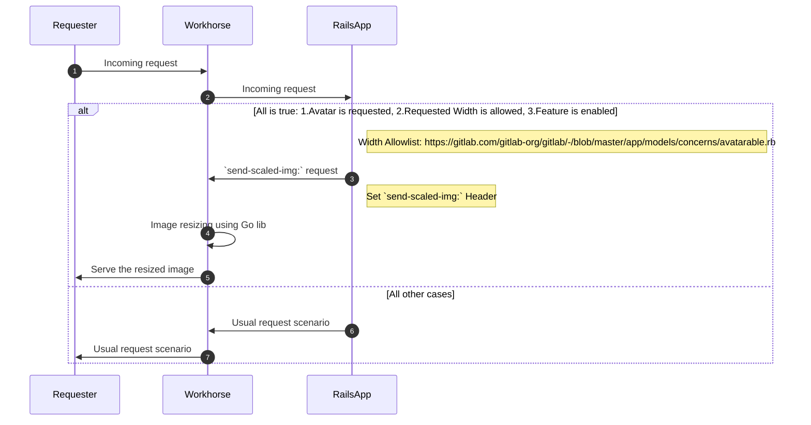

# Image resizing for avatars and content images

Currently, we are showing all uploaded images 1:1, which is of course not ideal. To improve performance greatly, add image resizing to the backend. There are two main areas of image resizing to consider; avatars and content images. The MVC for this implementation focuses on Avatars. Avatars requests consist of approximately 70% of total image requests. There is an identified set of sizes we intend to support which makes the scope of this first MVC very narrow. Content image resizing has many more considerations for size and features. It is entirely possible that we have two separate development efforts with the same goal of increasing performance via image resizing.

## MVC Avatar Resizing

When implementing a dynamic image resizing solution, images should be resized and optimized on the fly so that if we define new targeted sizes later we can add them dynamically. This would mean a huge improvement in performance as some of the measurements suggest that we can save up to 95% of our current load size. Our initial investigations indicate that we have uploaded approximately 1.65 million avatars totaling approximately 80GB in size and averaging approximately 48kb each. Early measurements indicate we can reduce the most common avatar dimensions to between 1-3kb in size, netting us a greater than 90% size reduction. For the MVC we don't consider application level caching and rely purely on HTTP based caches as implemented in CDNs and browsers, but might revisit this decision later on. To easily mitigate performance issues with avatar resizing, especially in the case of self managed, an operations feature flag is implemented to disable dynamic image resizing.

## Content Image Resizing

Content image resizing is a more complex problem to tackle. There are no set size restrictions and there are additional features or requirements to consider.

- Dynamic WebP support - the WebP format typically achieves an average of 30% more compression than JPEG without the loss of image quality. More details are in [this Google Comparative Study](https://developers.google.com/speed/webp/docs/c_study)
- Extract first image of GIF's so we can prevent from loading 10MB pixels
- Check Device Pixel Ratio to deliver nice images on High DPI screens
- Progressive image loading, similar to what is described in [this article about how to build a progressive image loader](https://www.sitepoint.com/how-to-build-your-own-progressive-image-loader/)
- Resizing recommendations (size, clarity, and so on)
- Storage

The MVC Avatar resizing implementation is integrated into Workhorse. With the extra requirements for content image resizing, this may require further use of GraphicsMagik (GM) or a similar library and breaking it out of Workhorse.

## Iterations

1. ✓ POC on different image resizing solutions
1. ✓ Review solutions with security team
1. ✓ Implement avatar resizing MVC
1. Deploy, measure, monitor
1. Clarify features for content image resizing
1. Weigh options between using current implementation of image resizing vs new solution
1. Implement content image resizing MVC
1. Deploy, measure, monitor

## Who

Proposal:

<!-- vale gitlab.Spelling = NO -->

| Role                         | Who
|------------------------------|-------------------------|
| Author                       |    Craig Gomes          |
| Architecture Evolution Coach |    Kamil Trzciński      |
| Engineering Leader           |    Tim Zallmann         |
| Domain Expert                |    Matthias Kaeppler    |
| Domain Expert                |    Aleksei Lipniagov    |

<!-- vale gitlab.Spelling = YES -->

DRIs:

<!-- vale gitlab.Spelling = NO -->

| Role                         | Who
|------------------------------|------------------------|
| Product                      |    Josh Lambert        |
| Leadership                   |    Craig Gomes         |
| Engineering                  |    Matthias Kaeppler   |

<!-- vale gitlab.Spelling = YES -->
