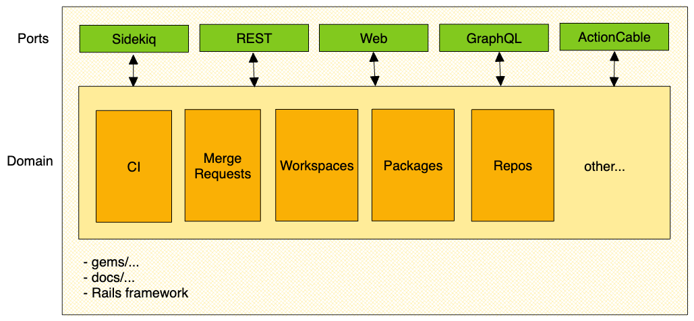
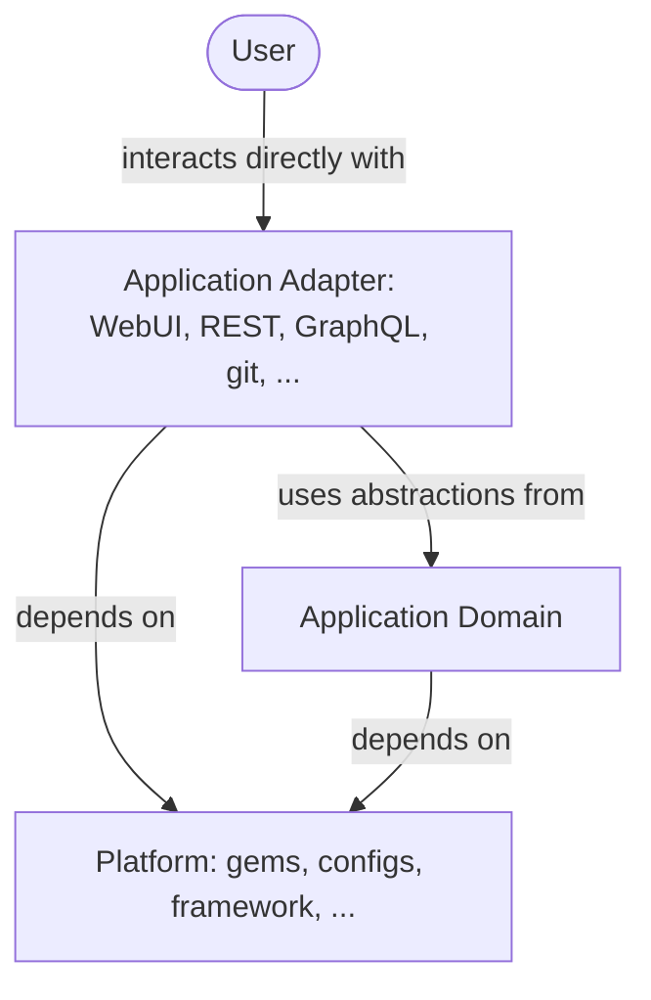

# Hexagonal Rails Monolith

## Summary

**TL;DR:** Change the Rails monolith from a [big ball of mud](https://en.wikipedia.org/wiki/Big_ball_of_mud) state to
a [modular monolith](https://www.thereformedprogrammer.net/my-experience-of-using-modular-monolith-and-ddd-architectures/)
that uses an [Hexagonal architecture](https://en.wikipedia.org/wiki/Hexagonal_architecture_(software)) (or ports and adapters architecture).
Extract cohesive functional domains into separate directory structure using Domain-Driven Design practices.
Extract infrastructure code (logging, database tools, instrumentation, etc.) into gems, essentially remove the need for `lib/` directory.
Define what parts of the functional domains (for example application services) are of public use for integration (the ports)
and what parts are instead private encapsulated details.
Define Web, Sidekiq, REST, GraphQL, and Action Cable as the adapters in the external layer of the architecture.
Use [Packwerk](https://github.com/Shopify/packwerk) to enforce privacy and dependency between modules of the monolith.



## Details



### Application domain

The application core (functional domains) is composed of all the code that describes the business logic, policies and data
that is unique to GitLab product.
It is divided into separate top-level [bounded contexts](../bounded_contexts.md).
A bounded-context is represented in the form of a Ruby module.
This follows the existing [guideline on naming namespaces](../../../../development/software_design.md#use-namespaces-to-define-bounded-contexts)
but puts more structure to it.

Modules should:

- Be deep enough to encapsulate a lot of the internal logic, state and data.
- Have a public interface that is as small as possible, safe to use by other bounded contexts and well documented.
- Be cohesive and represent the SSoT (single source of truth) of the feature it describes.

Feature categories represent a product area that is large enough for the module to be deep, so we don't have a proliferation
of small top-level modules. It also helps the codebase to follow the
[ubiquitous language](../../../../development/software_design.md#use-ubiquitous-language-instead-of-crud-terminology).
A team can be responsible for multiple feature categories, hence owning the vision for multiple bounded contexts.
While feature categories can sometimes change ownership, this change of mapping the bounded context to new owners
is very cheap.
Using feature categories also helps new contributors, either as GitLab team members of members of the wider community,
to navigate the codebase.

If multiple feature categories are strongly related, they may be grouped under a single bounded context.
If a feature category is only relevant in the context of a parent feature category, it may be included in the
parent's bounded context. For example: Build artifacts existing in the context of Continuous Integration feature category
and they may be merged under a single bounded context.

The application domain has no knowledge of outer layers like the application adapters and only depends on the
platform code. This makes the domain code to be the SSoT of the business logic, be reusable and testable regardless
whether the request came from the WebUI or REST API.

If a dependency between an outer layer and an inner layer is required (domain code depending on the interface of an adapter), this can be solved using inversion of control techniques, especially dependency injection.

### Application adapters

>>>
_Adapters are the glue between components and the outside world._
_They tailor the exchanges between the external world and the ports that represent the requirements of the inside_
_of the application component. There can be several adapters for one port, for example, data can be provided by_
_a user through a GUI or a command-line interface, by an automated data source, or by test scripts._ -
[Wikipedia](https://en.wikipedia.org/wiki/Hexagonal_architecture_(software)#Principle)
>>>

Application adapters would be:

- Web UI (Rails controllers, view, JS and Vue client)
- REST API endpoints
- GraphQL Endpoints

They are responsible for the interaction with the user. Each adapter should interpret the request, parse parameters
and invoke the right abstraction from the application domain, then present the result back to the user.

Presentation logic, and possibly authentication, would be specific to the adapters layer.

The application adapters layer depends on the platform code to run: the Rails framework, the gems that power the adapter,
the configurations and utilities.

### Platform code

For platform code we consider any classes and modules that are required by the application domain and/or application
adapters to work.

The Rails' `lib/` directory today contains multiple categories of code that could live somewhere else,
most of which is platform code:

- REST API endpoints could be part of the [application adapters](#application-adapters).
- domain code (both large domain code such as `Gitlab::Ci` and small such as `Gitlab::JiraImport`) should be
  moved inside the [application domain](#application-domain).
- The rest could be extracted as separate single-purpose gems under the `gems/` directory inside the monolith.
  This can include utilities such as logging, error reporting and metrics, rate limiters,
  infrastructure code like `Gitlab::ApplicationRateLimiter`, `Gitlab::Redis`, `Gitlab::Database`
  and generic subdomains like `Banzai`.

Base classes to extend Rails framework such as `ApplicationRecord` or `ApplicationWorker` as well as GitLab base classes
such as `BaseService` could be implemented as gem extensions.

This means that aside from the Rails framework code, the rest of the platform code resides in `gems/`.

Eventually all code inside `gems/` could potentially be extracted in a separate repository or open sourced.
Placing platform code inside `gems/` makes it clear that its purpose is to serve the application code.

### Enforcing boundaries

Ruby does not have the concept of privacy of constants in a given module. Unlike other programming languages, even extracting
well documented gems doesn't prevent other developers from coupling code to implementation details because all constants
are public in Ruby.

We can have a codebase perfectly organized in an hexagonal architecture but still having the application domain, the biggest
part of the codebase, being a non modularized [big ball of mud](https://en.wikipedia.org/wiki/Big_ball_of_mud).

Enforcing boundaries is also vital to maintaining the structure long term. We don't want that after a big modularization
effort we slowly fall back into a big ball of mud gain by violating the boundaries.

We explored the idea of [using Packwerk in a proof of concept](../proof_of_concepts.md#use-packwerk-to-enforce-module-boundaries)
to enforce module boundaries.

[Packwerk](https://github.com/Shopify/packwerk) is a static analyzer that allows to gradually introduce packages in the
codebase and enforce privacy and explicit dependencies. Packwerk can detect if some Ruby code is using private implementation
details of another package or if it's using a package that wasn't declared explicitly as a dependency.

Being a static analyzer it does not affect code execution, meaning that introducing Packwerk is safe and can be done
gradually.

Companies like Gusto have been developing and maintaining a list of [development and engineering tools](https://github.com/rubyatscale)
for organizations that want to move to using a Rails modular monolith around Packwerk.

### EE and JH extensions

One of the unique challenges of modularizing the GitLab codebase is the presence of EE extensions (managed by GitLab)
and JH extensions (managed by JiHu).

By moving related domain code (e.g. `Ci::`) under the same bounded context and Packwerk package, we would also need to
move `ee/` extensions in it.

To have top-level bounded contexts to also match Packwerk packages it means that all code related to a specific domain
needs to be placed under the same package directory, including EE extensions, for example.

The following is just an example of a possible directory structure:

```shell
domains
├── ci
│   ├── package.yml       # package definition.
│   ├── packwerk.yml      # tool configurations for this package.
│   ├── package_todo.yml  # existing violations.
│   ├── core              # Core features available in Community Edition and always autoloaded.
│   │   ├── app
│   │   │   ├── models/...
│   │   │   ├── services/...
│   │   │   └── lib/...   # domain-specific `lib` moved inside `app` together with other classes.
│   │   └── spec
│   │       └── models/...
│   ├── ee                # EE extensions specific to the bounded context, conditionally autoloaded.
│   │   ├── models/...
│   │   └── spec
│   │       └── models/...
│   └── public            # Public constants are placed here so they can be referenced by other packages.
│       ├── core
│       │   ├── app
│       │   │   └── models/...
│       │   └── spec
│       │       └── models/...
│       └── ee
│           ├── app
│           │   └── models/...
│           └── spec
│               └── models/...
├── merge_requests/
├── repositories/
└── ...
```

## Challenges

- Such changes require a shift in the development mindset to understand the benefits of the modular
  architecture and not fallback into legacy practices.
- Changing the application architecture is a challenging task. It takes time, resources and commitment
  but most importantly it requires buy-in from engineers.
- This may require us to have a medium-long term team of engineers or a Working Group that makes progresses
  on the architecture evolution plan, foster discussions in various engineering channels and resolve adoption challenges.
- We need to ensure we build standards and guidelines and not silos.
- We need to ensure we have clear guidelines on where new code should be placed. We must not recreate junk drawer folders like `lib/`.

## Opportunities

The move to a modular monolith architecture enables a lot of opportunities that we could explore in the future:

- We could align the concept of domain expert with explicitly owning specific modules of the monolith.
- The use of static analysis tool (such as Packwerk, Rubocop) can catch design violations in development and CI, ensuring
  that best practices are honored.
- By defining dependencies between modules explicitly we could speed up CI by testing only the parts that are affected by
  the changes.
- Such modular architecture could help to further decompose modules into separate services if needed.
