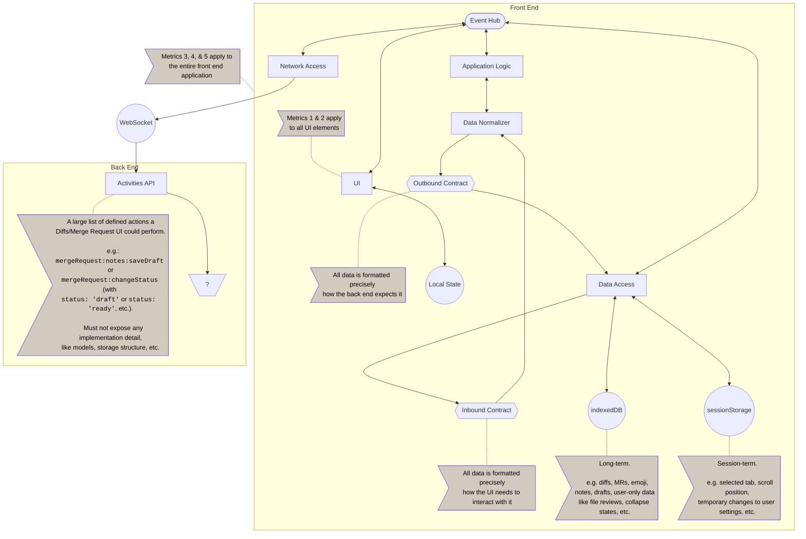

<!-- Blueprints often contain forward-looking statements -->
<!-- vale gitlab.FutureTense = NO -->

# New diffs

## Summary

Diffs at GitLab are spread across several places with each area using their own method. We are aiming
to develop a single, performant way for diffs to be rendered across the application. Our aim here is
to improve all areas of diff rendering, from the backend creation of diffs to the frontend rendering
the diffs.

## Motivation

### Goals

- improved perceived performance
- improved maintainability
- consistent coverage of all scenarios

### Non-Goals

<!--
Listing non-goals helps to focus discussion and make progress. This section is
optional.

- What is out of scope for this blueprint?
-->

### Priority of Goals

In an effort to provide guidance on which goals are more important than others to assist in making
consistent choices, despite all goals being important, we defined the following order.

**Perceived performance** is above **improved maintainability** is above **consistent coverage**.

Examples:

- a proposal improves maintainability at the cost of perceived performance: ❌ we should consider an alternative.
- a proposal removes a feature from certain contexts, hurting coverage, and has no impact on perceived performance or maintainability: ❌ we should re-consider.
- a proposal improves perceived performance but removes features from certain contexts of usage: ✅ it's valid and should be discussed with Product/UX.
- a proposal guarantees consistent coverage and has no impact on perceived performance or maintainability: ✅ it's valid.

In essence, we'll strive to meet every goal at each decision but prioritise the higher ones.

## Proposal

<!--
This is where we get down to the specifics of what the proposal actually is,
but keep it simple!  This should have enough detail that reviewers can
understand exactly what you're proposing, but should not include things like
API designs or implementation. The "Design Details" section below is for the
real nitty-gritty.

You might want to consider including the pros and cons of the proposed solution so that they can be
compared with the pros and cons of alternatives.
-->

### Accessibility

New diffs should be displayed in a way that is compliant with [Web Content Accessibility Guidelines 2.1](https://www.w3.org/TR/WCAG21/) level AA for web-based content and [Authoring Tool Accessibility Guidelines 2.0](https://www.w3.org/TR/ATAG20/) level AA for user interface.

## Design and implementation details

### Workspace & Artifacts

- We will store implementation details like metrics, budgets, and development & architectural patterns here in the docs
- We will store large bodies of research, the results of audits, etc. in the [wiki](https://gitlab.com/gitlab-com/create-stage/new-diffs/-/wikis/home) of the [New Diffs project](https://gitlab.com/gitlab-com/create-stage/new-diffs)
- We will store audio & video recordings on the public YouTube channel in the Code Review / New Diffs playlist
- We will store drafts, meeting notes, and other temporary documents in public Google docs

### Definitions

#### Maintainability

Maintainable projects are _simple_ projects.

Simplicity is the opposite of complexity. This uses a definition of simple and complex [described by Rich Hickey in "Simple Made Easy"](https://www.infoq.com/presentations/Simple-Made-Easy/) (Strange Loop, 2011).

- Maintainable code is simple (single task, single concept, separate from other things).
- Maintainable projects expand on simple code by having simple structure (folders define classes of behaviors, e.g. you can be assured that a component directory will never initiate a network call, because that would be conflating visual display with data access)
- Maintainable applications flow out of simple organization and simple code. The old saying is a cluttered desk is representative of a cluttered mind. Rigorous discipline on simplicity will be represented in our output (the product). By being strict about working simply, we will naturally produce applications where our users can more easily reason about their behavior.

#### Done

GitLab has an existing [definition of done](/ee/development/contributing/merge_request_workflow.md#definition-of-done) which is geared primarily toward identifying when an MR is ready to be merged.

In addition to the items in the GitLab definition of done, work on new diffs should also adhere to the following requirements:

- Meets or exceeds all metrics
  - Meets or exceeds our minimum accessibility metrics (these are explicitly not part of our defined priorities, because they are non-negotiable)
- All work is fully documented for engineers (user documentation is a requirement of the standard definition of done)

### Metrics

To measure our success, we need to set meaningful metrics. These metrics should meaningfully and positively impact the end user.

1. Meets or exceeds [WCAG 2.2 AA](https://www.w3.org/TR/WCAG22/).
1. Meets or exceeds [ATAG 2.0 AA](https://www.w3.org/TR/ATAG20/).
1. The new Diffs app loads less than or equal to 300 KiB of JavaScript (compressed / "across-the-wire")<sup>1</sup>.
1. The new Diffs app loads less than or equal to 150 KiB of markup, images, styles, fonts, etc. (compressed / "across-the-wire")<sup>1</sup>.
1. The new Diffs app can load and execute in total isolation from the rest of the GitLab product:
    1. "Execute" means the app can load, display data, and allows user interaction ("read-only").
    1. If a part of the application is only used in merge requests or diffs, it is considered part of the Diffs application.
    1. If a part of the application must be brought in from the rest of the product, it is not considered part of the Diffs load (as defined in metrics 3 and 4).
    1. If a part of the application must be brought in from the rest of the product, it may not block functionality of the Diffs application.
    1. If a part of the application must be brought in from the rest of the product, it must be loaded asynchronously.
    1. If a part of the application meets 5.1-5.5 _(such as: the Markdown editor is loaded asynchronously when the user would like to leave a comment on a diff)_ and its inclusion causes a budget overflow:
       - It must be added to a list of documented exceptions that we accept are out of bounds and out of our control.
       - The exceptions list should be addressed on a regular basis to determine the ongoing value of overflowing our budget.

---
<sup>1</sup>: [The Performance Inequality Gap, 2023](https://infrequently.org/2022/12/performance-baseline-2023/)

### Front end

#### High-level implementation

<!--
This section should contain enough information that the specifics of your
change are understandable. This may include API specs (though not always
required) or even code snippets. If there's any ambiguity about HOW your
proposal will be implemented, this is the place to discuss them.

If you are not sure how many implementation details you should include in the
blueprint, the rule of thumb here is to provide enough context for people to
understand the proposal. As you move forward with the implementation, you may
need to add more implementation details to the blueprint, as those may become
an important context for important technical decisions made along the way. A
blueprint is also a register of such technical decisions. If a technical
decision requires additional context before it can be made, you probably should
document this context in a blueprint. If it is a small technical decision that
can be made in a merge request by an author and a maintainer, you probably do
not need to document it here. The impact a technical decision will have is
another helpful information - if a technical decision is very impactful,
documenting it, along with associated implementation details, is advisable.

If it's helpful to include workflow diagrams or any other related images.
Diagrams authored in GitLab flavored markdown are preferred. In cases where
that is not feasible, images should be placed under `images/` in the same
directory as the `index.md` for the proposal.
-->

#### HTML structure

The HTML structure of a diff should have support for assistive technology.
For this reason, a table could be a preferred solution as it allows to indicate
logical relationship between the presented data and is easier to navigate for
screen reader users with keyboard. Labeled columns will make sure that information
such as line numbers can be associated with the edited piece of code.

Possible structure could include:

```html
<table>
  <caption class="gl-sr-only">Changes for file index.js. 10 lines changed: 5 deleted, 5 added.</caption>
  <tr hidden>
    <th>Original line number: </th>
    <th>Diff line number: </th>
    <th>Line change:</th>
  </tr>
  <tr>
    <td>1234</td>
    <td></td>
    <td>.tree-time-ago ,</td>
  </tr>
  […]
</table>
```

See [WAI tutorial on tables](https://www.w3.org/WAI/tutorials/tables) for
more implementation guidelines.

Each file table should include a short summary of changes that will read out:

- total number of lines changed,
- number of added lines,
- number of removed lines.

The summary of the table content can be placed either within `<caption>` element, or before the table within an element referred as `aria-describedby`.
See <abbr>WAI</abbr> (Web Accessibility Initiative) for more information on both approaches:

- [Nesting summary inside the `<caption>` element](https://www.w3.org/WAI/tutorials/tables/caption-summary/#nesting-summary-inside-the-caption-element)
- [Using `aria-describedby` to provide a table summary](https://www.w3.org/WAI/tutorials/tables/caption-summary/#using-aria-describedby-to-provide-a-table-summary)

However, if such a structure will compromise other functional aspects of displaying a diff,
more generic elements together with ARIA support can be used.

#### Visual indicators

It is important that each visual indicator should have a screen reader text
denoting the meaning of that indicator. When needed, use `gl-sr-only` or `gl-sr-only-focusable`
class to make the element accessible by screen readers, but not by sighted users.

Some of the visual indicators that require alternatives for assistive technology are:

- `+` or red highlighting to be read as `added`
- `-` or green highlighting to be read as `removed`

## Alternative Solutions

<!--
It might be a good idea to include a list of alternative solutions or paths considered, although it is not required. Include pros and cons for
each alternative solution/path.

"Do nothing" and its pros and cons could be included in the list too.
-->

## Proposed changes

These changes (indicated by an arbitrary name like "Design A") suggest a proposed final path forward for this blueprint, but have not yet been accepted as the authoritative content.

- Mark the highest hierarchical heading with your design name. If you are changing multiple headings at the same level, make sure to mark them all with the same name. This will create a high-level table of contents that is easier to reason about.

### Front end (Design A)

NOTE:
This draft proposal suggests one potential front end architecture which may not be chosen. It is not necessarily mutually exclusive with other proposed designs.

Ideally, we would meet our definition of done and our accountability metrics on our first try.
We also need to continue to stay within those boundaries as we move forward. To ensure this,
we need to design an application architecture that:

1. Is:
   1. Scalable.
   1. Malleable.
   1. Flexible.
1. Considers itself a mission-critical part of the overall GitLab product.
1. Treats itself as a complex, unique application with concerns that cannot be addressed
   as side effects of other parts of the product.
1. Can handle data access/format changes without making UI changes.
1. Can handle UI changes without making data access/format changes.
1. Provides a hookable, inspectable API and avoids code coupling.
1. Separates:
    - State and application data.
    - Application behavior and UI.
    - Data access and network access.

#### High-level implementation

NOTE:
This draft proposal suggests one potential front end architecture which may not be chosen. It is not necessarily mutually exclusive with other proposed designs.

(See [New Diffs: Technical Architecture Design](https://gitlab.com/gitlab-org/gitlab/-/issues/431276) for nicer visuals of this chart)



### Metrics (Design B)

NOTE:
This draft proposal suggests one potential front end architecture which may not be chosen. It is not necessarily mutually exclusive with other proposed designs.

1. _(no change)_
1. _(no change)_
1. _(no change)_
1. _(no change)_
1. _(no change)_
1. When rendering diffs on the server:
    - The total server-rendered count should not exceed 5 files.
    - It should not try to render empty diffs. (It should render at least 1 file.)
    - The total lines of diff code rendered should not exceed 1000 lines.
