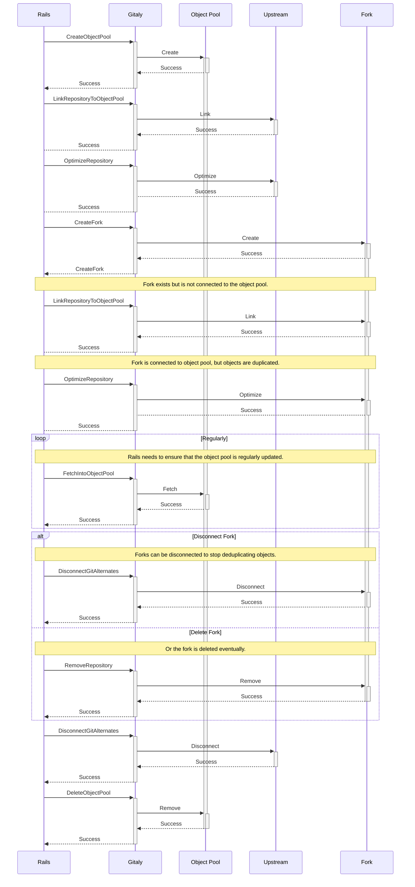
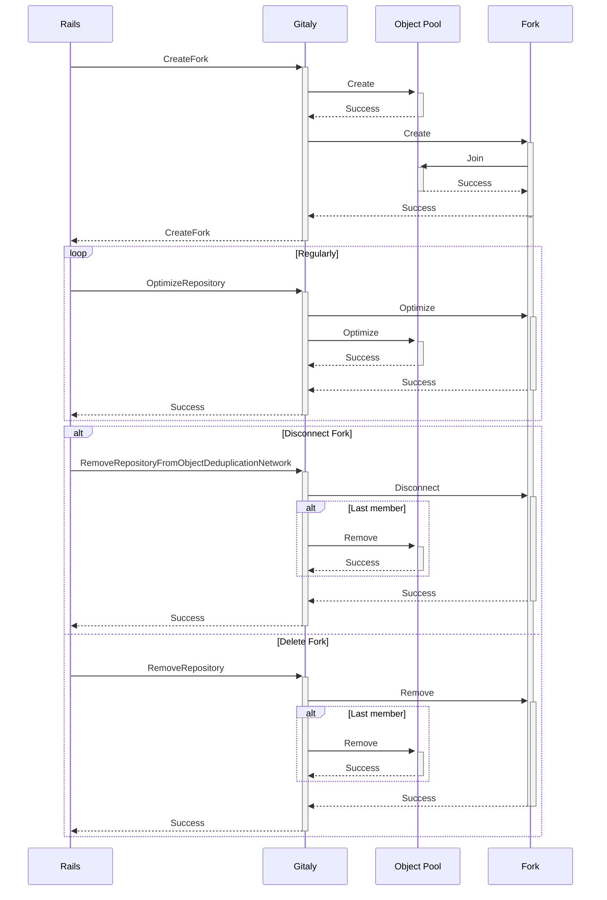

# Iterate on the design of object pools

## Summary

Forking repositories is at the heart of many modern workflows for projects
hosted in GitLab. As most of the objects between a fork and its upstream project
will typically be the same, this opens up potential for optimizations:

- Creating forks can theoretically be lightning fast if we reuse much of the
  parts of the upstream repository.

- We can save on storage space by deduplicating objects which are shared.

This architecture is currently implemented with object pools which hold objects
of the primary repository. But the design of object pools has organically grown
and is nowadays showing its limits.

This blueprint explores how we can iterate on the design of object pools to fix
long standing issues with it. Furthermore, the intent is to arrive at a design
that lets us iterate more readily on the exact implementation details of object
pools.

## Motivation

The current design of object pools is showing problems with scalability in
various different ways. For a large part the problems come from the fact that
object pools have organically grown and that we learned as we went by.

It is proving hard to fix the overall design of object pools because there is no
clear ownership. While Gitaly provides the low-level building blocks to make
them work, it does not have enough control over them to be able to iterate on
their implementation details.

There are thus two major goals: taking ownership of object pools so that it
becomes easier to iterate on the design, and fixing scalability issues once we
can iterate.

### Lifecycle ownership

While Gitaly provides the interfaces to manage object pools, the actual life
cycle of them is controlled by the client. A typical lifecycle of an object pool
looks as following:

1. An object pool is created via `CreateObjectPool()`. The caller provides the
   path where the object pool shall be created as well as the origin repository
   from which the repository shall be created.

1. The origin repository needs to be linked to the object pool explicitly by
   calling `LinkRepositoryToObjectPool()`.

1. The object pool needs to be regularly updated via `FetchIntoObjectPool()`
   that fetches all changes from the primary pool member into the object pool.

1. To create forks, the client needs to call `CreateFork()` followed by
   `LinkRepositoryToObjectPool()`.

1. Repositories of forks are unlinked by calling `DisconnectGitAlternates()`.
   This will reduplicate objects.

1. The object pool is deleted via `DeleteObjectPool()`.

This lifecycle is complex and leaks a lot of implementation details to the
caller. This was originally done in part to give the Rails side control and
management over Git object visibility. GitLab project visibility rules are
complex and not a Gitaly concern. By exposing these details Rails can control
when pool membership links are created and broken. It is not clear at the
current point in time how the complete system works and its limits are not
explicitly documented.

In addition to the complexity of the lifecycle we also have multiple sources of
truth for pool membership. Gitaly never tracks the set of members of a pool
repository but can only tell for a specific repository that it is part of said
pool. Consequently, Rails is forced to maintain this information in a database,
but it is hard to maintain that information without becoming stale.

### Repository maintenance

Related to the lifecycle ownership issues is the issue of repository
maintenance. As mentioned, keeping an object pool up to date requires regular
calls to `FetchIntoObjectPool()`. This is leaking implementation details to the
client, but was done to give the client control over syncing the primary
repository with its object pool. With this control, private repositories can be
prevented from syncing and consquently leaking objects to other repositories in
the fork network.

We have had good success with moving repository maintenance into Gitaly so that
clients do not need to know about on-disk details. Ideally, we would do the same
for repositories that are the primary member of an object pool: if we optimize
its on-disk state, we will also automatically update the object pool.

There are two issues that keep us from doing so:

- Gitaly does not know about the relationship between an object pool and its
  members.

- Updating object pools is expensive.

By making Gitaly the single source of truth for object pool memberships we would
be in a position to fix both issues.

### Fast forking

In the current implementation, Rails first invokes `CreateFork()` which results
in a complete `git-clone(1)` being performed to generate the fork repository.
This is followed by `LinkRepositoryToObjectPool()` to link the fork with the
object pool. It is not until housekeeping is performed on the fork repository
that objects are deduplicated. This is not only leaking implementation details
to clients, but it also keeps us from reaping the full potential benefit of
object pools.

In particular, creating forks is a lot slower than it could be since a clone is
always performed before linking. If the steps of creating the fork and linking
the fork to the pool repository were unified, the initial clone could be
avoided.

### Clustered object pools

Gitaly Cluster and object pools development overlapped. Consequently they are
known to not work well together. Praefect does neither ensure that repositories
with object pools have their object pools present on all nodes, nor does it
ensure that object pools are in a known state. If at all, object pools only work
by chance.

The current state has led to cases where object pools were missing or had
different contents per node. This can result in inconsistently observed state in
object pool members and writes that depend on the object pool's contents to
fail.

One way object pools might be handled for clustered Gitaly could be to have the
pool repositories duplicated on nodes that contain repositories dependent on
them. This would allow members of a fork network to exist of different nodes. To
make this work, repository replciation would have to be aware of object pools
and know when it needs to duplicate them onto a particular node.

## Requirements

There are a set of requirements and invariants that must be given for any
particular solution.

### Private upstream repositories should not leak objects to forks

When a project has a visibility setting that is not public, the objects in the
repository should not be fetched into an object pool. An object pool should only
ever contain objects from the upstream repository that were at one point public.
This prevents private upstream repositories from having objects leaked to forks
through a shared object pool.

### Forks cannot sneak objects into upstream projects

It should not be possible to make objects uploaded in a fork repository
accessible in the upstream repository via a shared object pool. Otherwise
potentially unauthorized users would be able to "sneak in" objects into
repositories by simply forking them.

Despite leading to confusion, this could also serve as a mechanism to corrupt
upstream repositories by introducing objects that are known to be broken.

### Object pool lifetime exceeds upstream repository lifetime

If the upstream repository gets deleted, its object pool should remain in place
to provide continued deduplication of shared objects between the other
repositories in the fork network. Thus it can be said that the lifetime of the
object pool is longer than the lifetime of the upstream repository. An object
pool should only be deleted if there are no longer any repositories referencing
it.

### Object lifetime

By deduplicating objects in a fork network, repositories become dependent on the
object pool. Missing objects in the pooled repository could lead to corruption
of repositories in the fork network. Therefore, objects in the pooled repository
must continue to exist as long as there are repositories referencing them.

Without a mechanism to accurately determine if a pooled object is referenenced
by one of more repositories, all objects in the pooled repository must remain.
Only when there are no repositories referencing the object pool can the pooled
repository, and therfore all its objects, be removed.

### Object sharing

An object that is deduplicated will become accessible from all forks of a
particular repository, even if it has never been reachable in any of the forks.
The consequence is that any write to an object pool immediately influences all
of its members.

We need to be mindful of this property when repositories connected to an object
pool are replicated. As the user-observable state should be the same on all
replicas, we need to ensure that both the repository and its object pool are
consistent across the different nodes.

## Proposal

In the current design, management of object pools mostly happens on the client
side as they need to manage their complete lifecyclethem. This requires Rails to
store the object pool relationships in the Rails database, perform fine-grained
management of every single step of an object pool's life, and perform periodic
Sidekiq jobs to enforce state by calling idempotent Gitaly RPCs. This design
significantly increases complexity of an already-complex mechanism.

Instead of handling the full lifecycle of object pools on the client-side, this
document proposes to instead encapsulate the object pool lifecycle management
inside of Gitaly. Instead of performing low-level actions to maintain object
pools, clients would only need to tell Gitaly about updated relationships
between a repository and its object pool.

This brings us multiple advantages:

- The inherent complexity of the lifecycle management is encapsulated in a
  single place, namely Gitaly.

- Gitaly is in a better position to iterate on the low-level technical design of
  object pools in case we find a better solution compared to "alternates" in the
  future.

- We can ensure better interplay between Gitaly Cluster, object pools and
  repository housekeeping.

- Gitaly becomes the single source of truth for object pool relationships and
  can thus start to manage it better.

Overall, the goal is to raise the abstraction level so that clients need to
worry less about the technical details while Gitaly is in a better position to
iterate on them.

### Move lifecycle management of pools into Gitaly

The lifecycle management of object pools is leaking too many details to the
client, and by doing so makes parts things both hard to understand and
inefficient.

The current solution relies on a set of fine-grained RPCs that manage the
relationship between repositories and their object pools. Instead, we are aiming
for a simplified approach that only exposes the high-level concept of forks to
the client. This will happen in the form of three RPCs:

- `ForkRepository()` will create a fork of a given repository. If the upstream
  repository does not yet have an object pool, Gitaly will create it. It will
  then create the new repository and automatically link it to the object pool.
  The upstream repository will be recorded as primary member of the object pool,
  the fork will be recorded as a secondary member of the object pool.

- `UnforkRepository()` will remove a repository from the object pool it is
  connected to. This will stop deduplication of objects. For the primary object
  pool member this also means that Gitaly will stop pulling new objects into the
  object pool.

- `GetObjectPool()` returns the object pool for a given repository. The pool
  description will contain information about the pool's primary object pool
  member as well as all secondary object pool members.

Furthermore, the following changes will be implemented:

- `RemoveRepository()` will remove the repository from its object pool. If it
  was the last object pool member, the pool will be removed.

- `OptimizeRepository()`, when executed on the primary object pool member, will
  also update and optimize the object pool.

- `ReplicateRepository()` needs to be aware of object pools and replicate them
  correctly. Repositories shall be linked to and unlink from object pools as
  required. While this is a step towards fixing the Praefect world, which may
  seem redundant given that we plan to deprecate Praefect anyway, this RPC call
  is also used for other use cases like repository rebalancing.

With these changes, Gitaly will have much tighter control over the lifecycle of
object pools. Furthermore, as it starts to track the membership of repositories
in object pools it can become the single source of truth for fork networks.

### Fix inefficient maintenance of object pools

In order to update object pools, Gitaly performs a fetch of new objects from the
primary object pool member into the object pool. This fetch is inefficient as it
needs to needlessly negotiate objects that are new in the primary object pool
member. But given that objects are deduplicated already in the primary object
pool member it means that it should only have objects in its object database
that do not yet exist in the object pool. Consequently, we should be able to
skip the negotiation completely and instead link all objects into the object
pool that exist in the source repository.

In the current design, these objects are kept alive by creating references to
the just-fetched objects. If the fetch deleted references or force-updated any
references, then it may happen that previously-referenced objects become
unreferenced. Gitaly thus creates keep-around references so that they cannot
ever be deleted. Furthermore, those references are required in order to properly
replicate object pools as the replication is reference-based.

These two things can be solved in different ways:

- We can set the `preciousObjects` repository extension. This will instruct all
  versions of Git which understand this extension to never delete any objects
  even if `git-prune(1)` or similar commands were executed. Versions of Git that
  do not understand this extension would refuse to work in this repository.

- Instead of replicating object pools via `git-fetch(1)`, we can instead
  replicate them by sending over all objects part of the object database.

Taken together this means that we can stop writing references in object pools
altogether. This leads to efficient updates of object pools by simply linking
all new objects into place, and it fixes issues we have seen with unbounded
growth of references in object pools.

## Design and implementation details

### Moving lifecycle management of object pools into Gitaly

As stated, the goal is to move the ownership of object pools into Gitaly.
Ideally, the concept of object pools should not be exposed to callers at all
anymore. Instead, we want to only expose the higher-level concept of networks of
repositories that share objects with each other in order to deduplicate them.

The following subsections review the current object pool-based architecture and
then propose the new object deduplication network-based architecture.

#### Object pool-based architecture

Managing the object pool lifecycle in the current architecture requires a
plethora of RPC calls and requires a lot of knowledge from the calling side. The
following sequence diagram shows a simplified version of the lifecycle of an
object pool. It is simplified insofar as we only consider there to be a single
object pool member.

The following steps are involved in creating the object pool:

1. The object pool is created from its upstream repository by calling
   `CreateObjectPool()`. It contains all the objects that the upstream
   repository contains at the time of creation.
1. The upstream repository is linked to the object pool by calling
   `LinkRepositoryToObjectPool()`. Its objects are not automatically
   deduplicated.
1. Objects in the upstream repository get deduplicated by calling
   `OptimizeRepository()`.
1. The fork is created by calling `CreateFork()`. This RPC call only takes the
   upstream repository as input and does not know about the already-created
   object pool. It thus performs a second full copy of objects.
1. Fork and object pool are linked by calling `LinkRepositoryToObjectPool()`.
   This writes the `info/alternates` file in the fork so that it becomes
   aware of the additional object database, but doesn't cause the objects to
   become deduplicated.
1. Objects in the fork get deduplicated by calling `OptimizeRepository()`.
1. The calling side is now expected to regularly call `FetchIntoObjectPool()` to
   fetch new objects from the upstream repository into the object pool. Fetched
   objects are not automatically deduplicated in the upstream repository.
1. The fork can be detached from the object pool in two ways:
   - Explicitly by calling `DisconnectGitAlternates()`, which removes the
     `info/alternates` file and reduplicates all objects.
   - By calling `RemoveRepository()` to delete the fork altogether.
1. When the object pool is empty, it must be removed by calling
   `DeleteObjectPool()`.

It is clear that the whole lifecycle management is not well-abstracted and that
the clients need to be aware of many of its intricacies. Furthermore, we have
multiple sources of truth for object pool memberships that can (and in practice
do) diverge.

#### Object deduplication network-based architecture

The proposed new architecture simplifies this process by completely removing the
notion of object pools from the public interface. Instead, Gitaly exposes the
high-level notion of "object deduplication networks". Repositories can join
these networks with one of two roles:

- Read-write object deduplication network members regularly update the set of
  objects that are part of the object deduplication network.
- Read-only object deduplication network members are passive members and never
  update the set of objects that are part of the object deduplication network.

The set of objects that can be deduplicated across members of the object
deduplication network thus consists only of objects fetched from the read-write
members. All members benefit from the deduplication regardless of their role.
Typically:

- The original upstream repository is designated as the read-write member of
  the object deduplication network.
- Forks are read-only object deduplication network members.

It is valid for object deduplication networks to only have read-only members.
In that case the network is not updated with new shared objects, but the
existing shared objects remain in use.

Though object pools continue to be the underlying mechanism, the higher level of
abstraction would allow us to swap out the mechanism if we ever decide to do so.

While clients of Gitaly need to perform fine-grained lifecycle management of
object pools in the object pool-based architecture, the object deduplication
network-based architecture only requires them to manage memberships of object
deduplication networks. The following diagram shows the equivalent flow to the
object pool-based architecture in the object deduplication network-based
architecture:

The following major steps are involved:

1. The fork is created, where the request instructs Gitaly to have both
   upstream and fork repository join an object deduplication network. If the
   upstream project is part of an object deduplication network already, then
   the fork joins that object deduplication network. If it isn't, Gitaly
   creates an object pool and joins the upstream repository as a read-write
   member and the fork as a read-only member. Objects of the fork are
   immediately deduplicated. Gitaly records the membership of both repositories
   in the object pool.
1. The client regularly calls `OptimizeRepository()` on either the upstream or
   the fork project, which is something that clients already know to do. The
   behavior changes depending on the role of the object deduplication network
   member:
   - When executed on a read-write object deduplication network member, the
     object pool may be updated based on a set of heuristics. This will pull
     objects which have been newly created in the read-write object
     deduplication network member into the object pool so that they are
     available for all members in the object deduplication network.
   - When executed on a read-only object deduplication network member, the
     object pool will not be updated so that objects which are only part of the
     read-only object deduplication network member will not get shared across
     members. The object pool may still be optimized though as required, for
     example by repacking objects.
1. Both the upstream and the fork project can leave the object deduplication
   network by calling `RemoveRepositoryFromObjectNetwork()`. This reduplicates
   all objects and disconnects the repositories from the object pool.
   Furthermore, if the repository was a read-write object deduplication network
   member, Gitaly will stop using it as a source to update the pool.

   Alternatively, the fork can be deleted with a call to `RemoveRepository()`.

   Both calls update the memberships of the object pool to reflect that
   repositories have left it. Gitaly deletes the object pool if it has no
   members left.

With this proposed flow the creation, maintenance, and removal of object pools
is handled opaquely inside of Gitaly. In addition to the above, two more
supporting RPCs may be provided:

- `AddRepositoryToObjectDeduplicationNetwork()` to let a preexisting repository
  join into an object deduplication network with a specified role.
- `ListObjectDeduplicationNetworkMembers()` to list all members and their roles
  of the object deduplication network that a repository is a member of.

#### Migration to the object deduplication network-based architecture

Migration towards the object deduplication network-based architecture involves
a lot of small steps:

1. `CreateFork()` starts automatically linking against preexisting object
   pools. This allows fast forking and removes the notion of object pools for
   callers when creating a fork.
1. Introduce `AddRepositoryToObjectDeduplicationNetwork()` and
   `RemoveRepositoryFromObjectDeduplicationNetwork()`. Deprecate
   `AddRepositoryToObjectPool()` and `DisconnectGitAlternates()` and migrate
   Rails to use the new RPCs. The object deduplication network is identified
   via a repository, so this drops the notion of object pools when handling
   memberships.
1. Start recording object deduplication network memberships in `CreateFork()`,
   `AddRepositoryToObjectDeduplicationNetwork()`,
   `RemoveRepositoryFromObjectDeduplicationNetwork()` and `RemoveRepository()`.
   This information empowers Gitaly to take control over the object pool
   lifecycle.
1. Implement a migration so that we can be sure that Gitaly has an up-to-date
   view of all members of object pools. A migration is required so that Gitaly
   can automatically handle the lifecycle of on object pool, which:
   - Enables `OptimizeRepository()` to automatically fetch objects from
     read-write object pool members.
   - Allows Gitaly to automatically remove empty object pools.
1. Change `OptimizeRepository()` so that it also optimizes object pools
   connected to the repository, which allows us to deprecate and eventually
   remove `FetchIntoObjectPool()`.
1. Adapt `RemoveRepositoryFromObjectDeduplicationNetwork()` and
   `RemoveRepository()` to remove empty object pools.
1. Adapt `CreateFork()` to automatically create object pools, which allows us
   to remove the `CreateObjectPool()` RPC.
1. Remove the `ObjectPoolService` and the notion of object pools from the Gitaly
   public API.

This plan is of course subject to change.

### Gitaly Cluster concerns

#### Repository creation

When a repository is forked for the first time, Rails creates an object pool via
the `CreateObjectPool()` RPC. This means object pool creation is handled outside
of Gitaly. Subsequently, the object pool is linked to upstream and fork
repositories. When a repository has its Git `alternates` file configured to link
to another repository, these two repositories must exist on the same physical
storage.

The repository and its object pool existing on the same physical storage is
particularly important for Praefect because it is dependent of the repository's
replication factor. A replication factor is a configuration that controls how
many storages the repository is replicated to in the Praefect virtual storage.
By default, the replication factor is equal to the number of storages in
Praefect. This means that when using the default replication factor, a
repository is available on all storages in the cluster. When a custom
replication factor is used, the number of replicas can be reduced so that a
repository only exists on a subset of storages in Praefect.

Gitaly Cluster persists repositories and their assigned storages in the Praefect
PostgreSQL database. The database is updated when new repositories are created
on the virtual storage. When a new repository is created, the replication factor
specifies how many storages are randomly assigned to the repository. The
following scenario outlines how a custom replication factor can be problematic
for object pools:

1. A new repository is created in a Gitaly Cluster that has five storage nodes.
   The replication factor is set to three. Therefore, three storages are
   randomly selected and assigned for this new repository in Praefect. For
   example, the assignments are storages 1, 2, and 3. Storages 4 and 5 do not
   have a copy of this repository.
1. The repository gets forked for the first time thus requiring an object pool
   repository be created with the `CreateObjectPool()` RPC. Because the
   replication factor is set to three, another randomly selected set of three
   storages are assigned in Praefect for the new object pool repository. For
   example, the object pool repository is assigned to storages 3, 4, and 5. Note
   that these assignments do not entirely match the upstream repository's.
1. The forked copy of the repository gets created with the `CreateFork()` RPC
   and is also assigned to three randomly-selected storages. For example, the
   fork repository gets assigned storages 1, 3, and 5. These assignments also do
   not entirely match the upstream and object pool repository's storage
   assignments.
1. Both the upstream and fork repositories are linked to the object pool via
   separate invocations of `LinkRepositoryToObjectPool()`. For this RPC to
   succeed the object pool must exist on the same storage as the repository
   that is linking to it. The upstream repository fails to link on storages 1
   and 2. The fork repository fails to link on storage 2. The
   `LinkRepositoryToObjectPool()` RPC is not transactional so a single failure
   of the RPC on any of the storages results in an error being proxied back to
   the client. Therefore, in this scenario `LinkRepositoryToObjectPool()` on
   both the upstream and fork repository always result in an error response.

To fix this problem, we must ensure Praefect always routes `CreateObjectPool()`
and `CreateFork()` RPC requests to the same set of storages as the upstream
repository. This ensures that these repositories always have the required object
pool repository available so that linking to them can succeed.

The main downside of this is that repositories in an object deduplication
network are pinned to the same set of storages. This could unevenly stress
individual storages as an object deduplication network grows larger. In the
future this can be avoided altogether when Praefect has the ability to create
object pools on a storage where it is required but not already present.

#### Repository replication

The `ReplicateRepository()` RPC is not aware of object pools and only replicates
from the source repository. This means that replication of a source repository
linked to an object pool repository results in a target repository with no Git
`alternates` file and consequently no deduplication of objects.

The `ReplicateRepository()` RPC has two main uses:

- Storage moves performed in the GitLab API rely on the `ReplicateRepository()`
  RPC to replicate repositories from one storage to another. Since this RPC is
  currently not object pool aware, the resulting replica on the target storage
  does not replicate the Git `alternates` file from the source repository or
  recreate any object pools. Instead, the replica is always a complete
  self-contained copy of the source repository. Consequently, the object pool
  relationship for the repository project in Rails is also removed. When moving
  repositories in an object deduplication network from one storage to another,
  the replicated repositories can result in increased storage usage because
  there is no longer any deduplication of objects on the target storage.
- When a repository replica becomes outdated in Praefect, the
  `ReplicateRepository()` RPC is internally used by Praefect replication jobs to
  replicate over the out-of-date replica from an up-to-date replica. Replication
  jobs are queued by the Praefect replication manager when replicas become
  outdated. Though the `ReplicateRepository()` RPC is not aware of object pools,
  the replication job checks if the source repository is linked to an object
  pool. If the source repository is linked, the job recreates the corresponding
  Git `alternates` file on the target repository. However, it is currently
  possible for an object pool to not exist on the same storage as the replica.
  When this happens, replication always fails because the replica is unable to
  link to the non-existent object pool. This means it is possible for replicas
  to remain outdated permanently.

Object pools required by the source repository should be replicated to the
target storage along with the repository during the `ReplicateRepository()` RPC.
This preserves object deduplication for repositories in an object deduplication
network. Because storage moves performed in the GitLab API remove any object
pool relationships, recreating object pools on the target storage results in
orphaned object pools. This new object pool replication behavior of the
`ReplicateRepository()` RPC should be controlled by the client to prevent
breaking changes. Object pool replication for storage moves can be enabled once
either:

- The Rails side is updated to preserve the object pool relationship.
- The object pool lifecycle is managed within Gitaly.

When it comes to replication of object pools, there are scenarios Praefect needs
to be capable of handling. Special consideration must be made in these cases so
Praefect can keep track of all the repositories it manages in its PostgreSQL
database to ensure they stay up to date.

- Replication of an external source repository that is linked to an object pool
  to Gitaly Cluster can result in the target virtual storage's Praefect needing
  to create a new object pool repository. To handle this, it needs to be known
  if the source repository is using an object pool. From there it can be checked
  if Praefect has an entry for the object pool repository in its `repositories`
  database table, and if not, create one. Next, Praefect storage assignments for
  the object pool need to be generated and persisted in the
  `repository_assignments` database table.
- It can not be guaranteed that the target repository storage in Praefect
  already contains the required object pool. Thus an individual storage may need
  to have an object pool assigned to it. This new assignment must also be
  tracked by the object pool repository in Praefect. To handle this, Praefect
  has to detect when a target storage does not contain the required object pool
  and persist the new storage assignment in the `repository_assignments`
  database table.

## Problems with the design

As mentioned before, object pools are not a perfect solution. This section goes
over the most important issues.

### Complexity of lifecycle management

Even though the lifecycle of object pools becomes easier to handle once it is
fully owned by Gitaly, it is still complex and needs to be considered in many
ways. Handling object pools in combination with their repositories is not an
atomic operation as any action by necessity spans over at least two different
resources.

### Performance issues

As object pools deduplicate objects, the end result is that object pool members
never have the full closure of objects in a single packfile. This is not
typically an issue for the primary object pool member, which by definition
cannot diverge from the object pool's contents. But secondary object pool
members can and often will diverge from the original contents of the upstream
repository.

This leads to two different sets of reachable objects in secondary object pool
members. Unfortunately, due to limitations in Git itself, this precludes the use
of a subset of optimizations:

- Packfiles cannot be reused as efficiently when serving fetches to serve
  already-deltified objects. This requires Git to recompute deltas on the fly
  for object pool members which have diverged from object pools.

- Packfile bitmaps can only exist in object pools as it is not possible nor
  easily feasible for these bitmaps to cover multiple object databases. This
  requires Git to traverse larger parts of the object graph for many operations
  and especially when serving fetches.

### Dependent writes across repositories

The design of object pools introduces significant complexity into the Raft world
where we use a write-ahead log for all changes to repositories. In the ideal
case, a Raft-based design would only need to care about the write-ahead log of a
single repository when considering requests. But with object pools, we are
forced to consider both reads and writes for a pooled repository to be dependent
on all writes in its object pool having been applied.

## Alternative Solutions

The proposed solution is not obviously the best choice as it has issues both
with complexity (management of the lifecycle) and performance (inefficiently
served fetches for pool members).

This section explores alternatives to object pools and why they have not been
chosen as the new target architecture.

### Stop using object pools altogether

An obvious way to avoid all of the complexity is to stop using object pools
altogether. While it is charming from an engineering point of view as we can
significantly simplify the architecture, it is not a viable approach from the
product perspective as it would mean that we cannot support efficient forking
workflows.

### Primary repository as object pool

Instead of creating an explicit object pool repository, we could just use the
upstream repository as an alternate object database of all forks. This avoids a
lot of complexity around managing the lifetime of the object pool, at least
superficially. Furthermore, it circumvents the issue of how to update object
pools as it will always match the contents of the upstream repository.

It has a number of downsides though:

- Repositories can now have different states, where some of the
  repositories are allowed to prune objects and others aren't. This introduces a
  source of uncertainty and makes it easy to accidentally delete objects in a
 repository and thus corrupt its forks.

- When upstream repositories go private we must stop updating objects which are
  supposed to be deduplicated across members of the fork network. This means
  that we would ultimately still be forced to create object pools once this
  happens in order to freeze the set of deduplicated objects at the point in
  time where the repository goes private.

- Deleting repositories becomes more complex as we need to take into account
  whether a repository is linked to by forks.

### Reference namespaces

With `gitnamespaces(7)`, Git provides a mechanism to partition references into
different sets of namespaces. This allows us to serve all forks from a single
repository that contains all objects.

One neat property is that we have the global view of objects referenced by all
forks together in a single object database. We can thus easily perform shared
housekeeping across all forks at once, including deletion of objects that are
not used by any of the forks anymore. Regarding objects, this is likely to be
the most efficient solution we could potentially aim for.

There are again some downsides though:

- Calculating usage quotas must by necessity use actual reachability of objects
  into account, which is expensive to compute. This is not a showstopper, but
  something to keep in mind.

- One stated requirement is that it must not be possible to make objects
  reachable in other repositories from forks. This property could theoretically
  be enforced by only allowing access to reachable objects. That way an object
  can only be accessed through virtual repository if the object is reachable from
  its references. Reachability checks are too compute heavy for this to be practical.

- Even though references are partitioned, large fork networks would still easily
  end up with multiple millions of references. It is unclear what the impact on
  performance would be.

- The blast radius for any repository-level attacks significantly increases as
  you would not only impact your own repository, but also all forks.

- Custom hooks would have to be isolated for each of the virtual repositories.
  Since the execution of Git hooks is controled it should be possible to handle
  this for each of the namespaces.

### Filesystem-based deduplication

The idea of deduplicating objects on the filesystem level was floating around at
several points in time. While it would be nice if we could shift the burden of
this to another component, it is likely not easy to implement due to the nature
of how Git works.

The most important contributing factor to repository sizes are Git objects.
While it would be possible to store the objects in their loose representation
and thus deduplicate on that level, this is infeasible:

- Git would not be able to deltify objects, which is an extremely important
  mechanism to reduce on-disk size. It is unlikely that the size reduction
  caused by deduplication would outweigh the size reduction gained from the
  deltification mechanism.

- Loose objects are significantly less efficient when accessing the repository.

- Serving fetches requires us to send a packfile to the client. Usually, Git is
  able to reuse large parts of already-existing packfiles, which significantly
  reduces the computational overhead.

Deduplicating on the loose-object level is thus infeasible.

The other unit that one could try to deduplicate is packfiles. But packfiles are
not deterministically generated by Git and will furthermore be different once
repositories start to diverge from each other. So packfiles are not a natural
fit for filesystem-level deduplication either.

An alternative could be to use hard links of packfiles across repositories. This
would cause us to duplicate storage space whenever any repository decides to
perform a repack of objects and would thus be unpredictable and hard to manage.

### Custom object backend

In theory, it would be possible to implement a custom object backend that allows
us to store objects in such a way that we can deduplicate them across forks.
There are several technical hurdles though that keep us from doing so without
significant upstream investments:

- Git is not currently designed to have different backends for objects. Accesses
  to files part of the object database are littered across the code base with no
  abstraction level. This is in contrast to the reference database, which has at
  least some level of abstraction.

- Implementing a custom object backend would likely necessitate a fork of the
  Git project. Even if we had the resources to do so, it would introduce a major
  risk factor due to potential incompatibilities with upstream changes. It would
  become impossible to use vanilla Git, which is often a requirement that exists
  in the context of Linux distributions that package GitLab.

Both the initial and the operational risk of ongoing maintenance are too high to
really justify this approach for now. We might revisit this approach in the
future.
