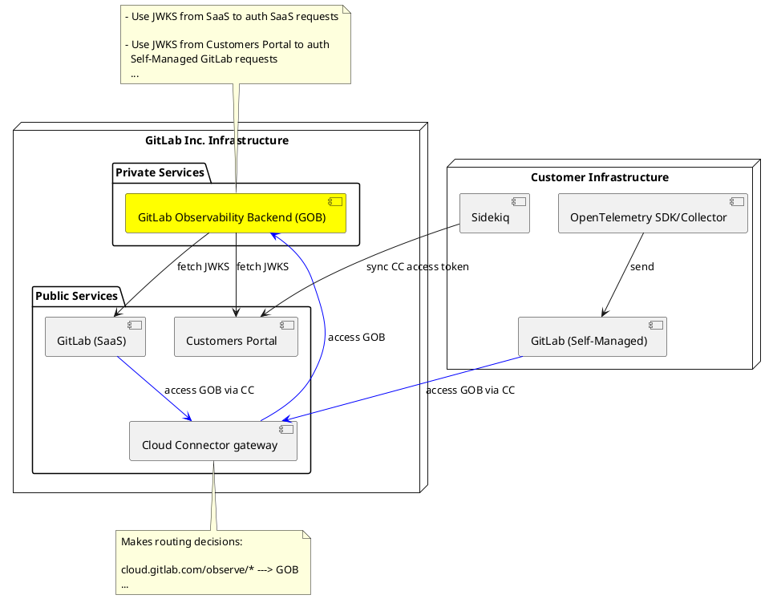
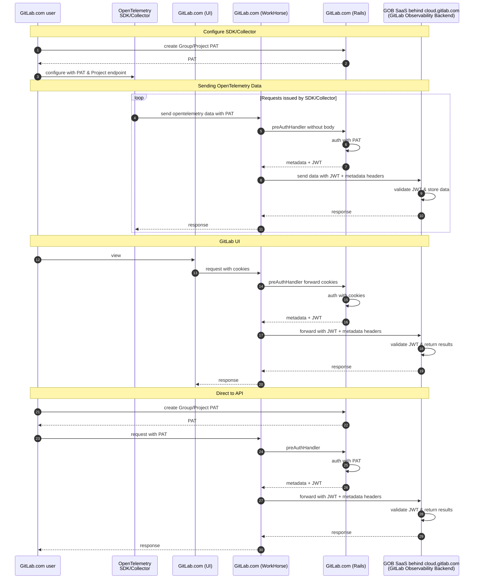
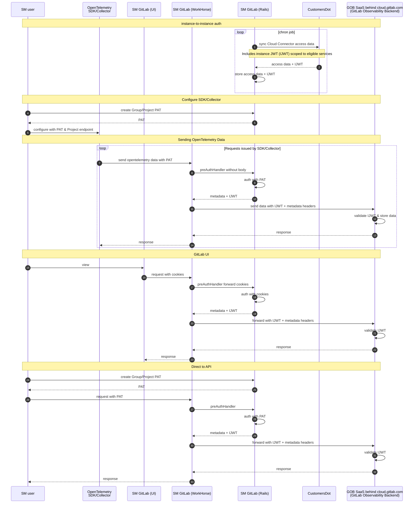

# GitLab Observability in GitLab.com and Self-Managed GitLab Instances

## Summary

GitLab observability [will first be available to self-managed instances through Cloud Connector](https://gitlab.com/groups/gitlab-org/opstrace/-/epics/95) so self-managed users can take advantage of GitLab Observability without the need to manage an observability platform. This document outlines the architecture.

In addition to making GitLab observability available to self-managed instances through Cloud Connector, GitLab observability available in GitLab.com will also realign architecture to utilize Cloud Connector.

The following architectural overview can be applied to both self-managed GitLab instances and .com GitLab instances.

## Goals

- **Offer seamless Observability features to self-managed users without requiring them to manage a scalable and reliable observability system.**
- **Move Observability APIs to GitLabs [project resource API](../../../api/api_resources.md#project-resources).**
- **Maintain API consistency between .com and self-managed GitLab**

## Architecture

GitLab Observability Backend (GOB) deployments will be managed by GitLab Inc. as
part of the GitLab Inc. infrastructure. GitLab.com and all self-managed GitLab instances
will initially use the same GOB backend that exists today. However, in the future, we
could also deploy regional GOB instances, or even customer-specific GOB instances if the need
arises, and route requests to the desired GOB instance.

Blue arrows highlight the request path from both GitLab SaaS and GitLab self-managed instances
to GOB. All requests pass through the [Cloud Connector Gateway](../cloud_connector/index.md)
public service and on to the private GOB service. GitLab SaaS cells will all have access to the public Cloud Connector Gateway.

The [Cloud Connector Gateway will be a single entry point Load balancer](../cloud_connector/decisions/001_lb_entry_point.md).

Detailed request architecture is outlined in the next section.

## Walkthrough of Observability Requests

The following two diagrams highlight the request flow for GitLab.com customers and for self-managed GitLab customers.
A couple small differences exist between the two:

1. The JWT sent to GOB in GitLab.com requests is created in Rails, whereas the JWT or otherwise referred to as IJWT in
the self-managed flow originates from CustomersDot.
1. There is no CustomersDot JWT sync in the GitLab.com flow.

### Observability offered in GitLab.com

### Observability offered in Self-Managed GitLab

## Performance

It is critically important to keep the body of any observability requests from burdening Rails/Puma. All preAuthHandlers in Workhorse will ensure the body is not forwarded
to Rails and will only be forwarded to GOB when auth is successful.

If we consider the daily data transmitted and stored concerning our observability of GitLab.com, and we extrapolate that across our self-managed customers who might have equally demanding needs, we can get an idea of how much data will pass through Workhorse and Cloud Connector. GitLab.com produces 150M+ metrics series, sampled every 30-60 seconds, and 18-22 TB of logs per day.

We could assume that any Ultimate tier root-level namespace on GitLab.com or any Ultimate tier self-managed instance could send a similar magnitude of data through `cloud.GitLab.com`.

To get an idea of what this equals to in requests/second and bytes/second, we walk through the following basic example.

**Assumptions**:

- Compression: [use this chart that illustrates compression ratios for observability data types](https://github.com/open-telemetry/opentelemetry-collector/blob/main/config/configgrpc/README.md#compression-comparison)
- An example metric is 396 Bytes raw and translates to a `md_metric_request` in the compression table linked above:
  - `{__name__="cluster:namespace:pod_cpu:active:kube_pod_container_resource_limits", cluster="play-db-cluster", container="k6-grpc", instance="10.4.3.6:8080", job="integrations/Kubernetes/kube-state-metrics", namespace="play-backends", node="gke-raintank-dev-pla-raintank-dev-pla-3cd3aafc-hijt", pod="k6-grpc-5c74969fdc-6n2bn", resource="cpu", uid="56e073b7-ca28-4cf4-b3da-83dc97763bef", unit="core"}`
- Trace volume can easily exceed log volume, with similar context attached to each span as would be found in a log line. Tracing is more similar to debug logging, so sampling is used to reduce the overall volume to reasonable levels. Let's assume for argument's sake that tracing volume after sampling is equal to logging volume.
- For compression ratios, assume `md_log_request`, `md_trace_request` and `md_metric_request`

Single large Ultimate tier Organization (via GitLab.com or self-managed):

- **Metrics volume**: 150M active metrics series sampled every 30 seconds
  - Samples/sec = 150M / 30 = 5M
  - Bytes/sec = 5M * 396B / 2.21 compression ratio = 896MB/s

- **Logs volume**: 18TB/day
  - Bytes/sec uncompressed = 18e+12 / ( 24 x 60 x 60 ) = 208MB/s
  - Bytes/sec compressed = 208 / 1.35 compression ratio = 154Mb/s

- **Traces volume**: from assumptions above, assume to be the same as log volume
  - Bytes/sec compressed = 208 / 1.57 compression ratio = 132Mb/s

Treating this as an upper bound assumption that the total possible demand from an Ultimate tier customer could be 896 + 154 + 132 = 1.2GB/s for data ingestion.
Data ingestion demands are always magnitudes higher than reading back observability data, so we can disregard read load for the sake of this back-of-napkin math.

It is also useful to consider the average requests per second that deliver the 1.2GB/s. This will allow us to infer the number of preAuthHandler requests against Rails.

The OpenTelemetry Batch Processor is the recommended way to send metrics, logs, and traces in configurable-sized batches. The default batch size is 8192 events.
If we take the average compressed size of `md_log_request`, `md_trace_request` and `md_metric_request` from the Opentelemetry compression comparison and the
Metric, Log, Trace Volume outlined above we can compute the average request/second using the default batch size.

- **Metrics req/s:**
  - 896MB per sec / 145 compressed bytes per event = 6.2M events/sec
  - 6.2M events per sec / 8192 events per batch = 760 reqs/sec

- **Logs req/s:**
  - 154MB per sec / 268 compressed bytes per event = 0.57M events/sec
  - 0.57M events per sec / 8192 events per batch = 70 reqs/sec

- **Traces req/s:**
  - 132MB per sec / 288 compressed bytes per event = 0.46M events/sec
  - 0.46M events per sec / 8192 events per batch = 56 reqs/sec

Total requests per second using default batching is **890 requests/second for each large customer with 150M active metrics series, 18TB of daily logs, and 18TB of daily traces**.

### Observability for GitLab.com

For each customer of this magnitude on GitLab.com, there would be a demand of 1.2GB/s through Workhorse.

To maximize performance and GitLab service availability, a dedicated web fleet should be created for observability just like the recent addition for code suggestions. All incoming
request paths starting with `/api/v4/projects/:id/observability/` can be routed to the dedicated observability web fleet in .com.
This mitigates the risk of observability requests saturating the main GitLab web fleet and allows for horizontal autoscaling of the observability fleet based on demand.

### Observability for Self-Managed

The self-managed Workhorse throughput for this magnitude of data would be 1.2GB/s. Self-managed customers will have access to the appropriate configuration in our reference architecture documentation.

## Authentication & Authorization

As outlined in the request flow, there are two main request legs for any interaction with GOB.

1. User/Client to their GitLab instance
1. GitLab instance to GOB

For all leg 1 requests, authentication and authorization will be enforced by leveraging a preAuthorizeHandler in Workhorse. This handler
will call an internal Rails API to perform both authN and authZ using either the supplied PAT or browser cookies. The internal Rails APIs
will first authenticate the request to ensure it was issued by Workhorse using the Workhorse/Rails JWT and shared signing secret. If successful, the endpoint
will then perform the appropriate auth checks against the supplied PAT/browser cookies. If successful, Rails will return in the response back to Workhorse,
all the headers that need to be sent to GOB including the IJWT (if instance is self-managed) and any metadata, in a similar manner to Workhorse/Rails websocket auth-data.

Workhorse will then forward the request to GOB with either the IJWT (self-managed) or the Workhorse JWT (SaaS). GOB will then verify the JWT to authenticate the request.

Both Rails and Workhorse use the same secret to sign JWTs so the JWKS available at the `jwks_uri` found at `https://gitlab.com/.well-known/openid-configuration` can be used to verify the identity of the JWT created from Rails or Workhorse, meaning requests to GOB could also be sent from Rails. For the IJWTs, the [JWKS can be retrieved in accordance with this](https://gitlab.com/gitlab-org/customers-gitlab-com/-/blob/d877b173ebe6a614d41ef34d9e2a6a0fe93dac07/doc/architecture/add_ons/code_suggestions/authorization_for_self_managed.md#L74-145).

## Enabling

Self-Managed users will enable the use of Cloud Connected GitLab Observability through the Customers Portal. All relevant licenses and
subscription info will then be encoded into the IJWT which Workhorse, Rails, and GOB will use to manage access and enforce limits and quotas.

## Rate-limits and Quota Management

GitLab Observability Backend already has rate limiting on its API gateway to prevent denial of service attacks.

In addition to these existing rate limits, we will also add rate limiting to Workhorse/Rails in the same idiomatic manner
to which other GitLab APIs manage rate limits to ensure rate limits are enforced at the edge, mitigating any DOS attacks at the edge
before calling on more downstream services.

GitLab Observability Quota management is enforced in GOB. GOB configures compute quota for each top-level namespace, depending on
the customer's license. In addition that, it will enforce storage quota appropriately based on the customer license by tracking storage
and purging old data to make space for new data, ensuring storage is always kept below an upper bound for each top-level namespace.
Eventually, this quota management will be mapped to the GitLab Organization construct instead of top-level namespace.

To ensure rate limiting and quota management in the GOB service is enforced correctly, GOB will use the IJWT token to extract relevant information
about the customer license. Metadata headers will also be sent as part of the request leg from Workhorse to GOB that provides any additional
information required by GOB to fulfill requests and enforce quotas and limits.

## APIs

All observability APIs will proxy through Workhorse and will live under GitLabs [project resource](../../../api/api_resources.md#project-resources).
HTTP will be supported initially and gRPC will be added at a later date.

## System Monitoring

GitLab Observability Backend already has system monitoring in place that plugs into GitLabs centralized metrics and logging system. Additional metrics will also be
captured in Workhorse and in Rails to provide visibility and alerting on the user-facing API.
