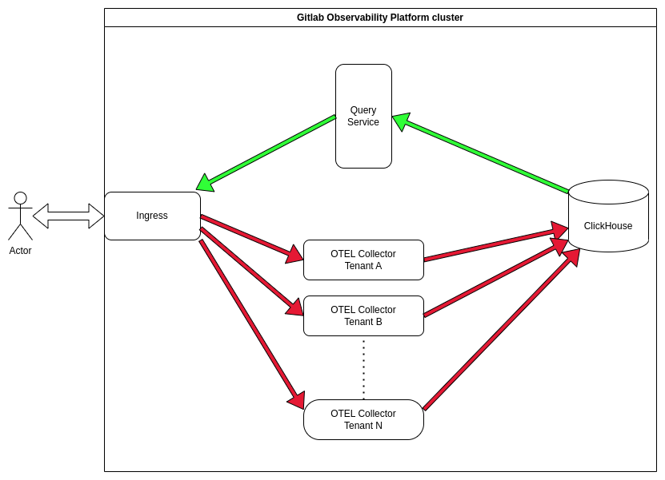

<!-- vale gitlab.FutureTense = NO -->

# GitLab Observability - Logging

## Summary

This design document outlines a system for storing and querying logs which will be a part of GitLab Observability Backend (GOB), together with [tracing](../observability_tracing/index.md) and [metrics](../observability_metrics/index.md).
At its core the system is leveraging [OpenTelemetry logging](https://opentelemetry.io/docs/specs/otel/logs/) specification for data ingestion and ClickHouse database for storage.
The users will interact with the data through GitLab UI.
The system itself is multi-tenant and offers our users a way to store their application logs, query them, and in future iterations correlate with other observability signals (traces, errors, metrics, etc...).

## Motivation

After [tracing](../observability_tracing/index.md) and [metrics](../observability_metrics/index.md), logging is the last observability signal that we need to support to be able to provide our users with a fully-fledged observability solution.

One could argue that logging itself is also the most important observability signal because it is so widespread.
It predates metrics and tracing in the history of application observability and is usually implemented as one of the first things during development.

Without logging support, it would be very hard if not impossible to fully understand for our users the performance and operation of the applications developed by them with the help of our platform.

### Goals

- **multi-tenant**: each user and their data should be isolated from others that are using the platform.
  Users may query only the data that they have sent to the platform.
- **follows OpenTelemetry standards**: logs ingestion should follow the [OpenTelemetry protocol](https://opentelemetry.io/docs/specs/otel/logs/data-model/).
  Apart from being able to re-use the tooling and know-how that was already developed for OpenTelemetry protocol, we will not have to reinvent the wheel when it comes to wire protocol and data storage format.
- **uses ClickHouse as a data storage backend**: ClickHouse has become the go-to solution for observability data at GitLab for a plethora of reasons.
  Our tracing and metrics solutions already use it, so logging should be consistent with it and not introduce new dependencies.
- **Users can query their data using reasonably complex queries**: storing logs by itself will not bring much value to our users.

### Non-Goals

- **complex query support and logs analytics** - at least in the first iteration we do not plan to support complex queries, in particular `GROUP BY` queries that users may want to use for quantitative logs analytics.
  Supporting it is not trivial and requires some more research and work in the area of query language syntax.
- **advanced data retention** - logs differ from traces and metrics concerning legal requirements.
  Authorities may request logs stored by us as part of e.g. ongoing investigations.
  In the initial iteration, we need to caution our users that our system is not ready for that and they need a secondary system for now if they intend to store e.g. access logs.
  We will need more work around logs/data integrity and long-term storage policies to handle this use case.
- **data deletion** - apart from the case where the data simply expires after a predefined storage period, we do not plan to support deleting individual logs by users.
  This is left for later iterations.
- **linking logs to traces** - we do not intend to support linking logs to traces in the first iteration, at least not in the UI.
- **logs sampling** - for traces we expect users to sample their data before sending it to us while we focus only on enforcing the limits/quotas.
  Logs should follow this pattern.
  The log sampling implementation seems immature as well - a log sampler is [implemented in OTEL Collector](https://github.com/open-telemetry/opentelemetry-collector-contrib/pull/14920), but it is not clear if it can work together with traces sampling, and there is no official specification ([issue](https://github.com/open-telemetry/opentelemetry-specification/issues/2237), [pull request](https://github.com/open-telemetry/opentelemetry-specification/pull/2482)).

## Proposal

The architecture of logs ingestion follows the patterns outlined in the [tracing](../observability_tracing/index.md) and [metrics](../observability_metrics/index.md) proposals:



We re-use the components that were introduced by these proposals, so there are not going to be any new services added.
Each top-level GitLab namespace has its own OTEL collector to which ingestion requests are directed by the cluster-wide Ingress.
On the other hand, there is a single, cluster-wide query service that handles queries from users.
The query service is tenant-aware.
Rate-limiting of the user requests is done at the Ingress level.
The cluster-wide Ingress is currently done using Traefik, and it is shared with all other services in the cluster.

### Ingestion path

We receive Log objects from customers in the JSON format over HTTP.
The request arrives at the cluster-wide Ingress which routes the request to the appropriate OTEL collector.
The collector then processes this request and executes INSERT statements against Clickhouse.

### Read path

GOB exposes an HTTP/JSON API that e.g. GitLab UI uses to query and then render logs.
The cluster-wide Ingress is routing the requests to the query service which in turn parses the API request and executes an SQL query against ClickHouse.
The results are then formatted into JSON response and sent back to the client.

## Design and implementation details

### Legacy code

Handling logging signals is heavily influenced by the large amount of legacy code that needs to be supported, contrary to trace and metric signals.
For metrics and tracing, OpenTelemetry specification defines new APIs and SDKs that can be leveraged.
With logs, OpenTelemetry acts more like a bridge and enables legacy libraries/code to send their data to us.

Users may create Log signals from plain log files using [filelogreceiver](https://github.com/open-telemetry/opentelemetry-collector-contrib/tree/main/receiver/filelogreceiver) or [fluentd](https://docs.fluentbit.io/manual/pipeline/outputs/opentelemetry).
Existing log libraries may use [Log Bridge API](https://opentelemetry.io/docs/specs/otel/logs/bridge-api/) to emit logs using OTEL protocol.
In time the ecosystem will most probably develop and the number of options will grow.
The assumption is made that _how_ logs are ingested is up to the user.

Hence we expose only an HTTP endpoint that accepts logs in OTEL format and assume that logs are already properly parsed and formatted.

### Logs, Events, and Span Events

Log messages can be sent using three different objects according to the OTEL specification:

- [Log](https://opentelemetry.io/docs/specs/otel/logs/)
- [Event](https://opentelemetry.io/docs/specs/otel/logs/event-api/)
- [Span Event](https://opentelemetry.io/docs/concepts/signals/traces/#span-events)

At least in the first iteration we can only either support Logs, Events, or Span-Events.

We can't send Span Events as there are lots of legacy code that can not or will not implement tracing for various reasons.

Even though Events use the same data model internally, their semantics differ.
Logs have a mandatory severity level as a first-class parameter that Events do not need to have, and Events have a mandatory `event.name` and optional `event.domain` keys in the `Attributes` field of the Log record.
Further, logs typically have messages in string form and events have data in the form of key-value pairs.
There is a [discussion](https://github.com/open-telemetry/oteps/blob/main/text/0202-events-and-logs-api.md) to separate Log and Event APIs.
More information on the differences between these two can be found [here](https://github.com/open-telemetry/oteps/blob/main/text/0202-events-and-logs-api.md#subtle-differences-between-logs-and-events).

From the perspective of a developer/potential user, there seems to be no logging use case that couldn't be modeled as a Log record instead of sending an Event explicitly.
Examples that the community gives e.g. [here](https://github.com/open-telemetry/opentelemetry-specification/issues/3254) or [here](https://github.com/open-telemetry/oteps/blob/main/text/0202-events-and-logs-api.md#subtle-differences-between-logs-and-events) are not convincing enough and could simply be modeled as Log records.

Hence the decision to only support Log objects seems like a boring and simple solution.

### Rate-limiting

Similar to traces, logging data ingestion will be done at the Ingress level.
As part of [the forward-auth](https://doc.traefik.io/traefik/middlewares/http/forwardauth/) flow, Traefik will forward the request to Gatekeeper which in turn leverages Redis for counting.
This is currently done only for [the ingestion path](https://gitlab.com/gitlab-org/opstrace/opstrace/-/merge_requests/2236).
Check the MR description for more details on how it works.
The read path rate limiting implementation is tracked [here](https://gitlab.com/gitlab-org/opstrace/opstrace/-/issues/2356).

### Database schema

[OpenTelemetry specification](https://github.com/open-telemetry/opentelemetry-specification/blob/main/specification/logs/data-model.md) defines a set of fields that are required by the implementations.
There are some small discrepancies between the documented schema and the [protobuf definition](https://github.com/open-telemetry/opentelemetry-proto/blob/main/opentelemetry/proto/logs/v1/logs.proto), namely, TraceFlags is defined as an 8-bit field in the documentation whereas it is a 32-bit wide field in the proto definition.
The remaining 24 bits are reserved.
The Log message body may be any object and there is [no size limitation for the record](https://github.com/open-telemetry/opentelemetry-specification/issues/1251).
For the purpose of this design document, we will assume that it is going to be an arbitrary string, either plain text or e.g. JSON, without length limits.

#### Data filtering

The schema uses Bloom Filters extensively.
They prevent false negatives, but false positives are still possible, hence we will not be able to provide `!=` queries to users.
The `Body` field is a special case, as it uses [`tokenbf_v1` tokenized Bloom Filter](https://clickhouse.com/docs/en/optimize/skipping-indexes#bloom-filter-types).
The `tokenbf_v1` skipping index sees like a simpler and more lightweight approach than the `ngrambf_v1` index.
Based on the very preliminary benchmarks below `ngrambf_v1` index will be also much more difficult to tune.
The limitation is though that our users will be able to search only the full words for now.
We (gu)estimate that there may be up to 10,000 different words in a given granule, and we aim for a 0.1% probability of false positives
Using [this tool](https://krisives.github.io/bloom-calculator/) the optimal size of the filter was calculated at 143776 bits and 10 hash functions.

#### Skipping indexes, `==`, `!=` and `LIKE` operators

Skipping indexes only optimize searching for granules to scan.
`==` and `LIKE` queries work as they should, the `!=` always results in a full scan due to Bloom Filters limitations.
At least in the first iteration we will not make `!=` operator available to users.

Based on the data, it may be much easier for us to tune the `tokenbf_v1` filter in the first iteration than the `ngrambf_v1`, because in the case of `ngrambf_v1` queries almost always result in a full scan for any reasonably big dataset.
The reason for that is that the number of ngrams in the index is much higher than tokens hence matches are more frequent for data with high cardinality of words/symbols.

A very preliminary benchmark was conducted to verify these assumptions.

As testing data, we used the following table schemas and inserts/functions.
They simulate a single tenant, as we want to focus only on the `Body` field.
Normally the primary index would allow us to skip granules where there is no data for a given tenant.

`tokenbf_v1` version of the table:

```plaintext
CREATE TABLE tbl2
(
    `Timestamp` DateTime64(9) CODEC(Delta(8), ZSTD(1)),
    `TraceId` String CODEC(ZSTD(1)),
    `ServiceName` LowCardinality(String) CODEC(ZSTD(1)),
    `Duration` UInt8 CODEC(ZSTD(1)),
    `SpanName` LowCardinality(String) CODEC(ZSTD(1)),
    `Body` String CODEC(ZSTD(1)),
    INDEX idx_body Body TYPE tokenbf_v1(143776, 10, 0) GRANULARITY 1
)
ENGINE = MergeTree
PARTITION BY toDate(Timestamp)
ORDER BY (ServiceName, SpanName, toUnixTimestamp(Timestamp), TraceId)
SETTINGS index_granularity = 8192
```

`ngrambf_v1` version of the table:

```plaintext
CREATE TABLE tbl3
(
    `Timestamp` DateTime64(9) CODEC(Delta(8), ZSTD(1)),
    `TraceId` String CODEC(ZSTD(1)),
    `ServiceName` LowCardinality(String) CODEC(ZSTD(1)),
    `Duration` UInt8 CODEC(ZSTD(1)),
    `SpanName` LowCardinality(String) CODEC(ZSTD(1)),
    `Body` String CODEC(ZSTD(1)),
    INDEX idx_body Body TYPE ngrambf_v1(4,143776, 10, 0) GRANULARITY 1
)
ENGINE = MergeTree
PARTITION BY toDate(Timestamp)
ORDER BY (ServiceName, SpanName, toUnixTimestamp(Timestamp), TraceId)
SETTINGS index_granularity = 8192
```

In both cases, their `Body` fields were filled with data that simulates a JSON map object:

```plaintext
CREATE FUNCTION genmap AS (n) -> arrayMap (x-> (x::String, (x*(rand()%40000+1))::String), range(1, n));

INSERT INTO tbl(2|3)
SELECT
    now() - randUniform(1, 1_000_000) as Timestamp,
    randomPrintableASCII(2) as TraceId,
    randomPrintableASCII(2) as ServiceName,
    rand32() as Duration,
    randomPrintableASCII(2) as SpanName,
    toJSONString(genmap(rand()%40+1)::Map(String, String)) as Body
FROM numbers(10_000_000);
```

In the case of the `tokenbf_v1` table, we have:

- `==` equality works, skipping index resulted in 224/1264 granules scanned:

```plaintext
zara.engel.vespian.net :) explain indexes=1 select count(*) from tbl2 where Body == '{"1":"14732","2":"29464","3":"44196","4":"58928","5":"73660","6":"88392","7":"103124","8":"117856","9":"132588","10":"147320","11":"162052"}'

EXPLAIN indexes = 1
SELECT count(*)
FROM tbl2
WHERE Body = '{"1":"14732","2":"29464","3":"44196","4":"58928","5":"73660","6":"88392","7":"103124","8":"117856","9":"132588","10":"147320","11":"162052"}'

Query id: 60827945-a9b0-42f9-86a8-dfe77758a6b1

┌─explain───────────────────────────────────────────┐
│ Expression ((Projection + Before ORDER BY))       │
│   Aggregating                                     │
│     Expression (Before GROUP BY)                  │
│       Filter (WHERE)                              │
│         ReadFromMergeTree (logging.tbl2)          │
│         Indexes:                                  │
│           MinMax                                  │
│             Condition: true                       │
│             Parts: 69/69                          │
│             Granules: 1264/1264                   │
│           Partition                               │
│             Condition: true                       │
│             Parts: 69/69                          │
│             Granules: 1264/1264                   │
│           PrimaryKey                              │
│             Condition: true                       │
│             Parts: 69/69                          │
│             Granules: 1264/1264                   │
│           Skip                                    │
│             Name: idx_body                        │
│             Description: tokenbf_v1 GRANULARITY 1 │
│             Parts: 62/69                          │
│             Granules: 224/1264                    │
└───────────────────────────────────────────────────┘

23 rows in set. Elapsed: 0.019 sec.
```

- `!=` inequality works as well, but results in fulltext scan - all granules were scanned:

```plaintext
zara.engel.vespian.net :) explain indexes=1 select count(*) from tbl2 where Body != '{"1":"14732","2":"29464","3":"44196","4":"58928","5":"73660","6":"88392","7":"103124","8":"117856","9":"132588","10":"147320","11":"162052"}'

EXPLAIN indexes = 1
SELECT count(*)
FROM tbl2
WHERE Body != '{"1":"14732","2":"29464","3":"44196","4":"58928","5":"73660","6":"88392","7":"103124","8":"117856","9":"132588","10":"147320","11":"162052"}'

Query id: 01584696-30d8-4711-8469-44d4f2629c98

┌─explain───────────────────────────────────────────┐
│ Expression ((Projection + Before ORDER BY))       │
│   Aggregating                                     │
│     Expression (Before GROUP BY)                  │
│       Filter (WHERE)                              │
│         ReadFromMergeTree (logging.tbl2)          │
│         Indexes:                                  │
│           MinMax                                  │
│             Condition: true                       │
│             Parts: 69/69                          │
│             Granules: 1264/1264                   │
│           Partition                               │
│             Condition: true                       │
│             Parts: 69/69                          │
│             Granules: 1264/1264                   │
│           PrimaryKey                              │
│             Condition: true                       │
│             Parts: 69/69                          │
│             Granules: 1264/1264                   │
│           Skip                                    │
│             Name: idx_body                        │
│             Description: tokenbf_v1 GRANULARITY 1 │
│             Parts: 69/69                          │
│             Granules: 1264/1264                   │
└───────────────────────────────────────────────────┘

23 rows in set. Elapsed: 0.017 sec.
```

- `LIKE` queries work, 271/1264 granules scanned:

```plaintext
zara.engel.vespian.net :) explain indexes=1 select * from tbl2 where Body like '%"11":"162052"%';

EXPLAIN indexes = 1
SELECT *
FROM tbl2
WHERE Body LIKE '%"11":"162052"%'

Query id: 86e99d7a-6567-4000-badc-d0b8b2dc8936

┌─explain─────────────────────────────────────┐
│ Expression ((Projection + Before ORDER BY)) │
│   ReadFromMergeTree (logging.tbl2)          │
│   Indexes:                                  │
│     MinMax                                  │
│       Condition: true                       │
│       Parts: 69/69                          │
│       Granules: 1264/1264                   │
│     Partition                               │
│       Condition: true                       │
│       Parts: 69/69                          │
│       Granules: 1264/1264                   │
│     PrimaryKey                              │
│       Condition: true                       │
│       Parts: 69/69                          │
│       Granules: 1264/1264                   │
│     Skip                                    │
│       Name: idx_body                        │
│       Description: tokenbf_v1 GRANULARITY 1 │
│       Parts: 64/69                          │
│       Granules: 271/1264                    │
└─────────────────────────────────────────────┘

20 rows in set. Elapsed: 0.047 sec.
```

`ngrambf_v1` tokenizer will be much harder to tune and use correctly:

- equality using n-gram indexes works as well, but due to the high granularity of tokens in the bloom filter, we aren't skipping many granules:

```plaintext
zara.engel.vespian.net :) explain indexes=1 select count(*) from tbl3 where Body == '{"1":"14732","2":"29464","3":"44196","4":"58928","5":"73660","6":"88392","7":"103124","8":"117856","9":"132588","10":"147320","11":"162052"}'

EXPLAIN indexes = 1
SELECT count(*)
FROM tbl3
WHERE Body = '{"1":"14732","2":"29464","3":"44196","4":"58928","5":"73660","6":"88392","7":"103124","8":"117856","9":"132588","10":"147320","11":"162052"}'

Query id: 22836e2d-5e49-4f51-b23c-facf5a3102c2

┌─explain───────────────────────────────────────────┐
│ Expression ((Projection + Before ORDER BY))       │
│   Aggregating                                     │
│     Expression (Before GROUP BY)                  │
│       Filter (WHERE)                              │
│         ReadFromMergeTree (logging.tbl3)          │
│         Indexes:                                  │
│           MinMax                                  │
│             Condition: true                       │
│             Parts: 60/60                          │
│             Granules: 1257/1257                   │
│           Partition                               │
│             Condition: true                       │
│             Parts: 60/60                          │
│             Granules: 1257/1257                   │
│           PrimaryKey                              │
│             Condition: true                       │
│             Parts: 60/60                          │
│             Granules: 1257/1257                   │
│           Skip                                    │
│             Name: idx_body                        │
│             Description: ngrambf_v1 GRANULARITY 1 │
│             Parts: 60/60                          │
│             Granules: 1239/1257                   │
└───────────────────────────────────────────────────┘

23 rows in set. Elapsed: 0.025 sec.
```

- inequality here also results in a full scan:

```plaintext
zara.engel.vespian.net :) explain indexes=1 select count(*) from tbl3 where Body != '{"1":"14732","2":"29464","3":"44196","4":"58928","5":"73660","6":"88392","7":"103124","8":"117856","9":"132588","10":"147320","11":"162052"}'

EXPLAIN indexes = 1
SELECT count(*)
FROM tbl3
WHERE Body != '{"1":"14732","2":"29464","3":"44196","4":"58928","5":"73660","6":"88392","7":"103124","8":"117856","9":"132588","10":"147320","11":"162052"}'

Query id: 2378c885-65b0-4be0-9564-fa7ba7c79172

┌─explain───────────────────────────────────────────┐
│ Expression ((Projection + Before ORDER BY))       │
│   Aggregating                                     │
│     Expression (Before GROUP BY)                  │
│       Filter (WHERE)                              │
│         ReadFromMergeTree (logging.tbl3)          │
│         Indexes:                                  │
│           MinMax                                  │
│             Condition: true                       │
│             Parts: 60/60                          │
│             Granules: 1257/1257                   │
│           Partition                               │
│             Condition: true                       │
│             Parts: 60/60                          │
│             Granules: 1257/1257                   │
│           PrimaryKey                              │
│             Condition: true                       │
│             Parts: 60/60                          │
│             Granules: 1257/1257                   │
│           Skip                                    │
│             Name: idx_body                        │
│             Description: ngrambf_v1 GRANULARITY 1 │
│             Parts: 60/60                          │
│             Granules: 1257/1257                   │
└───────────────────────────────────────────────────┘

23 rows in set. Elapsed: 0.022 sec.
```

- LIKE statements work, but result in a fullscan as the ngrams match all the granules:

```plaintext
zara.engel.vespian.net :) explain indexes=1 select * from tbl3 where Body like '%"11":"162052"%';

EXPLAIN indexes = 1
SELECT *
FROM tbl3
WHERE Body LIKE '%"11":"162052"%'

Query id: 957d8c98-819e-4487-93ac-868ffe0485ec

┌─explain─────────────────────────────────────┐
│ Expression ((Projection + Before ORDER BY)) │
│   ReadFromMergeTree (logging.tbl3)          │
│   Indexes:                                  │
│     MinMax                                  │
│       Condition: true                       │
│       Parts: 60/60                          │
│       Granules: 1257/1257                   │
│     Partition                               │
│       Condition: true                       │
│       Parts: 60/60                          │
│       Granules: 1257/1257                   │
│     PrimaryKey                              │
│       Condition: true                       │
│       Parts: 60/60                          │
│       Granules: 1257/1257                   │
│     Skip                                    │
│       Name: idx_body                        │
│       Description: ngrambf_v1 GRANULARITY 1 │
│       Parts: 60/60                          │
│       Granules: 1251/1257                   │
└─────────────────────────────────────────────┘

20 rows in set. Elapsed: 0.023 sec.
```

#### Data Deduplication

To provide cost-efficient service to our users, we need to think about deduplicating the data we get from our users.
ClickHouse [ReplacingMergeTree](https://clickhouse.com/docs/en/engines/table-engines/mergetree-family/replacingmergetree) deduplicates data automatically based on the primary key.
We can't include all the relevant `Log` entry fields in the primary field, hence the idea of a Fingerprint as the very last part of the Primary Key.
We normally do not use it for indexing, just to prevent unique records from being garbage collected.
The fingerprint calculation algorithm and length have not been chosen yet, we may use the same one that `metrics` are using to calculate their Fingerprint.
For now, we assume that it is 128-bit wide (16 8-bit chars).
The columns we use for fingerprint calculation are the columns that are not present in the primary key: `Body`, `ResourceAttributes`, and `LogAttributes`.
The fingerprint, due to very high cardinality, will need to go into the last place in the primary index.

#### Data Retention

There is a legal question of how long logs need to be stored and whether we allow for their deletion (e.g. due to the leak of some private data or data related to an investigation).
In some jurisdictions, logs need to be kept for years and there must be no way to delete them.
This affects deduplication unless we include the ObservedTimestamp in the fingerprint.
As pointed out in the `Non-Goals` section, this is an issue we are going to tackle in future iterations.

#### Ingestion-time fields

I am intentionally not pulling [semantic convention fields](https://opentelemetry.io/docs/specs/semconv/general/logs/) into separate columns as users will use countless number of log formats, and it will probably not be possible to identify properties worth becoming a column.

The `ObservedTimestamp` field is set by the collector during the ingestion.
Users query by the `Timestamp` field and the log pruning is driven by the `ObservedTimestamp` field.
The disadvantage of this approach is that `TTL DELETE` may not remove parts as early as we would like to because the primary index and TTL column differ so the data may not be localized.
This seems like a good tradeoff though.
We will offer users a predefined storage period that starts with the ingestion.
In case when users ingest logs that have timestamps in the future or the past, the pruning of old logs could start too early or too late.
Users could abuse the claimed log timestamp too to delay pruning.
The `ObservedTimestamp` approach does not have these issues.

During the ingestion, the `SeverityText` field is parsed into `SeverityNumber` if the `SeverityNumber` field has not been set.
Queries will be using the `SeverityNumber` field as it is more efficient than plain text and offers higher granularity.

```plaintext
DROP TABLE if exists logs;
CREATE TABLE logs
(
    `ProjectId` String CODEC(ZSTD(1)),
    `Fingerprint` FixedString(16) CODEC(ZSTD(1)),
    `Timestamp` DateTime64(9) CODEC(Delta(8), ZSTD(1)),
    `ObservedTimestamp` DateTime64(9) CODEC(Delta(8), ZSTD(1)),
    `TraceId` FixedString(16) CODEC(ZSTD(1)),
    `SpanId` FixedString(8) CODEC(ZSTD(1)),
    `TraceFlags` UInt32 CODEC(ZSTD(1)),
    `SeverityText` LowCardinality(String) CODEC(ZSTD(1)),
    `SeverityNumber` UInt8 CODEC(ZSTD(1)),
    `ServiceName` String CODEC(ZSTD(1)),
    `Body` String CODEC(ZSTD(1)),
    `ResourceAttributes` Map(LowCardinality(String), String) CODEC(ZSTD(1)),
    `LogAttributes` Map(LowCardinality(String), String) CODEC(ZSTD(1)),
    INDEX idx_trace_id TraceId TYPE bloom_filter(0.001) GRANULARITY 1,
    INDEX idx_span_id SpanId TYPE bloom_filter(0.001) GRANULARITY 1,
    INDEX idx_trace_flags TraceFlags TYPE set(2) GRANULARITY 1,
    INDEX idx_res_attr_key mapKeys(ResourceAttributes) TYPE bloom_filter(0.01) GRANULARITY 1,
    INDEX idx_res_attr_value mapValues(ResourceAttributes) TYPE bloom_filter(0.01) GRANULARITY 1,
    INDEX idx_log_attr_key mapKeys(LogAttributes) TYPE bloom_filter(0.01) GRANULARITY 1,
    INDEX idx_log_attr_value mapValues(LogAttributes) TYPE bloom_filter(0.01) GRANULARITY 1,
    INDEX idx_body Body TYPE tokenbf_v1(143776, 10, 0) GRANULARITY 1
)
ENGINE = ReplacingMergeTree
PARTITION BY toDate(Timestamp)
ORDER BY (ProjectId, ServiceName, SeverityNumber, toUnixTimestamp(Timestamp), TraceId, Fingerprint)
TTL toDateTime(ObservedTimestamp) + toIntervalDay(30)
SETTINGS index_granularity = 8192, ttl_only_drop_parts = 1;
```

### Query API, querying UI

The main idea behind query API/workflow introduced by this proposal is to give users the freedom to query while at the same time providing limits both when it comes to query complexity and query resource usage/execution time.
We can't foresee how users are going to query their data, nor how the data will look exactly - some will use Attributes, some will just focus on log-level, etc...

In Clickhouse, individual queries [may have settings](https://clickhouse.com/docs/knowledgebase/configure-a-user-setting), which include [query complexity settings](https://clickhouse.com/docs/en/operations/settings/query-complexity).
The query limits would be appended to each query automatically by the query service when constructing SQL statements.

Fulltext queries for the Log entry `Body` field would be handled transparently by the query service as well thanks to ClickHouse optimizing `LIKE` queries using BloomFilters and tokenization of the search term.
In future iterations we may want to consider n-gram tokenization, for now, the queries will be limited to full words only.

It is up for debate whether we want to deduplicate log entries in the UI in case the user ingests duplicates.
We could use the `max(ObservedTimestamp)` function to avoid duplicated entries in the time between records ingestion and ReplacingMergeTree's eventual deduplication kicking in.
Definitely not in the first iteration though.

The query service would also transparently translate the `SeverityText` attributes of the query into `SeverityNumber` while constructing the query.

#### Query Service API schema

We can't allow UI to send us SQL queries as that would open the possibility of abusing the system by users.
We are also unable to support all the use cases that users could come up with when given the full flexibility of SQL query language.
So the idea is for UI to provide a simple creator-like experience that would guide users.
Something very similar to what GitLab currently has for searching MRs and Issues.
UI code would then translate the query that the user came up with into a JSON and send it for processing to the query service.
Based on the JSON received, the query service would then template an SQL query together with the query limits we mentioned above.

For now, the UI and the JSON API would support only a basic set of operations on given fields:

- Timestamp: `>`, `<`, `==`
- TraceId: `==`, later iterations `in`
- SpanId: `==`, later iterations `in`
- TraceFlags: `==`, `!=`, later iterations:`in`, `notIn`
- SeverityText: `==`, `!=`, later iterations: `in`, `notIn`
- SeverityNumber: `<`,`>`, `==`, `!=`, later iterations: `in`, `notIn`
- ServiceName: `==`, `!=`, later iterations: `in`, `notIn`
- Body: `==`, `CONTAINS`
- ResourceAttributes: `key==value`, `mapContains(key)`
- LogAttributes: `key==value`, `mapContains(key)`

The format of the intermediate JSON could look like the following:

```yaml
{
  "query": [
    { "type": "()|AND|OR",
      "operands": {
        [...]
    },
    {
      "type": "==|!=|<|>|CONTAINS",
      "column": "...",
      "val": "..."
    }
  ]
}
```

The `==|!=|<|>|CONTAINS` are non-nesting operands, they operate on concrete columns and result in `WHEN` conditions after being processed by the query service.
The `()|AND|OR` are nesting operands and can only include other non-nesting operands.
We may defer the implementation of the nesting operands for later iterations.
There is implicit AND between the operands at the top level of the query structure.

The query schema is intentionally kept simple compared to [the one used in the metrics proposal](../observability_metrics/index.md#api-structure).
We may add fields like `QueryContext`, `BackendContext`, etc... in later iterations once a need arises.
For now, we keep the schema as simple as possible and just make sure that the API is versioned so that we can change it easily in the future.

## Open questions

### Logging SDK Maturity

OTEL standard does not intend to provide a standalone SDK for logging just like it did e.g. tracing.
It may consider doing so only for a programming language that does not have its logging libraries which should be a pretty rare thing.
All the existing logging libraries should instead use [bridge API](https://opentelemetry.io/docs/specs/otel/logs/bridge-api/) to interact with OTEL collector/send logs using OTEL Logs standard.

The majority of languages have already made the required adjustments, except for Go.
There is only very minimal support for GO ([repo](https://github.com/agoda-com/opentelemetry-go), [repo](https://github.com/agoda-com/opentelemetry-logs-go)).
The official Uber Zap repository has barely an [issue](https://github.com/uber-go/zap/issues/654) about emitting events in spans.
Opentelemetry [status page](https://opentelemetry.io/docs/languages/go/) states that Go support as not implemented yet.

The lack of native OTEL SDK support for emitting logs in Go may be an issue for us if we want to dogfood logging.
We could work around these limitations in large extent by parsing log files using [filelogreceiver](https://github.com/open-telemetry/opentelemetry-collector-contrib/tree/main/receiver/filelogreceiver) or [fluentd](https://docs.fluentbit.io/manual/pipeline/outputs/opentelemetry).
Contributing and improving the support of Go in OTEL is also a valid option.

## Future work

### Support for != operators in queries

Bloom filters that we use in schemas do not allow for testing if the given term is NOT present in the log entry's body/attributes.
This is a small but valid use case.
A solution for that may be [inverted indexes](https://clickhouse.com/blog/clickhouse-search-with-inverted-indices) but this is still an experimental feature.

### Documentation

As part of the documentation effort, we may want to provide examples of how sending data to GOB can be done in different languages (uber-zap, logrus, log4j, etc...) just like we do for error tracking.
Some of the applications can't be easily modified to send data to us (e.g. systemd/journald) and a log tailing/parsing needs to be employed using [filelogreceiver](https://github.com/open-telemetry/opentelemetry-collector-contrib/tree/main/receiver/filelogreceiver) or [fluentd](https://docs.fluentbit.io/manual/pipeline/outputs/opentelemetry).
We could probably address both cases above by instrumenting our infrastructure and linking to our code from the documentation.
This way we can both dog-food our solution, save some money as the GCE logging solution is pretty expensive, and give users real-life examples of how they can instrument their infrastructure.

This could be one of the follow-up tasks once we are done with the implementation.

### User query resource usage monitoring

Long-term, we will need a way to monitor the number of user queries that failed due to limits enforcement and resource usage in general to fine-tune the query limits and make sure that users are not too aggressively restricted.

## Iterations

Refer to [Observability Group planning epic](https://gitlab.com/groups/gitlab-org/opstrace/-/epics/92) and its linked issues for up-to-date information.
