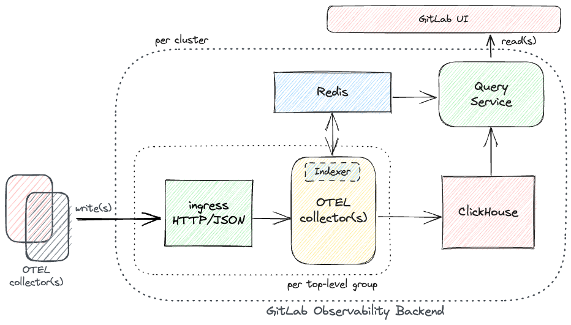
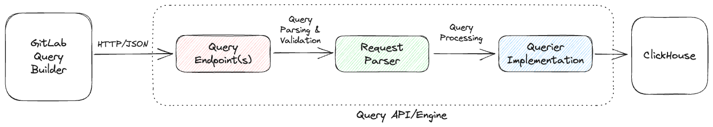
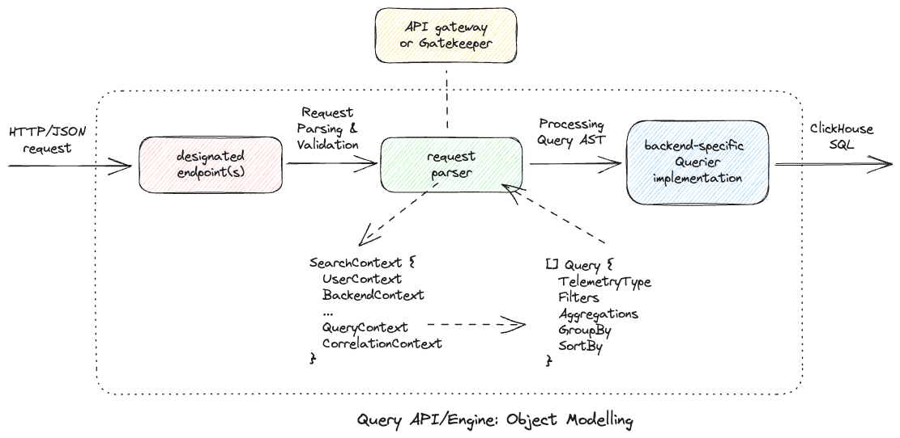

<!-- vale gitlab.FutureTense = NO -->

# GitLab Observability - Metrics

## Summary

Developing a multi-user system to store & query observability data typically formatted in widely accepted, industry-standard formats such as OpenTelemetry using Clickhouse as the underlying storage with support for long-term data retention and aggregation.

## Motivation

From the six pillars of Observability, commonly abbreviated as `TEMPLE` - Traces, Events, Metrics, Profiles, Logs & Errors, Metrics constitute one of the most important of those for modern day systems helping their users gather insights about the operational posture of monitored systems.

Metrics which are commonly structured as timeseries data have the following characteristics:

- indexed by their corresponding timestamps;
- continuously expanding in size;
- usually aggregated, down-sampled, and queried in ranges; and
- have very write-intensive requirements.

Within GitLab Observability Backend, we aim to add the support for our customers to ingest and query observability data around their systems & applications, helping them improve the operational health of their systems.

### Goals

With the development of the proposed system, we have the following goals:

- Scalable, low latency & cost-effective monitoring system backed by Clickhouse whose performance has been proven via repeatable benchmarks.

- Support for long-term storage for metrics, ingested via an OpenTelemetry-compliant agent and queried via GitLab-native UI with probable support for metadata and exemplars.

The aforementioned goals can further be broken down into the following four sub-goals:

#### Ingesting data

- For the system to be capable of ingesting large volumes of writes and reads, we aim to ensure that it must be horizontally scalable & provide durability guarantees to ensure no writes are dropped once ingested.

#### Persisting data

- We aim to support ingesting telemetry/data instrumented using OpenTelemetry specifications. For a first iteration, any persistence we design for our dataset will be multi-tenant by default, ensuring we can store observability data for multiple groups/projects within the same storage backend.

#### Reading data

- We aim to support querying data via a GitLab-native UX which would mean using a custom DSL/Query Builder sending API requests to our backend which would then translate them into Clickhouse SQL. From our internal discussions around this, [Product Analytics Visualisation Designer](https://gitlab.com/gitlab-org/gitlab-services/design.gitlab.com/-/analytics/dashboards/visualization-designer) is a good source of inspiration for this.

#### Deleting data

- We aim to support being able to delete any ingested data should such a need arise. This is also in addition to us naturally deleting data when a configured TTL expires and/or respective retention policies are enforced. We must, within our schemas, build a way to delete data by labels OR their content, also add to our offering the necessary tooling to do so.

### Non-Goals

With the goals established above, we also want to establish what specific things are non-goals with the current proposal. They are:

- With our first iteration here, we do not aim to support querying ingested telemetry via [PromQL](https://prometheus.io/docs/prometheus/latest/querying/basics/) deferring that to as & when such a business need arises. However, users will be able to ingest their metrics using the OpenTelemetry Line Protocol (OTLP), e.g. via the [Prometheus Receiver](https://github.com/open-telemetry/opentelemetry-collector-contrib/blob/main/receiver/prometheusreceiver/README.md) in case of Prometheus metrics.

## Proposal

We intend to use GitLab Observability Backend (GOB) as a framework for the Metrics implementation so that its lifecycle can be managed via already established components of our backend.



As depicted in the diagram above, an OTEL-collector pipeline, indexer & query service are components that need to be developed as proposed here while the remaining peripheral components either already exist or can be provisioned via existing code in our centralised `scheduler` within GOB.

**On the write path**:

- We expect to receive incoming data via `HTTP/JSON` similar to what we do for our existing services, e.g. errortracking, tracing.

- We aim to heavily deduplicate incoming timeseries by indexing/caching per-series metadata to reduce our storage footprint.

- We aim to ensure avoiding writing a lot of small writes into Clickhouse by batching data before writing it into Clickhouse.

**On the read path**:



- We aim to allow our users to use GitLab itself to read ingested data, which will necessitate building a dedicated `Query Service` on our backend to be able to service API requests originating from GitLab.

- We aim implement necessary query validation, sanitation and rate-limiting for any resource consumption to ensure underlying systems remain in good operational health at all times.

### GitLab Observability Tenant

With the recent changes to our backend design especially around deprecating the use of a Grafana-based UX, we have found opportunities to streamline how we provision tenants within our system. This initiative had led to the development of a custom CR - `GitLabObservabilityTenant` intended to model a dedicated set of resources **per top-level GitLab namespace**. From a scalability perspective, this means we deploy a dedicated instance of `Ingress` & `Ingester` per top-level GitLab namespace to make sure we can scale each tenant subject to traffic volumes of its respective groups & projects. It also helps isolate resource consumption across tenants in an otherwise multi-tenant system such as ours.

### Indexing per-series metadata

As an internal part of the `ingester`, we aim to index per-series labels and/or metadata to be able to deduplicate incoming timeseries data and segregate them into metadata and points-data. This helps reduce our storage footprint by an order of magnitude keeping total cost of operation low. This indexed data can also be consumed by the `Query Service` to efficiently compute timeseries for all incoming read requests. This part of our architecture is also described in more detail in [Proposal: Indexing metrics labels for efficiently deduplicating & querying time series data](https://gitlab.com/gitlab-org/opstrace/opstrace/-/issues/2397).

### Query Service

The `Query Service` consists of two primary components - 1. a request parser & 2. a backend-specific querier implementation. On the request path, once its received on the designated endpoint(s), it is handled by a handler which is a part of the request parser. The parser's responsibility is to unmarshal incoming query payloads, validate the contents and produce a `SearchContext` object which describes how must this query/request be processed. Within a `SearchContext` object is a `QueryContext` attribute which further defines one or more `Query` objects - each a completely independent data query against one of our backends.



#### API structure

For the user-facing API, we intend to add support via HTTP/JSON endpoint(s) with user-queries marshalled as payloads within a request body. For example, to compute the sum of a minutely delta of metric:`apiserver_request_total` over all values of label:`instance`, you'd send a POST request to `https://observe.gitlab.com/query/$GROUP/$PROJECT/metrics` with the following as body:

```json
{
  "queries": {
    "A": {
      "type": "metrics",
      "filters": [
        {
          "key": "__name__",
          "value": "apiserver_request_total",
          "operator": "eq"
        }
      ],
      "aggregation": {
        "function": "rate",
        "interval": "1m"
      },
      "groupBy": {
        "attribute": [
          "instance"
        ],
        "function": "sum"
      },
      "sortBy": {},
      "legend": {}
    }
  },
  "expression": "A"
}
```

#### Query representation as an AST

```plaintext
type SearchContext struct {
  UserContext    *UserContext    `json:"authContext"`
  BackendContext *BackendContext `json:"backendContext"`

  StartTimestamp      int64 `json:"start"`
  EndTimestamp        int64 `json:"end"`
  StepIntervalSeconds int64 `json:"step"`

  QueryContext       *QueryContext          `json:"queryContext"`
  CorrelationContext *CorrelationContext    `json:"correlationContext"`
  Variables          map[string]interface{} `json:"variables,omitempty"`
}
```

Generally speaking:

- `SearchContext` defines how a search must be executed.
  - It internally contains a `QueryContext` which points to one or more `Query`(s) each targeting a given backend.
  - Each `Query` must be parsed & processed independently, supplemented by other common attributes within a `QueryContext` or `SearchContext`.

- `Query` defines an AST-like object which describes how must a query be performed.
  - It is intentionally schema-agnostic allowing it to be serialised and passed around our system(s).
  - It is also an abstraction that hides details of how we model data internal to our databases from the querying entity.
  - Assuming an incoming query can be parsed & validated into a `Query` object, a `Querier` can execute a search/query against it.

- `UserContext` defines if a request has access to the data being searched for.
  - It is perhaps a good place to model & enforce request quotas, rate-limiting, etc.
  - Populating parts of this attribute depend on the parser reading other global state via the API gateway or Gatekeeper.

- `BackendContext` defines which backend must a request be processed against.
  - It helps route requests to an appropriate backend in a multitenant environment.
  - For this iteration though, we intend to work with only one backend as is the case with our architecture.

- `CorrelationContext` defines how multiple queries can be correlated to each other to build a cohesive view on the frontend.
  - For this iteration though, we intend to keep it empty and only work on adding correlation vectors later.

## Intended target-environments

Keeping inline with our current operational structure, we intend to deploy the metrics offering as a part of GitLab Observability Backend, deployed on the following two target environments:

- kind cluster (for local development)
- GKE cluster (for staging/production environments)

## Production Readiness

### Batching

Considering we'll need to batch data before ingesting large volumes of small writes into Clickhouse, the design must account for app-local persistence to allow it to locally batch incoming data before landing it into Clickhouse in batches of a predetermined size in order to increase performance and allow the table engine to continue to persist data successfully.

We have considered the following alternatives to implement app-local batching:

- In-memory - non durable
- BadgerDB - durable, embedded, performant
- Redis - trivial, external dependency
- Kafka - non-trivial, external dependency but it can augment multiple other use-cases and help other problem domains at GitLab.

**Note**: Similar challenges have also surfaced with the CH interactions `errortracking` - the subsystem has in its current implementation. There have been multiple attempts to solve this problem domain in the past - [this MR](https://gitlab.com/gitlab-org/opstrace/opstrace/-/merge_requests/1660) implemented an in-memory alternative while [this one](https://gitlab.com/gitlab-org/opstrace/opstrace/-/merge_requests/1767) attempted an on-disk alternative.

Any work done in this area of concern would also benefit other subsystems such as errortracking, logging, etc.

### Scalability

We intend to start testing the proposed implementation with 10K metric-points per second to test/establish our initial hypothesis, though ideally, we must design the underlying backend for 1M points ingested per second.

### Benchmarking

We propose the following three dimensions be tested while benchmarking the proposed implementation:

- Data ingest performance (functional)
- Mean query response times (functional)
- Storage requirements (operational)

For understanding performance, we'll need to first compile a list of such queries given the data we ingest for our tests. Clickhouse query logging is super helpful while doing this.

NOTE:
Ideally, we aim to benchmark the system to be able to ingest >1M metric points/sec while consistently serving most queries under <1 sec.

### Past work & references

- [Benchmark ClickHouse for metrics](https://gitlab.com/gitlab-org/opstrace/opstrace/-/issues/1666)
- [Incubation:APM ClickHouse evaluation](https://gitlab.com/gitlab-org/incubation-engineering/apm/apm/-/issues/4)
- [Incubation:APM ClickHouse metrics schema](https://gitlab.com/gitlab-org/incubation-engineering/apm/apm/-/issues/10)
- [Our research around TimescaleDB](https://gitlab.com/gitlab-com/gl-infra/reliability/-/issues/14137)
- [Current Workload on our Thanos-based setup](https://gitlab.com/gitlab-com/gl-infra/reliability/-/issues/15420#current-workload)
- [Scaling-200m-series](https://opstrace.com/blog/scaling-200m-series)

### Cost-estimation

- We aim to make sure the system is cost-effective to our users for ingesting & querying telemetry data. One of the more significant factors affecting underlying costs are how we model & store ingested data which the intended proposal must optimize for by measures such as reducing data redundancy, pruning unused metrics, etc.

- We must consider the usage of multiple storage medium(s), especially:
  - Tiered storage
  - Object storage

### Tooling

As an overarching outcome here, we aim to build the necessary tooling and/or telemetry around ingested data to enable all user personas to have visibility into high cardinality metrics to help prune or drop unused metrics. It'd be prudent to have usage statistics e.g. per-metric scrape frequencies, to make sure our end-users are not ingesting data at a volume they do not need and/or find useful.

## Future iterations

### Linkage across telemetry pillars, exemplars

We must build the metrics system in a way to be able cross-reference ingested data with other telemetry pillars, such as traces, logs and errors, so as to provide a more holistic view of all instrumentation a system sends our way.

### Support for user-defined SQL queries to aggregate data and/or generate materialized views

We should allow users of the system to be able to run user-defined, ad-hoc queries similar to how Prometheus recording rules help generate custom metrics from existing ones.

### Support for scalable data ingestion

We believe that should we feel the need to start buffering data local to the ingestion application and/or move away from Clickhouse for persisting data, on-disk WALs would be a good direction to proceed into given their prevelant usage among other monitoring systems.

### Query Service features

- Adding support for compound queries and/or expressions.
- Consolidation of querying capabilities for tracing, logs & errortracking via the query engine.
- Using the query engine to build integrations such as alerting.
- Adding support for other monitoring/querying standards such as PromQL, MetricQL, OpenSearch, etc
- Adding automated insights around metric cardinality & resource consumption.

## Planned roadmap

The following section enlists how we intend to implement the aforementioned proposal around building Metrics support into GitLab Observability Service. Each corresponding document and/or issue contains further details of how each next step is planned to be executed.

### 16.5

- Research & draft design proposal and/or requirements.
- Produce architectural blueprint, open for feedback.

### 16.6

- Develop support for OpenTelemetry-based ingestion.
- Develop support for querying data; begin with an API to list all ingested metrics scoped to a given tenant.
- Develop support for displaying a list of ingested metrics within GitLab UI.
- Release Experimental version.

### 16.7

- Develop support for querying data, add metrics search endpoints for supported metric-types.
- Develop our first iteration of the query builder, enable querying backend APIs.
- Develop a metrics details page with the ability to graph data returned via backend APIs.
- Setup testing, ensure repeatable benchmarking/testing can be performed.
- Release Beta version, open for early usage by internal and external customers.

### 16.9 (Gap to allow for user feedback for GA release)

- Develop end-to-end testing, complete necessary production readiness, address feedback from users.
- Release GA version.
