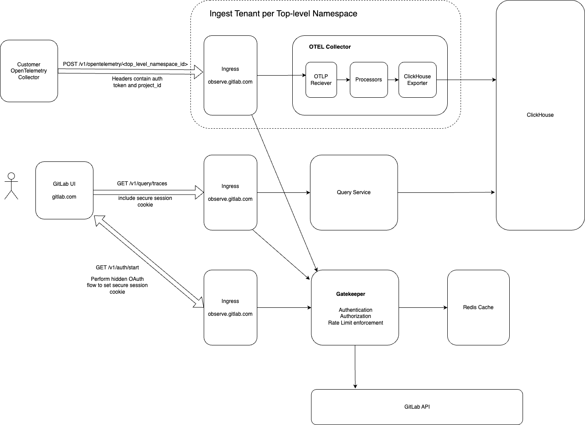

# Distributed Tracing Feature

## Summary

GitLab already has distributed tracing as a feature. So this proposal focuses on the intended changes required to GA the feature. Given the strategic direction update which is covered more in the motivation section, we are deprecating the GitLab Observability UI (GOUI) in favor of building native UI for tracing in GitLab UI.

This proposal covers the scope and technical approach to what will be released in GA, including the new UI, API changes and any backend changes to support the new direction.

Distributed Tracing will GA as a premium feature, initially only available to premium and ultimate users.

## Motivation

In December 2021 GitLab acquired OpsTrace and kicked off work integrating Observability functionality into the DevOps platform. At that point the stated goal was to create an observability distribution that could be run independently of GitLab and which integrated well into the DevSecOps platform. See [Internal Only- Argus FAQ](https://docs.google.com/document/d/1eWZhbRdgQx74udzZjpSMgWnHfpYWETD7AWqnPVD5Sm8/edit) for more background on previous strategy.

Since December 2021 there have been a lot of changes in the world and at GitLab. It is GitLabs belief that Observability should be natively built within GitLab UI to avoid fracturing capabilities and ensuring a singular UX. As such we are deprecating GitLab Observability UI which began life as a fork of Grafana in December 2021.

Much of the GitLab Observability architecture and features were built around the fork of Grafana. As such, this proposal is part of a series of proposals that align us toward achieving the following high level objectives.

## Observability Group Objectives

The following group-level objectives are included for context. **The Objectives below are not completely covered by this design. This design focuses on distributed tracing. More design documents will be created for logging, metrics, auto-monitor, etc.**

**Timeline**: Completion of the following before December 2024

**Objectives**:

- GA of a Complete (Metrics, Logs, Traces) Observability Platform - Add on-by-default setup for tracing, metrics and logging including a GA for the service available on GitLab.com and for self-managed users. A user is able to trace micro-services or distributed systems using open-source tracers. Furthermore, users should be able to set sane defaults for sampling or use advanced techniques such as tail-based sampling.

- Tailored Triage Workflow - Users need to connect the dots between Metrics, Logs, and Spans/Traces. Designing for the discovery, querying and the connection of all telemetry data, regardless of type, will aid users to resolve critical alerts and incidents more quickly.

- Auto Monitor - When a developer starts a new project their application is automatically instrumented, alerts are set up and linked to GitLab alerts management, schedules are created and incidents are created for critical alerts.

### Goals

To release a generally available distributed tracing feature as part of GitLab.com SaaS with a minimum featureset such that it is valuable but can be iterated upon.

Specific goals:

- An HTTPS write API implemented in the [GitLab Observability Backend](https://gitlab.com/gitlab-org/opstrace/opstrace) project which receives spans sent to GitLab using [OTLP (OpenTelemetry Protocol)](https://opentelemetry.io/docs/specs/otel/protocol/). Users can collect and send distributed traces using either the [OpenTelemetry SDK](https://opentelemetry.io/docs/collector/deployment/no-collector/) or the [OpenTelemetry Collector](https://opentelemetry.io/docs/collector/).
- UI to list and filter/search for traces by ID, service, attributes or time
- UI to show a detail view of a trace and its corresponding spans
- Apply sensible ingestion and storage limits per top-level namespace for all GitLab tiers

## Timeline

In order to achieve the group objectives, the following timelines must be met for [GitLab phased rollout](https://handbook.gitlab.com/handbook/product/gitlab-the-product/#experiment-beta-ga) of Tracing.

- **Tracing Experiment Release**: 16.2
- **Tracing Beta Release**: 16.3
- **Tracing GA Release**: 16.4

## Proposal

Much of the proposed architecture already exists and is in operation for GitLab.com. Distributed tracing has already been in an internal **Beta** for quite some time and has internal users, with graduation to GA being blocked by UX requirements. These UX requirements resulted in the new UI strategy.

 The following diagram outlines the architecture for GitLab Observability Backend and how clients, including the GitLab UI, will interact with it.

### Key Components

- Gatekeeper: Responsible for authentication, authorization and rate limit enforcement on all incoming requests. NGINX-Ingress interacts directly with Gatekeeper.
- Ingress: NGINX-Ingress is used to handle all incoming requests
- ClickHouse: ClickHouse is the backing store for all observability data
- Query Service: A horizontally scalable service that retrieves data from ClickHouse in response to a query
- GitLab UI: The UI hosted at GitLab.com
- Redis: An HA Redis cluster for caching GitLab API responses

### Data Ingest

One data ingestion pipeline will be deployed for each top level GitLab namespace. Currently we deploy one pipeline _per GitLab Group that enables observability_ and this architecture is now unnecessarily expensive and complex without the presence of the multi-tenant Grafana instances. This multi-tenant ingestion system has the following benefits:

- Beyond rate limits, resource limits can be enforced per user such that no user can steal more system resources (memory, cpu) than allocated.
- Fine grained control of horizontal scaling for each user pipeline by adding more OTEL Collector instances
- Manage the users tenant in accordance to GitLab subscription tier, for example, quota, throughput, cold storage, shard to different databases
- Reduced complexity and enhanced security in the pipeline by leveraging off the shelf components like the [OpenTelemetry Collector](https://opentelemetry.io/docs/concepts/components/#collector) where data within that collector belongs to no more than a single user/customer.

A pipeline is only deployed for the user upon enabling observability in the project settings, in the same way a user can enable error tracking for their project. When observability is enabled for any project in the users namespace, a pipeline will be deployed. This deployment is automated by our Kubernetes scheduler-operator and tenant-operator. Provisioning is currently managed through the iframe, but a preferred method would be to provision using a RESTful API. The GitLab UI would have a section in project settings that allow a user to "enable observability", much like they do for error tracking today.

The opentelemetry collector is used as the core pipeline implementation for its excellent community development of receivers, processors and exporters. [An exporter for ClickHouse has emerged in the community](https://github.com/open-telemetry/opentelemetry-collector-contrib/tree/main/exporter/clickhouseexporter) which we intend to leverage and it currently has support for opentelemetry traces, metrics and logs. This will help accelerate the effort toward ingesting not just traces but also metrics and logs.

### Limits

In addition to the existing cpu and memory limits for each ingest pipeline, the following limits and quotas will also be enforced:

- 100KB (possibly increase this to 1MB) total ingest rate of traces per second per top level namespace
- 30 day data retention
- TBD GB total storage

All above limits are subject to change and will be driven by top level namespace configuration so scripts and future features can be built to make these more dynamic for each user or subscription tier. This configuration will be part of the tenant-operator custom resource.

The ingest rate limit will utilize the internal Redis cluster to perform a simple, performant [sliding window rate limit like Cloudflare](https://blog.cloudflare.com/counting-things-a-lot-of-different-things/). The code for this will live in Gatekeeper, where a connection to Redis is already managed.

The data retention and total storage limits will be enforced by a control loop in the tenant-operator that will periodically query ClickHouse and continuously delete the oldest whole day of data until quota is no longer exceeded. To do this efficiently, its important that ClickHouse tables are partitioned using `toDate(timestamp)` to partition by day.

### Query API

The query API, backed by the query service, will be a centralized, horizontally scalable component responsible for returning traces/spans back to the UI. A good starting point for this query service may be to leverage the Jaeger query service code and the [Jaeger query service swagger](https://github.com/Jaegertracing/Jaeger-idl/blob/main/swagger/api_v3/query_service.swagger.json). This query service will be extended to include support for metrics and logs in the future and will be queried directly by vue.js code in GitLab UI.

The scope of effort for GA would include two APIs:

- `/v1/traces` adhering to [this spec](https://github.com/Jaegertracing/Jaeger-idl/blob/main/swagger/api_v3/query_service.swagger.json#L64)
- `/v1/traces/{trace_ID}` adhering to [this spec](https://github.com/Jaegertracing/Jaeger-idl/blob/main/swagger/api_v3/query_service.swagger.json#L142)

### Authentication and Authorization

<!-- markdownlint-disable-next-line MD044 -->
GitLab Observability Backend utilizes an [instance-wide trusted GitLab OAuth](../../../integration/oauth_provider.md#create-an-instance-wide-application) token to perform a seamless OAuth flow that authenticates the GitLab user against the GitLab Observability Backend (GOB). GOB creates an auth session and stores the session identifier in an http-only, secure cookie. This mechanism has already been examined and approved by AppSec. Now that the Observability UI will be native within the UI hosted at GitLab.com, a few small adjustments must be made for authentication to work against the new UI domain vs the embedded iframe that we previously relied upon (GitLab.com instead of observe.gitLab.com).

A hidden iframe will be embedded in the GitLab UI only on pages where GOB authenticated APIs must be consumed. This allows GitLab.com UI to directly communicate with GOB APIs without the need for an intermediate proxy layer in rails and without relying on the less secure shared token between proxy and GOB. This iframe will be hidden and its sole purpose is to perform the OAuth flow and assign the http-only secure cookie containing the GOB user session. This flow is seamless and can be fully hidden from the user since its a **trusted** GitLab OAuth flow. Sessions currently expire after 30 days which is configurable in GOB deployment terraform.

<!-- markdownlint-disable-next-line MD044 -->
In order to allow requests from GitLab.com directly to observe.gitLab.com using this method, all requests will have to include `{withCredentials: true}` in order to include cookies. For these "readonly" APIs that GitLab.com will query for tracing data, we must:

- Configure Ingress with `"NGINX.Ingress.Kubernetes.io/cors-allow-credentials": "true"` and `"NGINX.Ingress.Kubernetes.io/cors-allow-origin":  "GitLab.com"`
- Ensure we have effective CSRF protection enabled in our Gatekeeper component (Gatekeeper is responsible request authorization)

<!-- markdownlint-disable-next-line MD044 -->
All requests from GitLab.com will then include the GOB session cookie for observe.gitLab.com to validate. Authorization is handled by the Gatekeeper component which checks group/project membership against GitLab and handles access appropriately. Anyone with inherited developer or above membership will have access to the tracing UI for that project.

### Database Schema

[The community developed OTEL exporter for ClickHouse](https://github.com/open-telemetry/opentelemetry-collector-contrib/tree/main/exporter/clickhouseexporter) has already implemented database schemas for storing traces and spans. [This blog post from ClickHouse](https://clickhouse.com/blog/storing-traces-and-spans-open-telemetry-in-clickhouse) further delves into the details of the community developed exporter and we intend to use the suggested schema design as a starting point for us to test during experiment and beta phases. It's recommended to read the blog post to learn more about the schemas and corresponding SQL queries we intend to try.

### UI Design

The new UI will be built using the Pajamas Design System in accordance with GitLab UX design standards. The UI will interact with the GOB query service directly from vue.js (see architecture diagram above) by sending a fetch to the subdomain `observe.gitLab.com/v1/query` with `{withCredentials: true}`. See the Authentication and Authorization section above for more details on how this is enabled.

**TODO Figma UI designs and commentary**

## Iterations

16.2

- migrate all resources attached to the Group CR to the Tenant CR
- [fork and build Clickhouse exporter](https://github.com/open-telemetry/opentelemetry-collector-contrib/tree/main/exporter/clickhouseexporter)
- add project_ID to all traces/spans
- gatekeeper: check membership at project level instead of group level
- basic query service for listing traces (no filtering/searching)
- implement hidden iframe-based OAuth mechanism (reuse/adapt what already done for GOUI)
- UI for traces list

16.3

- filtering/searching query service (by traceID, service, status, duration min/max, start/end time, span attributes)
- add `read_observability` and `write_observability` scopes to Project access token and support Project access token for writing to project level ingest API
- provision API
- remove existing iframe provisioning
- UI for trace detail
- UI for filtering/searching traces
- basic e2e test for provision, send data, query in UI
- metrics, dashboards, alerts

16.4

- UI settings page to "enable observability" (this would interact with provisioning API)
- production readiness review
- documentation complete
- alter GitLabNamespace CR to only represent a tenant (i.e. top level namespace)
- delete Group CR and corresponding controller
- e2e tests that haven't been added yet
- in cluster smoke test
