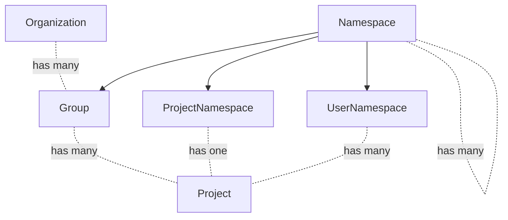

<!-- vale gitlab.FutureTense = NO -->

# Organization

This document is a work in progress and represents the current state of the Organization design.

## Glossary

- Organization: An organization is the umbrella for one or multiple top-level groups. Organizations are isolated from each other by default meaning that cross-namespace features will only work for namespaces that exist in a single organization.
- Top-level group: Top-level group is the name given to the topmost group of all other groups. Groups and projects are nested underneath the top-level group.
- Cell: A Cell is a set of infrastructure components that contains multiple organizations. The infrastructure components provided in a Cell are shared among organizations, but not shared with other Cells. This isolation of infrastructure components means that Cells are independent from each other.

## Summary

Organizations solve the following problems:

1. Enables grouping of top-level groups. For example, the following top-level groups would belong to the organization `GitLab`:
    1. `https://gitlab.com/gitlab-org/`
    1. `https://gitlab.com/gitlab-com/`
1. Allows different organizations to be isolated. Top-level groups of the same organization can interact with each other but not with groups in other organizations, providing clear boundaries for an organization, similar to a self-managed instance. Isolation should have a positive impact on performance and availability as things like user dashboards can be scoped to organizations.
1. Allows integration with Cells. Isolating organizations makes it possible to allocate and distribute them across different Cells.
1. Removes the need to define hierarchies. An organization is a container that could be filled with whatever hierarchy/entity set makes sense (organization, top-level groups, etc.)
1. Enables centralized control of user profiles. With an organization-specific user profile, administrators can control the user's role in a company, enforce user emails, or show a graphical indicator that a user as part of the organization. An example could be adding a "GitLab employee" stamp on comments.
1. Organizations bring an on-premise-like experience to SaaS (GitLab.com). The organization admin will have access to instance-equivalent Admin Area settings with most of the configuration controlled on organization level.

## Motivation

### Goals

The Organization focuses on creating a better experience for organizations to manage their GitLab experience. By introducing Organizations and [Cells](../cells/index.md) we can improve the reliability, performance and availability of our SaaS Platforms.

- Wider audience: Many instance-level features are admin only. We do not want to lock out users of GitLab.com in that way. We want to make administrative capabilities that previously only existed for self-managed users available to our SaaS users as well. This also means we would give users of GitLab.com more independence from GitLab.com admins in the long run. Today, there are actions that self-managed admins can perform that GitLab.com users have to request from GitLab.com admins.
- Improved UX: Inconsistencies between the features available at the project and group levels create navigation and usability issues. Moreover, there isn't a dedicated place for organization-level features.
- Aggregation: Data from all groups and projects in an organization can be aggregated.
- An organization includes settings, data, and features from all groups and projects under the same owner (including personal namespaces).
- Cascading behavior: Organization cascades behavior to all the projects and groups that are owned by the same organization. It can be decided at the organization level whether a setting can be overridden or not on the levels beneath.

### Non-Goals

Due to urgency of delivering Organizations as a prerequisite for Cells, it is currently not a goal to build Organization functionality on the namespace framework.

## Proposal

We create Organizations as a new lightweight entity, with just the features and workflows which it requires. We already have much of the functionality present in groups and projects, and groups themselves are essentially already the top-level entity. It is unlikely that we need to add significant features to Organizations outside of some key settings, as top-level groups can continue to serve this purpose at least on SaaS.

Self-managed instances would set a default organization.

### Benefits

- No changes to URL's for groups moving under an organization, which makes moving around top-level groups very easy.
- Low risk rollout strategy, as there is no conversion process for existing top-level groups.
- Organization becomes the key for identifying what is part of an Organization, which is likely on its own table for performance and clarity.

### Drawbacks

- It is unclear right now how we would avoid continuing to spend effort to build instance (or not Organization) features, in particular much of the reporting. This is not an issue on SaaS as top-level groups already have this capability, however it is a challenge on self-managed. If we introduce a built-in Organization (or just none at all) for self-managed, it seems like we would need to continue to build instance/organization level reporting features as we would not get that for free along with the work to add to groups.
- Billing may need to be moved from top-level groups to Organization level.

## Design and Implementation Details

## Iteration Plan

### Iteration 0: Organization MVC

In the first iteration, we introduce the concept of an Organization as a way to group top-level groups together. Support for Organizations does not require any [Cells](../cells/index.md) work, but having them will make all subsequent iterations of Cells simpler.

### Iteration 1

## Alternative Solutions

An alternative approach to building Organizations is to convert top-level groups into Organizations. The main advantage of this approach is that features could be built on top of the namespace framework and therewith leverage functionality that is already available at the group level. We would avoid building the same feature multiple times. However, Organizations have been identified as a critical driver of Cells. Due to the urgency of delivering Cells, we decided to opt for the quickest and most straightforward solution to deliver an Organization, which is the lightweight design described above. More details on comparing the two Organization proposals can be found [here](https://gitlab.com/gitlab-org/tenant-scale-group/group-tasks/-/issues/56).
