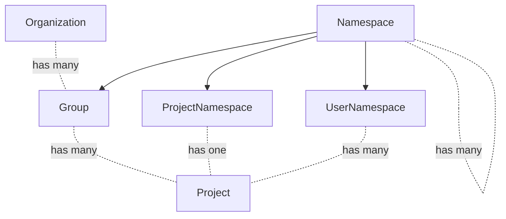

<!-- vale gitlab.FutureTense = NO -->

# Organization

This document is a work in progress and represents the current state of the Organization design.

## Glossary

- Organization: An Organization is the umbrella for one or multiple top-level Groups. Organizations are isolated from each other by default meaning that cross-Namespace features will only work for Namespaces that exist in a single Organization.
- Top-level Group: Top-level Group is the name given to the topmost Group of all other Groups. Groups and Projects are nested underneath the top-level Group.
- Cell: A Cell is a set of infrastructure components that contains multiple Organizations. The infrastructure components provided in a Cell are shared among Organizations, but not shared with other Cells. This isolation of infrastructure components means that Cells are independent from each other.
- User: An Organization has many Users. Joining an Organization makes someone a User of that Organization.
- Member: Adding a User to a Group or Project within an Organization makes them a Member. Members are always Users, but Users are not necessarily Members of a Group or Project within an Organization. For instance, a User could just have accepted the invitation to join an Organization, but not be a Member of any Group or Project it contains.
- Non-User: A Non-User of an Organization means a User is not part of that specific Organization.

## Summary

Organizations solve the following problems:

1. Enables grouping of top-level Groups. For example, the following top-level Groups would belong to the Organization `GitLab`:
    1. `https://gitlab.com/gitlab-org/`
    1. `https://gitlab.com/gitlab-com/`
1. Allows different Organizations to be isolated. Top-level Groups of the same Organization can interact with each other but not with Groups in other Organizations, providing clear boundaries for an Organization, similar to a self-managed instance. Isolation should have a positive impact on performance and availability as things like User dashboards can be scoped to Organizations.
1. Allows integration with Cells. Isolating Organizations makes it possible to allocate and distribute them across different Cells.
1. Removes the need to define hierarchies. An Organization is a container that could be filled with whatever hierarchy/entity set makes sense (Organization, top-level Groups, etc.)
1. Enables centralized control of user profiles. With an Organization-specific user profile, administrators can control the user's role in a company, enforce user emails, or show a graphical indicator that a user as part of the Organization. An example could be adding a "GitLab employee" stamp on comments.
1. Organizations bring an on-premise-like experience to SaaS (GitLab.com). The Organization admin will have access to instance-equivalent Admin Area settings with most of the configuration controlled at the Organization level.

## Motivation

### Goals

The Organization focuses on creating a better experience for Organizations to manage their GitLab experience. By introducing Organizations and [Cells](../cells/index.md) we can improve the reliability, performance and availability of our SaaS Platforms.

- Wider audience: Many instance-level features are admin only. We do not want to lock out users of GitLab.com in that way. We want to make administrative capabilities that previously only existed for self-managed users available to our SaaS users as well. This also means we would give users of GitLab.com more independence from GitLab.com admins in the long run. Today, there are actions that self-managed admins can perform that GitLab.com users have to request from GitLab.com admins.
- Improved UX: Inconsistencies between the features available at the Project and Group levels create navigation and usability issues. Moreover, there isn't a dedicated place for Organization-level features.
- Aggregation: Data from all Groups and Projects in an Organization can be aggregated.
- An Organization includes settings, data, and features from all Groups and Projects under the same owner (including personal Namespaces).
- Cascading behavior: Organization cascades behavior to all the Projects and Groups that are owned by the same Organization. It can be decided at the Organization level whether a setting can be overridden or not on the levels beneath.
- Minimal burden on customers: The addition of Organizations should not change existing Group and Project paths to minimize the impact of URL changes.

### Non-Goals

Due to urgency of delivering Organizations as a prerequisite for Cells, it is currently not a goal to build Organization functionality on the Namespace framework.

## Proposal

We create Organizations as a new lightweight entity, with just the features and workflows which it requires. We already have much of the functionality present in Groups and Projects, and Groups themselves are essentially already the top-level entity. It is unlikely that we need to add significant features to Organizations outside of some key settings, as top-level Groups can continue to serve this purpose at least on SaaS. From an infrastructure perspective, cluster-wide shared data must be both minimal (small in volume) and infrequently written.



All instances would set a default Organization.

### Benefits

- No changes to URL's for Groups moving under an Organization, which makes moving around top-level Groups very easy.
- Low risk rollout strategy, as there is no conversion process for existing top-level Groups.
- Organization becomes the key for identifying what is part of an Organization, which is on its own table for performance and clarity.

### Drawbacks

- It is unclear right now how we would avoid continuing to spend effort to build instance (or not Organization) features, in particular much of the reporting. This is not an issue on SaaS as top-level Groups already have this capability, however it is a challenge on self-managed. If we introduce a built-in Organization (or just none at all) for self-managed, it seems like we would need to continue to build instance/Organization level reporting features as we would not get that for free along with the work to add to Groups.
- Billing may need to be moved from top-level Groups to Organization level.

## Data Exploration

From an initial [data exploration](https://gitlab.com/gitlab-data/analytics/-/issues/16166#note_1353332877), we retrieved the following information about Users and Organizations:

- For the users that are connected to an organization the vast majority of them (98%) are only associated with a single organization. This means we expect about 2% of Users to navigate across multiple Organizations.
- The majority of Users (78%) are only Members of a single top-level Group.
- 25% of current top-level Groups can be matched to an organization.
  - Most of these top-level Groups (83%) are associated with an organization that has more than one top-level Group.
  - Of the organizations with more than one top-level Group the (median) average number of top-level Groups is 3.
  - Most top-level Groups that are matched to organizations with more than one top-level Group are assumed to be intended to be combined into a single organization (82%).
  - Most top-level Groups that are matched to organizations with more than one top-level Group are using only a single pricing tier (59%).
- Most of the current top-level Groups are set to public visibility (85%).
- Less than 0.5% of top-level Groups share Groups with another top-level Group. However, this means we could potentially break 76,000 existing links between top-level Groups by introducing the Organization.

Based on this analysis we expect to see similar behavior when rolling out Organizations.

## Design and Implementation Details

### Organization MVC

The Organization MVC will contain the following functionality:

- Instance setting to allow the creation of multiple Organizations. This will be enabled by default on GitLab.com, and disabled for self-managed GitLab.
- Every instance will have a default Organization named `Default Organization`. Initially, all Users will be managed by this default Organization.
- Organization Owner. The creation of an Organization appoints that User as the Organization Owner. Once established, the Organization Owner can appoint other Organization Owners.
- Organization Users. A User is managed by one Organization, but can be part of multiple Organizations. Users are able to navigate between the different Organizations they are part of.
- Setup settings. Containing the Organization name, ID, description, and avatar. Settings are editable by the Organization Owner.
- Setup flow. Users are able to build new Organizations and transfer existing top-level Groups into them. They can also create new top-level Groups in an Organization.
- Visibility. Initially, Organizations can only be `public`. Public Organizations can be seen by everyone. They can contain public and private Groups and Projects.
- Organization settings page with the added ability to remove an Organization. Deletion of the default Organization is prevented.
- Groups. This includes the ability to create, edit, and delete Groups, as well as a Groups overview that can be accessed by the Organization Owner and Users.
- Projects. This includes the ability to create, edit, and delete Projects, as well as a Projects overview that can be accessed by the Organization Owner and Users.

### Organization Access

#### Organization Users

Organization Users can get access to Groups and Projects as:

- A Group Member: this grants access to the Group and all its Projects, regardless of their visibility.
- A Project Member: this grants access to the Project, and limited access to parent Groups, regardless of their visibility.
- A Non-Member: this grants access to public and internal Groups and Projects of that Organization. To access a private Group or Project in an Organization, a User must become a Member.

Organization Users can be managed in the following ways:

- As [Enterprise Users](../../../user/enterprise_user/index.md), managed by the Organization. This includes control over their User account and the ability to block the User.
- As Non-Enterprise Users, managed by the default Organization. Non-Enterprise Users can be removed from an Organization, but the User keeps ownership of their User account.

Enterprise Users are only available to Organizations with a Premium or Ultimate subscription. Organizations on the free tier will only be able to host Non-Enterprise Users.

##### How do Users join an Organization?

Users are visible across all Organizations. This allows Users to move between Organizations. Users can join an Organization by:

1. Becoming a Member of a Namespace (Group, Subgroup, or Project) contained within an Organization. A User can become a Member of a Namespace by:

   - Being invited by username
   - Being invited by email address
   - Requesting access. This requires visibility of the Organization and Namespace and must be accepted by the owner of the Namespace. Access cannot be requested to private Groups or Projects.

1. Becoming an Enterprise User of an Organization. Bringing Enterprise Users to the Organization level is planned post MVC. For the Organization MVC Enterprise Users will remain at the top-level Group.

The creator of an Organization automatically becomes the Organization Owner. It is not necessary to become a User of a specific Organization to comment on or create public issues, for example. All existing Users can create and comment on all public issues.

##### When can Users see an Organization?

For the MVC, an Organization can only be public. Public Organizations can be seen by everyone. They can contain public and private Groups and Projects.

In the future, Organizations will get an additional internal visibility setting for Groups and Projects. This will allow us to introduce internal Organizations that can only be seen by the Users it contains. This would mean that only Users that are part of the Organization will see:

- The Organization front page, instead of a 404 when navigating the Organization URL
- Name of the organization
- Description of the organization
- Organization pages, such as the Activity page, Groups, Projects and Users overview

Content of these pages will be determined by each User's access to specific Groups and Projects. For instance, private Projects would only be seen by the members of this Project in the Project overview.

As an end goal, we plan to offer the following scenarios:

| Organization visibility | Group/Project visibility | Who sees the Organization? | Who sees Groups/Projects? |
| ------ | ------ | ------ | ------ |
| public | public | Everyone | Everyone |
| public | internal | Everyone | Organization Users |
| public | private | Everyone | Group/Project members |
| internal | internal | Organization Users | Organization Users |
| internal | private | Organization Users | Group/Project members |

##### What can Users see in an Organization?

Users can see the things that they have access to in an Organization. For instance, an Organization User would be able to access only the private Groups and Projects that they are a Member of, but could see all public Groups and Projects. Actionable items such as issues, merge requests and the to-do list are seen in the context of the Organization. This means that a User might see 10 merge requests they created in `Organization A`, and 7 in `Organization B`, when in total they have created 17 merge requests across both Organizations.

##### What is a Billable Member?

How Billable Members are defined differs between GitLabs two main offerings:

- Self-managed (SM): [Billable Members are Users who consume seats against the SM License](../../../subscriptions/self_managed/index.md#subscription-seats). Custom roles elevated above the Guest role are consuming seats.
- GitLab.com (SaaS): [Billable Members are Users who are Members of a Namespace (Group or Project) that consume a seat against the SaaS subscription for the top-level Group](../../../subscriptions/gitlab_com/index.md#how-seat-usage-is-determined). Currently, [Users with Minimal Access](../../../user/permissions.md#users-with-minimal-access) and Users without a Group count towards a licensed seat, but [that's changing](https://gitlab.com/gitlab-org/gitlab/-/issues/330663#note_1133361094).

These differences and how they are calculated and displayed often cause confusion. For both SM and SaaS, we evaluate whether a User consumes a seat against the same core rule set:

1. They are active users
1. They are not bot users
1. For the Ultimate tier, they are not a Guest

For (1) this is determined differently per offering, in terms of both what classifies as active and also due to the underlying model that we refer to (User vs Member).
To help demonstrate the various associations used in GitLab relating to Billable Members, here is a relationship diagram:

```mermaid
graph TD
        A[Group] <-.type of.- B[Namespace]
        C[Project] -.belongs to.-> A

        E[GroupMember] <-.type of.- D[Member]
        G[User] -.has many.-> F
        F -.belongs to.-> C
        F[ProjectMember] <-.type of.- D
        G -.has many.-> E -.belongs to.-> A

        GGL[GroupGroupLink] -.belongs to.->A
        PGL[ProjectGroupLink] -.belongs to.->A
        PGL -.belongs to.->C
```

GroupGroupLink is the join table between two Group records, indicating that one Group has invited the other.
ProjectGroupLink is the join table between a Group and a Project, indicating the Group has been invited to the Project.

SaaS has some additional complexity when it comes to the relationships that determine whether or not a User is considered a Billable Member, particularly relating to Group/Project membership that can often lead to confusion. An example of that are Members of a Group that have been invited into another Group or Project and therewith become billable.
There are two charts as the flow is different for each: [SaaS](https://mermaid.live/view#pako:eNqNVl1v2jAU_StXeS5M-3hCU6N2aB3SqKbSPkyAhkkuxFsSs9hpVUX899mxYxsnlOWFcH1877nnfkATJSzFaBLtcvaSZKQS8DhdlWCeijGxXBCygCeOFdzSPCfbHOGrRK9Ho2tlvUkEfcZmo97HXBCBG6AcSGuOj86ZA8No_BP5eHQNMz7HYovV8kuGyR-gOx1I3Qd9Ap-31btrtgORITxIPnBXsfoAGcWKVEn2uj4T4Z6pAPdMdKyX8t2mIG-5ex0LkCnBdO4OOrOhO-O3TDQzrkkSkN9izW-BCCUTCB-8hGU866Bl45FxKJ-GdGiDDYI7SOtOp7o0GW90rA20NYjXQxE6cWSaGr1Q2BnX9hCnIbZWc1reJAly3pisMsJ19vKEFiQHfQw5PmMenwqhPQ5Uxa-DjeAa5IJk_g3t-hvdZ8jFA8vxrpYvccfWHIA6aVmrLtMQj2rvuqPynSZYcnx8PWDzlAuZsay3MfouPJxl1c9hKFCIPedzSBuH5fV2X5FDBrT8Zadk2bbszJur_xsp9UznzZRWmIizV-Njx346X9TbPpwoVqO9xobebUZmF3gse0yk9wA-jDBkflTst2TS-EyMTcrTZmGz7hPrkG8HdChdv1n5TAWmGuxHLmXI9qgTza9aO93-TVfnobAh1M6V0VDtuk7E0w313tMUy3Swc_Tyll9VLUwMPcFxUJGBNdKYTTTwY-ByesC_qusx1Yk0bXtao9kk8Snzj8eLsX0lwqV2ujnUE5Bw7FT4g7QbQGM-4YWoXPRZ2C7BnT4TXZPSiAHFUIP3nVhGbiN3G9-OyKWsTvpSS60yMYZA5U_HtyQzdy7p7GCBon65OyXNWJwT9DSNMwF7YB3Xly1o--gqKrAqCE3l359GHa4iuQ8KXEUT-ZrijtS5WEWr8iihpBZs8Vom0WRHco5XUX1IZd9NKZETUxjr8R82ROYl) and [SM](https://mermaid.live/view#pako:eNqFk1FvwiAQx7_KhefVD-CDZo2JNdmcWe3DYpeI7alsLRgKLob0u48qtqxRx9Plz4-7-3NgSCZyJEOyLcRPtqdSwXKScnBLVyhXswrUHiGxMYSsKOimwPHnXwiCYNQAsaIKzXOm2BFh3ShrOGvjujvQghAMPrAaBCOITKRLyu9Rc9FAc6Gu9VPegVELLEKzkOILMwWhUH6yRdhCcWJilEeWXSz5VJzcqrWycWvc830rOmdwnmZ8KoU-vEnXU6-bf6noPmResdzYWxdboHDeAiHBbfqOuqifonX6Ym-CV7g8HfAhfZ0U2-2xUu-iwKm2wdg4BRoJWAUXufZH5JnqH-8ye42YpFCsbGbvRN-Tx7UmunfxqFCfvZfTNeS9AfJESpQlZbn9K6Y5lxL7KUpMydCGOZXfKUl5bTmqlYhPPCNDJTU-EX3IrZEJoztJy4tY_wJJwxFj).

##### How can Users switch between different Organizations?

Users can utilize a [context switcher](https://gitlab.com/gitlab-org/gitlab/-/issues/411637). This feature allows easy navigation and access to different Organizations' content and settings. By clicking on the context switcher and selecting a specific Organization from the provided list, Users can seamlessly transition their view and permissions, enabling them to interact with the resources and functionalities of the chosen Organization.

##### What happens when a User is deleted?

We've identified three different scenarios where a User can be removed from an Organization:

1. Removal: The User is removed from the organization_users table. This is similar to the User leaving a company, but the User can join the Organization again after access approval.
1. Banning: The User is banned. This can happen in case of misconduct but the User cannot be added again to the Organization until they are unbanned. In this case, we keep the organization_users entry and change the permission to none.
1. Deleting: The User is deleted. We assign everything the User has authored to the Ghost User and delete the entry from the organization_users table.

As part of the Organization MVC, Organization Owners can remove Organization Users. This means that the User's membership entries are deleted from all Groups and Projects that are contained within the Organization. In addition, the User entry is removed from the `organization_users` table.

Actions such as banning and deleting a User will be added to the Organization at a later point.

#### Organization Non-Users

Non-Users are external to the Organization and can only access the public resources of an Organization, such as public Projects.

### Roles and Permissions

Organizations will have an Owner role. Compared to Users, they can perform the following actions:

| Action | Owner | User |
| ------ | ------ | ----- |
| View Organization settings | ✓ |  |
| Edit Organization settings | ✓ |  |
| Delete Organization | ✓ |  |
| Remove Users | ✓ |  |
| View Organization front page | ✓ | ✓ |
| View Groups overview | ✓ | ✓ (1) |
| View Projects overview | ✓ | ✓ (1) |
| View Users overview | ✓ | ✓ (2) |
| View Organization activity page | ✓ | ✓ (1) |
| Transfer top-level Group into Organization if Owner of both | ✓ |  |

(1) Users can only see what they have access to.
(2) Users can only see Users from Groups and Projects they have access to.

[Roles](../../../user/permissions.md) at the Group and Project level remain as they currently are.

#### Relationship between Organization Owner and Instance Admin

Users with the (Instance) Admin role can currently [administer a self-managed GitLab instance](../../../administration/index.md).
As functionality is moved to the Organization level, Organization Owners will be able to access more features that are currently only accessible to Admins.
On our SaaS platform, this helps us in empowering enterprises to manage their own Organization more efficiently without depending on the Instance Admin, which is currently a GitLab team member.
On SaaS, we expect the Instance Admin and the Organization Owner to be different users.
Self-managed instances are generally scoped to a single organization, so in this case it is possible that both roles are fulfilled by the same person.
There are situations that might require intervention by an Instance Admin, for instance when Users are abusing the system.
When that is the case, actions taken by the Instance Admin overrule actions of the Organization Owner.
For instance, the Instance Admin can ban or delete a User on behalf of the Organization Owner.

### Routing

Today only Users, Projects, Namespaces and container images are considered routable entities which require global uniqueness on `https://gitlab.com/<path>/-/`.
Initially, Organization routes will be [unscoped](../../../development/routing.md).
Organizations will follow the path `https://gitlab.com/-/organizations/org-name/` as one of the design goals is that the addition of Organizations should not change existing Group and Project paths.

## Impact of the Organization on Other Features

We want a minimal amount of infrequently written tables in the shared database.
If we have high write volume or large amounts of data in the shared database then this can become a single bottleneck for scaling and we lose the horizontal scalability objective of Cells.
With isolation being one of the main requirements to make Cells work, this means that existing features will mostly be scoped to an Organization rather than work across Organizations.
One exception to this are Users, which are stored in the cluster-wide shared database.
For a deeper exploration of the impact on select features, see the [list of features impacted by Cells](../cells/index.md#impacted-features).

### Alignment between Organization and Fulfillment

Fulfillment is supportive of an entity above top-level groups. Their perspective is outlined in issue [#1138](https://gitlab.com/gitlab-org/fulfillment-meta/-/issues/1138).

#### Goals of Fulfillment

- Fulfillment has a longstanding plan to move billing from the top-level Group to a level above. This would mean that a license applies to an Organization and all its top-level Groups.
- Fulfillment uses Zuora for billing and would like to have a 1-to-1 relationship between an Organization and their Zuora entity called BillingAccount. They want to move away from tying a license to a single top-level Group.
- If a customer needs multiple Organizations, they will need to have a separate BillingAccount per each.
- Ideally, a self-managed instance has a single Organization by default, which should be enough for most customers.
- Fulfillment prefers only one additional entity.

## Iteration Plan

The following iteration plan outlines how we intend to arrive at the Organization MVC. We are following the guidelines for [Experiment, Beta, and Generally Available features](../../../policy/experiment-beta-support.md).

### Iteration 1: Organization Prototype (FY24Q3)

In iteration 1, we introduce the concept of an Organization as a way to group top-level Groups together. Support for Organizations does not require any [Cells](../cells/index.md) work, but having them will make all subsequent iterations of Cells simpler. The goal of iteration 1 will be to generate a prototype that can be used by GitLab teams to test basic functionality within an Organization. The prototype contains the following functionality:

- A new Organization can be created.
- The Organization contains a name, ID, description and avatar.
- The creator of the Organization is assigned as the Organization Owner.
- Groups can be created in an Organization. Groups are listed in the Groups overview. Every Organization User can access the Groups overview and see the Groups they have access to.
- Projects can be created in a Group. Projects are listed in the Projects overview. Every Organization User can access the Projects overview and see the Projects they have access to.
- Both Enterprise and Non-Enterprise Users can be part of an Organization.
- Enterprise Users are still managed by top-level Groups.
- A User can be part of multiple Organizations.
- Users can navigate between the different Organizations they are part of.
- Any User within or outside of an Organization can be invited to Groups and Projects contained by the Organization.

### Iteration 2: Organization MVC Experiment (FY24Q4)

In iteration 2, an Organization MVC Experiment will be released. We will test the functionality with a select set of customers and improve the MVC based on these learnings. The MVC Experiment contains the following functionality:

- Users are listed in the User overview. Every Organization User can access the User overview and see Users that are part of the Groups and Projects they have access to.
- Organizations can be deleted.
- Organization Owners can access the Activity page for the Organization.
- Forking across Organizations will be defined.

### Iteration 3: Organization MVC Beta (FY24Q4)

In iteration 3, the Organization MVC Beta will be released. Users will be able to transfer existing top-level Groups into an Organization.

- Multiple Organization Owners can be assigned.
- Organization avatars can be changed in the Organization settings.
- Organization Owners can create, edit and delete Groups from the Groups overview.
- Organization Owners can create, edit and delete Projects from the Projects overview.
- Top-level Groups can be transferred into an Organization.
- The Organization URL path can be changed.

### Iteration 4: Organization MVC GA (FY25Q1)

In iteration 4, the Organization MVC will be rolled out.

### Post-MVC Iterations

After the initial rollout of Organizations, the following functionality will be added to address customer needs relating to their implementation of GitLab:

1. [Organizations can invite Users](https://gitlab.com/gitlab-org/gitlab/-/issues/420166).
1. Internal visibility will be made available on Organizations that are part of GitLab.com.
1. Restrict inviting Users outside of the Organization.
1. Enterprise Users will be made available at the Organization level.
1. Organizations are able to ban and delete Users.
1. Projects can be created from the Organization-level Projects overview.
1. Groups can be created from the Organization-level Groups overview.
1. Move billing from top-level Group to Organization.
1. Audit events at the Organization level.
1. Set merge request approval rules at the Organization level and cascade to all Groups and Projects.
1. Security policies at the Organization level.
1. Vulnerability Report and Dependency List at the Organization level.
1. Cascading Organization setting to enforce security scans.
1. Scan result policies at the Organization level.
1. Compliance frameworks.
1. [Support the agent for Kubernetes sharing at the Organization level](https://gitlab.com/gitlab-org/gitlab/-/issues/382731).

## Organization Rollout

We propose the following steps to successfully roll out Organizations:

- Phase 1: Rollout
  - Organizations will be rolled out using the concept of a `default Organization`. All existing top-level groups on GitLab.com are already part of this `default Organization`. The Organization UI is feature flagged and can be enabled for a specific set of users initially, and the global user pool at the end of this phase. This way, users will already become familiar with the concept of an Organization and the Organization UI. No features would be impacted by enabling the `default Organization`. See issue [#418225](https://gitlab.com/gitlab-org/gitlab/-/issues/418225) for more details.
- Phase 2: Migrations
  - GitLab, the organization, will be the first one to bud off into a separate Organization. We move all top-level groups that belong to GitLab into the new GitLab Organization, including the `gitLab-org` and `gitLab-com` top-level Groups. See issue [#418228](https://gitlab.com/gitlab-org/gitlab/-/issues/418228) for more details.
  - Existing customers can create their own Organization. Creation of an Organization remains optional.
- Phase 3: Onboarding changes
  - New customers will only have the option to start their journey by creating an Organization.
- Phase 4: Targeted efforts
  - Organizations are promoted, e.g. via a banner message, targeted conversations with large customers via the CSMs. Creating a separate Organization will remain a voluntary action.
  - We increase the value proposition of the Organization, for instance by moving billing to the Organization level to provide incentives for more customers to move to a separate Organization. Adoption will be monitored.

A force-option will only be considered if the we do not achieve the load distribution we are aiming for with Cells.

## Alternative Solutions

An alternative approach to building Organizations is to convert top-level Groups into Organizations. The main advantage of this approach is that features could be built on top of the Namespace framework and therewith leverage functionality that is already available at the Group level. We would avoid building the same feature multiple times. However, Organizations have been identified as a critical driver of Cells. Due to the urgency of delivering Cells, we decided to opt for the quickest and most straightforward solution to deliver an Organization, which is the lightweight design described above. More details on comparing the two Organization proposals can be found [here](https://gitlab.com/gitlab-org/tenant-scale-group/group-tasks/-/issues/56).

## Decision Log

- 2023-05-10: [Billing is not part of the Organization MVC](https://gitlab.com/gitlab-org/gitlab/-/issues/406614#note_1384055365)
- 2023-05-15: [Organization route setup](https://gitlab.com/gitlab-org/gitlab/-/issues/409913#note_1388679761)

## Links

- [Organization epic](https://gitlab.com/groups/gitlab-org/-/epics/9265)
- [Organization MVC design](https://gitlab.com/groups/gitlab-org/-/epics/10068)
- [Enterprise Users](../../../user/enterprise_user/index.md)
- [Cells blueprint](../cells/index.md)
- [Cells epic](https://gitlab.com/groups/gitlab-org/-/epics/7582)
- [Namespaces](../../../user/namespace/index.md)
