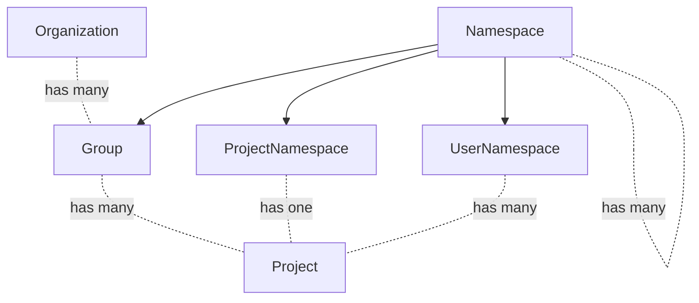

<!-- vale gitlab.FutureTense = NO -->

# Organization

This document is a work in progress and represents the current state of the Organization design.

## Glossary

- Organization: An Organization is the umbrella for one or multiple top-level groups. Organizations are isolated from each other by default meaning that cross-namespace features will only work for namespaces that exist in a single Organization.
- Top-level group: Top-level group is the name given to the topmost group of all other groups. Groups and projects are nested underneath the top-level group.
- Cell: A Cell is a set of infrastructure components that contains multiple Organizations. The infrastructure components provided in a Cell are shared among Organizations, but not shared with other Cells. This isolation of infrastructure components means that Cells are independent from each other.
- User: An Organization has many users. Joining an Organization makes someone a user of that Organization.
- Member: Adding a user to a group or project within an Organization makes them a member. Members are always users, but users are not necessarily members of a group or project within an Organization. For instance, a user could just have accepted the invitation to join an Organization, but not be a member of any group or project it contains.
- Non-user: A non-user of an Organization means a user is not part of that specific Organization.

## Summary

Organizations solve the following problems:

1. Enables grouping of top-level groups. For example, the following top-level groups would belong to the Organization `GitLab`:
    1. `https://gitlab.com/gitlab-org/`
    1. `https://gitlab.com/gitlab-com/`
1. Allows different Organizations to be isolated. Top-level groups of the same Organization can interact with each other but not with groups in other Organizations, providing clear boundaries for an Organization, similar to a self-managed instance. Isolation should have a positive impact on performance and availability as things like user dashboards can be scoped to Organizations.
1. Allows integration with Cells. Isolating Organizations makes it possible to allocate and distribute them across different Cells.
1. Removes the need to define hierarchies. An Organization is a container that could be filled with whatever hierarchy/entity set makes sense (Organization, top-level groups, etc.)
1. Enables centralized control of user profiles. With an Organization-specific user profile, administrators can control the user's role in a company, enforce user emails, or show a graphical indicator that a user as part of the Organization. An example could be adding a "GitLab employee" stamp on comments.
1. Organizations bring an on-premise-like experience to SaaS (GitLab.com). The Organization admin will have access to instance-equivalent Admin Area settings with most of the configuration controlled on Organization level.

## Motivation

### Goals

The Organization focuses on creating a better experience for Organizations to manage their GitLab experience. By introducing Organizations and [Cells](../cells/index.md) we can improve the reliability, performance and availability of our SaaS Platforms.

- Wider audience: Many instance-level features are admin only. We do not want to lock out users of GitLab.com in that way. We want to make administrative capabilities that previously only existed for self-managed users available to our SaaS users as well. This also means we would give users of GitLab.com more independence from GitLab.com admins in the long run. Today, there are actions that self-managed admins can perform that GitLab.com users have to request from GitLab.com admins.
- Improved UX: Inconsistencies between the features available at the project and group levels create navigation and usability issues. Moreover, there isn't a dedicated place for Organization-level features.
- Aggregation: Data from all groups and projects in an Organization can be aggregated.
- An Organization includes settings, data, and features from all groups and projects under the same owner (including personal namespaces).
- Cascading behavior: Organization cascades behavior to all the projects and groups that are owned by the same Organization. It can be decided at the Organization level whether a setting can be overridden or not on the levels beneath.

### Non-Goals

Due to urgency of delivering Organizations as a prerequisite for Cells, it is currently not a goal to build Organization functionality on the namespace framework.

## Proposal

We create Organizations as a new lightweight entity, with just the features and workflows which it requires. We already have much of the functionality present in groups and projects, and groups themselves are essentially already the top-level entity. It is unlikely that we need to add significant features to Organizations outside of some key settings, as top-level groups can continue to serve this purpose at least on SaaS.

Self-managed instances would set a default Organization.

### Benefits

- No changes to URL's for groups moving under an Organization, which makes moving around top-level groups very easy.
- Low risk rollout strategy, as there is no conversion process for existing top-level groups.
- Organization becomes the key for identifying what is part of an Organization, which is likely on its own table for performance and clarity.

### Drawbacks

- It is unclear right now how we would avoid continuing to spend effort to build instance (or not Organization) features, in particular much of the reporting. This is not an issue on SaaS as top-level groups already have this capability, however it is a challenge on self-managed. If we introduce a built-in Organization (or just none at all) for self-managed, it seems like we would need to continue to build instance/Organization level reporting features as we would not get that for free along with the work to add to groups.
- Billing may need to be moved from top-level groups to Organization level.

## Design and Implementation Details

### Organization MVC

The Organization MVC will contain the following functionality:

- Instance setting to allow the creation of multiple Organizations. This will be enabled by default on GitLab.com, and disabled for self-managed GitLab. 
- Every instance will have a default organization. Initially, all users will be managed by this default Organization.
- Organization Owner. The creation of an Organization appoints that user as the Organization Owner. Once established, the Organization Owner can appoint other Organization Owners.
- Organization users. A user is managed by one Organization, but can be part of multiple Organizations.
- Setup settings. Containing the Organization name, ID, description, README, and avatar. Settings are editable by the Organization Owner.
- Setup flow. Users are able to build an Organization on top of an existing top-level group. New users are able to create an Organization from scratch and to start building top-level groups from there.
- Visibility. Options will be `public` and `private`. A nonuser of a specific Organization will not see private Organizations in the explore section. Visibility is editable by the Organization Owner.
- Organization settings page with the added ability to remove an Organization. Deletion of the default Organization is prevented. 
- Groups. This includes the ability to create, edit, and delete groups, as well as a Groups overview that can be accessed by the Organization Owner.
- Projects. This includes the ability to create, edit, and delete projects, as well as a Projects overview that can be accessed by the Organization Owner.

### Organization Access

#### Organization Users

Organization Users can get access to groups and projects as:

- A group member: this grants access to the group and all its projects, regardless of their visibility.
- A project member: this grants access to the project, and limited access to parent groups, regardless of their visibility.
- A non-member: this grants access to public and internal groups and projects of that Organization. To access a private group or project in an Organization, a user must become a member.

Organization Users can be managed by the Organization as:

- Enterprise Users, managed by the Organization. This includes control over their user account and the ability to block the user.
- Non-Enterprise Users, managed by the User. Non-Enterprise Users can be removed from an Organization, but their user account remains in their control.

Enterprise Users are only available to Organizations with a Premium or Ultimate subscription. Organizations on the free tier will only be able to host Non-Enterprise Users.

#### Organization Non-Users

Non-users are external to the Organization and can only access the public resources of an Organization, such as public projects.

## Iteration Plan

The following iteration plan outlines how we intend to arrive at the Organization MVC. We are following the guidelines for [Experiment, Beta, and Generally Available features](../../../policy/alpha-beta-support.md).

### Iteration 1: Organization Prototype (FY24Q2)

In iteration 1, we introduce the concept of an Organization as a way to group top-level groups together. Support for Organizations does not require any [Cells](../cells/index.md) work, but having them will make all subsequent iterations of Cells simpler. The goal of iteration 1 will be to generate a prototype that can be used by GitLab teams to test moving functionality to the Organization. It contains everything that is necessary to move an Organization to a Cell:

- The Organization can be named, has an ID and an avatar.
- Only non-enterprise user can be part of an Organization.
- A user can be part of multiple Organizations.
- A single Organization Owner can be assigned.
- Groups can be created in an Organization. Groups are listed in the Groups overview.
- Projects can be created in a Group. Projects are listed in the Projects overview.

### Iteration 2: Organization MVC Experiment (FY24Q3)

In iteration 2, an Organization MVC Experiment will be released. We will test the functionality with a select set of customers and improve the MVC based on these learnings. Users will be able to build an Organization on top of their existing top-level group.

- The Organization has a description and a README.

### Iteration 3: Organization MVC Beta (FY24Q4)

In iteration 3, the Organization MVC Beta will be released. 

- Multiple Organization Owners can be assigned. 
- Enterprise users can be added to an Organization.

### Iteration 4: Organization MVC GA (FY25Q1)

### Post-MVC Iterations

After the initial rollout of Organizations, the following functionality will be added to address customer needs relating to their implementation of GitLab:

1. Internal visibility will be made available on Organizations that are part of GitLab.com.
1. Move billing from top-level group to Organization.
1. Audit events at the Organization level.
1. Set merge request approval rules at the Organization level and cascade to all groups and projects. 
1. Security policies at the Organization level.
1. Vulnerability reports at the Organization level.
1. Cascading Organization setting to enforce security scans.
1. Scan result policies at the Organization level.
1. Compliance frameworks.

## Alternative Solutions

An alternative approach to building Organizations is to convert top-level groups into Organizations. The main advantage of this approach is that features could be built on top of the namespace framework and therewith leverage functionality that is already available at the group level. We would avoid building the same feature multiple times. However, Organizations have been identified as a critical driver of Cells. Due to the urgency of delivering Cells, we decided to opt for the quickest and most straightforward solution to deliver an Organization, which is the lightweight design described above. More details on comparing the two Organization proposals can be found [here](https://gitlab.com/gitlab-org/tenant-scale-group/group-tasks/-/issues/56).

## Decision Log

- 2023-05-10: [Billing is not part of the Organization MVC](https://gitlab.com/gitlab-org/gitlab/-/issues/406614#note_1384055365)

## Links

- [Organization epic](https://gitlab.com/groups/gitlab-org/-/epics/9265)
