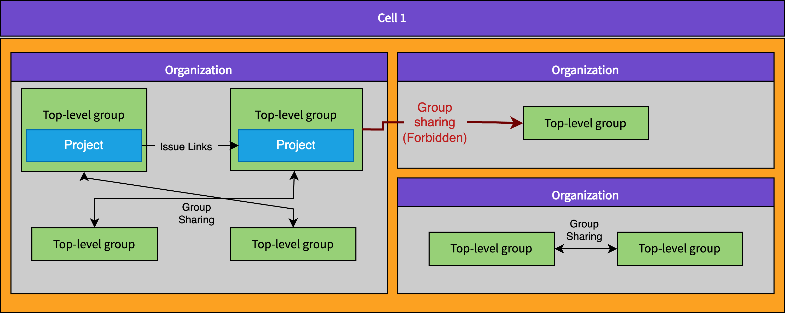
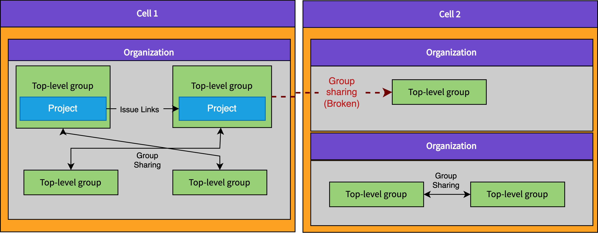

<!-- vale gitlab.FutureTense = NO -->

# Organization Isolation

This blueprint details requirements for Organizations to be isolated.
Watch a [video introduction](https://www.youtube.com/watch?v=kDinjEHVVi0) that summarizes what Organization isolation is and why we need it.
Read more about what an Organization is in [Organization](index.md).

## What?

All Cell-local data and functionality in GitLab (all data except the few
things that need to exist on all Cells in the cluster) must be isolated.
Isolation means that data or features can never cross Organization boundaries.
Many features in GitLab can link data together.
A few examples of things that would be disallowed by Organization Isolation are:

1. [Related issues](../../../user/project/issues/related_issues.md): Users would not be able to take an issue in one Project in `Organization A` and relate that issue to another issue in a Project in `Organization B`.
1. [Share a project/group with a group](../../../user/group/manage.md#share-a-group-with-another-group): Users would not be allowed to share a Group or Project in `Organization A` with another Group or Project in `Organization B`.
1. [System notes](../../../user/project/system_notes.md): Users would not get a system note added to an issue in `Organization A` if it is mentioned in a comment on an issue in `Organization B`.

## Why?

[GitLab Cells](../cells/index.md) depend on using the Organization as the sharding key, which will allow us to shard data between different Cells.
Initially, when we start rolling out Organizations, we will be working with a single Cell `Cell 1`.
`Cell 1` is our current GitLab.com deployment.
Newly created Organizations will be created on `Cell 1`.
Once Cells are ready, we will deploy `Cell 2` and begin migrating Organizations from `Cell 1` to `Cell 2`.
Migrating workloads off will be critical to allowing us to rebalance our data across a fleet of servers and eventually run much smaller GitLab instances (and databases).

If today we allowed users to create Organizations that linked to data in other Organizations, these links would suddenly break when an Organization is moved to a different Cell (because it won't know about the other Organization).
For this reason we need to ensure from the very beginning of rolling out Organizations to customers that it is impossible to create any links that cross the Organization boundary, even when Organizations are still on the same Cell.
If we don't, we will create even more mixed up related data that cannot be migrated between Cells.
Not fulfilling the requirement of isolation means we risk creating a new top-level data wrapper (Organization) that cannot actually be used as a sharding key.

The Cells project initially started with the assumption that we'd be able to shard by top-level Groups.
We quickly learned that there were no constraints in the application that isolated top-level Groups.
Many users (including ourselves) had created multiple top-level Groups and linked data across them.
So we decided that the only way to create a viable sharding key was to create another wrapper around top-level Groups.
Organizations were something our customers already wanted to gain more administrative capabilities as available in self-managed, and aggregate data across multiple top-level Groups, so this became a logical choice.
Again, this leads us to realize that we cannot allow multiple Organizations to get mixed in together the same way we had with top-level Groups, otherwise we will end up back where we started.

## How?

Multiple POCs have been implemented to demonstrate how we will provide robust developer facing and customer facing constraints in the GitLab application and database that enforce the described isolation constraint.
These are:

1. [Enforce Organization Isolation based on `project_id` and `namespace_id` column on every table](https://gitlab.com/gitlab-org/gitlab/-/merge_requests/133576)
1. [Enforce Organization Isolation based on `organization_id` on every table](https://gitlab.com/gitlab-org/gitlab/-/merge_requests/129889)
1. [Validate if a top-level group is isolated to be migrated to an Organization](https://gitlab.com/gitlab-org/gitlab/-/merge_requests/131968)

The major constraint these POCs were trying to overcome was that there is no standard way in the GitLab application or database to even determine what Organization (or Project or namespace) a piece of data belongs to.
This means that the first step is to implement a standard way to efficiently find the parent Organization for any model or row in the database.

The proposed solution is ensuring that every single table that exists in the `gitlab_main_cell`, `gitlab_ci` and `gitlab_pm` (Cell-local) databases must include a valid sharding key that is a reference to `projects`, `namespaces` or `organizations`.
At first we considered enforcing everything to have an `organization_id`, but we determined that this would be too expensive to update for customers that need to migrate large Groups out of the default Organization.
The added benefit is that more than half of our tables already have one of these columns.
Additionally, if we can't consistently attribute data to a top-level Group, then we won't be able to validate if a top-level Group is safe to be moved to a new Organization.

Once we have consistent sharding keys we can use them to validate all data on insert are not crossing any Organization boundaries.
We can also use these sharding keys to help us decide whether:

- Existing namespaces in the default Organization can be moved safely to a new Organization, because the namespace is already isolated.
- The namespace owner would need to remove some links before migrating to a new Organization.
- A set of namespaces is isolated as a group and could be moved together in bulk to a new Organization.

## Detailed steps

1. Implement developer facing documentation explaining the requirement to add these sharding keys and how they should choose.
1. Add a way to declare a sharding key in `db/docs` and automatically populate it for all tables that already have a sharding key
1. Implement automation in our CI pipelines and/or DB migrations that makes it impossible to create new tables without a sharding key.
1. Implement a way for people to declare a desired sharding key in `db/docs` as
   well as a path to the parent table from which it is migrated. Will only be
   needed temporarily for tables that don't have a sharding key
1. Attempt to populate as many "desired sharding key" as possible in an
   automated way and delegate the MRs to other teams
1. Fan out issues to other teams to manually populate the remaining "desired
   sharding key"
1. Start manually creating then automating the creation of migrations for
   tables to populate sharding keys from "desired sharding key"
1. Once all tables have sharding keys or "desired sharding key", we ship an
   evolved version of the
   [POC](https://gitlab.com/gitlab-org/gitlab/-/merge_requests/133576), which
   will enforce that newly inserted data cannot cross Organization boundaries.
   This may need to be expanded to more than just foreign keys, and should also
   include loose foreign keys and possibly any relationships described in
   models. It can temporarily depend on inferring, at runtime, the sharding key
   from the "desired sharding key" which will be a less performant option while
   we backfill the sharding keys to all tables but allow us to unblock
   implementing the isolation rules and user experience of isolation.
1. Finish migration of ~300 tables that are missing a sharding key:
   1. The Tenant Scale team migrates the first few tables.
   1. We build a dashboard showing our progress and continue to create
      automated MRs for the sharding keys that can be automatically inferred
      and automate creating issues for all the sharding keys that can't be
      automatically inferred
1. Validate that all existing sharding key columns on all Cell-local tables can reliably be assumed to be the sharding key. This requires assigning issues to teams to confirm that these columns aren't used for some other purpose that would actually not be suitable.
1. We allow customers to create new Organizations without the option to migrate namespaces into them. All namespaces need to be newly created in their new Organization.
1. Implement new functionality in GitLab similar to the [POC](https://gitlab.com/gitlab-org/gitlab/-/merge_requests/131968), which allows a namespace owner to see if their namespace is fully isolated.
1. Implement functionality that allows namespace owners to migrate an existing namespace from one Organization to another. Most likely this will be existing customers that want to migrate their namespace out of the default Organization into a newly created Organization. Only isolated namespaces as implemented in the previous step will be allowed to move.
1. Expand functionality to validate if a namespace is isolated, so that users can select multiple namespaces they own and validate that the selected group of namespaces is isolated. Links between the selected namespaces would stay intact.
1. Implement functionality that allows namespace owners to migrate multiple existing namespaces from one Organization to another. Only isolated namespaces as implemented in the previous step will be allowed to move.
1. We build better tooling to help namespace owners with cleaning up unwanted links outside of their namespace to allow more customers to migrate to a new Organization. This step would be dependent on the amount of existing customers that actually have links to clean up.

The implementation of this effort will be tracked in [#11670](https://gitlab.com/groups/gitlab-org/-/epics/11670).

## Alternatives considered

### Add any data that need to cross Organizations to cluster-wide tables

We plan on having some data at the cluster level in our Cells architecture (for example
Users), so it might stand to reason that we can make any data cluster-wide
that might need to cross Organization boundaries and this would solve the problem.

This could be an option for a limited set of features and may turn out to be
necessary for some critical workflows.
However, this should not become the default option, because it will ultimately lead to the Cells architecture not achieving the horizontal scaling goals.
Features like [sharing a group with a group](../../../user/group/manage.md#share-a-group-with-another-group) are very tightly connected to some of the worst performing functionality in our
application with regard to scalability.
We are hoping that by splitting up our databases in Cells we will be able to unlock more scaling headroom and reduce the problems associated with supporting these features.

### Do nothing and treat these anomalies as an acceptable edge case

This idea hasn't been explored deeply but is rejected on the basis that these
anomalies will appear as data loss while moving customer data between Cells.
Data loss is a very serious kind of bug, especially when customers are not opting into being moved between servers.

### Solve these problems feature by feature

This could be done, for example, by implementing an application rule that
prevents users from adding an issue link between Projects on different Organizations.
We would need to find all such features by asking teams, and
they would need to fix them all as a special case business rule.

This may be a viable, less robust option, but it does not give us a lot of confidence in our system.
Without a robust way to ensure that all Organization data is isolated, we would have to trust that each feature we implement has been manually checked.
This creates a real risk that we miss something, and again we would end up with customer data loss.
Another challenge here is that if we are not confident in our isolation constraints, then we may end up attributing various unrelated bugs to possible data loss.
As such it could become a rabbit hole to debug all kinds of unrelated bugs.
