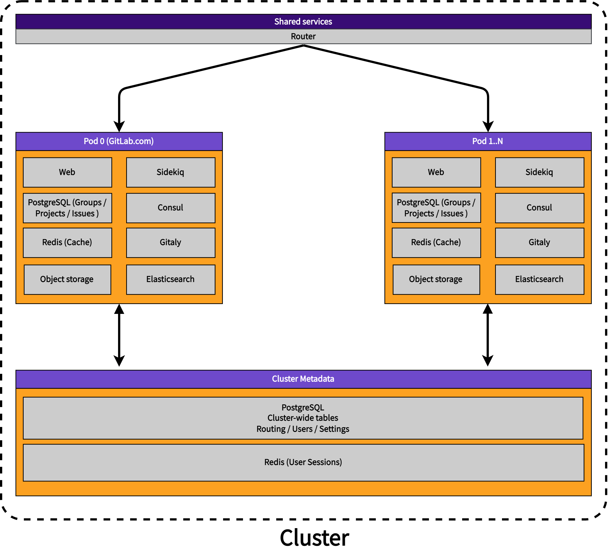

# Pods

This document is a work-in-progress and represents a very early state of the Pods design. Significant aspects are not documented, though we expect to add them in the future.

## Summary

Pods is a new architecture for our Software as a Service platform that is horizontally-scalable, resilient, and provides a more consistent user experience. It may also provide additional features in the future, such as data residency control (regions) and federated features.

## Terminology

We use the following terms to describe components and properties of the Pods architecture.

### Pod

A Pod is a set of infrastructure components that contains multiple top-level namespaces that belong to different organizations. The components include both datastores (PostgreSQL, Redis etc.) and stateless services (web etc.). The infrastructure components provided within a Pod are shared among organizations and their top-level namespaces but not shared with other Pods. This isolation of infrastructure components means that Pods are independent from each other.

#### Pod properties

- Each pod is independent from the others
- Infrastructure components are shared by organizations and their top-level namespaces within a Pod
- More Pods can be provisioned to provide horizontal scalability
- A failing Pod does not lead to failure of other Pods
- Noisy neighbor effects are limited to within a Pod
- Pods are not visible to organizations; it is an implementation detail
- Pods may be located in different geographical regions (for example, EU, US, JP, UK)

Discouraged synonyms: GitLab instance, cluster, shard

### Cluster

A cluster is a collection of Pods.

#### Cluster properties

- A cluster holds cluster-wide metadata, for example Users, Routes, Settings.

Discouraged synonyms: whale

### Organizations

GitLab references [Organizations in the initial set up](../../../topics/set_up_organization.md) and users can add a (free text) organization to their profile. There is no Organization entity established in the GitLab codebase.

As part of delivering Pods, we propose the introduction of an `organization` entity. Organizations would represent billable entities or customers.

Organizations are a known concept, present for example in [AWS](https://docs.aws.amazon.com/whitepapers/latest/organizing-your-aws-environment/core-concepts.html) and [GCP](https://cloud.google.com/resource-manager/docs/cloud-platform-resource-hierarchy#organizations).

Organizations work under the following assumptions:

1. Users care about what happens within their organizations.
1. Features need to work within an organization.
1. Only few features need to work across organizations.
1. Users understand that the majority of pages they view are only scoped to a single organization at a time.
1. Organizations are located on a single pod.

#### Organization properties

- Top-level namespaces belong to organizations
- Users can be members of different organizations
- Organizations are isolated from each other by default meaning that cross-namespace features will only work for namespaces that exist within a single organization
- User namespaces must not belong to an organization

Discouraged synonyms: Billable entities, customers

### Top-Level namespace

A top-level namespace is the logical object container in the code that represents all groups, subgroups and projects that belong to an organization.

A top-level namespace is the root of nested collection namespaces and projects. The namespace and its related entities form a tree-like hierarchy: Namespaces are the nodes of the tree, projects are the leaves.

Example:

`https://gitlab.com/gitlab-org/gitlab/`:

- `gitlab-org` is a `top-level namespace`; the root for all groups and projects of an organization
- `gitlab` is a `project`; a project of the organization.

Top-level namespaces may [be replaced by workspaces](https://gitlab.com/gitlab-org/gitlab/-/issues/368237#high-level-goals). This proposal only uses the term top-level namespaces as the workspace definition is ongoing.

Discouraged synonyms: Root-level namespace

#### Top-level namespace properties

- Top-level namespaces belonging to an organization are located on the same Pod
- Top-level namespaces can interact with other top-level namespaces that belong to the same organization

### Users

Users are available globally and not restricted to a single Pod. Users can be members of many different organizations with varying permissions. Inside organizations, users can create multiple top-level namespaces. User activity is not limited to a single organization but their contributions (for example TODOs) are only aggregated within an organization. This avoids the need for aggregating across pods.

#### User properties

- Users are shared globally across all Pods
- Users can create multiple top-level namespaces
- Users can be a member of multiple top-level namespaces
- Users can be a member of multiple organizations
- Users can administer organizations
- User activity is aggregated in an organization
- Every user has one personal namespace

## Goals

### Scalability

The main goal of this new shared-infrastructure architecture is to provide additional scalability for our SaaS Platform. GitLab.com is largely monolithic and we have estimated (internal) that the current architecture has scalability limitations, even when database partitioning and decomposition are taken into account.

Pods provide a horizontally scalable solution because additional Pods can be created based on demand. Pods can be provisioned and tuned as needed for optimal scalability.

### Increased availability

A major challenge for shared-infrastructure architectures is a lack of isolation between top-level namespaces. This can lead to noisy neighbor effects. A organization's behavior inside a top-level namespace can impact all other organizations. This is highly undesirable. Pods provide isolation at the pod level. A group of organizations is fully isolated from other organizations located on a different Pod. This minimizes noisy neighbor effects while still benefiting from the cost-efficiency of shared infrastructure.

Additionally, Pods provide a way to implement disaster recovery capabilities. Entire Pods may be replicated to read-only standbys with automatic failover capabilities.

### A consistent experience

Organizations should have the same user experience on our SaaS platform as they do on a self-managed GitLab instance.

### Regions

GitLab.com is only hosted within the United States of America. Organizations located in other regions have voiced demand for local SaaS offerings. Pods provide a path towards [GitLab Regions](https://gitlab.com/groups/gitlab-org/-/epics/6037) because Pods may be deployed within different geographies. Depending on which of the organization's data is located outside a Pod, this may solve data residency and compliance problems.

## Market segment

Pods would provide a solution for organizations in the small to medium business (up to 100 users) and the mid-market segment (up to 2000 users).
(See [segmentation definitions](https://about.gitlab.com/handbook/sales/field-operations/gtm-resources/#segmentation).)
Larger organizations may benefit substantially from [GitLab Dedicated](../../../subscriptions/gitlab_dedicated/index.md).

At this moment, GitLab.com has "social-network"-like capabilities that may not fit well into a more isolated organization model. Removing those features, however, possesses some challenges:

1. How will existing `gitlab-org` contributors contribute to the namespace??
1. How do we move existing top-level namespaces into the new model (effectively breaking their social features)?

We should evaluate if the SMB and mid market segment is interested in these features, or if not having them is acceptable in most cases.

## High-level architecture problems to solve

A number of technical issues need to be resolved to implement Pods (in no particular order). This section will be expanded.

1. How are users of an organization routed to the correct Pod?
1. How do users authenticate?
1. How are Pods rebalanced?
1. How are Pods provisioned?
1. How can Pods implement disaster recovery capabilities?

## Cross-section impact

Pods is a fundamental architecture change that impacts other sections and stages. This section summarizes and links to other groups that may be impacted and highlights potential conflicts that need to be resolved. The Pods group is not responsible for achieving the goals of other groups but we want to ensure that dependencies are resolved.

### Summary

Based on discussions with other groups the net impact of introducing Pods and a new entity called organizations is mostly neutral. It may slow down development in some areas. We did not discover major blockers for other teams.

1. We need to resolve naming conflicts (proposal is TBD)
1. Pods requires introducing Organizations. Organizations are a new entity **above** top-level groups. Because this is a new entity, it may impact the ability to consolidate settings for Group Workspace and influence their decision on [how to approach introducing a workspace](https://gitlab.com/gitlab-org/gitlab/-/issues/376285#approach-2-workspace-is-built-on-top-of-top-level-groups)
1. Organizations may make it slightly easier for Fulfillment to realize their billing plans.

### Impact on Group Manage Workspace

We synced with the Workspace PM and Designer ([recording](https://youtu.be/b5Opn9cFWFk)) and discussed the similarities and differences between the Pods and Workspace proposal ([presentation](https://docs.google.com/presentation/d/1FsUi22Up15b_tu6p2m-yLML3hCZ3rgrZrmzJAxUsNmU/edit?usp=sharing)).

#### Goals of Group Manage Workspace

As defined in the [workspace documentation](../../../user/workspace/index.md):

1. Create an entity to manage everything you do as a GitLab administrator, including:
   1. Defining and applying settings to all of your groups, subgroups, and projects.
   1. Aggregating data from all your groups, subgroups, and projects.
1. Reach feature parity between SaaS and self-managed installations, with all Admin Area settings moving to groups (?). Hardware controls remain on the instance level.

The [workspace roadmap outlines](https://gitlab.com/gitlab-org/gitlab/-/issues/368237#high-level-goals) the current goals in detail.

#### Potential conflicts with Pods

- Workspace and Organization are different terms for the same entity. Both define a new entity as the primary organizational object for groups and projects. This is mainly a semantic difference and **we need to decide on a name** following [user research to decide if workspace](https://gitlab.com/gitlab-org/ux-research/-/issues/2147). This is also driven by the fact that the Remote Development team is looking at better names and [are considering the term Workspace as well](https://gitlab.com/gitlab-com/Product/-/issues/4812).
- We will only introduce one entity
- Group workspace highlighted the need to further validate the key assumption that users only care about what happens within their organization.

### Impact on Fulfillment

We synced with Fulfillment ([recording](https://youtu.be/FkQF3uF7vTY)) to discuss how Pods would impact them. Fulfillment is supportive of an entity above top-level namespaces. Their perspective is outline in [!5639](https://gitlab.com/gitlab-org/customers-gitlab-com/-/merge_requests/5639/diffs).

#### Goals of Fulfillment

- Fulfillment has a longstanding plan to move billing from the top-level namespace to a level above. This would mean that a license applies for an organization and all its top-level namespaces.
- Fulfillment uses Zuora for billing and would like to have a 1-to-1 relationship between an organization and their Zuora entity called BillingAccount. They want to move away from tying a license to a single user.
- If a customer needs multiple organizations, the corresponding BillingAccounts can be rolled up into a consolidated billing account (similar to [AWS consolidated billing](https://docs.aws.amazon.com/awsaccountbilling/latest/aboutv2/consolidated-billing.html))
- Ideally, a self-managed instance has a single Organization by default, which should be enough for most customers.
- Fulfillment prefers only one additional entity.

A rough representation of this is:

#### Potential conflicts with Pods

- There are no known conflicts between Fulfillment's plans and Pods

## Iteration plan

We can't ship the entire Pods architecture in one go - it is too large. Instead, we are adopting an iteration plan that provides value along the way.

1. Introduce organizations
1. Migrate existing top-level namespaces to organizations
1. Create new organizations on `pod_0`
1. Migrate existing organizations from `pod_0` to `pod_n`
1. Add additional Pod capabilities (DR, Regions)

### Iteration 0: Introduce organizations

In the first iteration, we introduce the concept of an organization
as a way to group top-level namespaces together. Support for organizations **does not require any Pods work** but having them will make all subsequent iterations of Pods simpler. This is mainly because we can group top-level namespaces for a single organization onto a Pod. Within an organization all interactions work as normal but we eliminate any cross-organizational interactions except in well defined cases (e.g. forking).

This means that we don't have a large number of cross-pod interactions.

Introducing organizations allows GitLab to move towards a multi-tenant system that is similar to Discord's with a single user account but many different "servers" - our organizations - that allow users to switch context. This model harmonizes the UX across self-managed and our SaaS Platforms and is a good fit for Pods.

Organizations solve the following problems:

1. We can group top-level namespaces by organization. It is very similar to the initial concept of "instance groups". For example these two top-level namespaces would belong to the organization `GitLab`:
    1. `https://gitlab.com/gitlab-org/`
    1. `https://gitlab.com/gitlab-com/`
1. We can isolate organizations from each other. Top-level namespaces of the same organization can interact within organizations but are not allowed to interact with other namespaces in other organizations. This is useful for customers because it means an organization provides clear boundaries - similar to a self-managed instance. This means we don't have to aggregate user dashboards across everything and can locally scope them to organizations.
1. We don't need to define hierarchies inside an organization. It is a container that could be filled with whatever hierarchy / entity set makes sense (workspaces, top-level namespaces etc.)
1. Self-managed instances would set a default organization.
1. Organizations can control user-profiles in a central way. This could be achieved by having an organization specific user-profile. Such a profile makes it possible for the organization administrators to control the user role in a company, enforce user emails, or show a graphical indicator of a user being part of the organization. An example would be a "GitLab Employee stamp" on comments.

#### Why would customers opt-in to Organizations?

By introducing organizations and Pods we can improve the reliability, performance and availability of our SaaS Platforms.

The first iteration of organizations would also have some benefits by providing more isolation. A simple example would be that `@` mentions could be scoped to an organization.

Future iterations would create additional value but are beyond the scope of this blueprint.

Organizations will likely be required in the future as well.

#### Initial user experience

1. We create a default `GitLab.com public` organization and assign all public top-level namespaces to it. This allows existing users to access all the data on GitLab.com, exactly as it does now.
1. Any user wanting to opt-in to the benefits of organizations will need to set a single default organization. Any attempts for these users to load a global page like `/dashboard` will end up redirecting to `/-/organizations/<DEFAULT_ORGANIZATION>/dashboard`.
1. New users that opted in to organizations will only ever see data that is related to a single organization. Upon login, data is shown for the default organization. It will be clear to the user how they can switch to a different organization. Users can still navigate to the `GitLab.com` organization but they won't see TODOs from their new organizations in any such views. Instead they'd need to navigate directly to `/organizations/my-company/-/dashboard`.

### Migrating to Organizations

Existing customers could also opt-in to migrate their existing top-level paid namespaces to become part of an organization. In most cases this will be a 1-to-1 mapping. But in some cases it may allow a customer to move multiple top-level namespaces into one organization (for example GitLab).

Migrating to Organizations would be optional. We could even recruit a few beta testers early on to see if this works for them. GitLab itself could dogfood organizations and we'd surface a lot of issues restricting interactions with other namespaces.

## Iteration 1 - Introduce Pod US 0

### GitLab.com as Pod US0

GitLab.com will be treated as the first pod `Pod US 0`. It will be unique and much larger compared to newly created pods. All existing top-level namespaces and organizations will remain on `Pod US 0` in the first iteration.

### Users are globally available

Users are globally available and the same for all pods. This means that user data needs to be handled separately, for example via decomposition, see [!95941](https://gitlab.com/gitlab-org/gitlab/-/merge_requests/95941).

### Pod groundwork

In this iteration, we'll lay all the groundwork to support a second Pod for new organizations. This will be transparent to customers.

## Iteration 2 - Introduce Pod US 1

### Add new organizations to Pod US 1

After we are ready to support a second Pod, newly created organizations are located by default on `Pod US 1`. The user experience for organizations is already well established.

### Migrate existing organizations from Pod US 0 to Pod US 1

We know that we'll have to move organizations from `Pod US 0` to other pods to reduce its size and ultimately retire the existing GitLab.com architecture.

By introducing organizations early, we should be able to draw strong "boundaries" across organizations and support migrating existing organizations to a new Pod.

This is likely going to be GitLab itself - if we can dogfood this, we are likely going to be successful with other organizations as well.

## Iteration 3 - Introduce Regions

We can now leverage the Pods architecture to introduce Regions.

## Iteration 4 - Introduce cross-organizational interactions as needed

Based on user research, we may want to change certain features to work across organizations. Examples include:

- Specific features allow for cross-organization interactions, for example forking, search.

## Technical Proposals

The Pods architecture do have long lasting implications to data processing, location, scalability and the GitLab architecture.
This section links all different technical proposals that are being evaluated.

- [Stateless Router That Uses a Cache to Pick Pod and Is Redirected When Wrong Pod Is Reached](proposal-stateless-router-with-buffering-requests.md)

- [Stateless Router That Uses a Cache to Pick Pod and pre-flight `/api/v4/pods/learn`](proposal-stateless-router-with-routes-learning.md)

## Impacted features

The Pods architecture will impact many features requiring some of them to be rewritten, or changed significantly.
This is the list of known affected features with the proposed solutions.

- [Pods: Git Access](pods-feature-git-access.md)
- [Pods: Data Migration](pods-feature-data-migration.md)
- [Pods: Database Sequences](pods-feature-database-sequences.md)
- [Pods: GraphQL](pods-feature-graphql.md)
- [Pods: Organizations](pods-feature-organizations.md)
- [Pods: Router Endpoints Classification](pods-feature-router-endpoints-classification.md)
- [Pods: Schema changes (Postgres and Elasticsearch migrations)](pods-feature-schema-changes.md)
- [Pods: Global Search](pods-feature-global-search.md)
- [Pods: CI Runners](pods-feature-ci-runners.md)
- [Pods: Admin Area](pods-feature-admin-area.md)
- [Pods: Secrets](pods-feature-secrets.md)
- [Pods: Container Registry](pods-feature-container-registry.md)
- [Pods: Contributions: Forks](pods-feature-contributions-forks.md)
- [Pods: Personal Namespaces](pods-feature-personal-namespaces.md)
- [Pods: Dashboard: Projects, Todos, Issues, Merge Requests, Activity, ...](pods-feature-dashboard.md)
- [Pods: Snippets](pods-feature-snippets.md)
- [Pods: Uploads](pods-feature-uploads.md)
- [Pods: GitLab Pages](pods-feature-gitlab-pages.md)
- [Pods: Agent for Kubernetes](pods-feature-agent-for-kubernetes.md)

## Links

- [Internal Pods presentation](https://docs.google.com/presentation/d/1x1uIiN8FR9fhL7pzFh9juHOVcSxEY7d2_q4uiKKGD44/edit#slide=id.ge7acbdc97a_0_155)
- [Pods Epic](https://gitlab.com/groups/gitlab-org/-/epics/7582)
- [Database Group investigation](https://about.gitlab.com/handbook/engineering/development/enablement/data_stores/database/doc/root-namespace-sharding.html)
- [Shopify Pods architecture](https://shopify.engineering/a-pods-architecture-to-allow-shopify-to-scale)
- [Opstrace architecture](https://gitlab.com/gitlab-org/opstrace/opstrace/-/blob/main/docs/architecture/overview.md)
