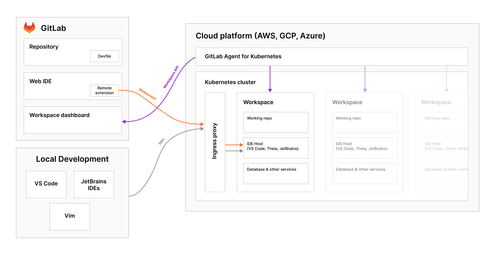
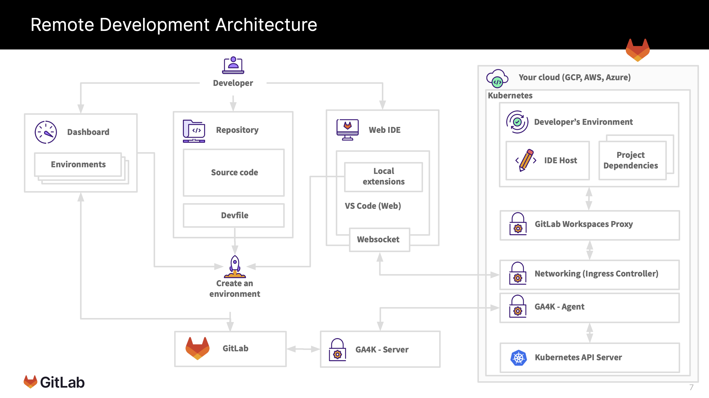

<!-- vale gitlab.FutureTense = NO -->

# Remote Development

## Summary

Remote Development is a new architecture for our software-as-a-service platform that provides a more consistent user experience writing code hosted in GitLab. It may also provide additional features in the future, such as a purely browser-based workspace and the ability to connect to an already running VM/Container or to use a GitLab-hosted VM/Container.

## Web IDE and Remote Development

It is important to note that `Remote Development !== Web IDE`, and this is something we want to be explicit about in this document as the terms can become conflated when they shouldn't. Our new Web IDE is a separate ongoing effort that is running in parallel to Remote Development.

These two separate categories do have some overlap as it is a goal to allow a user to connect a running workspace to the Web IDE, **but** this does not mean the two are dependent on one another.

You can use the [Web IDE](../../../user/project/web_ide/index.md) to commit changes to a project directly from your web browser without installing any dependencies or cloning any repositories. The Web IDE, however, lacks a native runtime environment on which you would compile code, run tests, or generate real-time feedback in the IDE. For a more complete IDE experience, you can pair the Web IDE with a Remote Development workspace that has been properly configured to run as a host.

## Long-term vision

As a [new Software Developer to a team such as Sasha](https://about.gitlab.com/handbook/product/personas/#sasha-software-developer) with no local development environment, I should be able to:

- Navigate to a repository on GitLab.com or self-managed.
- Click a button that will provide a list of current workspaces for this repository.
- Click a button that will create a new workspace or select an existing workspace from a list.
- Go through a configuration wizard that will let me select various options for my workspace (memory/CPU).
- Start up a workspace from the Web IDE and within a minute have a fully interactive terminal panel at my disposal.
- Make code changes, run tests, troubleshoot based on the terminal output, and commit new changes.
- Submit MRs of any kind without having to clone the repository locally or to manually update a local development environment.

## User Flow Diagram

## Terminology

We use the following terms to describe components and properties of the Remote Development architecture.

### Remote Development

Remote Development allows you to use a secure development environment in the cloud that you can connect to from your local machine through a web browser or a client-based solution with the purpose of developing a software product there.

#### Remote Development properties

- Separate your development environment to avoid impacting your local machine configuration.
- Make it easy for new contributors to get started and keep everyone on a consistent environment.
- Use tools or runtimes not available on your local OS or manage multiple versions of them.
- Access an existing development environment from multiple machines or locations.

Discouraged synonyms: VS Code for web, Remote Development Extension, browser-only WebIDE, Client only WebIDE

### Workspace

Container/VM-based developer machines providing all the tools and dependencies needed to code, build, test, run, and debug applications.

#### Workspace properties

- Workspaces should be isolated from each other by default and are responsible for managing the lifecycle of their components. This isolation can be multi-layered: namespace isolation, network isolation, resources isolation, node isolation, sandboxing containers, etc. ([reference](https://kubernetes.io/docs/concepts/security/multi-tenancy/)).
- A workspace should contain project components as well as editor components.
- A workspace should be a combination of resources that support cloud-based development environment.
- Workspaces are constrained by the amount of resources provided to them.

### Web IDE

VS Code for web - replacement of our current legacy Web IDE.

#### Web IDE properties

A package for bootstrapping GitLab context-aware Web IDE that:

- Is built on top of Microsoft's VS Code. We customize and add VS Code features in the [GitLab fork of the VS Code project](https://gitlab.com/gitlab-org/gitlab-web-ide-vscode-fork).
- Can be configured in a way that it connects to the workspace rather than only using the browser. When connected to a workspace, a user should be able to do the following from the Web IDE:
  - Edit, build, or debug on a different OS than they are running locally.
  - Make use of larger or more specialized hardware than their local machine for development.
  - Separate developer environments to avoid conflicts, improve security, and speed up onboarding.

### Remote Development Extension for Desktop

Something that plugs into the desktop IDE and connects you to the workspace.

#### Remote Development Extension for Desktop properties

- Allows you to open any folder in a workspace.
- Should be desktop IDE agnostic.
- Should have access to local files or APIs.

## Goals

### A consistent experience

Organizations should have the same user experience on our SaaS platform as they do on a self-managed GitLab instance. We want to abstract away the user's development environment to avoid impacting their local machine configuration. We also want to provide support for developing on the same operating system you deploy to or use larger or more specialized hardware.

A major goal is that each member of a development team should have the same development experience minus any specialized local configuration. This will also make it easy for new contributors to get started and keep everyone on a consistent environment.

### Increased availability

A workspace should allow access to an existing development environment from multiple machines and locations across a single or multiple teams. It should also allow a user to make use of tools or runtimes not available on their local OS or manage multiple versions of them.

Additionally, Remote Development workspaces could provide a way to implement disaster recovery if we are able to leverage the capabilities of [Pods](../../../architecture/blueprints/pods/index.md).

### Scalability

As an organization begins to scale, they quickly realize the need to support additional types of projects that might require extensive workflows. Remote Development workspaces aim to solve that issue by abstracting away the burden of complex machine configuration, dependency management, and possible data-seeding issues.

To facilitate working on different features across different projects, Remote Development should allow each user to provision multiple workspaces to enable quick context switching.

Eventually, we should be able to allow users to vertically scale their workspaces with more compute cores, memory, and other resources. If a user is currently working against a 2 CPU and 4 GB RAM workspace but comes to find they need more CPU, they should be able to upgrade their compute layer to something more suitable with a click or CLI command within the workspace.

### Provide built-in security and enterprise readiness

As Remote Development becomes a viable replacement for Virtual Desktop Infrastructure solutions, they must be secure and support enterprise requirements, such as role-based access control and the ability to remove all source code from developer machines.

### Accelerate project and developer onboarding

As a zero-install development environment that runs in your browser, Remote Development makes it easy for anyone to join your team and contribute to a project.

### Regions

GitLab.com is only hosted within the United States of America. Organizations located in other regions have voiced demand for local SaaS offerings. BYO infrastructure helps work in conjunction with [GitLab Regions](https://gitlab.com/groups/gitlab-org/-/epics/6037) because a user's workspace may be deployed within different geographies. The ability to deploy workspaces to different geographies might also help to solve data residency and compliance problems.

## Market analysis

We have conducted a market analysis to understand the broader market and what others can offer us by way of open-source libraries, integrations, or partnership opportunities. We have broken down the effort into a set of issues where we investigate each potential competitor/pathway/partnership as a spike.

- [Market analysis](https://gitlab.com/groups/gitlab-org/-/epics/8131)
- [YouTube results](https://www.youtube.com/playlist?list=PL05JrBw4t0KrRQhnSYRNh1s1mEUypx67-)

### Implementation

- [Viable Maturity Epic](https://gitlab.com/groups/gitlab-org/-/epics/9190) to track progress.
- [Documentation](https://gitlab.com/gitlab-org/remote-development/gitlab-remote-development-docs)
explaining the architecture and implementation details.

## Che vs. DevWorkspace Operatoor vs. Custom-Built Solution

After an investigation into using [Che](https://gitlab.com/gitlab-org/gitlab/-/issues/366052) as our backend to accelerate Remote Development, we ultimately opted to [write our own custom-built solution using DevWorkspace Operator](https://gitlab.com/gitlab-org/gitlab/-/merge_requests/97449#note_1131215629).

Some advantages of us opting to write our own custom-built solution are:

- We can still use the core DevWorkspace Operator and build on top of it.
- It is easier to add support for other configurations apart from `devfile` in the future if the need arises.
- We have the ability to choose which tech stack to use (for example, instead of using Traefik which is used in Che, explore NGINX itself or use GitLab Agent for Kubernetes).

After writing our own custom-built solution using DevWorkspace Operator,
we decided to [remove the dependency on DevWorkspace Operator](https://gitlab.com/groups/gitlab-org/-/epics/9895)
and thus the transitive dependency of Cert Manager.

## Links

- [Remote Development presentation](https://docs.google.com/presentation/d/1XHH_ZilZPufQoWVWViv3evipI-BnAvRQrdvzlhBuumw/edit#slide=id.g131f2bb72e4_0_8)
- [Category Strategy epic](https://gitlab.com/groups/gitlab-org/-/epics/7419)
- [Minimal Maturity epic](https://gitlab.com/groups/gitlab-org/-/epics/9189)
- [Viable Maturity epic](https://gitlab.com/groups/gitlab-org/-/epics/9190)
- [Complete Maturity epic](https://gitlab.com/groups/gitlab-org/-/epics/9191)
- [Remote Development sync](https://docs.google.com/document/d/1hWVvksIc7VzZjG-0iSlzBnLpyr-OjwBVCYMxsBB3h_E/edit#)
- [Market analysis and architecture](https://gitlab.com/groups/gitlab-org/-/epics/8131)
- [GA4K Architecture](https://gitlab.com/gitlab-org/remote-development/gitlab-remote-development-docs/-/blob/main/doc/architecture.md)
- [BYO infrastructure](https://gitlab.com/groups/gitlab-org/-/epics/8290)
- [Browser runtime](https://gitlab.com/groups/gitlab-org/-/epics/8291)
- [GitLab-hosted infrastructure](https://gitlab.com/groups/gitlab-org/-/epics/8292)
- [Browser runtime spike](https://gitlab.com/gitlab-org/gitlab-web-ide/-/merge_requests/58).
- [Remote Development direction](https://about.gitlab.com/direction/create/editor/remote_development)
- [Ideal user journey](https://about.gitlab.com/direction/create/editor/remote_development/#ideal-user-journey)
