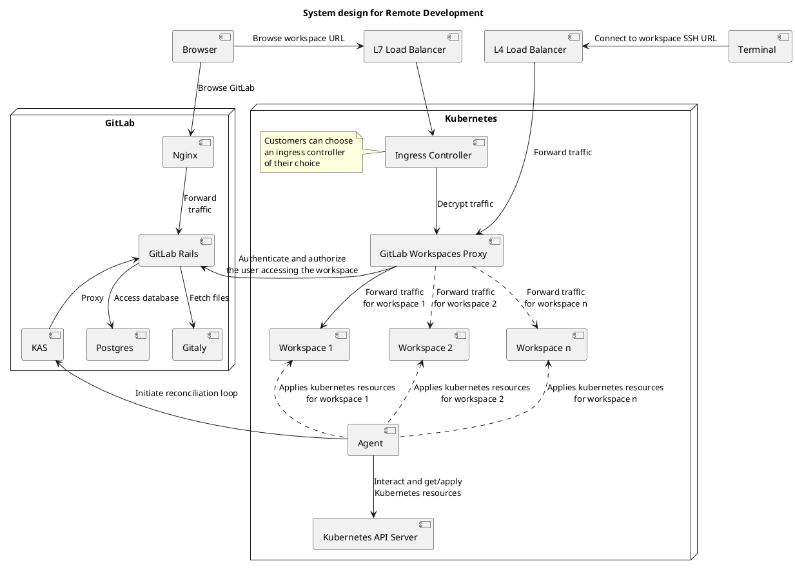
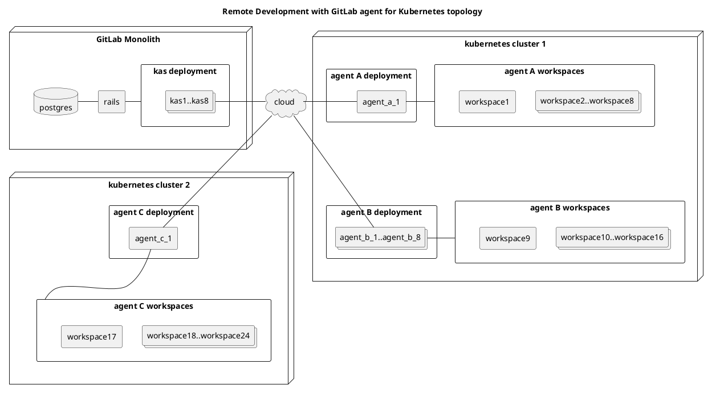
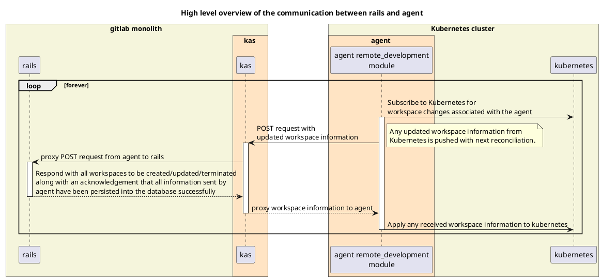
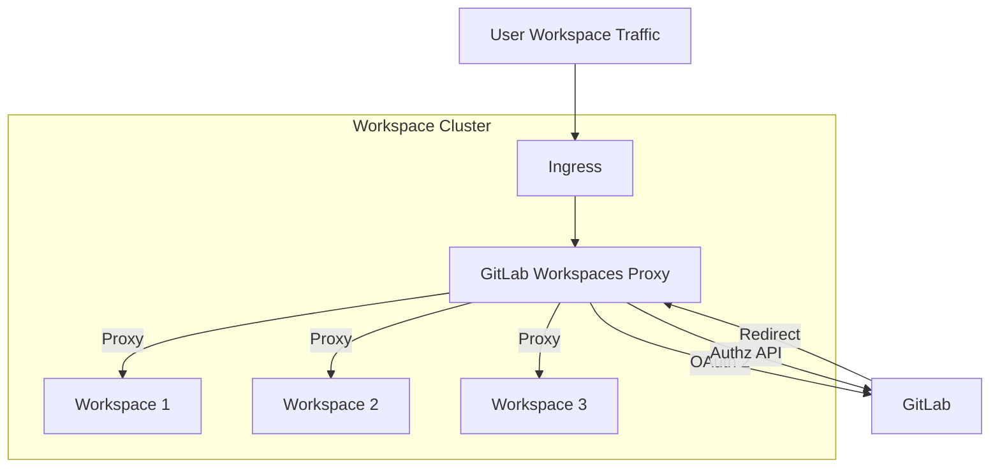
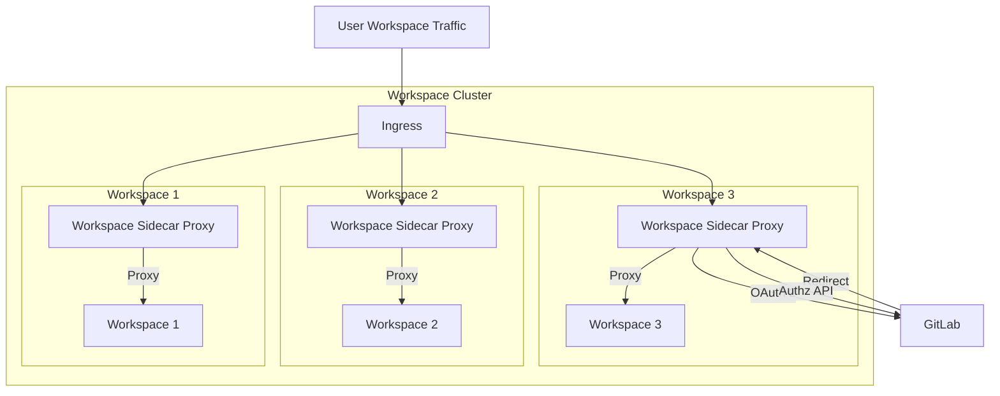
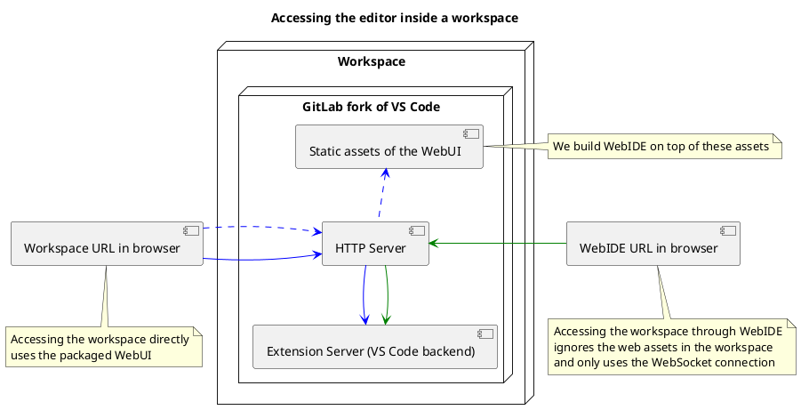

<!-- vale gitlab.FutureTense = NO -->

# Remote development

## Summary

Remote development is a new architecture for our software-as-a-service platform that provides a more consistent user experience writing code hosted in GitLab. It may also provide additional features in the future, such as a purely browser-based workspace and the ability to connect to an already running VM/Container or to use a GitLab-hosted VM/Container.

## Web IDE and remote development

It is important to note that `remote development !== Web IDE`, and this is something we want to be explicit about in this document as the terms can become conflated when they shouldn't. Our new Web IDE is a separate ongoing effort that is running in parallel to remote development.

These two separate categories do have some overlap as it is a goal to allow a user to connect a running workspace to the Web IDE, **but** this does not mean the two are dependent on one another.

You can use the [Web IDE](../../../user/project/web_ide/index.md) to commit changes to a project directly from your web browser without installing any dependencies or cloning any repositories. The Web IDE, however, lacks a native runtime environment on which you would compile code, run tests, or generate real-time feedback in the IDE. For a more complete IDE experience, you can pair the Web IDE with a remote development workspace that has been properly configured to run as a host.

## Long-term vision

As a [new Software Developer to a team such as Sasha](https://handbook.gitlab.com/handbook/product/personas/#sasha-software-developer) with no local development environment, I should be able to:

- Go to a repository on GitLab.com or self-managed.
- Click a button that will provide a list of current workspaces for this repository.
- Click a button that will create a new workspace or select an existing workspace from a list.
- Go through a configuration wizard that will let me select various options for my workspace (memory/CPU).
- Start up a workspace from the Web IDE and within a minute have a fully interactive terminal panel at my disposal.
- Make code changes, run tests, troubleshoot based on the terminal output, and commit new changes.
- Submit MRs of any kind without having to clone the repository locally or to manually update a local development environment.

## Terminology

We use the following terms to describe components and properties of the remote development architecture.

### Remote development

Remote development allows you to use a secure development environment in the cloud that you can connect to from your local machine through a web browser or a client-based solution with the purpose of developing a software product there.

#### Remote development properties

- Separate your development environment to avoid impacting your local machine configuration.
- Make it easy for new contributors to get started and keep everyone on a consistent environment.
- Use tools or runtimes not available on your local OS or manage multiple versions of them.
- Access an existing development environment from multiple machines or locations.

Discouraged synonyms: VS Code for web, remote development Extension, browser-only WebIDE, Client only WebIDE

### Workspace

Container/VM-based developer machines providing all the tools and dependencies needed to code, build, test, run, and debug applications.

#### Workspace properties

- Workspaces should be isolated from each other by default and are responsible for managing the lifecycle of their components. This isolation can be multi-layered: namespace isolation, network isolation, resources isolation, node isolation, sandboxing containers, etc. ([reference](https://kubernetes.io/docs/concepts/security/multi-tenancy/)).
- A workspace should contain project components as well as editor components.
- A workspace should be a combination of resources that support cloud-based development environment.
- Workspaces are constrained by the amount of resources provided to them.

### Web IDE

VS Code for web - replacement of our current legacy Web IDE.

#### Web IDE properties

A package for bootstrapping GitLab context-aware Web IDE that:

- Is built on top of Microsoft's VS Code. We customize and add VS Code features in the [GitLab fork of the VS Code project](https://gitlab.com/gitlab-org/gitlab-web-ide-vscode-fork).
- Can be configured in a way that it connects to the workspace rather than only using the browser. When connected to a workspace, a user should be able to do the following from the Web IDE:
  - Edit, build, or debug on a different OS than they are running locally.
  - Make use of larger or more specialized hardware than their local machine for development.
  - Separate developer environments to avoid conflicts, improve security, and speed up onboarding.

### Remote development extension for desktop

Something that plugs into the desktop IDE and connects you to the workspace.

#### Remote development extension for desktop properties

- Allows you to open any folder in a workspace.
- Should be desktop IDE agnostic.
- Should have access to local files or APIs.

## Goals

### A consistent experience

Organizations should have the same user experience on our SaaS platform as they do on a self-managed GitLab instance. We want to abstract away the user's development environment to avoid impacting their local machine configuration. We also want to provide support for developing on the same operating system you deploy to or use larger or more specialized hardware.

A major goal is that each member of a development team should have the same development experience minus any specialized local configuration. This will also make it easy for new contributors to get started and keep everyone on a consistent environment.

### Increased availability

A workspace should allow access to an existing development environment from multiple machines and locations across a single or multiple teams. It should also allow a user to make use of tools or runtimes not available on their local OS or manage multiple versions of them.

Additionally, remote development workspaces could provide a way to implement disaster recovery if we are able to leverage the capabilities of [Cells](../../../architecture/blueprints/cells/index.md).

### Scalability

As an organization begins to scale, they quickly realize the need to support additional types of projects that might require extensive workflows. Remote development workspaces aim to solve that issue by abstracting away the burden of complex machine configuration, dependency management, and possible data-seeding issues.

To facilitate working on different features across different projects, remote development should allow each user to provision multiple workspaces to enable quick context switching.

Eventually, we should be able to allow users to vertically scale their workspaces with more compute cores, memory, and other resources. If a user is currently working against a 2 CPU and 4 GB RAM workspace but comes to find they need more CPU, they should be able to upgrade their compute layer to something more suitable with a click or CLI command in the workspace.

### Built-in security and enterprise readiness

As remote development becomes a viable replacement for virtual desktop infrastructure solutions, it must be secure and support enterprise requirements. These include role-based access control and the ability to remove all source code from developer machines.

### Faster project and developer onboarding

As a zero-install development environment that runs in your browser, remote development makes it easy for anyone to join your team and contribute to a project.

### Regions

GitLab.com is only hosted in the United States of America. Organizations located in other regions have voiced demand for local SaaS offerings. BYO infrastructure helps work in conjunction with [GitLab Regions](https://gitlab.com/groups/gitlab-org/-/epics/6037) because a user's workspace may be deployed in different geographies. The ability to deploy workspaces to different geographies might also help to solve data residency and compliance problems.

## Market analysis

We have conducted a market analysis to understand the broader market and what others can offer us by way of open-source libraries, integrations, or partnership opportunities. We have broken down the effort into a set of issues where we investigate each potential competitor/pathway/partnership as a spike.

- [Market analysis](https://gitlab.com/groups/gitlab-org/-/epics/8131)
- [YouTube results](https://www.youtube.com/playlist?list=PL05JrBw4t0KrRQhnSYRNh1s1mEUypx67-)

## Che vs DevWorkspace Operator vs custom-built solution

After an investigation into using [Che](https://gitlab.com/gitlab-org/gitlab/-/issues/366052) as our backend to accelerate remote development, we ultimately opted to [write our own custom-built solution using DevWorkspace Operator](https://gitlab.com/gitlab-org/gitlab/-/merge_requests/97449#note_1131215629).

Some advantages of us opting to write our own custom-built solution are:

- We can still use the core DevWorkspace Operator and build on top of it.
- It is easier to add support for other configurations apart from `devfile` in the future if the need arises.
- We have the ability to choose which tech stack to use (for example, instead of using `traefik`, which is used in Che, explore NGINX itself or use the GitLab agent for Kubernetes).

After writing our own custom-built solution using DevWorkspace Operator,
we decided to [remove the dependency on DevWorkspace Operator](https://gitlab.com/groups/gitlab-org/-/epics/9895)
and thus the transitive dependency of Cert Manager.

## Architecture details

Remote development is delivered as a module in the
[GitLab agent for Kubernetes](../../../user/clusters/agent/index.md) project.
The overall goal of this architecture is to ensure that the **actual state** of all
remote development workspaces running in the Kubernetes clusters is reconciled with the **desired state** of the
workspaces as set by the user.

This is accomplished as follows:

1. The desired state of the workspaces is obtained from user actions in the GitLab UI or API and persisted in the Rails database.
1. There is a reconciliation loop between the agent and Rails, which:
   - Retrieves the actual state of the workspaces from the Kubernetes clusters through the agent and sends it to Rails to be persisted.
   - Rails compares the actual state with the desired state and responds with actions to bring the actual state in line with the desired state for all workspaces.

### System design



### Remote development with the GitLab agent for Kubernetes topology

- The Kubernetes API is not shown in this diagram, but it is assumed that it is managing the workspaces through the agent.
- The numbers of components in each Kubernetes cluster are arbitrary.



### High-level overview of the communication between Rails and the agent



### Types of messages between Rails and the agent

The agent can send different types of messages to Rails to capture different information. Depending on what type of message the agent sends, Rails will respond accordingly.

Different types of messages are:

- `prerequisites` (yet to be implemented) - This is the first message the agent sends to Rails after the agent starts or restarts or after a leader-election.
  - Actions performed by the agent:
    - Fetch Kubernetes resources that are required to be available in the Kubernetes cluster
  - Actions performed by Rails:
    - Send the Kubernetes manifests for `gitlab-workspaces-proxy` that need to be available in the Kubernetes cluster.
- `reconcile` - Messages sent to Rails to persist the current state of the workspaces. There are two types of updates specified by the `update_type` field with the following possible values: `full` and `partial`. The payload schema remains the same for both update types.
  - `full`
    - Actions performed by the agent:
      - Send the current state of all the workspaces in the Kubernetes cluster managed by the agent.
      - To keep things consistent between the agent and Rails, the agent will send this message every time agent undergoes a full reconciliation cycle that occurs
        - when an agent starts or restarts
        - after a leader-election
        - periodically, as set using the `full_sync_interval` configuration (default: once every hour)
        - whenever the agent configuration is updated
    - Actions performed by Rails:
      - Update Postgres with the current state and respond with all the workspaces managed by the agent and their last resource version that Rails has persisted in Postgres.
      - Returning the persisted resource version back to the agent gives it a confirmation that the updates for that workspace have been successfully processed on the Rails end.
      - This persisted resource version will also help with sending only the latest workspaces changes from the agent to Rails for `reconcile` message with `partial` update type.
  - `partial`
    - Actions performed by the agent:
      - Send the latest workspace changes to Rails that are not yet persisted in Postgres. This persisted resource version will help with sending only the latest workspaces changes from the agent to Rails.
    - Actions performed by Rails:
      - Update Postgres with the current state and respond with the workspaces to be created/updated/deleted in the Kubernetes cluster and their last resource version that Rails has persisted in Postgres.
      - The workspaces to be created/updated/deleted are calculated by using the filter `desired state updated at >= agent info reported at`.
      - Returning the persisted resource version back to the agent gives it a confirmation that the updates for that workspace have been successfully processed on the Rails end.

### Event-driven polling vs full or partial reconciliation

It was initially considered desirable to be able to tell the agent to not wait for the next reconciliation loop but instead poll immediately. This would grant the following benefits:

1. This would grant the ability to trigger a full reconciliation on demand that would allow on-demand recovery/resetting of module state in the agent.
1. Apart from making the architecture more event-driven and real-time it would also help to increase the interval between reconciliation polls, thus reducing the load on the infrastructure.

However, as the prospective solutions were evaluated, it was concluded that there are very few/rare cases that would merit this capability, especially given the complexity of the viable options. An eventual reconciliation of state would suffice for most cases and it could be simply achieved through full reconciliation that is carried out periodically (with a longer interval as compared to partial reconciliation).

You can read more in this [issue](https://gitlab.com/gitlab-org/gitlab/-/issues/387090) and [conclusion comment](https://gitlab.com/gitlab-org/remote-development/gitlab-remote-development-docs/-/merge_requests/13#note_1282495106)

## Workspace states

- `CreationRequested` - Initial state of a Workspace; Creation requested by user but hasn't yet been acted on
- `Starting` - In the process of being ready for use
- `Running` - Ready for use
- `Stopping` - In the process of scaling down
- `Stopped` - Persistent storage is still available but workspace has been scaled down
- `Failed` - Kubernetes resources have been applied by `agentk` but are not ready due to various reasons (for example, crashing container)
- `Error` - Kubernetes resources failed to get applied by `agentk`
- `RestartRequested` - User has requested a restart of the workspace but the restart has not yet successfully happened
- `Terminating` - User has requested the termination of the workspace and the action has been initiated but not yet completed.
- `Terminated` - Persistent storage has been deleted and the workspace has been scaled down
- `Unknown` - Not able to understand the actual state of the workspace

### Possible `actual_state` values

The `actual_state` values are determined from the `status` attribute in the Kubernetes deployment changes, which the agent listens to and sends to Rails.

The following diagram represents the typical flow of the `actual_state` values for a `Workspace` record based on the
`status` values received from the agent. The `status` is parsed to derive the `actual_state` of the workspace based on different conditions.

However, any of these states can be skipped if there have been any
transitional `status` updates that were not received from the agent for some reason (a quick transition, a
failure to send the event, etc).

```plantuml
[*] --> CreationRequested
CreationRequested : Initial state before\nworkspace creation\nrequest is sent\nto kubernetes
CreationRequested -right-> Starting : status=Starting
CreationRequested -right-> Error : Could not create\nworkspace

Starting : Workspace config is being\napplied to kubernetes
Starting -right-> Running : status=Running
Starting -down-> Failed : status=Failed\n(container crashing)

Running : Workspace is running
Running -down-> Stopping : status=Stopping
Running -down-> Failed : status=Failed\n(container crashing)
Running -down-> Terminated : status=Terminated
Running -right-> Error : Could not\nstop/terminate\nworkspace

Stopping : Workspace is stopping
Stopping -down-> Stopped : status=Stopped
Stopping -left-> Failed : status=Failed\n(could not\nunmount volume\nand stop workspace)

Stopped : Workspace is Stopped\nby user request
Stopped -left-> Failed : status=Failed\n(could not\nunmount volume\nterminate workspace)
Stopped -right-> Error : Could not\nstart/terminate\nworkspace
Stopped -down-> Terminated : status=Terminated
Stopped -up-> Starting : status=Starting

Terminated: Workspace has been deleted

Failed: Workspace is not ready due to\nvarious reasons(for example, crashing container)
Failed -up-> Starting : status=Starting\n(container\nnot crashing)
Failed -right-> Stopped : status=Stopped
Failed -down-> Terminated : status=Terminated
Failed -down-> Error : Could not\nstop/terminate\nworkspace

Error: Kubernetes resources failed to get applied
Error -up-> Terminated : status=Terminated

Unknown: Unable to understand the actual state of the workspace
```

### Possible `desired_state` values

The `desired_state` values are determined from the user's request to Rails and are sent to the agent by Rails.

`desired_state` is a subset of the `actual_state` with only `Running`, `Stopped`, `Terminated` and `RestartRequested` values.
The state reconciliation logic in Rails will
continually attempt to transition the `actual_state` to the `desired_state` value, unless the workspace is in an unrecoverable state.

There is also an additional supported state of `RestartRequested` which is only valid for `desired_state`.
This value is not a valid value for `actual_state`. It is required in order for Rails to
initiate a restart of a started workspace. It will only persist until a `status` of `Stopped` is received
from the agent, indicating that the restart request was successful and in progress or completed.
At this point, the `desired_state` will be automatically changed to `Running` to trigger the workspace to restart again.
If there is a failure to restart the workspace, and a `Stopped` status is never received, the
`desired_state` will remain `RestartRequested` until a new `desired_state` is specified.

```plantuml
[*] --> Running
Running : Workspace is running
Running -down-> Stopped : status=Stopped
Running -left-> Terminated : status=Terminated

Stopped : Workspace is Stopped\nby user request
Stopped -up-> Running : status=Running
Stopped -down-> Terminated : status=Terminated

Terminated: Workspace has been deleted

RestartRequested : User has requested a workspace restart.\n**desired_state** will automatically change\nto **'Running'** if actual state\nof **'Stopped'** is received.
RestartRequested -left-> Running : status=Running
```

## Injecting environment variables and files into a workspace

Like CI, there is a need to inject environment variables and files into a workspace.
These environment variables and files will be frozen in time during workspace creation to ensure the same values
are injected into the workspace every time it starts/restarts.
Thus, a new database table, on the lines of `ci_job_variables` will be required.
This table will contain the following columns -

- `key` - To store the name of the environment variable or the file.
- `encrypted_value` - To store the encrypted value of the environment variable or the file.
- `encrypted_value_iv` - To store the initialization vector used for encryption.
- `workspace_id` - To reference the workspace the environment variable or the file is to be injected into.
- `variable_type` - To store whether this data is to be injected as an environment variable or a file.

To perform the encryption, the GitLab instance level secret key is used. The data about the environment variables
and files will only be sent to the Agent when required i.e.

- When new workspace creation request has been received from the user and an Agent initiates a Partial Reconciliation request
- When an Agent initiates a Full Reconciliation request

More details about the implementation details can be found in this [epic](https://gitlab.com/groups/gitlab-org/-/epics/10882).

We need to keep in mind potential performance concerns of decrypting workspace variables on the Rails side,
and perform benchmarks of what scale we will reach unacceptably long request times for a reconcile request.

e.g. a reconcile request for 100 workspaces with 20 encrypted values each == 2000 decryptions in a single request.

More details about the benchmarking can be found in this [issue](https://gitlab.com/gitlab-org/gitlab/-/issues/421504).

When a workspace is created from a project, it will inherit all the variables from the group/subgroup/project hierarchy
which are defined under [`Settings > CI/CD > Variables`](../../../ci/variables/index.md#define-a-cicd-variable-in-the-ui).
This aspect will be generalized to allow for defining `Variables` which will be inherited in both CI/CD and Workspaces.
A user will also be able to define, at a user level, environment variables and files to be injected into each
workspace created by them. While creating a workspace, a user would be able to override any environment variable
or file that is inherited from the group/subgroup/project/user hierarchy.

## Git operations from within a workspace

When a new workspace is created, a new personal access token associated to the user who created the workspace
will be generated. This personal access token will be tied to the lifecycle of the workspace and will be injected
into the workspace as a file to allow for cloning private projects and supporting transparent Git operations from
within the workspace out-of-the-box among other things using a
[custom Git credential helper](https://git-scm.com/book/en/v2/Git-Tools-Credential-Storage).

[Investigation](https://gitlab.com/gitlab-org/gitlab/-/issues/421289#note_1511631931) into using
ephemeral tokens(JWTs/OAuth/OIDC/etc.) instead of Personal Access Tokens revealed the need to have a common
JWT Authentication/Authorization layer at GitLab which can be tracked in this [issue](https://gitlab.com/gitlab-org/gitlab/-/issues/421983).
Once such a feature is available, Personal Access Tokens for each workspace would be replaced with JWT tokens.

## Workspace user traffic authentication and authorization

We need to only allow certain users to access workspaces. Currently, we are restricting this to the creator/owner of the workspace. After the workspace is created, it needs to be exposed to the network so that the user can connect to it.
Thus, any traffic incoming to the workspace needs to be authenticated and authorized.
[`gitlab-workspaces-proxy`](https://gitlab.com/gitlab-org/remote-development/gitlab-workspaces-proxy) handles discovery, authentication and authorization of the workspaces running in a Kubernetes cluster.

It will proxy all HTTP and WebSocket calls to the correct workspace. It will perform the following tasks:

1. Workspace discovery - The proxy will auto discover workspaces based on labels of Kubernetes service resources. The proxy will watch the Kubernetes API for the creation/updation/deletion of Kubernetes service resources. When an service resource is created, the proxy will automatically configure itself to use corresponding service as an upstream. Thus it will require a Kubernetes service account and a role that allows it to watch, list and get service resources.
1. Authentication - It will use the [OAuth 2.0 flow](../../../api/oauth2.md) with GitLab to authenticate the user. GitLab will act as the identity provider. If the customer uses a third party SSO service to sign in to GitLab, the flow would automatically delegate authentication to that provider. One of the complexities with authentication is the fact that each workspace is served on its own domain, and therefore we can't set the redirect URI on the GitLab app to a specific workspace. We need to set a state in the OAuth 2.0 flow to redirect to the correct workspace.
1. Authorization - The proxy will make a call to a GitLab GraphQL endpoint with the user's credentials obtained in the authentication phase. The endpoint will validate if the user has access to the workspace and accordingly return either a 404 or a 200.
1. Session Management - The proxy will be stateless and be deployed without additional third party software such as a cache or database, and therefore will be using a signed JWT to manage sessions. The JWT is signed using a key provided to the proxy during startup.

All traffic incoming to the Kubernetes cluster on a given domain is forwarded to `gitlab-workspaces-proxy`, which then decides how to serve that traffic.



- Advantages
  - Single instance of proxy, and therefore it is easy to manage and get metrics from.
  - Easy to upgrade as a single instance exists - workspaces do not need to be restarted.
- Disadvantages
  - Single point of failure
  - It will have to scale with traffic
  - New component (other than the GitLab agent) that would have to be deployed in the Kubernetes cluster by the customer
  - Does need Kubernetes privileges to list service resources.

### Other options considered

#### Sidecar proxy

A sidecar will be injected into each workspace and all traffic to the workspace will flow through the sidecar. The sidecar will only handle the traffic for a single workspace. The sidecar can communicate with the workspace over the loopback interface (localhost) because the two share a network namespace.



- Advantages
  - Does not need to handle a large volume of traffic
  - If a sidecar stops working it does not hamper the working of other workspaces
- Disadvantages
  - Inefficient usage of resources as a sidecar will have to be deployed for every workspace
  - Workspace might take slightly longer to come up because of the additional proxy element

#### Auth annotations on the Ingress resource

Use auth annotations on the Ingress resource to allow Ingress controllers(for example, `ingress-nginx`) to delegate authentication and authorization to a separate process. The challenge is that these annotations are not standardized (that is, not part of the [Ingress specification](https://kubernetes.io/docs/concepts/services-networking/ingress/)) and may not be supported across different Ingress controllers. We would need to document the process to set up our Auth provider for each of the Ingress controllers. However, if they do become a part of the new [Gateway API](https://gateway-api.sigs.k8s.io/concepts/security-model/), we will reconsider this decision.

For `ingress-nginx`, the auth annotations would be:

```yaml
apiVersion: networking.k8s.io/v1
kind: Ingress
metadata:
  annotations:
    nginx.ingress.kubernetes.io/auth-url: "https://$host/oauth2/auth"
    nginx.ingress.kubernetes.io/auth-signin: "https://$host/oauth2/start?rd=$escaped_request_uri"
  name: example-ingress
  namespace: example-namespace
spec:
  ingressClassName: nginx
  rules:
  - host: "*.workspaces.example.dev"
    http:
      paths:
      - path: /
        pathType: Prefix
        backend:
          service:
            name: example-workspace
            port:
              number: 80
```

For `traefik`, the auth annotations would be:

```yaml
apiVersion: networking.k8s.io/v1
kind: Ingress
metadata:
  name: example-ingress
  namespace: example-namespace
  annotations:
    kubernetes.io/ingress.class: traefik
    ingress.kubernetes.io/auth-type: forward
    ingress.kubernetes.io/auth-url: http://traefik-forward-auth:4181
    ingress.kubernetes.io/auth-response-headers: X-Forwarded-User
spec:
  ingressClassName: traefik
  rules:
  - host: "*.workspaces.example.dev"
    http:
      paths:
      - backend:
          name: example-workspace
          servicePort: http
```

For `Google Cloud Load Balancer using IAP`, the auth annotations would be:

```yaml
apiVersion: cloud.google.com/v1
kind: BackendConfig
metadata:
  name: example-backend-config
  namespace: example-namespace
spec:
  iap:
    enabled: true
    oauthclientCredentials:
      secretName: example-secret
```

## Accessing the Web IDE from the workspace

Currently, we only support GitLab fork of VS Code as the editor that is injected inside a workspace during runtime.
The [editor injector](https://gitlab.com/gitlab-org/gitlab-web-ide-vscode-fork/-/tree/main/scripts/gl/editor-injector) is a container image that contains GitLab fork of VS Code server.
The editor injector contains scripts for copying this server into a workspace and starting the server.

The editor injector packages both the WebUI and the Extension Host (VS Code backend). [Currently](https://gitlab.com/gitlab-org/gitlab/-/issues/393006), we also package the WebUI in the workspace. That means that the GitLab fork of VS Code editor can be used two ways:

- Access the Workspace URL **directly** and use the bundled WebUI
- Access the Workspace through **WebIDE** (ignore the bundled WebUI)



## Building container images for workspaces

We rely on file group permissions to be able to modify and run any file in a container.
Thus, while creating the workspace, we use an arbitrary Linux user to run the container.
If the container image you want to use does not support arbitrary user IDs, you can build you own by using the snippet below. This snippet is provided only for reference. If there are other locations in the container that should have write access to the Linux user running the container, make sure those files and folders have the desired root Linux group permissions that we rely on.

```dockerfile
FROM IMAGE_OF_YOUR_CHOICE

RUN useradd -l -u 33333 -G sudo -md /home/gitlab-workspaces -s /bin/bash -p gitlab-workspaces gitlab-workspaces

ENV HOME=/home/gitlab-workspaces

WORKDIR $HOME

RUN mkdir -p /home/gitlab-workspaces && chgrp -R 0 /home && chmod -R g=u /etc/passwd /etc/group /home

USER gitlab-workspaces
```

You can read more about this decision in this [issue](https://gitlab.com/gitlab-org/gitlab/-/issues/396300#note_1375061754).

## Links

- [Remote Development direction](https://about.gitlab.com/direction/create/ide/remote_development/)
- [Remote Development presentation](https://docs.google.com/presentation/d/1XHH_ZilZPufQoWVWViv3evipI-BnAvRQrdvzlhBuumw/edit#slide=id.g131f2bb72e4_0_8)
- [Category Strategy epic](https://gitlab.com/groups/gitlab-org/-/epics/7419)
- [Minimal Maturity epic](https://gitlab.com/groups/gitlab-org/-/epics/9189)
- [Viable Maturity epic](https://gitlab.com/groups/gitlab-org/-/epics/9190)
- [Complete Maturity epic](https://gitlab.com/groups/gitlab-org/-/epics/9191)
- [Remote Development Engineering Sync](https://docs.google.com/document/d/1hWVvksIc7VzZjG-0iSlzBnLpyr-OjwBVCYMxsBB3h_E/edit#)
- [Market analysis and architecture](https://gitlab.com/groups/gitlab-org/-/epics/8131)
- [Developer Documentation](https://gitlab.com/gitlab-org/remote-development/gitlab-remote-development-docs/)
- [BYO infrastructure](https://gitlab.com/groups/gitlab-org/-/epics/8290)
- [Browser runtime](https://gitlab.com/groups/gitlab-org/-/epics/8291)
- [GitLab-hosted infrastructure](https://gitlab.com/groups/gitlab-org/-/epics/8292)
- [Browser runtime spike](https://gitlab.com/gitlab-org/gitlab-web-ide/-/merge_requests/58)
- [Building container images for workspaces](https://gitlab.com/gitlab-org/gitlab/-/issues/396300#note_1375061754)
