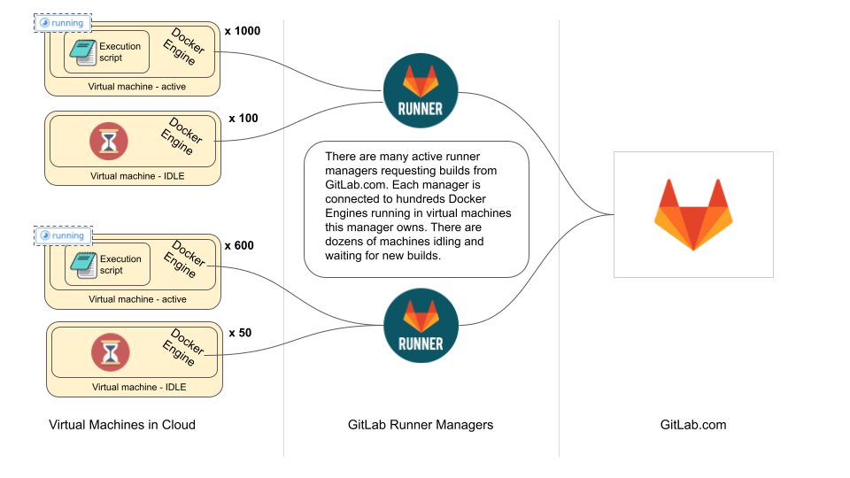

<!-- vale gitlab.FutureTense = NO -->

# Next Runner Auto-scaling Architecture

## Summary

GitLab Runner is a core component of GitLab CI/CD. It makes it possible to run
CI/CD jobs in a reliable and concurrent environment. It has been initially
introduced by Kamil Trzciński in early 2015 to replace a Ruby version of the
same service. GitLab Runner written in Go turned out to be easier to use by the
wider community, it was more efficient and reliable than the previous,
Ruby-based, version.

In February 2016 Kamil Trzciński [implemented an auto-scaling feature](https://gitlab.com/gitlab-org/gitlab-runner/-/merge_requests/53)
to leverage cloud infrastructure to run many CI/CD jobs in parallel. This
feature has become a foundation supporting CI/CD adoption on GitLab.com over
the years, where we now run around 4 million builds per day at peak.

During the initial implementation a decision was made to use Docker Machine:

> Is easy to use. Is well documented. Is well supported and constantly
> extended. It supports almost any cloud provider or virtualization
> infrastructure. We need minimal amount of changes to support Docker Machine:
> machine enumeration and inspection. We don't need to implement any "cloud
> specific" features.

This design choice was crucial for the GitLab Runner success. Since that time
the auto-scaling feature has been used by many users and customers and enabled
rapid growth of CI/CD adoption on GitLab.com.

We can not, however, continue using Docker Machine. Work on that project
[was paused in July 2018](https://github.com/docker/machine/issues/4537) and there
was no development made since that time (except for some highly important
security fixes). In 2018, after Docker Machine entered the "maintenance mode",
we decided to create [our own fork](https://gitlab.com/gitlab-org/ci-cd/docker-machine)
to be able to keep using this and ship fixes and updates needed for our use case.
[On September 26th, 2021 the project got archived](https://github.com/docker/docker.github.io/commit/2dc8b49dcbe85686cc7230e17aff8e9944cb47a5)
and the documentation for it has been removed from the official page. This
means that the original reason to use Docker Machine is no longer valid too.

To keep supporting our customers and the wider community and to improve our SaaS runners
maintenance we need to design a new mechanism for GitLab Runner auto-scaling. It not only
needs to support auto-scaling, but it also needs to do that in the way to enable us to
build on top of it to improve efficiency, reliability and availability.

We call this new mechanism the "next GitLab Runner Scaling architecture".

## Continuing building on Docker Machine

At this moment one of our core products - GitLab Runner - and one of its most
important features - ability to auto-scale job execution environments - depends
on an external product that is abandoned.

Docker Machine project itself is also hard to maintain. Its design starts to
show its age, which makes it hard to bring new features and fixes. A huge
codebase that it brings with a lack of internal knowledge about it makes it
hard for our maintainers to support and properly handle incoming feature
requests and community contributions.

Docker Machine and it integrated 20+ drivers for cloud and virtualization
providers creates also another subset of problems, like:

- Each cloud/virtualization environment brings features that come and go
  and we would need to maintain support for them (add new features, fix
  bugs).

- We basically need to become experts for each of the virtualization/cloud
  provider to properly support integration with their API,

- Every single provider that Docker Machine integrates with has its
  bugs, security releases, vulnerabilities - to maintain the project properly
  we would need to be on top of all of that and handle updates whenever
  they are needed.

Another problem is the fact that Docker Machine, from its beginnings, was
focused on managing Linux based instances only. Despite that at some moment
Docker got official and native integration on Windows, Docker Machine never
followed this step. Nor its designed to make such integration easy.

There is also no support for MacOS. This one is obvious - Docker Machine is a
tool to maintain hosts for Docker Engine and there is no native Docker Engine
for MacOS. And by native we mean MacOS containers executed within MacOS
operating system. Docker for MacOS product is not a native support - it's just
a tooling and a virtualized Linux instance installed with it that makes it
easier to develop **Linux containers** on MacOS development instances.

This means that only one of three of our officially supported platforms -
Linux, Windows and MacOS - have a fully-featured support for CI/CD
auto-scaling. For Windows there is a possibility to use Kubernetes (which in
some cases have limitations) and maybe with a lot of effort we could bring
support for Windows into Docker Machine. But for MacOS, there is no
auto-scaling solution provided natively by GitLab Runner.

This is a huge limitation for our users and a frequently requested feature.
It's also a limitation for our SaaS runners offering. We've maintained to
create some sort of auto-scaling for our SaaS Windows and SaaS MacOS runners
hacking around Custom executor. But experiences from past three years show
that it's not the best way of doing this. And yet, after this time, Windows
and MacOS runners autoscaling lacks a lot of performance and feature support
that we have with our SaaS Linux runners.

To keep supporting our customers and the wider community and to improve our
SaaS runners maintenance we need to design a new mechanism for GitLab Runner
auto-scaling. It not only needs to support auto-scaling, but it also needs to
do that in the way to enable us to build on top of it to improve efficiency,
reliability and availability.

## Proposal

Currently, GitLab Runner auto-scaling can be configured in a few ways. Some
customers are successfully using an auto-scaled environment in Kubernetes. We
know that a custom and unofficial GitLab Runner version has been built to make
auto-scaling on Kubernetes more reliable. We recognize the importance of having
a really good Kubernetes solution for running multiple jobs in parallel, but
refinements in this area are out of scope for this architectural initiative.

We want to focus on resolving problems with Docker Machine and replacing this
mechanism with a reliable and flexible mechanism. We might be unable to build a
drop-in replacement for Docker Machine, as there are presumably many reasons
why it has been deprecated. It is very difficult to maintain compatibility with
so many cloud providers, and it seems that Docker Machine has been deprecated
in favor of Docker Desktop, which is not a viable replacement for us.
[This issue](https://github.com/docker/roadmap/issues/245) contains a discussion
about how people are using Docker Machine right now, and it seems that GitLab
CI is one of the most frequent reasons for people to keep using Docker Machine.

There is also an opportunity in being able to optionally run multiple jobs in a
single, larger virtual machine. We can't do that today, but we know that this
can potentially significantly improve efficiency. We might want to build a new
architecture that makes it easier and allows us to test how efficient it is
with PoCs. Running multiple jobs on a single machine can also make it possible
to reuse what we call a "sticky context" - a space for build artifacts / user
data that can be shared between job runs.

### 💡 Design a simple abstraction that users will be able to build on top of

Because there is no viable replacement and we might be unable to support all
cloud providers that Docker Machine used to support, the key design requirement
is to make it really simple and easy for the wider community to write a custom
GitLab plugin for whatever cloud provider they might be using. We
want to design a simple abstraction that users will be able to build on top, as
will we to support existing workflows on GitLab.com.

The designed mechanism should abstract what Docker Machine executor has been doing:
providing a way to create an external Docker environment, waiting to execute
jobs by provisioning this environment and returning credentials required to
perform these operations.

The new plugin system should be available for all major platforms: Linux,
Windows, MacOS.

### 💡 Migrate existing Docker Machine solution to a plugin

Once we design and implement the new abstraction, we should be able to migrate
existing Docker Machine mechanisms to a plugin. This will make it possible for
users and customers to immediately start using the new architecture, but still
keep their existing workflows and configuration for Docker Machine. This will
give everyone time to migrate to the new architecture before we drop support
for the legacy auto-scaling entirely.

### 💡 Build plugins for AWS, Google Cloud Platform and Azure

Although we might be unable to add support for all the cloud providers that
Docker Machine used to support, it seems to be important to provide
GitLab-maintained plugins for the major cloud providers like AWS, Google Cloud
Platform and Azure.

We should build them, presumably in separate repositories, in a way that they
are easy to contribute to, fork, modify for certain needs the wider community
team members might have. It should be also easy to install a new plugin without
the need of rebuilding GitLab Runner whenever it happens.

### 💡 Write a solid documentation about how to build your own plugin

It is important to show users how to build a plugin, so that they
can implement support for their own cloud infrastructure.

Building new plugins should be simple and supported with great
documentation. We want to design the plugin system in a way that the entry barrier
for contributing new plugins is very low.

### 💡 Build a PoC to run multiple builds on a single machine

We want to better understand what kind of efficiency can running multiple jobs
on a single machine bring. It is difficult to predict that, so ideally we
should build a PoC that will help us to better understand what we can expect
from this.

To run this experiment we most likely we will need to build an experimental
plugin, that not only allows us to schedule running multiple builds on a single
machine, but also has a set of comprehensive metrics built into it, to make it
easier to understand how it performs.

## Details

How the abstraction will look exactly is something that
we will need to prototype, PoC and decide in a data-informed way. There are a
few proposals that we should describe in detail, develop requirements for, PoC
and score. We will choose the solution that seems to support our goals the
most.

In order to describe the proposals we first need to better explain what part of
the GitLab Runner needs to be abstracted away. To make this easier to grasp
these concepts, let's take a look at the current auto-scaling architecture and
sequence diagram.

On the diagrams above we see that currently a runner manager runs on a
machine that has access to a cloud provider's API. It is using Docker Machine
to provision new Virtual Machines with Docker Engine installed and it
configures the Docker daemon there to allow external authenticated requests. It
stores credentials to such ephemeral Docker environments on disk. Once a
machine has been provisioned and made available for the runner manager to
run builds, it is using one of the existing executors to run a user-provided
script. In auto-scaling, this is typically done using the Docker executor.

### Separation of concerns

There are several concerns represented in the current architecture. They are
coupled in the current implementation so we will break them out here to consider
them each separately.

- **Virtual Machine (VM) shape**. The underlying provider of a VM requires configuration to
  know what kind of machine to create. For example, Cores, memory, failure domain,
  etc... This information is very provider specific.
- **VM lifecycle management**. Multiple machines will be created and a
  system must keep track of which machines belong to this executor. Typically
  a cloud provider will have a way to manage a set of homogeneous machines.
  For example, GCE Instance Group. The basic operations are increase, decrease and
  usually delete a specific machine.
- **VM autoscaling**. In addition to low-level lifecycle management,
  job-aware capacity decisions must be made to the set of machines to provide
  capacity when it is needed but not maintain excess capacity for cost reasons.
- **Job to VM mapping (routing)**. Currently the system assigns only one job to a
  given a machine. A machine may be reused based on the specific executor
  configuration.
- **In-VM job execution**. Within each VM a job must be driven through
  various pre-defined stages and results and trace information returned
  to the Runner system. These details are highly dependent on the VM
  architecture and operating system as well as Executor type.

See also Glossary below.

#### Current state

The current architecture has several points of coupling between concerns.
Coupling reduces opportunities for abstraction (for example, community supported
plugins) and increases complexity, making the code harder to understand,
test, maintain and extend.

A primary design decision will be which concerns to externalize to the plugin
and which should remain with the runner system. The current implementation
has several abstractions internally which could be used as cut points for a
new abstraction.

For example the [`Build`](https://gitlab.com/gitlab-org/gitlab-runner/-/blob/267f40d871cd260dd063f7fbd36a921fedc62241/common/build.go#L125)
type uses the [`GetExecutorProvider`](https://gitlab.com/gitlab-org/gitlab-runner/-/blob/267f40d871cd260dd063f7fbd36a921fedc62241/common/executor.go#L171)
function to get an executor provider based on a dispatching executor string.
Various executor types register with the system by being imported and calling
[`RegisterExecutorProvider`](https://gitlab.com/gitlab-org/gitlab-runner/-/blob/267f40d871cd260dd063f7fbd36a921fedc62241/common/executor.go#L154)
during initialization. Here the abstractions are the [`ExecutorProvider`](https://gitlab.com/gitlab-org/gitlab-runner/-/blob/267f40d871cd260dd063f7fbd36a921fedc62241/common/executor.go#L80)
and [`Executor`](https://gitlab.com/gitlab-org/gitlab-runner/-/blob/267f40d871cd260dd063f7fbd36a921fedc62241/common/executor.go#L59)
interfaces.

Within the `docker+autoscaling` executor the [`machineExecutor`](https://gitlab.com/gitlab-org/gitlab-runner/-/blob/267f40d871cd260dd063f7fbd36a921fedc62241/executors/docker/machine/machine.go#L19)
type has a [`Machine`](https://gitlab.com/gitlab-org/gitlab-runner/-/blob/267f40d871cd260dd063f7fbd36a921fedc62241/helpers/docker/machine.go#L7)
interface which it uses to acquire a VM during the common [`Prepare`](https://gitlab.com/gitlab-org/gitlab-runner/-/blob/267f40d871cd260dd063f7fbd36a921fedc62241/executors/docker/machine/machine.go#L71)
phase. This abstraction primarily creates, accesses and deletes VMs.

There is no current abstraction for the VM autoscaling logic. It is tightly
coupled with the VM lifecycle and job routing logic. Creating idle capacity
happens as a side-effect of calling [`Acquire`](https://gitlab.com/gitlab-org/gitlab-runner/-/blob/267f40d871cd260dd063f7fbd36a921fedc62241/executors/docker/machine/provider.go#L449) on the `machineProvider` while binding a job to a VM.

There is also no current abstraction for in-VM job execution. VM-specific
commands are generated by the runner manager using the [`GenerateShellScript`](https://gitlab.com/gitlab-org/gitlab-runner/-/blob/267f40d871cd260dd063f7fbd36a921fedc62241/common/build.go#L336)
function and [injected](https://gitlab.com/gitlab-org/gitlab-runner/-/blob/267f40d871cd260dd063f7fbd36a921fedc62241/common/build.go#L373)
into the VM as the manager drives the job execution stages.

### Design principles

Our goal is to design a GitLab Runner plugin system interface that is flexible
and simple for the wider community to consume. As we cannot build plugins for
all cloud platforms, we want to ensure a low entry barrier for anyone who needs
to develop a plugin. We want to allow everyone to contribute.

To achieve this goal, we will follow a few critical design principles. These
principles will guide our development process for the new plugin system
abstraction.

#### General high-level principles

- Design the new auto-scaling architecture aiming for having more choices and
  flexibility in the future, instead of imposing new constraints.
- Design the new auto-scaling architecture to experiment with running multiple
  jobs in parallel, on a single machine.
- Design the new provisioning architecture to replace Docker Machine in a way
  that the wider community can easily build on top of the new abstractions.
- New auto-scaling method should become a core component of GitLab Runner product so that
  we can simplify maintenance, use the same tooling, test configuration and Go language
  setup as we do in our other main products.
- It should support multiple job execution environments - not only Docker containers
  on Linux operating system.

    The best design would be to bring auto-scaling as a feature wrapped around
    our current executors like Docker or Shell.

#### Principles for the new plugin system

- Make the entry barrier for writing a new plugin low.
- Developing a new plugin should be simple and require only basic knowledge of
  a programming language and a cloud provider's API.
- Strive for a balance between the plugin system's simplicity and flexibility.
  These are not mutually exclusive.
- Abstract away as many technical details as possible but do not hide them completely.
- Build an abstraction that serves our community well but allows us to ship it quickly.
- Invest in a flexible solution, avoid one-way-door decisions, foster iteration.
- When in doubts err on the side of making things more simple for the wider community.
- Limit coupling between concerns to make the system more simple and extensible.
- Concerns should live on one side of the plug or the other--not both, which
  duplicates effort and increases coupling.

#### The most important technical details

- Favor gRPC communication between a plugin and GitLab Runner.
- Make it possible to version communication interface and support many versions.
- Make Go a primary language for writing plugins but accept other languages too.
- Autoscaling mechanism should be fully owned by GitLab.

    Cloud provider autoscalers don't know which VM to delete when scaling down so
    they make sub-optimal decisions. Rather than teaching all autoscalers about GitLab
    jobs, we prefer to have one, GitLab-owned autoscaler (not in the plugin).

    It will also ensure that we can shape the future of the mechanism and make decisions
    that fit our needs and requirements.

## Plugin boundary proposals

The following are proposals for where to draw the plugin boundary. We will evaluate
these proposals and others by the design principles and technical constraints
listed above.

### Custom provider

In order to reduce the scope of work, we only want to introduce the new
abstraction layer in one place.

A few years ago we introduced the [Custom Executor](https://docs.gitlab.com/runner/executors/custom.html)
feature in GitLab Runner. It allows users to design custom build execution
methods. The custom executor driver can be implemented in any way - from a
simple shell script to a dedicated binary - that is then used by a Runner
through os/exec system calls.

Thanks to the custom executor abstraction there is no more need to implement
new executors internally in Runner. Users who have specific needs can implement
their own drivers and don't need to wait for us to make their work part of the
"official" GitLab Runner. As each driver is a separate project, it also makes
it easier to create communities around them, where interested people can
collaborate together on improvements and bug fixes.

We want to design the new Custom Provider to replicate the success of the
Custom Executor. It will make it easier for users to build their own ways to
provide a context and an environment in which a build will be executed by one
of the Custom Executors.

There are multiple solutions to implementing a custom provider abstraction. We
can use raw Go plugins, HashiCorp's Go Plugin, HTTP interface or gRPC based
facade service. There are many solutions, and we want to choose the most
optimal one. In order to do that, we will describe the solutions in a separate
document, define requirements and score the solution accordingly. This will
allow us to choose a solution that will work best for us and the wider
community.

This proposal places VM lifecycle and autoscaling concerns as well as job to
VM mapping (routing) into the plugin. The build need only ask for a VM and
it will get one with all aspects of lifecycle and routing already accounted
for by the plugin.

Rationale: [Description of the Custom Executor Provider proposal](https://gitlab.com/gitlab-org/gitlab-runner/-/issues/28848#note_823321515)

### Taskscaler provider

We can introduce a more simple version of the `Machine` abstraction in the
form of a "Fleeting" interface. Fleeting provides a low-level interface to
a homogeneous VM group which allows increasing and decreasing the set size
as well as consuming a VM from within the set.

Plugins for cloud providers and other VM sources are implemented via the
HashiCorp go-plugin library. This is in practice gRPC over STDIN/STDOUT
but other wire protocols can be used also.

In order to make use of the new interface, the autoscaling logic is pulled
out of the Docker Executor and placed into a new Taskscaler library.

This places the concerns of VM lifecycle, VM shape and job routing within
the plugin. It also places the concern of VM autoscaling into a separate
component so it can be used by multiple Runner Executors (not just `docker+autoscaling`).

Rationale: [Description of the InstanceGroup / Fleeting proposal](https://gitlab.com/gitlab-org/gitlab-runner/-/issues/28848#note_823430883)
POC: [Merge request](https://gitlab.com/gitlab-org/gitlab-runner/-/merge_requests/3315)

## Glossary

- **[GitLab Runner](../../../development/documentation/styleguide/word_list.md#gitlab-runner)** - the software application that you can choose to install and manage, whose source code is hosted at `gitlab.com/gitlab-org/gitlab-runner`.
- **[runners](../../../development/documentation/styleguide/word_list.md#runner-runners)** - the runner is the agent that's responsible for running GitLab CI/CD jobs in an environment and reporting the results to a GitLab instance. It /1/ retrieves jobs from GitLab, /2/ configures a local or remote build environment, and /3/ executes jobs within the provisioned environment, passing along log data and status updates to GitLab.
- **runner manager** - the runner process is often referred to as the `Runner Manager` as it manages multiple runners, which are the `[[runners]]` workers defined in the runners `config.toml` file.
- **executor** - a concrete environment which can be prepared and used to run a job. A new executor is created for each job.
- **executor provider** - an implementation capable of providing executors on demand. Executor providers are registered on import and initialized once when a runner starts up.
- **custom executor** - works as an interface between GitLab Runner and a set of binaries or shell scripts with environment variable inputs that enable executing CI jobs in any host computing environment. New custom executors can be added to the system without making any changes to the GitLab Runner codebase.
- **custom executor provider** - a new abstraction, proposed under the custom provider heading in the plugin boundary proposal section above, which allows new executor providers to be created without modifying the GitLab Runner codebase. The protocol could be similar to custom executors or done over gRPC. This abstraction places all the mechanics of producing executors within the plugin, delegating autoscaling and lifecycle management concerns to each implementation.
- **taskscaler** - a new library, proposed under the taskscaler provider heading in the plugin boundary proposal section above, which is parameterized with a concrete executor provider and a fleeting provider. Taskscaler is responsible for the autoscaling concern and can be used to autoscale any executor provider using any VM shape. Taskscaler is also responsible for the runner-specific aspect of VM lifecycle and keeps track of how many jobs are using a give VM and how many times a VM has been used.
- **fleeting** - a new library proposed along with taskscaler which provides abstractions for cloud provider VMs.
- **fleeting instance group** - the abstraction that fleeting uses to represent a pool of like VMs. This would represent a GCP IGM or an AWS ASG (without the autoscaling). Instance groups can be increased, decreased or can provide connection details for a specific VM.
- **fleeting plugin** - a concrete implementation of a fleeting instance group representing a specific IGM or ASG (when initialized). There will be N of these, one for each provider, each in its own project. We will own and maintain the core ones but some will be community supported. A new fleeting plugin can be created without making any changes to the runner, taskscaler or fleeting code bases. This makes it analogous to the custom executor provider in terms of self-service and decoupling, but along a different line of concerns.
- **fleeting plugin Google Compute** - the fleeting plugin which creates GCP instances. This lives in a separate project from the fleeting and taskscaler.
- **fleeting plugin AWS** - the fleeting plugin which creates AWS instances. This lives in a separate project from the fleeting and taskscaler.

## Status

Status: RFC.

## Who

Proposal:

<!-- vale gitlab.Spelling = NO -->

| Role                         | Who                                             |
|------------------------------|-------------------------------------------------|
| Authors                      | Grzegorz Bizon, Tomasz Maczukin, Joseph Burnett |
| Architecture Evolution Coach | Kamil Trzciński                                 |
| Engineering Leader           | Elliot Rushton, Cheryl Li                       |
| Product Manager              | Darren Eastman, Jackie Porter                   |
| Domain Expert / Runner       | Arran Walker                                    |

DRIs:

| Role        | Who             |
|-------------|-----------------|
| Leadership  | Elliot Rushton  |
| Product     | Darren Eastman  |
| Engineering | Tomasz Maczukin |

Domain experts:

| Area                   | Who          |
|------------------------|--------------|
| Domain Expert / Runner | Arran Walker |

<!-- vale gitlab.Spelling = YES -->
