<!-- vale gitlab.FutureTense = NO -->

# Next GitLab Runner Token Architecture

## Summary

GitLab Runner is a core component of GitLab CI/CD that runs
CI/CD jobs in a reliable and concurrent environment. Ever since the beginnings
of the service as a Ruby program, runners are registered in a GitLab instance with
a registration token - a randomly generated string of text. The registration token is unique for its given scope
(instance, group, or project). The registration token proves that the party that registers the runner has
administrative access to the instance, group, or project to which the runner is registered.

This approach has worked well in the initial years, but some major known issues started to
become apparent as the target audience grew:

| Problem                                     | Symptoms                                                                                                                                                                                                                                                                                                                                                                                                                                                                                                                                                               |
|---------------------------------------------|------------------------------------------------------------------------------------------------------------------------------------------------------------------------------------------------------------------------------------------------------------------------------------------------------------------------------------------------------------------------------------------------------------------------------------------------------------------------------------------------------------------------------------------------------------------------|
| Single token per scope                      | - The registration token is shared by multiple runners: <br/>- Single tokens lower the value of auditing and make traceability almost impossible; <br/>- Copied in many places for [self-registration of runners](https://docs.gitlab.com/runner/install/kubernetes.html#required-configuration); <br/>- Reports of users storing tokens in unsecured locations; <br/>- Makes rotation of tokens costly. <br/>- In the case of a security event affecting the whole instance, rotating tokens requires users to update a table of projects/namespaces, which takes a significant amount of time. |
| No provision for automatic expiration       | Requires manual intervention to change token. Addressed in [#30942](https://gitlab.com/gitlab-org/gitlab/-/issues/30942).                                                                                                                                                                                                                                                                                                                                                                                                                                        |
| No permissions model                        | Used to register a runner for protected branches, and for any tags. In this case, the registration token has permission to do everything. Effectively, someone taking a possession of registration token could steal secrets or source code.                                                                                                                                                                                                                                                                                                                                                       |
| No traceability                             | Given that the token is not created by a user, and is accessible to all administrators, there is no possibility to know the source of a leaked token.                                                                                                                                                                                                                                                                                                                                                                                                                  |
| No historical records                       | When reset, the previous value of the registration token is not stored so there is no historical data to enable deeper auditing and inspection.                                                                                                                                                                                                                                                                                                                                                                                                                        |
| Token stored in project/namespace model     | Inadvertent disclosure of token is possible.                                                                                                                                                                                                                                                                                                                                                                                                                                                                                                                           |
| Too many registered runners                 | It is too straightforward to register a new runner using a well-known registration token.                                                                                                                                                                                                                                                                                                                                                                                                                                                                              |

In light of these issues, it is important that we redesign the way in which we connect runners to the GitLab instance so that we can guarantee traceability, security, and performance.

We call this new mechanism the "next GitLab Runner Token architecture".

## Proposal

The proposal addresses the issues of a _single token per scope_ and _token storage_
by eliminating the need for a registration token. Runner creation happens
in the GitLab Runners settings page for the given scope, in the context of the authenticated user,
which provides traceability. The page provides instructions to configure the newly-created
runner in supported environments using the existing `gitlab-runner register` command.

The remaining concerns become non-issues due to the elimination of the registration token.

### Comparison of current and new runner registration flow

```mermaid
graph TD
    subgraph new[<b>New registration flow</b>]
    A[<b>GitLab</b>: User creates a runner in GitLab UI and adds the runner configuration] -->|<b>GitLab</b>: creates ci_runners record and returns<br/>new 'glrt-' prefixed authentication token| B
    B(<b>Runner</b>: User runs 'gitlab-runner register' command with</br>authentication token to register new runner machine with<br/>the GitLab instance) --> C{<b>Runner</b>: Does a .runner_system_id file exist in<br/>the gitlab-runner configuration directory?}
    C -->|Yes| D[<b>Runner</b>: Reads existing system ID] --> F
    C -->|No| E[<b>Runner</b>: Generates and persists unique system ID] --> F
    F[<b>Runner</b>: Issues 'POST /runner/verify' request<br/>to verify authentication token validity] --> G{<b>GitLab</b>: Is the authentication token valid?}
    G -->|Yes| H[<b>GitLab</b>: Creates ci_runner_machine database record if missing] --> J[<b>Runner</b>: Store authentication token in .config.toml]
    G -->|No| I(<b>GitLab</b>: Returns '403 Forbidden' error) --> K(gitlab-runner register command fails)
    J --> Z(Runner and runner machine are ready for use)
    end

    subgraph current[<b>Current registration flow</b>]
    A'[<b>GitLab</b>: User retrieves runner registration token in GitLab UI] --> B'
    B'[<b>Runner</b>: User runs 'gitlab-runner register' command<br/>with registration token to register new runner] -->|<b>Runner</b>: Issues 'POST /runner request' to create<br/>new runner and obtain authentication token| C'{<b>GitLab</b>: Is the registration token valid?}
    C' -->|Yes| D'[<b>GitLab</b>: Create ci_runners database record] --> F'
    C' -->|No| E'(<b>GitLab</b>: Return '403 Forbidden' error) --> K'(gitlab-runner register command fails)
    F'[<b>Runner</b>: Store authentication token<br/>from response in .config.toml] --> Z'(Runner is ready for use)
    end

    style new fill:#f2ffe6
```



### Using the authentication token in place of the registration token

<!-- vale gitlab.Spelling = NO -->
In this proposal, runners created in the GitLab UI are assigned
[authentication tokens](../../../security/token_overview.md#runner-authentication-tokens-also-called-runner-tokens)
prefixed with `glrt-` (**G**it**L**ab **R**unner **T**oken).
<!-- vale gitlab.Spelling = YES -->
The prefix allows the existing `register` command to use the authentication token _in lieu_
of the current registration token (`--registration-token`), requiring minimal adjustments in
existing workflows.
The authentication token is shown to the user only once - after completing the creation flow - to
discourage unintended reuse.

Given that the runner is pre-created through the GitLab UI, the `register` command fails if
provided with arguments that are exposed in the runner creation form.
Some examples are `--tag-list`, `--run-untagged`, `--locked`, or `--access-level` as these are
sensitive parameters that should be decided at creation time by an administrator/owner.
The runner configuration is generated through the existing `register` command, which can behave in
two different ways depending on whether it is supplied a registration token or an authentication
token in the `--registration-token` argument:

| Token type | Behavior |
| ---------- | -------- |
| [Registration token](../../../security/token_overview.md#runner-authentication-tokens-also-called-runner-tokens) | Leverages the `POST /api/v4/runners` REST endpoint to create a new runner, creating a new entry in `config.toml`. |
| [Authentication token](../../../security/token_overview.md#runner-authentication-tokens-also-called-runner-tokens) | Leverages the `POST /api/v4/runners/verify` REST endpoint to ensure the validity of the authentication token. Creates an entry in `config.toml` file and a `system_id` value in a sidecar file if missing (`.runner_system_id`). |

### Transition period

During a transition period, legacy tokens ("registration tokens") continue to be shown on the
GitLab Runners settings page and to be accepted by the `gitlab-runner register` command.
The legacy workflow is nevertheless discouraged in the UI.
Users are steered towards the new flow consisting of creating the runner in the UI and using the
resulting authentication token with the `gitlab-runner register` command as they do today.
This approach reduces disruption to users responsible for deploying runners.

### Reusing the runner authentication token across many machines

In the existing autoscaling model, a new runner is created whenever a new job needs to be executed.
This has led to many situations where runners are left behind and become stale.

In the proposed model, a `ci_runners` table entry describes a configuration that the user can reuse
across multiple machines, and runner state from each machine (for example, IP address, platform,
or architecture) is moved to a separate table (`ci_runner_machines`).
A unique system identifier is [generated automatically](#generating-a-system_id-value) whenever the
runner application starts up or the configuration is saved.
This allows differentiating the machine in which the runner is being used.

The `system_id` value complements the short runner token that is used to identify a runner in
command line output, CI job logs, and GitLab UI.

Given that the creation of runners involves user interaction, it should be possible
to eventually lower the per-plan limit of CI runners that can be registered per scope.

#### Generating a `system_id` value

We ensure that a unique system identifier is assigned at all times to a `gitlab-runner`
installation.
The ID is derived from an existing machine identifier such as `/etc/machine-id` (on Linux) and
hashed for privacy, in which case it is prefixed with `s_`.
If an ID is not available, a random string is used instead, in which case it is prefixed with `r_`.

This unique ID identifies the `gitlab-runner` process and is sent
on `POST /api/v4/jobs` requests for all runners in the `config.toml` file.

The ID is generated and saved both at `gitlab-runner` startup and whenever the configuration is
saved to disk.
Instead of saving the ID at the root of `config.toml` though, we save it to a new file that lives
next to it - `.runner_system_id`. The goal for this new file is to make it less likely that IDs
get reused due to manual copying of the `config.toml` file

```plain
s_cpwhDr7zFz4xBJujFeEM
```

### Runner identification in CI jobs

For users to identify the machine where the job was executed, the unique identifier needs to be
visible in CI job contexts.
As a first iteration, GitLab Runner will include the unique system identifier in the build logs,
wherever it publishes the short token SHA.

Given that the runner can potentially be reused with different unique system identifiers,
we should store the unique system ID in the database.
This ensures the unique system ID maps to a GitLab Runner's `system_id` value with the runner token.
A new `ci_runner_machines` table holds information about each unique runner machine,
with information regarding when the runner last connected, and what type of runner it was.

In the long term, the relevant fields are to be moved from the `ci_runners` into
`ci_runner_machines`.
Until the removal milestone though, they should be kept in the `ci_runners` as a fallback when a
matching `ci_runner_machines` record does not exist.
An expected scenario is the case when the table is created but the runner hasn't pinged the GitLab
instance (for example if the runner is offline).

In addition, we should add the following columns to `ci_runners`:

- a `creator_id` column to keep track of who created a runner;
- a `registration_type` enum column to `ci_runners` to signal whether a runner has been created
  using the legacy `register` method, or the new UI-based method.
  Possible values are `:registration_token` and `:authenticated_user`.
  This allows the stale runner cleanup service to determine which runners to clean up, and allows
  future uses that may not be apparent.

```sql
CREATE TABLE ci_runners (
  ...
  creator_id bigint
  registration_type int8
)
```

A new `p_ci_runner_machine_builds` table joins the `ci_runner_machines` and `ci_builds` tables, to avoid
adding more pressure to those tables.
We might consider a more efficient way to store `contacted_at` than updating the existing record.

```sql
CREATE TABLE p_ci_runner_machine_builds (
    partition_id bigint DEFAULT 100 NOT NULL,
    build_id bigint NOT NULL,
    runner_machine_id bigint NOT NULL
)
PARTITION BY LIST (partition_id);

CREATE TABLE ci_runner_machines (
    id bigint NOT NULL,
    system_xid character varying UNIQUE NOT NULL,
    contacted_at timestamp without time zone,
    version character varying,
    revision character varying,
    platform character varying,
    architecture character varying,
    ip_address character varying,
    executor_type smallint,
    config jsonb DEFAULT '{}'::jsonb NOT NULL
);
```

## Advantages

- Easier for users to wrap their minds around the concept: instead of two types of tokens,
  there is a single type of token - the per-runner authentication token. Having two types of tokens
  frequently results in misunderstandings when discussing issues;
- Runners can always be traced back to the user who created it, using the audit log;
- The claims of a CI runner are known at creation time, and cannot be changed from the runner
  (for example, changing the `access_level`/`protected` flag). Authenticated users
  may however still edit these settings through the GitLab UI;
- Easier cleanup of stale runners, which doesn't touch the `ci_runner` table.

## Details

In the proposed approach, we create a distinct way to configure runners that is usable
alongside the current registration token method during a transition period. The idea is
to avoid having the Runner make API calls that allow it to leverage a single "god-like"
token to register new runners.

The new workflow looks as follows:

  1. The user opens the Runners settings page (instance, group, or project level);
  1. The user fills in the details regarding the new desired runner, namely description,
  tags, protected, locked, etc.;
  1. The user clicks `Create`. That results in the following:

      1. Creates a new runner in the `ci_runners` table (and corresponding `glrt-` prefixed authentication token);
      1. Presents the user with instructions on how to configure this new runner on a machine,
         with possibilities for different supported deployment scenarios (e.g. shell, `docker-compose`, Helm chart, etc.)
         This information contains a token which is available to the user only once, and the UI
         makes it clear to the user that the value shall not be shown again, as registering the same runner multiple times
         is discouraged (though not impossible).

  1. The user copies and pastes the instructions for the intended deployment scenario (a `register` command), leading to the following actions:

      1. Upon executing the new `gitlab-runner register` command in the instructions, `gitlab-runner` performs
      a call to the `POST /api/v4/runners/verify` with the given runner token;
      1. If the `POST /api/v4/runners/verify` GitLab endpoint validates the token, the `config.toml`
      file is populated with the configuration;
      1. Whenever a runner pings for a job, the respective `ci_runner_machines` record is
         ["upserted"](https://en.wiktionary.org/wiki/upsert) with the latest information about the
         runner (with Redis cache in front of it like we do for Runner heartbeats).

As part of the transition period, we provide admins and top-level group owners with an
instance/group-level setting (`allow_runner_registration_token`) to disable the legacy registration
token functionality and enforce using only the new workflow.
Any attempt by a `gitlab-runner register` command to hit the `POST /api/v4/runners` endpoint
to register a new runner with a registration token results in a `HTTP 410 Gone` status code.

The instance setting is inherited by the groups. This means that if the legacy registration method
is disabled at the instance method, the descendant groups/projects mandatorily prevents the legacy
registration method.

The registration token workflow is to be deprecated (with a deprecation notice printed by the `gitlab-runner register` command)
and removed at a future major release after the concept is proven stable and customers have migrated to the new workflow.

### Handling of legacy runners

Legacy versions of GitLab Runner do not send the unique system identifier in its requests, and we
will not change logic in Workhorse to handle unique system IDs. This can be improved upon in the
future after the legacy registration system is removed, and runners have been upgraded to newer
versions.

Job pings from such legacy runners results in a `ci_runner_machines` record containing a
`<legacy>` `system_xid` field value.

Not using the unique system ID means that all connected runners with the same token are
notified, instead of just the runner matching the exact system identifier. While not ideal, this is
not an issue per-se.

### `ci_runner_machines` record lifetime

New records are created in 2 situations:

- when the runner calls the `POST /api/v4/runners/verify` endpoint as part of the
`gitlab-runner register` command, if the specified runner token is prefixed with `glrt-`.
This allows the frontend to determine whether the user has successfully completed the registration and take an
appropriate action;
- when GitLab is pinged for new jobs and a record matching the `token`+`system_id` does not already exist.

Due to the time-decaying nature of the `ci_runner_machines` records, they are automatically
cleaned after 7 days after the last contact from the respective runner.

### Required adaptations

#### Migration to `ci_runner_machines` table

When details from `ci_runner_machines` are needed, we need to fall back to the existing fields in
`ci_runner` if a match is not found in `ci_runner_machines`.

#### REST API

API endpoints receiving runner tokens should be changed to also take an optional
`system_id` parameter, sent alongside with the runner token (most often as a JSON parameter on the
request body).

#### GraphQL `CiRunner` type

The [`CiRunner` type](../../../api/graphql/reference/index.md#cirunner) closely reflects the
`ci_runners` model. This means that machine information such as `ipAddress`, `architectureName`,
and `executorName` among others are no longer singular values in the proposed approach.
We can live with that fact for the time being and start returning lists of unique values, separated
by commas.
The respective `CiRunner` fields must return the values for the `ci_runner_machines` entries
(falling back to `ci_runner` record if non-existent).

#### Stale runner cleanup

The functionality to
[clean up stale runners](../../../ci/runners/configure_runners.md#clean-up-stale-runners) needs
to be adapted to clean up `ci_runner_machines` records instead of `ci_runners` records.

At some point after the removal of the registration token support, we'll want to create a background
migration to clean up stale runners that have been created with a registration token (leveraging the
enum column created in the `ci_runners` table.

### Runner creation through API

Automated runner creation is possible through a new GraphQL mutation and the existing
[`POST /runners` REST API endpoint](../../../api/runners.md#register-a-new-runner).
The difference in the REST API endpoint is that it is modified to accept a request from an
authorized user with a scope (instance, a group, or a project) instead of the registration token.
These endpoints are only available to users that are
[allowed](../../../user/permissions.md#gitlab-cicd-permissions) to create runners at the specified
scope.

## Implementation plan

### Stage 1 - Deprecations

| Component        | Milestone | Changes |
|------------------|----------:|---------|
| GitLab Rails app | `15.6` | Deprecate `POST /api/v4/runners` endpoint for `17.0`. This hinges on a [proposal](https://gitlab.com/gitlab-org/gitlab/-/issues/373774) to allow deprecating REST API endpoints for security reasons. |
| GitLab Runner    | `15.6` | Add deprecation notice for `register` command for `17.0`. |
| GitLab Runner Helm Chart | `15.6` | Add deprecation notice for `runnerRegistrationToken` command for `17.0`. |
| GitLab Runner Operator | `15.6` | Add deprecation notice for `runner-registration-token` command for `17.0`. |
| GitLab Runner / GitLab Rails app | `15.7` | Add deprecation notice for registration token reset for `17.0`. |

### Stage 2 - Prepare `gitlab-runner` for `system_id`

| Component        | Milestone | Changes |
|------------------|----------:|---------|
| GitLab Runner    | `15.7` | Ensure a sidecar TOML file exists with a `system_id` value.<br/>Log new system ID values with `INFO` level as they get assigned. |
| GitLab Runner    | `15.9` | Log unique system ID in the build logs. |
| GitLab Runner    | `15.9` | Label Prometheus metrics with unique system ID. |
| GitLab Runner    | `15.8` | Prepare `register` command to fail if runner server-side configuration options are passed together with a new `glrt-` token. |

### Stage 2a - Prepare GitLab Runner Helm Chart and GitLab Runner Operator

| Component        | Milestone | Issue | Changes |
|------------------|----------:|-------|---------|
|GitLab Runner Helm Chart| `%15.10` | Update the Runner Helm Chart to support registration with the authentication token. |
|GitLab Runner Operator| `%15.10` | Update the Runner Operator to support registration with the authentication token. |

### Stage 3 - Database changes

| Component        | Milestone | Changes |
|------------------|----------:|---------|
| GitLab Rails app | `%15.8` | Create database migration to add columns to `ci_runners` table. |
| GitLab Rails app | `%15.8` | Create database migration to add `ci_runner_machines` table. |
| GitLab Rails app | `%15.9` | Create database migration to add `ci_runner_machines.id` foreign key to `ci_builds_metadata` table. |
| GitLab Rails app | `%15.8` | Create database migrations to add `allow_runner_registration_token` setting to `application_settings` and `namespace_settings` tables (default: `true`). |
| GitLab Rails app | `%15.8` | Create database migration to add `config` column to `ci_runner_machines` table. |
| GitLab Runner    | `%15.9` | Start sending `system_id` value in `POST /jobs/request` request and other follow-up requests that require identifying the unique system. |
| GitLab Rails app | `%15.9` | Create service similar to `StaleGroupRunnersPruneCronWorker` service to clean up `ci_runner_machines` records instead of `ci_runners` records.<br/>Existing service continues to exist but focuses only on legacy runners. |
| GitLab Rails app | `%15.9` | Implement the `create_runner_machine` [feature flag](../../../administration/feature_flags.md). |
| GitLab Rails app | `%15.9` | Create `ci_runner_machines` record in `POST /runners/verify` request if the runner token is prefixed with `glrt-`. |
| GitLab Rails app | `%15.9` | Use runner token + `system_id` JSON parameters in `POST /jobs/request` request in the [heartbeat request](https://gitlab.com/gitlab-org/gitlab/blob/c73c96a8ffd515295842d72a3635a8ae873d688c/lib/api/ci/helpers/runner.rb#L14-20) to update the `ci_runner_machines` cache/table. |
| GitLab Rails app | `%15.9` | Implement the `create_runner_workflow_for_admin`  [feature flag](../../../administration/feature_flags.md). |
| GitLab Rails app | `%15.9` | Implement `create_{instance|group|project}_runner` permissions. |
| GitLab Rails app | `%15.9` | Rename `ci_runner_machines.machine_xid` column to `system_xid` to be consistent with `system_id` passed in APIs. |
| GitLab Rails app | `%15.10` | Remove the ignore rule for `ci_runner_machines.machine_xid` column. |
| GitLab Rails app | `%15.10` | Replace `ci_builds_metadata.runner_machine_id` with a new join table. |
| GitLab Rails app | `%15.11` | Drop `ci_builds_metadata.runner_machine_id` column. |
| GitLab Rails app | `%16.0` | Remove the ignore rule for `ci_builds_metadata.runner_machine_id` column. |

### Stage 4 - Create runners from the UI

| Component        | Milestone | Changes |
|------------------|----------:|---------|
| GitLab Rails app | `%15.9` | [Add prefix to newly generated runner authentication tokens](https://gitlab.com/gitlab-org/gitlab/-/issues/383198). |
| GitLab Rails app | `%15.9` | Add new runner field for with token that is used in registration |
| GitLab Rails app | `%15.9` | Implement new GraphQL user-authenticated API to create a new runner. |
| GitLab Rails app | `%15.10` | Return token and runner ID information from `/runners/verify` REST endpoint. |
| GitLab Runner    | `%15.10` | [Modify register command to allow new flow with glrt- prefixed authentication tokens](https://gitlab.com/gitlab-org/gitlab-runner/-/issues/29613). |
| GitLab Runner    | `%15.10` | Make the `gitlab-runner register` command happen in a single operation. |
| GitLab Rails app | `%15.10` | Define feature flag and policies for "New Runner creation workflow" for groups and projects. |
| GitLab Rails app | `%15.10` | Only update runner `contacted_at` and `status` when polled for jobs. |
| GitLab Rails app | `%15.10` | Add GraphQL type to represent runner machines under `CiRunner`. |
| GitLab Rails app | `%15.11` | Implement UI to create new instance runner. |
| GitLab Rails app | `%15.11` | Update service and mutation to accept groups and projects. |
| GitLab Rails app | `%15.11` | Implement UI to create new group/project runners. |
| GitLab Rails app | `%15.11` | Add runner_machine field to CiJob GraphQL type. |
| GitLab Rails app | `%15.11` | UI changes to runner details view (listing of platform, architecture, IP address, etc.) (?) |
| GitLab Rails app | `%15.11` | Adapt `POST /api/v4/runners` REST endpoint to accept a request from an authorized user with a scope instead of a registration token. |
| GitLab Runner    | `%15.11` | Handle `glrt-` runner tokens in `unregister` command. |
| GitLab Runner    | `%15.11` | Runner asks for registration token when a `glrt-` runner token is passed in `--token`. |
| GitLab Rails app | `%15.11` | Move from 'runner machine' terminology to 'runner manager'. |

### Stage 5 - Optional disabling of registration token

| Component        | Milestone | Changes |
|------------------|----------:|---------|
| GitLab Rails app | `%16.0` | Adapt `register_{group|project}_runner` permissions to take [application setting](https://gitlab.com/gitlab-org/gitlab/-/issues/386712) in consideration. |
| GitLab Rails app | | Add UI to allow disabling use of registration tokens at project or group level. |
| GitLab Rails app | | Introduce `:enforce_create_runner_workflow` feature flag (disabled by default) to control whether use of registration tokens is allowed. |
| GitLab Rails app | | Make [`POST /api/v4/runners` endpoint](../../../api/runners.md#register-a-new-runner) permanently return `HTTP 410 Gone` if either `allow_runner_registration_token` setting or `:enforce_create_runner_workflow` feature flag disables registration tokens.<br/>A future v5 version of the API should return `HTTP 404 Not Found`. |
| GitLab Rails app | | Start refusing job requests that don't include a unique ID, if either `allow_runner_registration_token` setting or `:enforce_create_runner_workflow` feature flag disables registration tokens. |
| GitLab Rails app | | Hide legacy UI showing registration with a registration token, if `:enforce_create_runner_workflow` feature flag disables registration tokens. |

### Stage 6 - Enforcement

| Component        | Milestone | Changes |
|------------------|----------:|---------|
| GitLab Rails app | `%16.6`   | Enable `:enforce_create_runner_workflow` feature flag by default. |
| GitLab Rails app | `%16.6`   | Start reject job requests that don't include `system_id` value. |

### Stage 7 - Removals

| Component        | Milestone | Changes |
|------------------|----------:|---------|
| GitLab Rails app | `17.0` | Remove legacy UI showing registration with a registration token. |
| GitLab Runner    | `17.0` | Remove runner model arguments from `register` command (for example `--run-untagged`, `--tag-list`, etc.) |
| GitLab Rails app | `17.0` | Create database migrations to drop `allow_runner_registration_token` setting columns from `application_settings` and `namespace_settings` tables. |
| GitLab Rails app | `17.0` | Create database migrations to drop:<br/>- `runners_registration_token`/`runners_registration_token_encrypted` columns from `application_settings`;<br/>- `runners_token`/`runners_token_encrypted` from `namespaces` table;<br/>- `runners_token`/`runners_token_encrypted` from `projects` table. |
| GitLab Rails app | `17.0` | Remove `:enforce_create_runner_workflow` feature flag. |

## FAQ

### Will my runner registration workflow break?

If no action is taken before your GitLab instance is upgraded to 16.6, then your runner registration
worflow will break.
For self-managed instances, to continue using the previous runner registration process,
you can disable the `enforce_create_runner_workflow` feature flag until GitLab 17.0.

To avoid a broken workflow, you need to first create a runner in the GitLab runners admin page.
After that, you'll need to replace the registration token you're using in your runner registration
workflow with the obtained runner authentication token.

### What is the new runner registration process?

When the new runner registration process is introduced, you will:

1. Create a runner directly in the GitLab UI.
1. Receive an authentication token in return.
1. Use the authentication token instead of the registration token.

This has added benefits such as preserved ownership records for runners, and minimizes
impact on users.
The addition of a unique system ID ensures that you can reuse the same authentication token across
multiple runners.
For example, in an auto-scaling scenario where a runner manager spawns a runner process with a
fixed authentication token.
This ID generates once at the runner's startup, persists in a sidecar file, and is sent to the
GitLab instance when requesting jobs.
This allows the GitLab instance to display which system executed a given job.

### What is the estimated timeframe for the planned changes?

- In GitLab 15.10, we plan to implement runner creation directly in the runners administration page,
  and prepare the runner to follow the new workflow.
- In GitLab 16.6, we plan to disable registration tokens.
  For self-managed instances, to continue using
  registration tokens, you can disable the `enforce_create_runner_workflow` feature flag until
  GitLab 17.0.

  Previous `gitlab-runner` versions (that don't include the new `system_id` value) will start to be
  rejected by the GitLab instance;
- In GitLab 17.0, we plan to completely remove support for runner registration tokens.

### How will the `gitlab-runner register` command syntax change?

The `gitlab-runner register` command will stop accepting registration tokens and instead accept new
authentication tokens generated in the GitLab runners administration page.
These authentication tokens are recognizable by their `glrt-` prefix.

Example command for GitLab 15.9:

```shell
gitlab-runner register
    --executor "shell" \
    --url "https://gitlab.com/" \
    --tag-list "shell,mac,gdk,test" \
    --run-untagged="false" \
    --locked="false" \
    --access-level="not_protected" \
    --non-interactive \
    --registration-token="GR1348941C6YcZVddc8kjtdU-yWYD"
```

In GitLab 16.0, the runner will be created in the UI where some of its attributes can be
pre-configured by the creator.
Examples are the tag list, locked status, or access level. These are no longer accepted as arguments
to `register`. The following example shows the new command:

```shell
gitlab-runner register
    --executor "shell" \
    --url "https://gitlab.com/" \
    --non-interactive \
    --registration-token="glrt-2CR8_eVxiioB1QmzPZwa"
```

### How does this change impact auto-scaling scenarios?

In auto-scaling scenarios such as GitLab Runner Operator or GitLab Runner Helm Chart, the
registration token is replaced with the authentication token generated from the UI.
This means that the same runner configuration is reused across jobs, instead of creating a runner
for each job.
The specific runner can be identified by the unique system ID that is generated when the runner
process is started.

## Status

Status: RFC.

## Who

Proposal:

<!-- vale gitlab.Spelling = NO -->

| Role                         | Who
|------------------------------|--------------------------------------------------|
| Authors                      | Kamil Trzciński, Tomasz Maczukin, Pedro Pombeiro |
| Architecture Evolution Coach | Kamil Trzciński                                  |
| Engineering Leader           | Elliot Rushton, Cheryl Li                        |
| Product Manager              | Darren Eastman, Jackie Porter                    |
| Domain Expert / Runner       | Tomasz Maczukin                                  |

DRIs:

| Role                         | Who                             |
|------------------------------|---------------------------------|
| Leadership                   | Elliot Rushton                  |
| Product                      | Darren Eastman                  |
| Engineering                  | Tomasz Maczukin, Pedro Pombeiro |

Domain experts:

| Area                         | Who             |
|------------------------------|-----------------|
| Domain Expert / Runner       | Tomasz Maczukin |

<!-- vale gitlab.Spelling = YES -->
