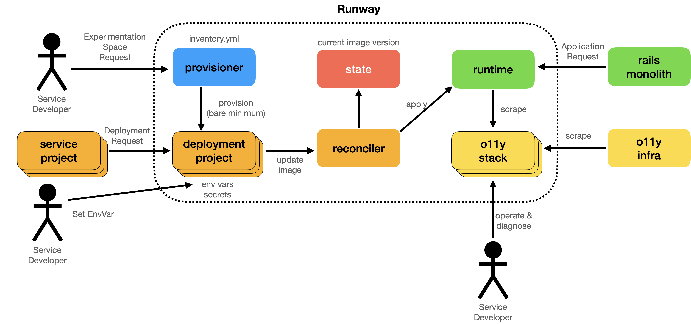
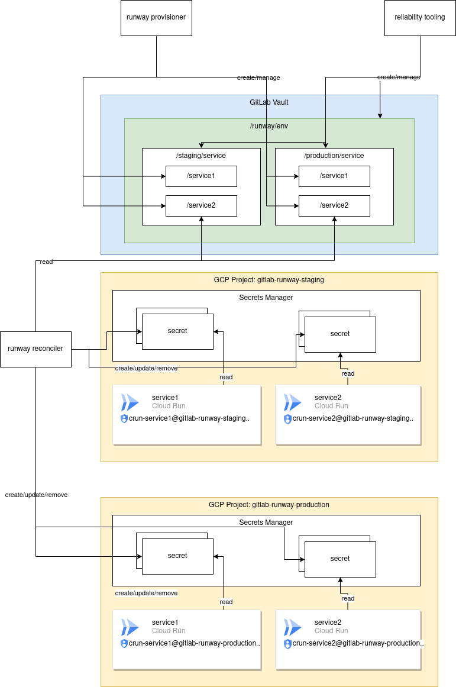

<!-- Blueprints often contain forward-looking statements -->
<!-- vale gitlab.FutureTense = NO -->

# Runway: A PaaS for GitLab

## Summary

Runway is an internal Platform as a Service for GitLab, which aims to enable teams to deploy and run their services quickly and safely.

## Motivation

<!--
This section is for explicitly listing the motivation, goals and non-goals of
this blueprint. Describe why the change is important, all the opportunities,
and the benefits to users.

The motivation section can optionally provide links to issues that demonstrate
interest in a blueprint within the wider GitLab community. Links to
documentation for competing products and services is also encouraged in cases
where they demonstrate clear gaps in the functionality GitLab provides.

For concrete proposals we recommend laying out goals and non-goals explicitly,
but this section may be framed in terms of problem statements, challenges, or
opportunities. The latter may be a more suitable framework in cases where the
problem is not well-defined or design details not yet established.
-->

The underlying motivation for this initiative is covered in [the Service Integration blueprint](../gitlab_ml_experiments/index.md). This blueprint can be considered the implementation of the strategic requirements put forward in that proposal.

### Goals

<!--
List the specific goals / opportunities of the blueprint.

- What is it trying to achieve?
- How will we know that this has succeeded?
- What are other less tangible opportunities here?
-->

- Development teams aiming to deploy their service without having to worry too much about managing the infrastructure, scaling, monitoring.
- We are focusing on satellite services that are stateless and thus can be autoscaled to meet demand.
- We aim to integrate with existing GitLab features and tooling to provide a streamlined experience.

### Non-Goals

<!--
Listing non-goals helps to focus discussion and make progress. This section is
optional.

- What is out of scope for this blueprint?
-->

- Hosting the GitLab monolith: The monolith is a complex application with very specialized requirements, and as such is out of scope. Deployment of the monolith is owned by the Delivery team, and there are other tools and initiatives that target this space, e.g. [Cells](../cells/index.md).
- Arbitrary GCP resources: While we may support a commonly used subset of GCP resources, we will be selective with what we support. If you need more flexibility, you may want to request a [GitLab Sandbox](https://handbook.gitlab.com/handbook/infrastructure-standards/realms/sandbox/) project instead.
- Arbitrary Kubernetes resources: As a managed platform, we aim not to expose too much of the underlying deployment mechanisms. This allows us to have a well-supported subset and gives us the flexibility to change providers. If you have specialized requirements, getting your own Kubernetes cluster may be a better option.

## Proposal

<!--
This is where we get down to the specifics of what the proposal actually is,
but keep it simple!  This should have enough detail that reviewers can
understand exactly what you're proposing, but should not include things like
API designs or implementation. The "Design Details" section below is for the
real nitty-gritty.

You might want to consider including the pros and cons of the proposed solution so that they can be
compared with the pros and cons of alternatives.
-->

Runway is a means for deploying a service, packaged up as a Docker image to a production environment. It leverages GitLab CI/CD as well as other GitLab product features to do this.

## Design and implementation details

<!--
This section should contain enough information that the specifics of your
change are understandable. This may include API specs (though not always
required) or even code snippets. If there's any ambiguity about HOW your
proposal will be implemented, this is the place to discuss them.

If you are not sure how many implementation details you should include in the
blueprint, the rule of thumb here is to provide enough context for people to
understand the proposal. As you move forward with the implementation, you may
need to add more implementation details to the blueprint, as those may become
an important context for important technical decisions made along the way. A
blueprint is also a register of such technical decisions. If a technical
decision requires additional context before it can be made, you probably should
document this context in a blueprint. If it is a small technical decision that
can be made in a merge request by an author and a maintainer, you probably do
not need to document it here. The impact a technical decision will have is
another helpful information - if a technical decision is very impactful,
documenting it, along with associated implementation details, is advisable.

If it's helpful to include workflow diagrams or any other related images.
Diagrams authored in GitLab flavored markdown are preferred. In cases where
that is not feasible, images should be placed under `images/` in the same
directory as the `index.md` for the proposal.
-->

The design of Runway aims to decouple individual components in a way that allows them to be changed and replaced over time.

### Architecture

[Diagram Source](https://gitlab.com/gitlab-com/gl-infra/platform/runway/team/uploads/a6b6646efaa084937ef1f961ad902b59/runway-arch.key)

[Initial Architecture Discussion](https://gitlab.com/gitlab-com/gl-infra/platform/runway/team/-/issues/7)

### Provisioner

Provisioner is the privileged code that creates service accounts and minimal resources needed by the rest of the system.

This process is responsible for taking a request "create an experimentation space for me", and stamping out the minimum required infrastructure for that space. It also covers decommissioning when a space is no longer needed.

- It is currently based on Terraform.
- Terraform runs via CI on the provisioner project.
- We store terraform state in the GitLab Terraform state backend.

### Reconciler

The Reconciler is the heart of the system. It is responsible for creating a desired view of the world (based on service definition and current version), finding the differences from the actual state, and then applying that diff.

Deploying a new version of a service is a matter of invoking the Reconciler.

This process is responsible for taking an artifact (e.g. a Docker image) from a service developer and bringing that into a runtime. This includes rollout strategies, rollbacks, canarying, multi-environment promotion, as well as diagnostic tools for failed deploys. Some of these capabilities may also be delegated to the runtime. There should also be a standard way for connecting an existing code base to a deployment.

- It is currently based on Terraform.
- Terraform runs via CI on the deployment project, triggered as a downstream pipeline from the service project.
- We store terraform state in the GitLab Terraform state backend on the deployment project.

The user-facing integration with the Reconciler is mediated via [`ci-tasks/service-project/runway.yml`](https://gitlab.com/gitlab-com/gl-infra/platform/runway/ci-tasks/-/blob/main/service-project/runway.yml), which is a version-locked CI task that service projects include into their CI config.

### Runtime

The runtime is responsible for actually scheduling and running the service workloads. Reconciler targets a runtime. Runtime will provide autoscaled compute resources with a degree of tenant isolation. It will also optionally expose an endpoint at which the workload can be reached. This endpoint will have a DNS name and be TLS encrypted.

- It is currently based on Cloud Run.
- If we need more flexibility, [Knative](https://knative.dev/docs/) is a likely migration target.

A service should expose an HTTP port, and it should be stateless (allowing instances to be auto-scaled). Other execution models (e.g. scheduled jobs) may be supported in the future.

#### Images used by Runtime

The images deployed by Runway are built by the teams responsible for the service. They are able to build the image in any fashion they wish and keep it inside the GitLab container registry of the service project. As part of the Runway deployment process, this image is mirrored to [GCP Artifact Registry](https://cloud.google.com/artifact-registry) before being consumed by Cloud Run. This is for two reasons:

1. Cloud run is only able to consume images from GCP Artifact Registry.
1. This means that if for whatever reason the image tag is changed in the future (by error), the image running inside Runway is not affected.

#### GCP Project Layout

Runway currently uses shared GCP projects based off three environments (dev, staging, production). These GCP projects are

- Dev: `runway-dev-527768b3` (managed by IT [HackyStack](https://handbook.gitlab.com/handbook/infrastructure-standards/realms/sandbox/))
- Staging: `gitlab-runway-staging` (managed by [reliability](https://gitlab.com/gitlab-com/gl-infra/config-mgmt/-/tree/master/environments/runway-staging?ref_type=heads)
- Production: `gitlab-runway-production` (managed by [reliability](https://gitlab.com/gitlab-com/gl-infra/config-mgmt/-/tree/master/environments/runway-production?ref_type=heads)

### Documents and Schemas used by Runway

In order for runway to function, there are two JSON/YAML documents in use. They are:

1. The Runway Inventory Model. This covers what service projects are currently onboarded into Runway. It's located [here](https://gitlab.com/gitlab-com/gl-infra/platform/runway/provisioner/-/blob/main/inventory.json?ref_type=heads). The schema used to validate the docuemnt is located [here](https://gitlab.com/gitlab-com/gl-infra/platform/runway/runwayctl/-/blob/main/schemas/service-inventory/v1.0.0-beta/inventory.schema.json?ref_type=heads). There is no backwards compatibility guarenteed to changes to this document schema. This is because it's only used internally by the Runway team, and there is only a single document actually being used by Runway to provision/deprovision Runway services.

1. The runway Service Model. This is used by Runway users to pass through configuration needed to Runway in order to deploy their service. It's located inside their Service project, at `.runway/runway.yml`. [An example is here](https://gitlab.com/gitlab-org/modelops/applied-ml/code-suggestions/ai-assist/-/blob/main/.runway/runway.yml?ref_type=heads). The schema used to validate the document is located [here](https://gitlab.com/gitlab-com/gl-infra/platform/runway/runwayctl/-/blob/main/schemas/service-manifest/v1.0.0-beta/manifest.schema.json?ref_type=heads). We aim to continue to make improvements and changes to the model, but all changes to the model within the same `kind/apiVersion` must be backwards compatible. In order to
   make breaking changes, a new `apiVersion` of the schema will be released. The overall goal is to copy the [Kubernetes model for making API changes](https://github.com/kubernetes/community/blob/master/contributors/devel/sig-architecture/api_changes.md).

There are also [GitLab CI templates](https://gitlab.com/gitlab-com/gl-infra/platform/runway/ci-tasks) used by Runway users in order to automate deployments via Runway through GitLab CI. Users will be encouraged to use tools such as [Renovate bot](https://gitlab.com/gitlab-com/gl-infra/common-ci-tasks/-/blob/main/renovate-bot.md) in order to make sure the CI templates and
version of Runway they are using is up to date. The Runway team will support all released versions of Runway, with the exception of when a security issue is identified. When this happens, Runway users will be expected to update to a version of Runway that contains a fix for the issue as soon as possible (once notification is received).

### Secrets management

For secrets management we aim to integrate with our existing HashiCorp Vault setup. We will sync secrets from Vault to whatever secrets store the Runtime integrates best with. For Cloud Run, we will use Google Secret Manager. For Kubernetes, we would use external-secrets to sync to Kubernetes Secret objects.

The following high level diagram shows the proposed setup of secrets within Vault, for consumption via runway. The general idea is a top level namespace (`/runway`) will be made in Vault, with roles and policies such that:

- Runway team members have full privileges over the namespace.
- The runway provisioner running in CI has the ability to create/modify/delete new service namespaces at `runway/env/$environment/service`. The environments currently needed are dev, staging, and production.
- The runway reconciler service accounts and GitLab team members will need read only access to `runway/env/$environment/service/$runway_service_id` in order to read secrets for deployment.
- The runway reconciler will mirror secrets in Vault into Google Secrets Manager for consumption in Cloud Run via its native secrets integration.

[Diagram Source](img/runway_vault_4_.drawio)

### Identity Management, Authentication, Authorization across Runway Components

The goal of Runway is to not rely on long lived secrets or tokens inside the runway components themselves. In order to achieve this, all pieces of runway authenticate to each other in the following ways.

#### Service projects to runway deployment projects

This is handled by GitLab downstream pipeline triggers. Because of this, all permissions are handled within GitLab itself (and API calls to GitLab use short lived `CI_JOB_TOKEN`). We leverage [CI_JOB_TOKEN allowlists](../../../ci/jobs/ci_job_token.md#add-a-project-to-the-job-token-allowlist) to allow deployment projects and service projects to interact in API calls (e.g. updating environments in the service project).

#### Deployment project to GCP Cloud

GitLab CI pipelines in the deployment project are responsible for talking to GCP to provision and change the cloud resources for a Runway Service. This is done via [OpenID Connnect](../../../ci/cloud_services/google_cloud/index.md) leveraging setup done in the Runway provisioner, in order to make deployment projects authenticate as a GCP service account
with restricted permissions.

#### Reconciler to GCP Cloud

The reconciler (`runwayctl` wrapping around `terraform`), runs inside GitLab CI in the deployment project. This uses a specific service account setup for each Runway service, with only the permissions it needs to manipulate the GCP apis for its work. The authentication for this is handled by GitLab CI as described above.

### Observability

Observability will be covered [in a separate blueprint](https://gitlab.com/gitlab-com/gl-infra/platform/runway/team/-/issues/76).

## Alternative Solutions

<!--
It might be a good idea to include a list of alternative solutions or paths considered, although it is not required. Include pros and cons for
each alternative solution/path.

"Do nothing" and its pros and cons could be included in the list too.
-->

### Unmanaged GCP project

Instead of building a managed platform, we could give teams a GCP project and let them have at it. In fact, this is what we have done for a few services. It brings excellent isolation and flexibility. There are however several issues with this approach:

- **Missing Infrastructure-as-Code:** Without any existing structure, teams may be inclined to create cloud resources via UI without using Terraform or similar IaC tools. This makes it very difficult to audit changes and re-provision the infrastructure across several environments.
- **Sprawling:** Without sane and safe defaults, every service will need to develop their own approach for deploying services. This also makes it very difficult for anyone else to contribute to these services.
- **Non-scalable design:** By being able to create arbitrary VMs, it can be tempting to co-locate services on a single machine without thinking about horizontal scalability.

### Unmanaged Kubernetes cluster or namespace

Instead of building a custom platform, we could decide that Kubernetes is the platform, and let teams have either their own cluster or their own namespace in a shared cluster.

Some challenges with this approach:

- **Baseline cost for GKE:** The management fee is $70 per month. If we aim to have many services across multiple environments, some of them receiving low traffic volume, then a separate cluster per service is not cost effective. This suggests we would want to go with a shared cluster.
- **Developer friendliness:** Kubernetes is growing in popularity but it's not the most developer friendly interface. There are a lot of concepts and abstractions to grapple with. A narrower interface a la "deploy this container and give me a port", while less flexible, has a much lower barrier to entry.

It is plausible that Runway will evolve more in this direction.

### GCP project per service

GCP projects provide a very solid foundation for resource isolation and cost attribution. Ideally we would leverage such a model. However, the lack of shared resources comes at a significant baseline cost per service.

If we want to make use of GKE, the per-cluster management fee of $70 per month would likely result in the minimum cost for a service being $140 per month. For small services, this is not cost effective.

An alternative to consider would be running Kubernetes without GKE. This then means we need to manage that Kubernetes deployment ourselves, and stay on top of the differences to GKE.

Another alternative to consider is to use Cloud Run for small services and GKE for larger ones. This however requires maintaining compatibility with Cloud Run, and potentially be limited to the lowest common denominator in terms of features.

Some hybrid is possible (e.g. give a Runway service its own project), but as long as we have shared resources, we need to implement permission control on a per-resource level.
