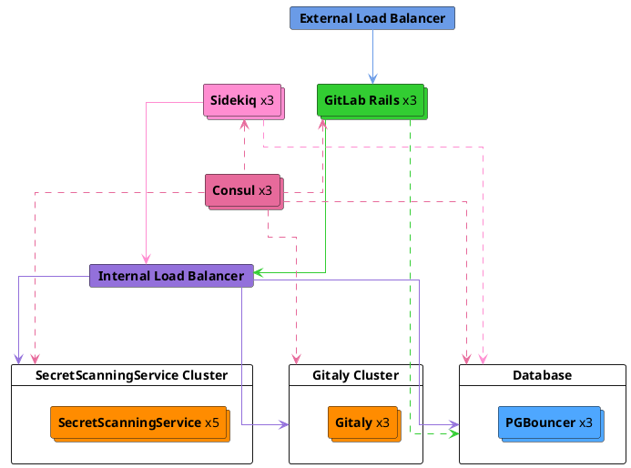

# GitLab Secret Detection ADR 004: Secret Detection Scanner Service

## Context

In the [phase 2](../index.md#phase-2---standalone-secret-detection-service) of Secret Push Protection, the goal is to have a
dedicated service responsible for running Secret Detection scans on the given input blobs. This is done primarily from
the scalability standpoint. Regex operations in the Secret Detection scan [consume](https://gitlab.com/gitlab-org/gitlab/-/issues/422574#note_1582015771)
high resources so running scans within Rails or Gitaly instances would impact the resource availability for running
other operations. Running scans in isolation provides greater control over resource allocation and scaling the service
independently as needed.

## Proposed Solution

We will build a standalone Secret Detection service responsible for running the Secret Detection scans.

The main change in the workflow of Secret Push Protection would be the delegation of scanning responsibility from the
[Secret Detection gem](https://gitlab.com/gitlab-org/gitlab/-/tree/master/gems/gitlab-secret_detection) to the RPC
service for GitLab SaaS i.e., the [secrets push check](https://gitlab.com/gitlab-org/gitlab/-/blob/master/ee/lib/gitlab/checks/secrets_check.rb) invokes the RPC
service with an array of blobs to scan for secrets. Note that the project eligibility checks are still performed at the
[Rails side](https://gitlab.com/gitlab-org/gitlab/-/blob/1a6db446abce0aa02f41d060511d7e085e3c7571/ee/lib/gitlab/checks/secrets_check.rb#L49-51).

### High-Level Architecture

The service architecture involves extracting the secret detection logic into a standalone service
which communicates directly with both the Rails application and Gitaly. This provides a means to scale
the secret detection nodes independently, and reduce resource usage overhead on the Rails application.

Scans still runs synchronously as a (potentially) blocking pre-receive transaction. The blob size remains limited to 1MB.

Note that the node count is purely illustrative, but serves to emphasize the independent scaling requirements for the
scanning service.

#### Service Level Indicators(SLIs)

We will adopt the same SLIs followed for [GitLab Applications](../../../../development/application_slis/index.md) i.e.,
**Apdex score**, **Error Ratio** and two additional metrics specific to the service - **Request Latency** and
**Memory Saturation rate**.

#### Service Level Objectives(SLOs)

_We will define threshold limits after obtaining benchmark scores from the RPC service._

### Service Implementation

We will build an RPC service primarily responsible for detecting secrets in the given input blobs with RPC as the
communication interface. This service will initially be invoked by Rails monolith when performing change access checks
for Git Push event, and eventually extended for the other use cases too.

To reuse the same business logic of Scanning, in addition to offering the feature as an RPC service, the same project
will also include the provision for distributing the feature into a Ruby Gem.

#### Language/Tools/Framework

- Ruby `3.2+`
- gRPC framework for serving RPC requests
- [Protobuf Service Definition](https://gitlab.com/gitlab-org/security-products/secret-detection/secret-detection-service/-/raw/main/rpc/secret_detection.proto) file

### Addendum

- The RPC service should also expose [Health Check](https://github.com/grpc/grpc/blob/master/doc/health-checking.md) RPC endpoint for ensuring the availability of the service.

- Unlike in Gem-based approach, we wouldn't be able to use [scan within the subprocess](003_run_scan_within_subprocess.md) approach in the RPC server
since they [removed support](https://github.com/grpc/grpc/blob/master/doc/fork_support.md) for forking subprocess. However, we can explore optimizations like batch requests
concurrently from the RPC client side.

### Reference links

- [Standalone Service as a concept](../../gitlab_ml_experiments/index.md)
- [Runway: Service Deployment & Docs](https://gitlab.com/gitlab-com/gl-infra/platform/runway)
