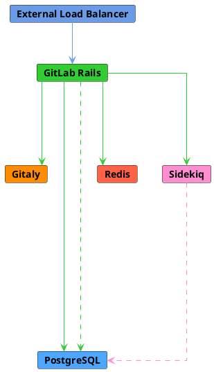
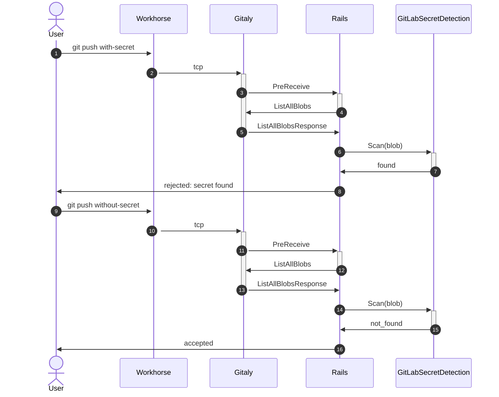
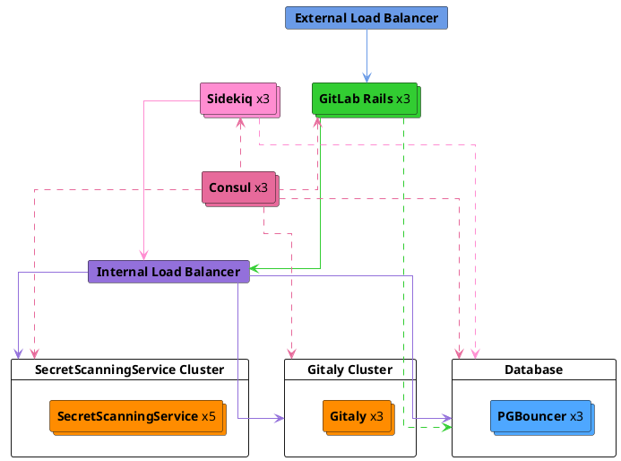
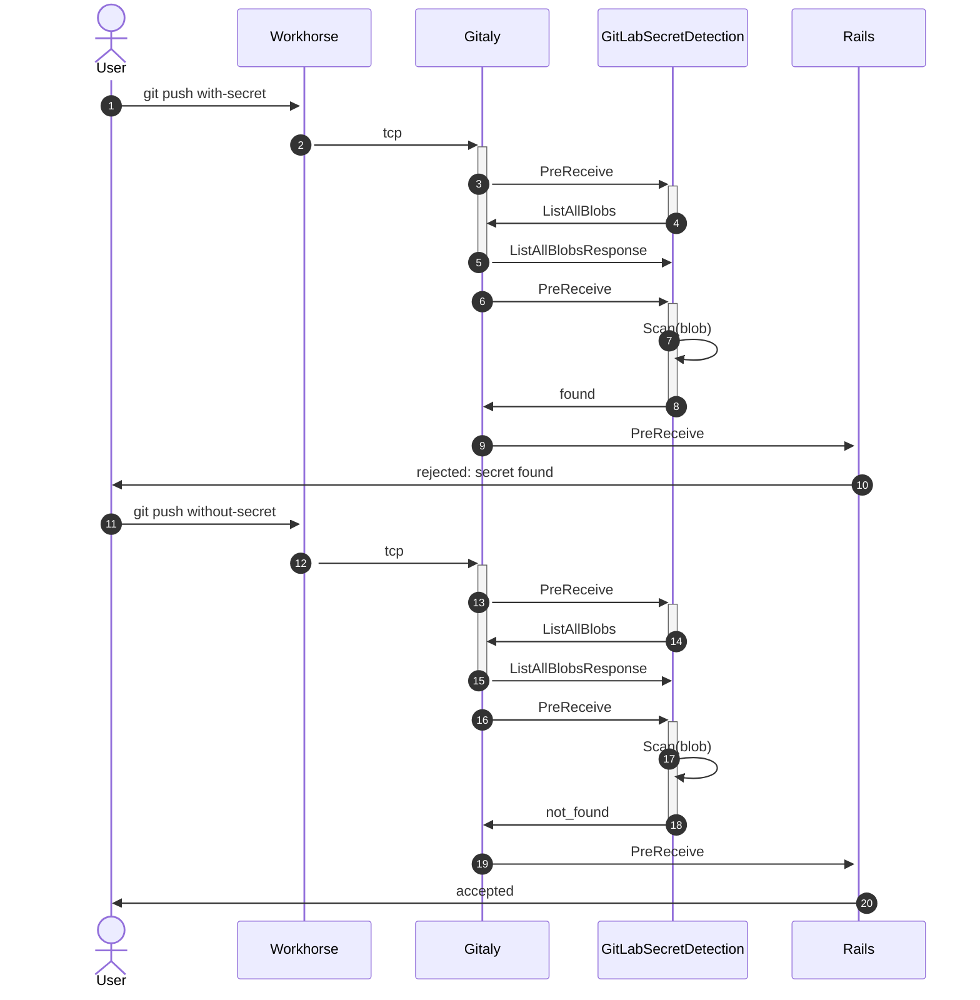
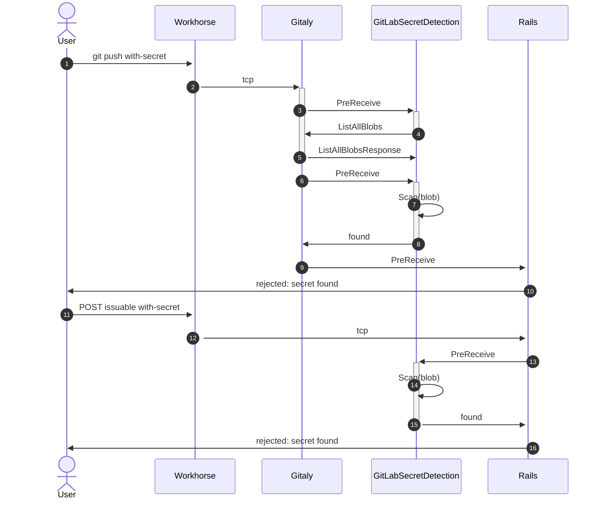

<!-- vale gitlab.FutureTense = NO -->

# Secret Detection as a platform-wide experience

## Summary

Today's secret detection feature is built around containerized scans of repositories
within a pipeline context. This feature is quite limited compared to where leaks
or compromised tokens may appear and should be expanded to include a much wider scope.

Secret detection as a platform-wide experience encompasses detection across
platform features with high risk of secret leakage, including repository contents,
job logs, and project management features such as issues, epics, and MRs.

## Motivation

### Goals

- Support platform-wide detection of tokens to avoid secret leaks
- Prevent exposure by rejecting detected secrets
- Provide scalable means of detection without harming end user experience

See [target types](#target-types) for scan target priorities.

### Non-Goals

Initial proposal is limited to detection and alerting across platform, with rejection only
during [preceive Git interactions and browser-based detection](#iterations).

Secret revocation and rotation is also beyond the scope of this new capability.

Scanned object types beyond the scope of this MVC include:

See [target types](#target-types) for scan target priorities.

#### Management UI

Development of an independent interface for managing secrets is out of scope
for this blueprint. Any detections will be managed using the existing
Vulnerability Management UI.

Management of detected secrets will remain distinct from the
[Secret Management feature capability](../../../ci/secrets/index.md) as
"detected" secrets are categorically distinct from actively "managed" secrets.
When a detected secret is identified, it has already been compromised due to
their presence in the target object (that is a repository). Alternatively, managed
secrets should be stored with stricter standards for secure storage, including
encryption and masking when visible (such as job logs or in the UI).

As a long-term priority we should consider unifying the management of the two
secret types however that work is out of scope for the current blueprints goals,
which remain focused on active detection.

### Target types

Target object types refer to the scanning targets prioritized for detection of leaked secrets.

In order of priority this includes:

1. non-binary Git blobs
1. job logs
1. issuable creation (issues, MRs, epics)
1. issuable updates (issues, MRs, epics)
1. issuable comments (issues, MRs, epics)

Targets out of scope for the initial phases include:

- Media types (JPEG, PDF, ...)
- Snippets
- Wikis
- Container images

### Token types

The existing Secret Detection configuration covers ~100 rules across a variety
of platforms. To reduce total cost of execution and likelihood of false positives
the dedicated service targets only well-defined tokens. A well-defined token is
defined as a token with a precise definition, most often a fixed substring prefix or
suffix and fixed length.

Token types to identify in order of importance:

1. Well-defined GitLab tokens (including Personal Access Tokens and Pipeline Trigger Tokens)
1. Verified Partner tokens (including AWS)
1. Remainder tokens currently included in Secret Detection CI configuration

## Proposal

### Decisions

- [001: Use Ruby Push Check approach within monolith](decisions/001_use_ruby_push_check_approach_within_monolith.md)

The first iteration of the experimental capability will feature a blocking
pre-receive hook implemented in the Rails application. This iteration
will be released in an experimental state to select users and provide
opportunity for the team to profile the capability before considering extraction
into a dedicated service.

In the future state, to achieve scalable secret detection for a variety of domain objects a dedicated
scanning service must be created and deployed alongside the GitLab distribution.
This is referred to as the `SecretScanningService`.

This service must be:

- highly performant
- horizontally scalable
- generic in domain object scanning capability

Platform-wide secret detection should be enabled by-default on GitLab SaaS as well
as self-managed instances.

## Challenges

- Secure authentication to GitLab.com infrastructure
- Performance of scanning against large blobs
- Performance of scanning against volume of domain objects (such as push frequency)
- Queueing of scan requests

### Transfer optimizations for large Git data blobs

As described in [Gitaly's upload-pack traffic blueprint](../gitaly_handle_upload_pack_in_http2_server/index.md#git-data-transfer-optimization-with-sidechannel), we have faced problems in the past handling large data transfers over gRPC. This could be a concern as we expand secret detection to large blob sizes to increase coverage over leaked secrets. We expect to rollout pre-receive scanning with a 1 megabyte blob size limit which should be well within boundaries. From [Protobuffers' documentation](https://protobuf.dev/programming-guides/techniques/#large-data):

> As a general rule of thumb, if you are dealing in messages larger than a megabyte each, it may be time to consider an alternate strategy.

In expansion phases we must explore chunking or alternative strategies like the optimized sidechannel approach used by Gitaly.

## Design and implementation details

The implementation of the secret scanning service is highly dependent on the outcomes of our benchmarking
and capacity planning against both GitLab.com and our
[Reference Architectures](../../../administration/reference_architectures/index.md).
As the scanning capability must be an on-by-default component of both our SaaS and self-managed
instances [the PoC](#iterations), the deployment characteristics must be considered to determine whether
this is a standalone component or executed as a subprocess of the existing Sidekiq worker fleet
(similar to the implementation of our Elasticsearch indexing service).

Similarly, the scan target volume will require a robust and scalable enqueueing system to limit resource consumption.

The detection capability relies on a multiphase rollout, from an experimental component implemented directly in the monolith to a standalone service capable of scanning text blobs generically.

See [technical discovery](https://gitlab.com/gitlab-org/gitlab/-/issues/376716)
for further background exploration.

See [this thread](https://gitlab.com/gitlab-org/gitlab/-/merge_requests/105142#note_1194863310)
for past discussion around scaling approaches.

### Phase 1 - Ruby pushcheck pre-receive integration

The critical paths as outlined under [goals above](#goals) cover two major object
types: Git text blobs (corresponding to push events) and arbitrary text blobs. In Phase 1,
we focus entirely on Git text blobs.

This phase will be considered "Experimental" with limited availability for customer opt-in, through instance level application settings.

The detection flow for push events relies on subscribing to the PreReceive hook
to scan commit data using the [PushCheck interface](https://gitlab.com/gitlab-org/gitlab/blob/3f1653f5706cd0e7bbd60ed7155010c0a32c681d/lib/gitlab/checks/push_check.rb). This `SecretScanningService`
service fetches the specified blob contents from Gitaly, scans
the commit contents, and rejects the push when a secret is detected.
See [Push event detection flow](#push-event-detection-flow) for sequence.

In the case of a push detection, the commit is rejected inline and error returned to the end user.

#### High-Level Architecture

The Phase 1 architecture involves no additional components and is entirely encapsulated in the Rails application server. This provides a rapid deployment with tight integration within auth boundaries and no distribution coordination.

The primary drawback relies on resource utilization, adding additional CPU, memory, transfer volume, and request latency to existing application nodes.

#### Push event detection flow

### Phase 2 - Standalone pre-receive service

The critical paths as outlined under [goals above](#goals) cover two major object
types: Git text blobs (corresponding to push events) and arbitrary text blobs. In Phase 2,
we focus entirely on Git text blobs.

This phase emphasizes scaling the service outside of the monolith for general availability and to allow
an on-by-default behavior. The architecture is adapted to provide an isolated and independently
scalable service outside of the Rails monolith.

In the case of a push detection, the commit is rejected inline and error returned to the end user.

#### High-Level Architecture

The Phase 2 architecture involves extracting the secret detection logic into a standalone service
which communicates directly with both the Rails application and Gitaly. This provides a means to scale
the secret detection nodes independently, and reduce resource usage overhead on the rails application.

Scans still runs synchronously as a (potentially) blocking pre-receive transaction.

Note that the node count is purely illustrative, but serves to emphasize the independent scaling requirements for the scanning service.

#### Push event detection flow

### Phase 3 - Expansion beyond pre-

The detection flow for arbitrary text blobs, such as issue comments, relies on
subscribing to `Notes::PostProcessService` (or equivalent service) to enqueue
Sidekiq requests to the `SecretScanningService` to process the text blob by object type
and primary key of domain object. The `SecretScanningService` service fetches the
relevant text blob, scans the contents, and notifies the Rails application when a secret
is detected.

The detection flow for job logs requires processing the log during archive to object
storage. See discussion [in this issue](https://gitlab.com/groups/gitlab-org/-/epics/8847#note_1116647883)
around scanning during streaming and the added complexity in buffering lookbacks
for arbitrary trace chunks.

In the case of a push detection, the commit is rejected and error returned to the end user.
In any other case of detection, the Rails application manually creates a vulnerability
using the `Vulnerabilities::ManuallyCreateService` to surface the finding in the
existing Vulnerability Management UI.

#### Architecture

There is no change to the architecture defined in Phase 2, however the individual load requirements may require scaling up the node counts for the detection service.

#### Detection flow

There is no change to the push event detection flow defined in Phase 2, however the added capability to scan
arbitary text blobs directly from Rails allows us to emulate a pre-receive behavior for issuable creations,
as well (see [target types](#target-types) for priority object types).

### Target types

Target object types refer to the scanning targets prioritized for detection of leaked secrets.

In order of priority this includes:

1. non-binary Git blobs
1. job logs
1. issuable creation (issues, MRs, epics)
1. issuable updates (issues, MRs, epics)
1. issuable comments (issues, MRs, epics)

Targets out of scope for the initial phases include:

- Media types (JPEG, PDF, ...)
- Snippets
- Wikis
- Container images

### Token types

The existing Secret Detection configuration covers ~100 rules across a variety
of platforms. To reduce total cost of execution and likelihood of false positives
the dedicated service targets only well-defined tokens. A well-defined token is
defined as a token with a precise definition, most often a fixed substring prefix or
suffix and fixed length.

Token types to identify in order of importance:

1. Well-defined GitLab tokens (including Personal Access Tokens and Pipeline Trigger Tokens)
1. Verified Partner tokens (including AWS)
1. Remainder tokens included in Secret Detection CI configuration

### Detection engine

Our current secret detection offering uses [Gitleaks](https://github.com/zricethezav/gitleaks/)
for all secret scanning in pipeline contexts. By using its `--no-git` configuration
we can scan arbitrary text blobs outside of a repository context and continue to
use it for non-pipeline scanning.

In the case of pre-receive detection, we rely on a combination of keyword/substring matches
for pre-filtering and `re2` for regex detections. See [spike issue](https://gitlab.com/gitlab-org/gitlab/-/issues/423832) for initial benchmarks

Changes to the detection engine are out of scope until benchmarking unveils performance concerns.

Notable alternatives include high-performance regex engines such as [Hyperscan](https://github.com/intel/hyperscan) or it's portable fork [Vectorscan](https://github.com/VectorCamp/vectorscan).

## Iterations

- ✓ Define [requirements for detection coverage and actions](https://gitlab.com/gitlab-org/gitlab/-/issues/376716)
- ✓ Implement [Browser-based detection of GitLab tokens in comments/issues](https://gitlab.com/gitlab-org/gitlab/-/issues/368434)
- ✓ [PoC of secret scanning service](https://gitlab.com/gitlab-org/secure/pocs/secret-detection-go-poc/)
- ✓ [PoC of secret scanning gem](https://gitlab.com/gitlab-org/gitlab/-/issues/426823)
- [Pre-Production Performance Profiling for pre-receive PoCs](https://gitlab.com/gitlab-org/gitlab/-/issues/428499)
  - Profiling service capabilities
    - ✓ [Benchmarking regex performance between Ruby and Go approaches](https://gitlab.com/gitlab-org/gitlab/-/issues/423832)
    - gRPC commit retrieval from Gitaly
    - transfer latency, CPU, and memory footprint
- Implementation of secret scanning service MVC (targeting individual commits)
- Capacity planning for addition of service component to Reference Architectures headroom
- Security and readiness review
- Deployment and monitoring
- Implementation of secret scanning service MVC (targeting arbitrary text blobs)
- Deployment and monitoring
- High priority domain object rollout (priority `TBD`)
  - Issuable comments
  - Issuable bodies
  - Job logs
