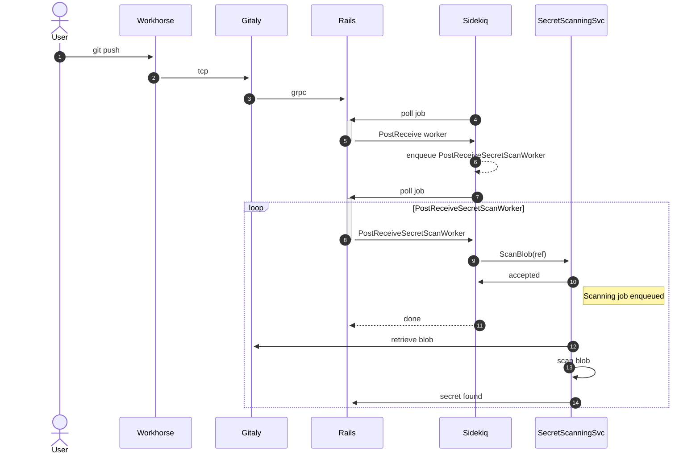

<!-- vale gitlab.FutureTense = NO -->

# Secret Detection as a platform-wide experience

## Summary

Today's secret detection feature is built around containerized scans of repositories
within a pipeline context. This feature is quite limited compared to where leaks
or compromised tokens may appear and should be expanded to include a much wider scope.

Secret detection as a platform-wide experience encompasses detection across
platform features with high risk of secret leakage, including repository contents,
job logs, and project management features such as issues, epics, and MRs.

## Motivation

### Goals

- Support asynchronous secret detection for the following scan targets:
  - push events
  - issuable creation
  - issuable updates
  - issuable comments

### Non-Goals

The current proposal is limited to asynchronous detection and alerting only.

**Blocking** secrets on push events is high-risk to a critical path and
would require extensive performance profiling before implementing. See
[a recent example](https://gitlab.com/gitlab-org/gitlab/-/issues/246819#note_1164411983)
of a customer incident where this was attempted.

Secret revocation and rotation is also beyond the scope of this new capability.

Scanned object types beyond the scope of this MVC include:

- Media types (JPEGs, PDFs,...)
- Snippets
- Wikis

#### Management UI

Development of an independent interface for managing secrets is out of scope
for this blueprint. Any detections will be managed using the existing
Vulnerability Management UI.

Management of detected secrets will remain distinct from the
[Secret Management feature capability](../../../ci/secrets/index.md) as
"detected" secrets are categorically distinct from actively "managed" secrets.
When a detected secret is identified, it has already been compromised due to
their presence in the target object (that is a repository). Alternatively, managed
secrets should be stored with stricter standards for secure storage, including
encryption and masking when visible (such as job logs or in the UI).

As a long-term priority we should consider unifying the management of the two
secret types however that work is out of scope for the current blueprints goals,
which remain focused on active detection.

## Proposal

To achieve scalable secret detection for a variety of domain objects a dedicated
scanning service must be created and deployed alongside the GitLab distribution.
This is referred to as the `SecretScanningService`.

This service must be:

- highly performant
- horizontally scalable
- generic in domain object scanning capability

Platform-wide secret detection should be enabled by-default on GitLab SaaS as well
as self-managed instances.

## Challenges

- Secure authentication to GitLab.com infrastructure
- Performance of scanning against large blobs
- Performance of scanning against volume of domain objects (such as push frequency)
- Queueing of scan requests

## Design and implementation details

The critical paths as outlined under [goals above](#goals) cover two major object
types: Git blobs (corresponding to push events) and arbitrary text blobs.

The detection flow for push events relies on subscribing to the PostReceive hook
to enqueue Sidekiq requests to the `SecretScanningService`. The `SecretScanningService`
service fetches enqueued refs, queries Gitaly for the ref blob contents, scans
the commit contents, and notifies the Rails application when a secret is detected.
See [Push event detection flow](#push-event-detection-flow) for sequence.

The detection flow for arbitrary text blobs, such as issue comments, relies on
subscribing to `Notes::PostProcessService` (or equivalent service) to enqueue
Sidekiq requests to the `SecretScanningService` to process the text blob by object type
and primary key of domain object. The `SecretScanningService` service fetches the
relevant text blob, scans the contents, and notifies the Rails application when a secret
is detected.

The detection flow for job logs requires processing the log during archive to object
storage. See discussion [in this issue](https://gitlab.com/groups/gitlab-org/-/epics/8847#note_1116647883)
around scanning during streaming and the added complexity in buffering lookbacks
for arbitrary trace chunks.

In any case of detection, the Rails application manually creates a vulnerability
using the `Vulnerabilities::ManuallyCreateService` to surface the finding in the
existing Vulnerability Management UI.

See [technical discovery](https://gitlab.com/gitlab-org/gitlab/-/issues/376716)
for further background exploration.

### Token types

The existing Secret Detection configuration covers ~100 rules across a variety
of platforms. To reduce total cost of execution and likelihood of false positives
the dedicated service targets only well-defined tokens. A well-defined token is
defined as a token with a precise definition, most often a fixed substring prefix or
suffix and fixed length.

Token types to identify in order of importance:

1. Well-defined GitLab tokens (including Personal Access Tokens and Pipeline Trigger Tokens)
1. Verified Partner tokens (including AWS)
1. Remainder tokens currently included in Secret Detection CI configuration

### Detection engine

Our current secret detection offering utilizes [Gitleaks](https://github.com/zricethezav/gitleaks/)
for all secret scanning in pipeline contexts. By using its `--no-git` configuration
we can scan arbitrary text blobs outside of a repository context and continue to
utilize it for non-pipeline scanning.

Given our existing familiarity with the tool and its extensibility, it should
remain our engine of choice. Changes to the detection engine are out of scope
unless benchmarking unveils performance concerns.

Notable alternatives include high-performance regex engines such as [hyperscan](https://github.com/intel/hyperscan) or it's portable fork [vectorscan](https://github.com/VectorCamp/vectorscan).

### High-level architecture

The implementation of the secret scanning service is highly dependent on the outcomes of our benchmarking
and capacity planning against both GitLab.com and our
[Reference Architectures](../../../administration/reference_architectures/index.md).
As the scanning capability must be an on-by-default component of both our SaaS and self-managed
instances [the PoC](#iterations), the deployment characteristics must be considered to determine whether
this is a standalone component or executed as a subprocess of the existing Sidekiq worker fleet
(similar to the implementation of our Elasticsearch indexing service).

Similarly, the scan target volume will require a robust and scalable enqueueing system to limit resource consumption.

See [this thread](https://gitlab.com/gitlab-org/gitlab/-/merge_requests/105142#note_1194863310)
for past discussion around scaling approaches.

### Push event detection flow

## Iterations

- ✓ Define [requirements for detection coverage and actions](https://gitlab.com/gitlab-org/gitlab/-/issues/376716)
- ✓ Implement [Clientside detection of GitLab tokens in comments/issues](https://gitlab.com/gitlab-org/gitlab/-/issues/368434)
- PoC of secret scanning service
  - Benchmarking of issuables, comments, job logs and blobs to gain confidence that the total costs will be viable
  - Capacity planning for addition of service component to Reference Architectures headroom
  - Service capabilities
    - gRPC commit retrieval from Gitaly
    - blob scanning
- Implementation of secret scanning service MVC (targeting individual commits)
- Security and readiness review
- Deployment and monitoring
- Implementation of secret scanning service MVC (targeting arbitrary text blobs)
- Deployment and monitoring
- High priority domain object rollout (priority `TBD`)
  - Issuable comments
  - Issuable bodies
  - Job logs
