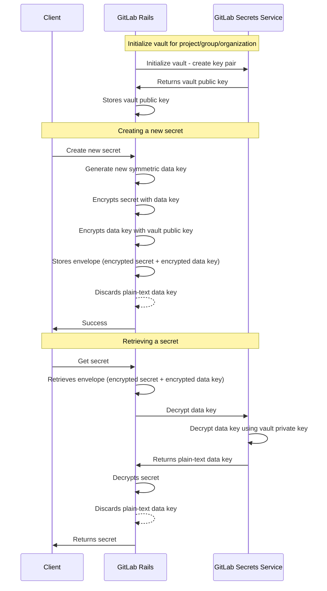

# GitLab Secrets Manager ADR 001: Use envelope encryption

## Context

To store secrets securely in the GitLab Secrets Manager, we need a system that can prevent unencrypted secrets from being leaked
in the event of a security breach to a GitLab system.

## Decision

Use envelope encryption. GitLab Rails will store the encrypted secret at rest, along with an encrypted data key.
In order to decrypt the secret, GitLab Rails will need to make a decryption request to the GCP key manager through GitLab
Secrets Service and obtain the decrypted data key. The data key is then used to decrypt the encrypted secret.

## Consequences

With this approach, an actor that gains access to the GitLab database containing the envelope will not be able to
decrypt the content of the secret as the private key required is not stored with it.

We also need to consider how to securely generate and store the asymmetric keypair used for each vault.

In addition, the following resources would be required:

1. Multiple asymmetric keypairs. A unique asymmetric keypair is needed per vault, belonging to a project, group or an organization.
1. Multiple symmetric keys. A unique key is needed per secret.

## Alternatives

We considered performing the encryption and decryption of the secret in the GitLab Secrets Service, while storing the
encrypted data in GitLab Rails. However, this means that there would be a time where the secret and the encryption keys
exist at the same time in GitLab Secrets Service.
