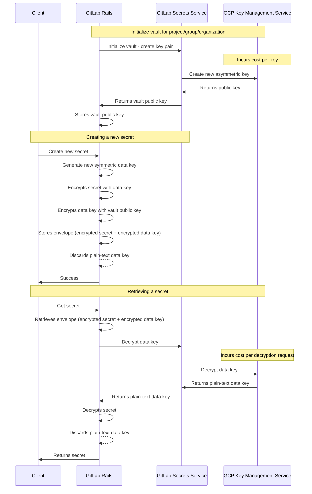

# GitLab Secrets Manager ADR 002: Use GCP Key Management Service

## Context

Following from [ADR 001: Use envelope encryption](001_envelop_encryption.md), we need to find a solution to securely
store asymmetric keys belonging to each vault.

## Decision

We decided to rely on Google CLoud Platform (GCP) Key Management Service (KMS) to manage the asymmetric keys
used by the GitLab Secrets Manager vaults.

Using GCP provides a few advantages:

1. Avoid implementing our own secure storage of cryptographic keys.
1. Support for Hardware Security Modules (HSM).

For security purpose, we decided to use Hardware Security Module (HSM) to protect the keys in GCP KMS.

## Consequences

### Authentication

With keys stored in GCP KMS, we need to de-multiplex between identities configured in GCP KMS and
identities defined in GitLab so that decryption requests can be authenticated accordingly.

### Cost

With the use of GCP KMS, we need to account for the following cost:

1. Number of keys required
1. Number of key operations
1. HSM Protection level

The number of keys required would be dependent on the number of projects, groups, and organizations using this feature.
A single asymmetric key is required for each project, group or organization.

Each cryptographic key operation would also incur cost and it varies per protection level.
Based on the proposed design above, this would incur cost at each secret decryption request.

We may implement a multi-tier protection level, supporting different protection types for different users.

The pricing table of GCP KMS can be found [here](https://cloud.google.com/kms/pricing).

### Feature availability for Self-Managed customers

Using GCP KMS as a backend means that this solution cannot be deployed into self-managed environments.
To make this feature available to Self-Managed customers, this feature needs to be a GitLab Cloud Connector feature.

## Alternatives

We considered generating and storing private keys within GitLab Secrets Service,
but this would not meet the requirements for [FIPS Compliance](../../../../development/fips_compliance.md).

On the other hand, GCP HSM Keys comply with [FIPS 140-2 Level 3](https://cloud.google.com/docs/security/key-management-deep-dive#fips_140-2_validation).
