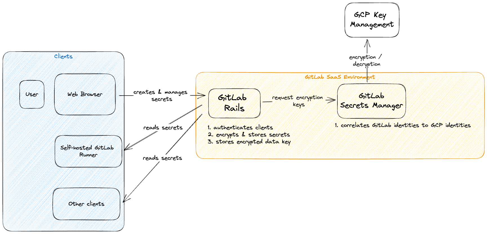

<!-- Blueprints often contain forward-looking statements -->
<!-- vale gitlab.FutureTense = NO -->

# GitLab Secrets Manager

## Summary

GitLab users need a secure and easy-to-use solution to
store their sensitive credentials that should be kept confidential ("secret").
GitLab Secrets Manager is the desired system that provides GitLab users
to meet that need without having to access third party tools.

## Motivation

The current de-facto approach used by many to store a sensitive credential in GitLab is
using a [Masked Variable](../../../ci/variables/index.md#mask-a-cicd-variable) or a
[File Variable](../../../ci/variables/index.md#use-file-type-cicd-variables).
However, data stored in variables (masked or file variables) can be inadvertently exposed even with masking.
A more secure solution would be to use native integration
with external secret managers such as HashiCorp Vault or Azure Key Vault.

Integration with external secret managers requires GitLab to maintain the integration
with the third-party products and to assist customers in troubleshooting configuration issues.
In addition, customer's engineering teams using these external secret managers
may need to maintain these systems themselves, adding to the operational burden.

Having a GitLab native secret manager would provide customers a secure method to store and access secrets
without the overhead of third party tools as well as to leverage the tight integration with other GitLab features.

### Goals

Provide GitLab users with a way to:

- Securely store secrets in GitLab
- Use the stored secrets in GitLab components (for example, CI Runner)
- Use the stored secrets in external environments (for example, production infrastructure).
- Manage access to secrets across a root namespace, subgroups and projects.
- Seal/unseal secrets vault on demand.

#### Non-functional requirements

- Security
- Compliance
- Auditability

### Non-Goals

This blueprint does not cover the following:

- Secrets such as access tokens created within GitLab to allow external resources to access GitLab, e.g personal access tokens.

## Decisions

- [ADR-001: Use envelope encryption](decisions/001_envelop_encryption.md)
- [ADR-002: Use GCP Key Management Service](decisions/002_gcp_kms.md)
- [ADR-003: Build Secrets Manager in Go](decisions/003_go_service.md)

## Proposal

The secrets manager feature will consist of three core components:

1. GitLab Rails
1. GitLab Secrets Manager Service
1. GCP Key Management

At a high level, secrets will be stored using unique encryption keys in order to achieve isolation
across GitLab. Each service should also be isolated such that in the event
one of the components is compromised, the likelihood of a secrets leaking is minimized.

**1. GitLab Rails**

GitLab Rails would be the main interface that users would interact with when creating secrets using the Secrets Manager feature.

This component performs the following role:

1. Storing unique encryption public keys per organization.
1. Encrypting and storing secret using envelope encryption.

The plain-text secret would be encrypted using a single use data key.
The data key is then encrypted using the public key belonging to the group or project.
Both, the encrypted secret and the encrypted data key, are being stored in the database.

**2. GitLab Secrets Manager Service**

GitLab Secrets Manager Service will be a new component in the GitLab overall architecture. This component serves the following purpose:

1. Correlating GitLab identities into GCP identities for access control.
1. A proxy over GCP Key Management for decrypting operations.

[The service will use Go-based tech stack](decisions/003_go_service.md) and [labkit](https://gitlab.com/gitlab-org/labkit).

**3. GCP Key Management**

We choose to leverage GCP Key Management to build on the security and trust that GCP provides on cryptographic operations.
In particular, we would be using GCP Key Management to store the private keys that will be used to decrypt
the data keys mentioned above.

### Implementation detail

- [Secrets Manager](secrets_manager.md)

### Further investigations required

1. Management of identities stored in GCP Key Management.
   We need to investigate how we can correlate and de-multiplex GitLab identities into
   GCP identities that are used to allow access to cryptographic operations on GCP Key Management.
1. Authentication of clients. Clients to the Secrets Manager could be GitLab Runner or external clients.
   For each of these, we need a secure and reliable method to authenticate requests to decrypt a secret.
1. Assignment of GCP backed private keys to each identity.

### Availability on SaaS and Self-Managed

To begin with, the proposal above is intended for GitLab SaaS environment. GitLab SaaS is deployed on Google Cloud Platform.
Hence, GCP Key Management is the natural choice for a cloud-based key management service.

To extend this service to self-managed GitLab instances, we would consider using GitLab Cloud Connector as a proxy between
self-managed GitLab instances and the GitLab Secrets Manager.

## Alternative Solutions

Other solutions we have explored:

- Separating secrets from CI/CD variables as a separate model with limited access, to avoid unintended exposure of the secret.
- [Secure Files](../../../ci/secure_files/index.md)

## References

The following links provide additional information that may be relevant to secret management concepts.

- [OWASP Secrets Management Cheat Sheet](https://cheatsheetseries.owasp.org/cheatsheets/Secrets_Management_Cheat_Sheet.html)
- [OWASP Key Management Cheat Sheet](https://cheatsheetseries.owasp.org/cheatsheets/Key_Management_Cheat_Sheet.html)
