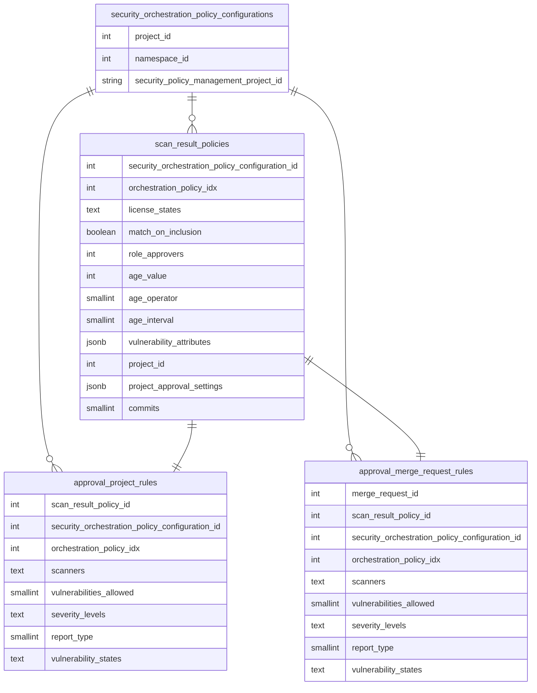
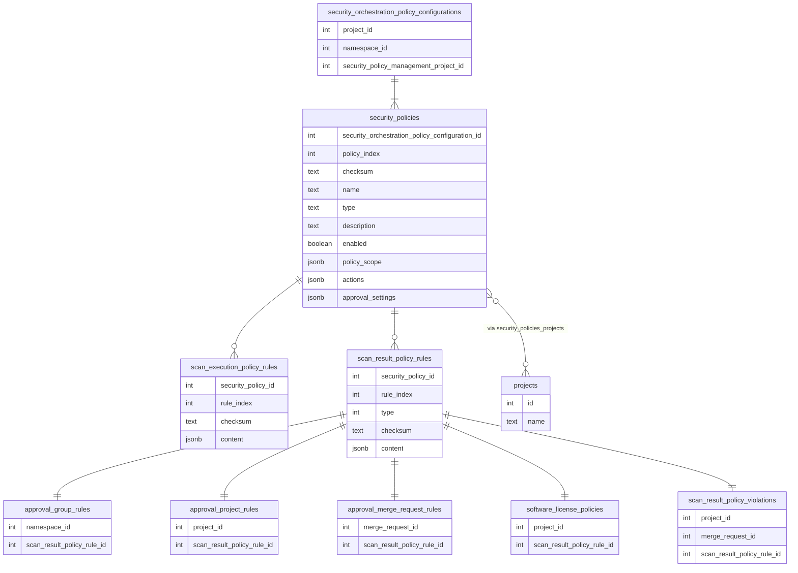

# Database read model for Security policies

This document is a work in progress and represents the proposal for new Security policies architecture to allow for optimized policy updates and propagation.

## Summary

The security policies are stored as YAML files in the security policy project. While this approach has a lot of advantages (like version control for policies using Git, auditable etc), it faces some performance drawbacks.
Since reading from the Git repository requires calls to Gitaly, it might block us in building flexible functionalities.

## Motivation

The current architecture of synchronising policies from YAML to approval rules in DB is not very performant as it involves the process of deleting and recreating the approval rules even though the event that triggers the re-sync does not need them to re-process completely (eg: user added to a project would only need to update approvers of approver rules). The current architecture faces these limitations:

- [Difficult to build new functionalities](https://gitlab.com/groups/gitlab-org/-/epics/8084)
  - Due to the limitation of reading the YAML from Gitaly everytime something gets updated, we keep a limit in the number of policies configured. But the limit is not sufficient for a lot of use-cases.
- High resource consumption
  - `Security::ProcessScanResultPolicyWorker` is a long-running worker, it makes call to Gitaly, deletes and create approval rules, updates all open MRs for the project. If the project has a huge number of MRs, it could take few minutes to complete, as we currently don't have the possibility to selectively sync a policy.
- Less fault tolerant
  - Since all the operations performed by the worker has to be atomic, if one step fails, it could make the final state of the system to be inconsistent
- Redundant data stored in approval rules table and `scan_result_policies`
  - Since we store fields from YAML into approval rules table for all MRs, they are redundant and consume a lot of extra disk space
  - Since we store `project_id` in `scan_result_policies`, we have a huge number of records for a low number of policies that are actually in security policy repository
- Difficulties of [fetching the security policies list due to access management](https://gitlab.com/gitlab-org/gitlab/-/issues/432141)
  - Users currently need access to security policy project in order to see the policies applicable to a project where they already have access. This would be solved if we read the policies from the database.

### Goals

1. Reduce the calls to Gitaly and depend on reading from the database. The YAML data will be mirrored on a database table and a read-only ActiveRecord model allows us to build features without performance concerns.
1. Remove duplicated columns related to merge request approval policies in approval_project_rules and approval_merge_request_rules
1. Change the current process in [UpdateOrchestrationPolicyConfiguration](https://gitlab.com/gitlab-org/gitlab/-/blob/master/ee/app/workers/concerns/update_orchestration_policy_configuration.rb) not to delete and recreate all related records, but rather update/recreate only the affected records
1. Reduce the average propagation duration of merge request approval policy changes
1. Reduce the number of queries to the database performed by workers from Security Policies

## Proposal

### Current architecture of Security policies

Security policy project that are linked to a group or a project has a corresponding entry in `security_orchestration_policy_configurations` table. In order to read/query policies, the YAML has to be read from policy project which involves a RPC call to Gitaly. This does not perform well when there are huge number of projects/groups configured with security policies.

Merge request approval policy that are stored in the policy project as YAML file gets synchronised to approval rules through `approval_project_rules` table. Currently we are storing these fields related to merge request approval policy in the table:

- `scanners`
- `vulnerabilities_allowed`
- `severity_levels`
- `report_type`
- `vulnerability_states`

The same fields are also duplicated in `approval_merge_request_rules` to relate them to each individual merge request. They are redundant as any value for these fields changed in `approval_project_rules` results in `approval_merge_request_rules` getting updated too.

`Security::ProcessScanResultPolicyWorker` is responsible for reading the policy from policy project and transforming them to approval rules. The worker performs these operations in sequence:

- Delete `approval_project_rules` and `approval_merge_request_rules`
- Read YAML from policy project (call to Gitaly)
- Convert the YAML to create rows in `approval_project_rules`
- Update each of `approval_merge_request_rules` for open merge requests

We delete and recreate approval rules because we cannot get the exact diff of the policy from YAML very efficiently as it involves call to Gitaly and also we do not have unique identifier for each policy in the YAML.

This worker is called whenever these events happen:

- Project created within a group with policies configured
- User added/removed from a project
- Protected branch is added/removed from a project
- Policy is created/updated/deleted for a project

To avoid this, we have created the `scan_result_policies` table (`Security::ScanResultPolicyRead` model) which acts as a read model for merge request approval policies to avoid reading from policy project. But currently, we don't store all the required fields in the table, we only store `role_approvers` , `license_state` and `match_on_inclusion`.

### Proposed Architecture

To solve the challenges and limitations mentioned above, we need to persist all fields from the policy YAML to DB (in `security_policies` table) which can be used instead of reading from YAML in Git repository.

The DB schema should closely mimic the policy YAML and should look like this:

In order to achieve this, we want to introduce a new worker(`Security::ScanResultPolicies::SyncWorker`) that reads the YAML from Git repository and convert them to entries in `security_policies` table, together with the underlying `scan_execution_policy_rules` and `scan_result_policy_rules` tables. This worker should be called only when a policy is created/updated/deleted. In all the other places where we currently read the YAML from Git repository, we should read from `security_policies` which serves as SSoT for the latest version of the policies.

This allows us to:

- Know what updated in a policy by comparing the updated value in YAML from values in the table
- Improve performance by adding DB index
- Reduce redundant data stored in `approval_merge_request_rules` and `approval_project_rules` tables, thereby reducing the DB size
- Dramatically reduce the number of `scan_result_policies` rows by removing the `project_id` column and creating the link between the projects via a join table
- Reduce redundant data stored in `scan_result_policies`, as we the rule data would be decomposed and we wouldn't have duplicated `project_approval_settings`, thereby reducing the DB size

There is an ongoing effort in [Allow group-level MR approval rules for 'All Protected Branches'](https://gitlab.com/groups/gitlab-org/-/epics/11451) that would allow us to define `approval_group_rules` for group policies. This means we will not need to copy `approval_project_rules` for every project in a group, reducing the number of workers needed to propagate policy changes.

## Design and Implementation Details

### Step 1: Add new tables

As a first step, we need to introduce `security_policies`, `scan_result_policy_rules` and `scan_execution_policy_rules` tables. These tables and columns map to the fields in YAML.

### Step 2: Introduce new worker to sync policies to the DB tables

The new worker would be responsible for reading and converting the YAML to rows in `security_policies` table.
Using `checksum`, we can determine whether a policy has changed and requires a rebuild, or whether it was only re-ordered.

We can compare changes and based on the columns that were updated, we can propagate policy changes. For example:

- When `actions` are updated, we can update the approvers in the approval rules.
- When `rules` are updated, we can trigger update of the approval rules associated to them.

### Step 3: Migrate all existing policies to `security_policies` table

We need to introduce DB migration that reads all existing policies and populate `security_policies` table.

### Step 4: Update `Security::ProcessScanResultPolicyWorker` to read from `security_policies`

Modify the worker to read from `security_policies` and invoke it only for these events:

- User added/removed from a project
- Protected branch is added/removed from a project

This would change the worker's responsibility to only update the approval rules associated to the `security_policies` based on the event to which it was triggered

### Step 5: Delete columns from approval rules table

This step would delete the columns that are migrated to `security_policies` from `approval_project_rules` and `approval_merge_request_rules`.

### Step 6: Remove `scan_result_policies` table

At this point, we can remove the old table `scan_result_policies` because the approval rules would be linked via `scan_result_policy_rules` table.

## Links

- [Use database read model for scan result policies](https://gitlab.com/groups/gitlab-org/-/epics/9971)
- [Spike: Prepare architecture blueprint for database read model for scan result policies](https://gitlab.com/gitlab-org/gitlab/-/issues/433410)
