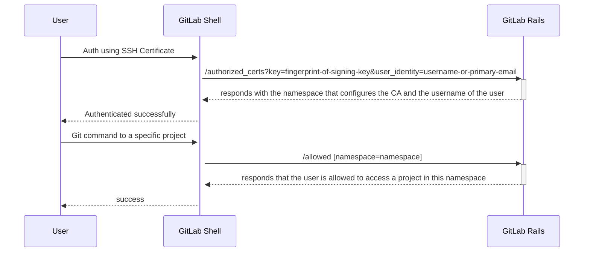

# SSH certificates

## Summary

On GitLab.com customers obtain their own top-level group (later organization). In comparison to self-managed, they have to manage organization-wide settings at this level.

Currently, the provided Git access control options on SaaS (SSH, HTTPS) rely on credentials (access tokens, SSH keys) setup in the user profile. As the user profile is out of control of the organization, there is no way for a customer to assess whether the key is kept confidential or whether the expiry date is meeting policies. Also, there's very little that can be done for damage control in case the keys are leaked as well as a customer cannot enforce MFA on Git access flows.

Customers may have processes in place, where developers on a daily basis can, via MFA, request a temporary SSH certificate which gives them access to internal systems. To enable the same way of working on SaaS, we would need a way to share public Certificate Authority (`CA`) files with GitLab.com SaaS for the purpose of Git access control.

## Motivation

- Enable users to share public Certificate Authority (`CA`) files with GitLab.com SaaS for the purpose of Git access control.
- Fill the product gap between GitLab and competitive products that already support authentication via SSH certificates.

### Goals

This document proposes an architectural design to implement functionality to satisfy the following requirements:

- The public key of the `CA` file (`CA.pub`) that is used to issue certificates can be added to a group.
- A certificate issued by the `CA` can be used to get Git access to projects of the group and its ancestors.
- The certificate cannot be used to get Git access to projects outside the group and its ancestors.

### Non-goals

This document focuses on providing core functionality for supporting authentication via SSH certificates. The potential improvements are described in [Follow Ups](#follow-ups).

## Proposal

### MVC

A group admin generates an SSH key pair to be used as a Certified Authority file (`ssh-keygen -f CA`):

- The private key is used to issue user certificates
- The public key is added to a group in order to grant access to the group via the user certificates

#### User certificate

A group admin issues user certificates using `CA` private key and specifies either a GitLab username or a user's primary email as the key identity:

```shell
ssh-keygen -s CA -I user@example.com -V +1d user-key.pub
```

As a result, a user certificate of the following structure is generated:

```shell
ssh-keygen -L -f ssh_host_ed25519_key-cert.pub

ssh_host_ed25519_key-cert.pub:
        Type: ssh-ed25519-cert-v01@openssh.com user certificate
        Public key: ED25519-CERT SHA256:dRVV49XJHt85X1seqr9xXyxyuuGTbtFV6Lbwlrx6BIQ
        Signing CA: RSA SHA256:UAcgUeGoXrs8WOT/N+bmqY2vB9145Mc5NaN1Y977NCI (using rsa-sha2-512)
        Key ID: "user@example.com"
        Serial: 1
        Valid: from 2023-07-31T18:20:00 to 2023-08-01T18:21:34
        Principals: (none)
        Critical Options: (none)
        Extensions:
                permit-X11-forwarding
                permit-agent-forwarding
                permit-port-forwarding
                permit-pty
                permit-user-rc
```

- `Type` is the type of the user certificate. Only user certificates are accepted by GitLab Shell, all other types are rejected.
- `Public Key` is the public key of the user.
- `Signing CA` is the public key of `CA`. Its fingerprint is used to find a group associated with the user certificate.
- `Key ID` is a user's username or primary email. It is used to associate a GitLab user with the user certificate.
- `Serial` is a serial number of the user certificate. It can be used to distinguish between different certificates created by the same `CA`.
- `Valid` indicates the period of validity. This value is validated by GitLab Shell: expired and not yet valid user certificates are rejected.
- `Principals`, `Critical Options` and `Extensions` are used to embed additional information into the user certificate. This fields can be potentially used in future iterations to apply additional restrictions on a user certificated.

#### Application behavior

[GitLab Shell](https://gitlab.com/gitlab-org/gitlab-shell) is the project responsible for handling [commands](../../../development/gitlab_shell/features.md) sent to GitLab instance via SSH.
When a user tries to establish an SSH connection and authenticate via a public key, GitLab Shell sends an internal API request to `/authorized_keys` endpoint to detect whether the key is associated with a GitLab user. If a certificate is used for authentication, GitLab Shell can recognize it and perform a request to `/authorized_certs` instead.

1. A group admin adds `CA.pub` file to a group.
1. A user tries to authenticate using a certificate signed by the `CA`.
1. GitLab Shell sends to `/authorized_certs` the fingerprint of the `CA` and the user identity (either GitLab username or the primary email).
1. GitLab Rails finds a group that has a `CA.pub` with the fingerprint added and the user. The `CA.pub` is unique for an instance by fingerprint which defines the one-to-one relationship between `CA` and a group.
1. GitLab Shell remembers the namespace full path for the established connection.
1. GitLab Shell sends a request to `/allowed` endpoint every time a check whether a user has access to a particular project is needed. The namespace full path is passed to `/allowed` endpoint.
1. GitLab Rails checks whether the namespace matches the project namespace or one of its ancestors in order to determine whether a user has access to this project via the certificate.
1. If all the checks above are successful, the user gets access to the project.



#### Examples

1. Access a project outside the group that configures `CA.pub`.

   Given there is the following hierarchy of groups

   ```plaintext
   a/b/c/d/e/f
       |
       └/g/h/i
   ```

   - A group admin adds `CA.pub` to `d` and a user is authenticated using a certificate signed by the `CA`.
   - When a user clones `a/b/c/d/e/f/project`, we send `a/b/c/d/e/project` project full path and `a/b/c/d` namespace full path: the user is allowed to clone the project because `d` is an ancestor of the project's namespace.
   - When a user clones `a/b/c/g/h/i/project`, the user is not allowed to clone the project because `d` is not in a list of its ancestors.

1. A group that configures `CA.pub` is transferred to a different namespace.

The existing certificates are still valid because the namespace full path is stored per connection. When a user reconnects, another request to `/authorized_certs` is sent and the new full path of the namespace is returned.

## Open questions

### Multiple SSH certificates to different projects

A user may have different SSH certificates to access different projects.
When the user establishes an SSH connection, the SSH client will iterate over a number of potential
options in order to find the one that authenticates successfully.
With the current architecture, the first certificate that provides access to a namespace is accepted,
even if the user is meant to get access to a different project.

For example:

1. A user has valid certificates for `a` and `b` groups.
1. The user is successfully authenticated using `a`.
1. The user tries to clone `b/project` and fails.

A workaround for this scenario is to configure Git to use a particular certificate during an SSH
connection. Add the following to your `.gitconfig` file:

```plaintext
[core]
    sshCommand = ssh git@gitlab.com -i cert.pub
```

### A single certificate cannot be revoked

Revocation of a single user certificate is out of the scope of this MVC. It is possible to implement this feature but the feasibility should be discussed.

Supporting it will complicate the implementation and UI/UX. However, the risk of a compromised certificate can be significantly reduced by the following actions:

- Expiration date of a user certificate. It should be highly recommended in the docs.
- Rotation of the CA which revokes all the current user certificates.
- Implementing `source-address` feature that allows restricting IP address(es) from which the user certificate can be used.

### A certificate can be used across multiple GitLab instances

The information about GitLab instance is not embedded into a user certificate. It means that it can be used across multiple GitLab instances as long as the `KeyId` value is recognized in those instances.

Potential solution:

- An optional field that restricts usage of a user certificate to a particular instance can be implemented using `Extensions` in a follow-up. Specifying `extension:login@gitlab.com=username` is a more secure and flexible option, but we can support both.

### CA cannot be reused by multiple groups

The `CA.pub` fingerprint must be unique and cannot be reused by multiple groups. The one-to-one relationship is chosen by design to be able to find a single group that a user has access to.

Another option is to embed the namespace into the user certificate using `Extensions` or `Critical Options`.

Pros:

- `CA` can be reused by multiple groups.
- A user certificate _tells_ which group to get access to rather than _asks_ which group it can get access to.

Cons:

- Requires a custom requirement to the user certificate format.
- If some other group adds `CA.pub`, a user may unintentionally get access to that group.

Potential solution:

- An optional field that restricts usage of a user certificate to a particular group can be implemented using `Extensions` or `Critical Options` in a follow-up. `CA` still cannot be reused but a user certificate cannot be used for some other group.

## Iteration plan

| Component    | Milestone             | Group                            | Changes |
|--------------|-----------------------|----------------------------------|---------|
| GitLab Shell | `16.3`                | Source Code                      | [Implement](https://gitlab.com/gitlab-org/gitlab-shell/-/merge_requests/812) authentication using SSH certificates in GitLab Shell |
| GitLab Rails | `16.4`                | Source Code                      | Implement the internal GitLab Rails API endpoint `authorized_certs` to find a group that configures the `CA.pub` |
| GitLab Rails | `16.4`                | Source Code                      | Implement a GitLab Rails API endpoint for groups to add/remove a `CA.pub` |
| GitLab Rails | `Next 2-3 milestones` | Authentication and Authorization | Implement Group Settings UX to add/remove `CA.pub` |
| GitLab Rails | `Next 2-3 milestones` | Authentication and Authorization | Implement an option to enforce using SSH certificates only for authentication and forbid personal SSH keys and access tokens |

## Follow-ups

The functionality that is related to the topic but out of the scope of this blueprint:

- Enforce using SSH certificates only for authentication by disabling Git over HTTPS for an instance or a Group: a must-have functionality.
- Enforce using Group-level SSH keys only by forbidding the use of personal SSH keys for an instance or a Group: a must-have functionality.
- Specifying `source-address` `Critical Option` that restricts usage of a user certificate to a set of IP addresses: a nice-to-have functionality.
- Specifying `login@hostname=username` `Extensions` that restrict usage of a user certificate to a set of instances: a nice-to-have functionality.
- Signing commits using SSH certificates: a nice-to-have functionality.
- Revoke a single user certificate. It requires complex UI/UX while the risk can be significantly mitigated by using other features.
