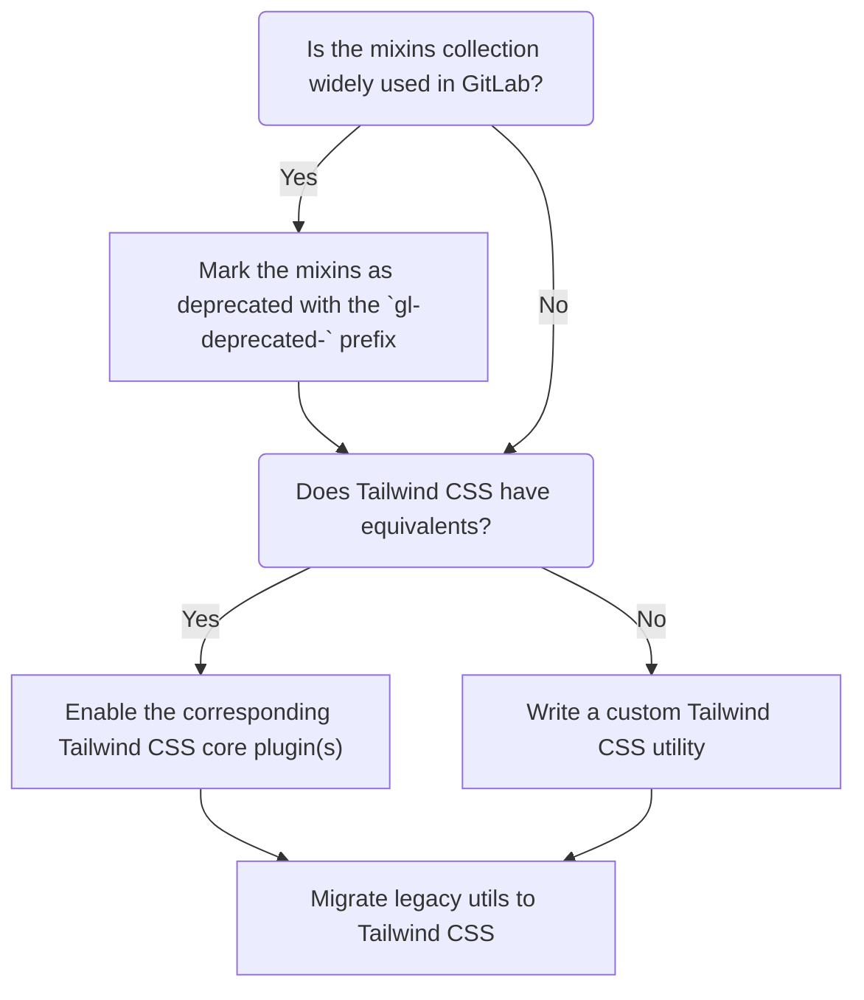

<!-- Blueprints often contain forward-looking statements -->
<!-- vale gitlab.FutureTense = NO -->

# Delegating CSS utility classes generation to Tailwind CSS

## Summary

Styling elements in GitLab primarily relies on CSS utility classes. Those are classes that
generally define a single CSS property and that can be applied additively to change an element's look.
We have developed our own tooling in the [GitLab UI](https://gitlab.com/gitlab-org/gitlab-ui) project
to generate the utils we need, but our approach has demonstrated a number of flaws that can be
circumvented by delegating that task to the [Tailwind CSS](https://tailwindcss.com/) framework.

This initiative requires that we deprecate existing utilities so that Tailwind CSS can replace them.

## Motivation

In June 2019, we have consolidated our usage of CSS utility classes through [RFC#4](https://gitlab.com/gitlab-org/frontend/rfcs/-/issues/4)
which introduced the concept of silent classes, where utilities would be generated from a collection
of manually defined SCSS mixins.

This has served us well, but came with some caveats:

- **Increased development overhead:** whenever a new utility is needed, it has to be manually added
  to the [GitLab UI](https://gitlab.com/gitlab-org/gitlab-ui) project. One then needs to wait on a
  new version of `@gitlab/ui` to be released and installed in the consumer project.
- **Inconsistencies:** Without any tooling in place to check how utilities are named, we have seen
  many inconsistencies make their way in the library, making it quite unpredictable. The most striking
  example of this was the introduction of desktop-first utilities among a majority of mobile-first
  utils, without any way of distinguishing the former from the latter, other than looking at the source.
- **Disconnection between the utilities library and its consumers:** When a utility is added to the
  library, it is made available to _any_ project that uses `@gitlab/ui`. As a result, some utils are
  included in projects that don't need them. Conversely, if all consumers stop using a given util,
  it could potentially be removed to decrease the CSS bundle size, but we have no visibility over this.
- **Limited autocompletion:** Although it's possible to configure autocomplete for the existing
  library, it is restricted to the utilities bundle. In contrast, Tailwind CSS autocomplete aligns
  with an on-demand approach, ensuring that all utilities are readily available. Additionally, IDE
  extensions can enhance understanding by revealing the values applied by a specific utility.

As part of this architectural change, we are alleviating these issues by dropping our custom built
solution for generating CSS utils, and delegating this task to [Tailwind CSS](https://tailwindcss.com/).

It is worth noting that this was previously debated in [RFC#107](https://gitlab.com/gitlab-org/frontend/rfcs/-/issues/107).
The RFC was well received. The few concerns that were raised were about the CSS utility approach as
a whole, not the way we implemented it. This initiative's purpose _is not_ to question our reliance
on utility classes, but to consolidate its implementation to improve engineers' efficiency when working
with CSS utils.

### Why Tailwind CSS?

Here are a few reasons that led us to choosing Tailwind CSS over similar tools:

- It is a long-standing project that has been battle-tested in many production apps and has a
  healthy community around it.
- Tailwind CSS is well maintained and keeps evolving without getting bloated.
- It integrates well in all of our tech stacks
  - Ruby on Rails projects can leverage the [`tailwindcss-rails` Gem](https://tailwindcss.com/docs/guides/ruby-on-rails).
  - Nuxt apps can set up the [`tailwindcss` module](https://nuxt.com/modules/tailwindcss).
  - More generic frontend stacks can use the [`tailwindcss` Node module](https://tailwindcss.com/docs/installation).

### Goals

This blueprint's goal is to improve the developer experience (DX) when working with CSS utility classes.
As a result of this initiative, frontend engineers' efficiency should be increased thanks to a much
lower development overhead.

### Non-Goals

As stated in the motivations above, this focuses on improving an existing architectural decision,
not on replacing it with a new design. So this therefore:

- _Is not_ aimed at revisiting the way we write CSS or how we apply styles within our projects.
- _Does not_ focus on user-facing improvements. This change is mostly a developer experience enhancement.
  The resulting increase in efficiency could certainly indirectly improve user experience, but that
  is not our primary intent.

## Proposal

We will be setting up Tailwind CSS in GitLab UI _and_ GitLab. The intent is to have the main
Tailwind CSS configuration in GitLab UI. This step is where we'll be maintaining the Pajamas-compliant
configuration properties (color, spacing scale, etc.). The Tailwind CSS setup in GitLab will inherit from
GitLab UI's setup. The subtlety here is that, in GitLab, we will be scanning both the GitLab codebase
and the `@gitlab/ui` Node module. This will ensure that GitLab UI does not need to expose any CSS
utilities anymore, but the ones it relies on are still generated in GitLab. A similar setup will
need to be introduced in other projects that use CSS utilities and need to upgrade to the Tailwind
CSS-based version.

### Pros

- We are removing the cumbersome workflow for adding new utilities. One should be able to use any
  utility right away without contributing to another project and waiting through the release cycle.
- We are introducing a predictable library, where the naming is decided upon in the overarching
  Tailwind CSS project. As engineers know, naming things is difficult, and it's best that we defer
  this to a well-established project.
- Engineers should be able to refer to Tailwind CSS documentation to know what utils are available
  and how to use them. No need to read through GitLab UI's source code anymore.
- Because Tailwind CSS generates the required utils by scanning the consumer's codebase, we'll be
  sure to only generate the utilities we actually need, keeping CSS bundle sizes under control. This
  must be taken with a grain of salt though: Tailwind CSS is extremely flexible and makes it possible
  to generate all sorts of utils, sometimes with developer-defined values, which could result in
  large utils bundles depending on how we'll adopt Tailwind CSS' features.
- We'll benefit from a robust IDE integration providing auto-completion and previews for the utils
  we support.

### Cons

- More setup: each project that requires CSS utils would need to have Tailwind CSS set up,
  which might be more or less tedious depending on the environment.
- One more dev dependency in each project.
- Inability to use string interpolation to build class names dynamically (Tailwind CSS
  needs to see the full names to generate the required classes).
- We'll need a migration: we'll need to ensure usages of the existing CSS utilities library
  don't break, which implies a deprecation/migration process.

## Design and implementation details

In order to prevent breakages, we are taking an iterative approach to moving away from the current
library. The proposed path here is purposefully rough around the edges. We acknowledge that it's
not a one size fits all solution and that we might need to adjust to some cases along the way.

Here's the basic process:

1. Deprecate a collection of utility mixins in GitLab UI. This entails replacing the `gl-` prefix
  with `gl-deprecated-` in the mixin's name, and updating all usages in both GitLab UI _and_ GitLab
  accordingly. We will typically focus on a single mixins file at a time, though we might want to
  deprecate several files at once if they are small enough. Conversely, some files might be too big
  to be deprecated in one go and would require several iterations.
1. Enable the corresponding [Tailwind CSS core plugins](https://tailwindcss.com/docs/configuration#core-plugins) so that we can immediately start using the
  newer utilities.
1. Migrate deprecated utilities to their Tailwind CSS equivalents.

The deprecation step gives us some margin to evaluate each migration without risking breakages in
production. It does have some drawbacks:

- We might cause merge conflicts for others as we will be touching several areas of the product in
  our deprecation MRs. We will make sure to communicate these changes efficiently to not make things
  too confusing. We will also use our best judgement to split MRs when we feel like their scope gets
  too large.
- Deprecation MRs might require approval from several departments, which is another reason to
  be transparent and iterative throughout the process.
- We are purposefully introducing technical debt which we are committed to pay in a reasonable time frame.
  We acknowledge that the actual duration of this initiative may be affected by a number of factors (uncovering
  edge-cases, DRIs' capacity, department-wide involvement, etc.), but we expect to have it completed in 6-12 months.
