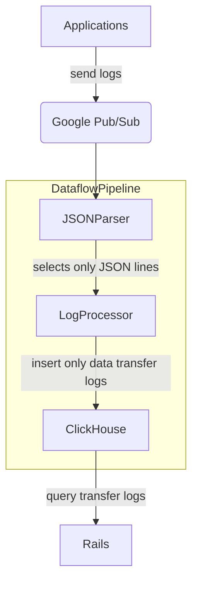

# Transfer data

## Summary

GitLab already provides users transparency on their Usage Quotas.

We currently display data about:

- used license seats
- used storage
- CI/CD minutes usage

But we don't collect and present transfer data (egress traffic caused by
various parts of the application).

Collecting data about number of transferred bytes between clients, customers
and services will allow us to discover new efficiencies and reduce the
operational risk. We want to better understand the data transfer
patterns across the whole application stack.

The goal of this blueprint to describe steps we need to do to achieve the result.

### Goals

Explore various solutions to store, process and present transfer data across the
whole application stack.

## Proposal

There are different types of transferred data.

| Type            | Description                                                 |
| --------------- | ----------------------------------------------------------- |
| `Repository`    | Egress data related to Git `fetch` operations (pull, clone) |
| `Artifacts`     | Artifacts transfer caused by direct and proxied egress      |
| `Pages`         | Pages egress (depends on Artifacts API)                     |
| `Packages`      | Package registry egress                                     |
| `Registry`      | Container registry egress                                   |
| `Uploads`       | Object store egress                                         |

Each type has different implementations and can be measured separately but
collection of metadata / data transfer telemetry and consuming / visualizing it,
should be built on top of the same abstraction.

## Overview



### Applications

Every application produces logs in structured format. Logs related
to transfer data requests have metadata fields that include the
number of bytes transferred, root namespace ID, project ID, and timestamp
of the egress event.

### Google Pub/Sub

Application logs are collected and sent to Google Pub/Sub.
Pub/Sub allows to subscribe to topics and read incoming logs.

### Dataflow pipeline

[Dataflow](https://cloud.google.com/dataflow/docs/overview) is a Google
Cloud unified stream and batch data processing that's serverless, fast
, and cost-effective. It's built on the open-source
[Apache Beam](https://beam.apache.org/) project.

Dataflow pipeline provides a data processing abstraction that can be written
in Java, Python or Go.

The Dataflow pipeline is a core of the processing logic. It relies on the streaming
implementation of Dataflow. The pipeline subscribes to Pub/Sub topics,
reads, processes logs, and inserts them into ClickHouse database.

### ClickHouse

ClickHouse is designed to provide a fast access to work with massive
data sets. It will allow customers to query aggregated data for
dynamic timeframes.

ClickHouse is an abstract store for logs. The Dataflow pipeline will
transform different input sources into consistent structure to be
stored in ClickHouse. That allows to support various inputs and formats
without affecting ClickHouse-stored timeseries.

ClickHouse table schema

```sql
CREATE TABLE transfer_data
(
    created_at DateTime,
    bytes UInt64,
    project_id UInt64,
    root_namespace_id UInt64,
    type String
)
ENGINE = MergeTree
PRIMARY KEY (project_id, root_namespace_id)
```

- `created_at` - a timestamp of the event
- `bytes` - a number of transferred bytes
- `project_id` - a project ID
- `root_namespace_id` - a root namespace ID
- `type` - a type of egress (`git`, `container_registry`, ...)

### Rails

Rails application uses [a gem to connect and query ClickHouse](../../../development/database/clickhouse/clickhouse_within_gitlab.md).
Customers will be able see their transfer data details in their dashboard.
They can request a transfer data report for their whole namespace or
for particular projects.

## Implementation proposals

- [Repository egress](repository.md)
