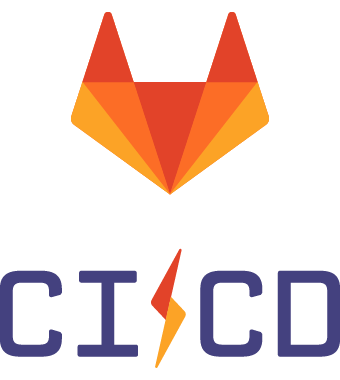
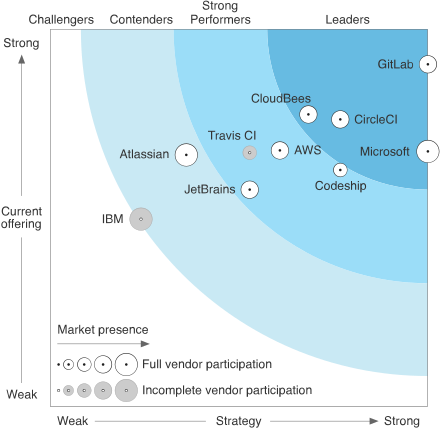
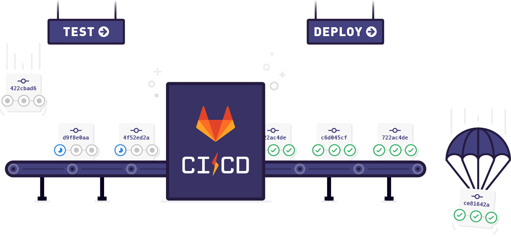
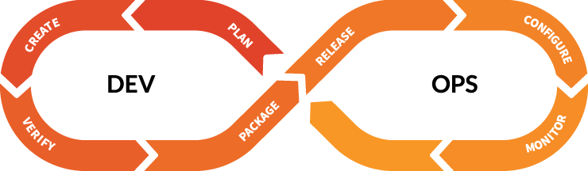
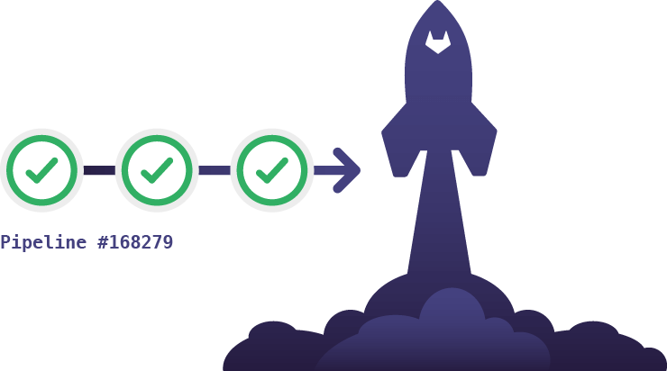
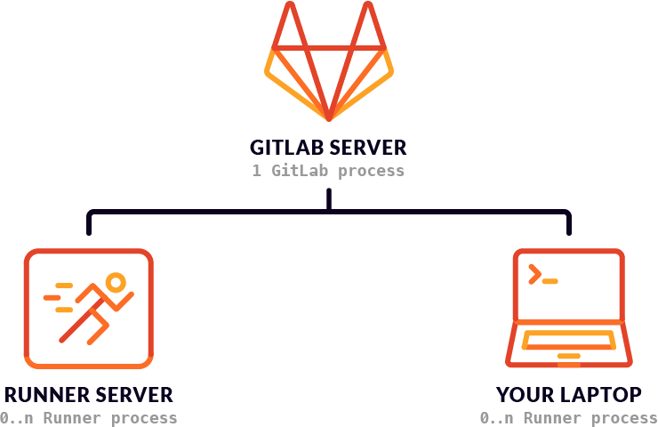

# GitLab Continuous Integration (GitLab CI/CD)

The benefits of Continuous Integration are huge when automation plays an
integral part of your workflow. GitLab comes with built-in Continuous
Integration, Continuous Deployment, and Continuous Delivery support
to build, test, and deploy your application.

Here's some info we've gathered to get you started.

## Getting started

The first steps towards your GitLab CI/CD journey.

- [Getting started with GitLab CI/CD](quick_start/README.md): understand how GitLab CI/CD works.
- [GitLab CI/CD configuration file: `.gitlab-ci.yml`](yaml/README.md) - Learn all about the ins and outs of `.gitlab-ci.yml`.
- [Pipelines and jobs](pipelines.md): configure your GitLab CI/CD pipelines to build, test, and deploy your application.
- Runners: The [GitLab Runner](https://docs.gitlab.com/runner/) is responsible by running the jobs in your CI/CD pipeline. On GitLab.com, Shared Runners are enabled by default, so
you don't need to set up anything to start to use them with GitLab CI/CD.

### Introduction to GitLab CI/CD

- Article (2016-08-05): [Continuous Integration, Delivery, and Deployment with GitLab - Intro to CI/CD](https://about.gitlab.com/2016/08/05/continuous-integration-delivery-and-deployment-with-gitlab/)
- Article (2015-12-14): [Getting started with GitLab and GitLab CI - Intro to CI](https://about.gitlab.com/2015/12/14/getting-started-with-gitlab-and-gitlab-ci/)
- Article (2017-07-13): [Making CI Easier with GitLab](https://about.gitlab.com/2017/07/13/making-ci-easier-with-gitlab/)
- Article (2017-05-22): [Fast and Natural Continuous Integration with GitLab CI](https://about.gitlab.com/2017/05/22/fast-and-natural-continuous-integration-with-gitlab-ci/)
- **Videos:**
  - Demo (Streamed live on Jul 17, 2017): [GitLab CI/CD Deep Dive](https://youtu.be/pBe4t1CD8Fc?t=195)
  - Demo (March, 2017): [How to get started using CI/CD with GitLab](https://about.gitlab.com/2017/03/13/ci-cd-demo/)
  - Webcast (April, 2016): [Getting started with CI in GitLab](https://about.gitlab.com/2016/04/20/webcast-recording-and-slides-introduction-to-ci-in-gitlab/)
- **Third-party videos:**
  - [Intégration continue avec GitLab (September, 2016)](https://www.youtube.com/watch?v=URcMBXjIr24&t=13s)
  - [GitLab CI for Minecraft Plugins (July, 2016)](https://www.youtube.com/watch?v=Z4pcI9F8yf8)

### Why GitLab CI/CD?

  - Article (2016-10-17): [Why We Chose GitLab CI for our CI/CD Solution](https://about.gitlab.com/2016/10/17/gitlab-ci-oohlala/)
  - Article (2016-07-22): [Building our web-app on GitLab CI: 5 reasons why Captain Train migrated from Jenkins to GitLab CI](https://about.gitlab.com/2016/07/22/building-our-web-app-on-gitlab-ci/)

## Exploring GitLab CI/CD

- [CI/CD Variables](variables/README.md) - Learn how to use variables defined in
  your `.gitlab-ci.yml` or the ones defined in your project's settings
  - [Where variables can be used](variables/where_variables_can_be_used.md) - A
    deeper look on where and how the CI/CD variables can be used
- **The permissions model** - Learn about the access levels a user can have for
  performing certain CI actions
  - [User permissions](../user/permissions.md#gitlab-ci)
  - [Job permissions](../user/permissions.md#job-permissions)
- [Configure a Runner, the application that runs your jobs](runners/README.md)
- Article (2016-03-01): [Setting up GitLab Runner For Continuous Integration](https://about.gitlab.com/2016/03/01/gitlab-runner-with-docker/)
- Article (2016-07-29): [GitLab CI: Run jobs sequentially, in parallel, or build a custom pipeline](https://about.gitlab.com/2016/07/29/the-basics-of-gitlab-ci/)
- Article (2016-08-26): [GitLab CI: Deployment & environments](https://about.gitlab.com/2016/08/26/ci-deployment-and-environments/)
- Article (2016-05-23): [Introduction to GitLab Container Registry](https://about.gitlab.com/2016/05/23/gitlab-container-registry/)

## Advanced use

Once you get familiar with the basics of GitLab CI/CD, it's time to dive in and
learn how to leverage its potential even more.

- [Environments and deployments](environments.md): Separate your jobs into
  environments and use them for different purposes like testing, building and
  deploying
- [Job artifacts](../user/project/pipelines/job_artifacts.md)
- [Caching dependencies](caching/index.md)
- [Git submodules](git_submodules.md) - How to run your CI jobs when Git
  submodules are involved
- [Use SSH keys in your build environment](ssh_keys/README.md)
- [Trigger pipelines through the GitLab API](triggers/README.md)
- [Trigger pipelines on a schedule](../user/project/pipelines/schedules.md)
- [Kubernetes clusters](../user/project/clusters/index.md) - Integrate one or
  more Kubernetes clusters to your project
- [Interactive web terminal](interactive_web_terminal/index.md) - Open an interactive
  web terminal to debug the running jobs

## GitLab CI/CD for Docker

Leverage the power of Docker to run your CI pipelines.

- [Use Docker images with GitLab Runner](docker/using_docker_images.md)
- [Use CI to build Docker images](docker/using_docker_build.md)
- [CI services (linked Docker containers)](services/README.md)
- Article (2016-03-01): [Setting up GitLab Runner For Continuous Integration](https://about.gitlab.com/2016/03/01/gitlab-runner-with-docker/)

## Review Apps

- [Review Apps documentation](review_apps/index.md)
- Article (2016-11-22): [Introducing Review Apps](https://about.gitlab.com/2016/11/22/introducing-review-apps/)
- [Example project that shows how to use Review Apps](https://gitlab.com/gitlab-examples/review-apps-nginx/)

## Auto DevOps

- [Auto DevOps](../topics/autodevops/index.md): Auto DevOps automatically detects, builds, tests, deploys, and monitors your applications.

## GitLab CI for GitLab Pages

See the documentation on [GitLab Pages](../user/project/pages/index.md).

## Examples

Check the [GitLab CI/CD examples](examples/README.md) for a collection of tutorials and guides on setting up your CI/CD pipeline for various programming languages, frameworks,
and operating systems.

## Integrations

- Article (2016-06-09): [Continuous Delivery with GitLab and Convox](https://about.gitlab.com/2016/06/09/continuous-delivery-with-gitlab-and-convox/)
- Article (2016-05-05): [Getting Started with GitLab and Shippable Continuous Integration](https://about.gitlab.com/2016/05/05/getting-started-gitlab-and-shippable/)
- Article (2016-04-19): [GitLab Partners with DigitalOcean to make Continuous Integration faster, safer, and more affordable](https://about.gitlab.com/2016/04/19/gitlab-partners-with-digitalocean-to-make-continuous-integration-faster-safer-and-more-affordable/)

## Special configuration (GitLab admin)

As a GitLab administrator, you can change the default behavior of GitLab CI/CD in
your whole GitLab instance as well as in each project.

- [Continuous Integration admin settings](../administration/index.md#continuous-integration-settings)
- **Project specific:**
  - [Pipelines settings](../user/project/pipelines/settings.md)
  - [Learn how to enable or disable GitLab CI](enable_or_disable_ci.md)
- **Affecting the whole GitLab instance:**
  - [Continuous Integration admin settings](../user/admin_area/settings/continuous_integration.md)

## Breaking changes

- [CI variables renaming for GitLab 9.0](variables/README.md#9-0-renaming) Read about the
  deprecated CI variables and what you should use for GitLab 9.0+.
- [New CI job permissions model](../user/project/new_ci_build_permissions_model.md)
  Read about what changed in GitLab 8.12 and how that affects your jobs.
  There's a new way to access your Git submodules and LFS objects in jobs.

## Rated \#1 in the Forrester CI Wave

> "GitLab supports development teams with a well-documented installation and
> configuration processes, an easy-to-follow UI, and a flexible per-seat pricing
> model that supports self service. GitLab’s vision is to serve enterprise-scale,
> integrated software development teams that want to spend more time writing code
> and less time maintaining their tool chain.” - Forrester CI Wave™

[Learn more](https://about.gitlab.com/resources/forrester-wave-ci-2017/)

## What Are The Advantages?

- **Integrated**: GitLab CI/CD is part of GitLab. You can use it for free on [GitLab.com](https://gitlab.com).
- **Easy to learn**: See the [Quick Start guide](quick_start/README.md).
- **Beautiful**: GitLab CI/CD offers the same great experience as GitLab. Familiar, easy to use, and beautiful.
- **Scalable**: Tests run distributed on separate machines of which you can add as many as you want
- **Faster results**: Each build can be split in multiple jobs that run in parallel on multiple machines
- **Continuous Delivery (CD)**: Multiple stages, manual deploys, environments, and variables
- **Open source**: CI/CD is included with both the open source GitLab Community Edition and the proprietary GitLab Enterprise Edition

## Features

- **Multi-platform**: You can execute builds on Unix, Windows, macOS, and any other platform that supports Go.
- **Multi-language**: Build scripts are command line driven and work with Java, PHP, Ruby, C, and any other language.
- **Stable**: Your builds run on a different machine than GitLab.
- **Parallel builds**: GitLab CI/CD splits builds over multiple machines, for fast execution.
- **Realtime logging**: A link in the merge request takes you to the current build log that updates dynamically.
- **Versioned tests**: A .gitlab-ci.yml file that contains your tests, allowing everyone to contribute changes and ensuring every branch gets the tests it needs.
- **Pipeline**: You can define multiple jobs per stage and you can trigger other builds
- **Autoscaling**: You can automatically spin up and down VMs to make sure your builds get processed immediately and minimize costs.
- **Job artifacts**: you can upload binaries and other job artifacts to GitLab and browse and download them.
- **Test locally**: There are multiple executors and you can reproduce tests locally
- **Docker support**: You can use custom Docker images, spin up services as part of testing, and build new Docker images, even run on Kubernetes.

## Entire DevOps lifecycle

- **Build** your application using GitLab Runners
- Run unit and integration **tests** to check if your code is valid
- Look at a live preview of your development branch with Review Apps before merging into stable
- **Deploy** to multiple environments like staging and production, and support advanced features such as canary deployments
- **Monitor** performances and status of your application

## Fully integrated with GitLab

- Quick project setup:
Add projects with a single click, all hooks are set up automatically via the GitLab API.
- Merge request integration:
See the status of each build within the Merge Request in GitLab.

## Architecture

**GitLab CI/CD** is a part of GitLab, a web application with an API
that stores its state in a database. It manages projects/builds and provides a nice user interface,
besides all the features of GitLab.

To perform the actual build, you need to install **GitLab Runner** which
is written in Go, it can be deployed separately and works with GitLab CI/CD through an API.
It can run on any platform for which you can build Go binaries,
including Linux, OSX, Windows, FreeBSD and Docker.
It can test any programming language including .Net, Java, Python, C, PHP and others.

In order to run tests, you need at least one GitLab instance and one GitLab Runner.

