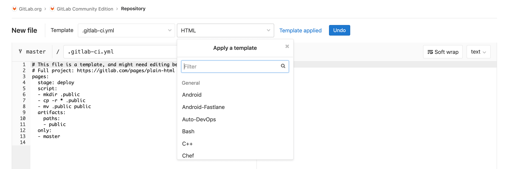

# GitLab CI/CD

GitLab CI/CD is a tool built into GitLab for software development
through the [continuous methodologies](introduction/index.md#introduction-to-cicd-methodologies):

- Continuous Integration (CI)
- Continuous Delivery (CD)
- Continuous Deployment (CD)

## Overview

Continuous Integration works by pushing small code chunks to your
application's code base hosted in a Git repository, and, to every
push, run a pipeline of scripts to build, test, and validate the
code changes before merging them into the main branch.

Continuous Delivery and Deployment consist of a step further CI,
deploying your application to production at every
push to the default branch of the repository.

These methodologies allow you to catch bugs and errors early in
the development cycle, ensuring that all the code deployed to
production complies with the code standards you established for
your app.

For a complete overview of these methodologies and GitLab CI/CD,
read the [Introduction to CI/CD with GitLab](introduction/index.md).

## Getting started

GitLab CI/CD is configured by a file called `.gitlab-ci.yml` placed
at the repository's root. The scripts set in this file are executed
by the [GitLab Runner](https://docs.gitlab.com/runner/).

To get started with GitLab CI/CD, we recommend you read through
the following documents:

- [How GitLab CI/CD works](introduction/index.md#how-gitlab-cicd-works).
- [GitLab CI/CD basic workflow](introduction/index.md#basic-cicd-workflow).
- [Step-by-step guide for writing `.gitlab-ci.yml` for the first time](../user/project/pages/getting_started_part_four.md).

You can also get started by using one of the
[`.gitlab-ci.yml` templates](https://gitlab.com/gitlab-org/gitlab-ce/tree/master/lib/gitlab/ci/templates)
available through the UI. You can use them by creating a new file,
choosing a template that suits your application, and adjusting it
to your needs:

For a broader overview, see the [CI/CD getting started](quick_start/README.md) guide.

Once you're familiar with how GitLab CI/CD works, see the
[`. gitlab-ci.yml` full reference](yaml/README.md)
for all the attributes you can set and use.

NOTE: **Note:**
GitLab CI/CD and [shared runners](runners/README.md#shared-specific-and-group-runners) are enabled in GitLab.com and available for all users, limited only to the [user's pipelines quota](https://docs.gitlab.com/ee/user/admin_area/settings/continuous_integration.html#extra-shared-runners-pipeline-minutes-quota).

## Configuration

GitLab CI/CD supports numerous configuration options:

| Configuration | Description  |
|:--------------|:-------------|
| [Pipelines](pipelines.md) | Structure your CI/CD process through pipelines. |
| [Environment variables](variables/README.md) | Reuse values based on a variable/value key pair. |
| [Environments](environments.md) | Deploy your application to different environments (e.g., staging, production). |
| [Job artifacts](../user/project/pipelines/job_artifacts.md) | Output, use, and reuse job artifacts. |
| [Cache dependencies](caching/index.md) | Cache your dependencies for a faster execution. |
| [Schedule pipelines](../user/project/pipelines/schedules.md) | Schedule pipelines to run as often as you need. |
| [Custom path for `.gitlab-ci.yml`](../user/project/pipelines/settings.md#custom-ci-config-path) | Define a custom path for the CI/CD configuration file. |
| [Git submodules for CI/CD](git_submodules.md) | Configure jobs for using Git submodules.|
| [SSH keys for CI/CD](ssh_keys/README.md) | Using SSH keys in your CI pipelines. |
| [Pipelines triggers](triggers/README.md) | Trigger pipelines through the API. |
| [Integrate with Kubernetes clusters](../user/project/clusters/index.md) | Connect your project to Google Kubernetes Engine (GKE) or an existing Kubernetes cluster. |
| [GitLab Runner](https://docs.gitlab.com/runner/) | Configure your own GitLab Runners to execute your scripts. |
| [Optimize GitLab and Runner for large repositories](large_repositories/index.md) | Recommended strategies for handling large repos. |
| [`.gitlab-ci.yml` full reference](yaml/README.md) | All the attributes you can use with GitLab CI/CD. |

Note that certain operations can only be performed according to the
[user](../user/permissions.md#gitlab-cicd-permissions) and [job](../user/permissions.md#job-permissions) permissions.

## Feature set

Use the vast GitLab CI/CD to easily configure it for specific purposes.
Its feature set is listed on the table below according to DevOps stages.

| Feature | Description |
|:--------|:------------|
| **Configure** ||
| [Auto DevOps](../topics/autodevops/index.md) | Set up your app's entire lifecycle. |
| [ChatOps](chatops/README.md) | Trigger CI jobs from chat, with results sent back to the channel. |
|---+---|
| **Verify** ||
| [Browser Performance Testing](https://docs.gitlab.com/ee/user/project/merge_requests/browser_performance_testing.html) | Quickly determine the performance impact of pending code changes. |
| [CI services](services/README.md) | Link Docker containers with your base image.|
| [Code Quality](https://docs.gitlab.com/ee/user/project/merge_requests/code_quality.html) **[STARTER]** | Analyze your source code quality. |
| [GitLab CI/CD for external repositories](https://docs.gitlab.com/ee/ci/ci_cd_for_external_repos/) **[PREMIUM]** | Get the benefits of GitLab CI/CD combined with repositories in GitHub and BitBucket Cloud. |
| [Interactive Web Terminals](interactive_web_terminal/index.md) **[CORE ONLY]** | Open an interactive web terminal to debug the running jobs. |
| [JUnit tests](junit_test_reports.md) | Identify script failures directly on merge requests. |
| [Using Docker images](docker/using_docker_images.md) | Use GitLab and GitLab Runner with Docker to build and test applications. |
|---+---|
| **Release** ||
| [Auto Deploy](../topics/autodevops/index.md#auto-deploy) | Deploy your application to a production environment in a Kubernetes cluster. |
| [Building Docker images](docker/using_docker_build.md) | Maintain Docker-based projects using GitLab CI/CD. |
| [Canary Deployments](https://docs.gitlab.com/ee/user/project/canary_deployments.html) **[PREMIUM]** | Ship features to only a portion of your pods and let a percentage of your user base to visit the temporarily deployed feature. |
| [Deploy Boards](https://docs.gitlab.com/ee/user/project/deploy_boards.html) **[PREMIUM]** | Check the current health and status of each CI/CD environment running on Kubernetes. |
| [Feature Flags](https://docs.gitlab.com/ee/user/project/operations/feature_flags.html) **[PREMIUM]** | Deploy your features behind Feature Flags. |
| [GitLab Pages](../user/project/pages/index.md) | Deploy static websites. |
| [GitLab Releases](../user/project/releases/index.md) | Add release notes to Git tags. |
| [Review Apps](review_apps/index.md) | Configure GitLab CI/CD to preview code changes. |
|---+---|
| **Secure** ||
| [Container Scanning](https://docs.gitlab.com/ee/ci/examples/container_scanning.html) **[ULTIMATE]** | Check your Docker containers for known vulnerabilities.|
| [Dependency Scanning](https://docs.gitlab.com/ee/ci/examples/dependency_scanning.html) **[ULTIMATE]** | Analyze your dependencies for known vulnerabilities. |
| [License Management](https://docs.gitlab.com/ee/user/application_security/license_management/) **[ULTIMATE]** | Search your project dependencies for their licenses. |
| [Security Test reports](https://docs.gitlab.com/ee/user/project/merge_requests/#security-reports-ultimate) **[ULTIMATE]** | Check for app vulnerabilities. |

## Examples

GitLab provides examples of configuring GitLab CI/CD in the form of:

- A collection of [examples and other resources](examples/README.md).
- Example projects that are available at the [`gitlab-examples`](https://gitlab.com/gitlab-examples) group. For example, see:
  - [`multi-project-pipelines`](https://gitlab.com/gitlab-examples/multi-project-pipelines) for examples of implementing multi-project pipelines.
  - [`review-apps-nginx`](https://gitlab.com/gitlab-examples/review-apps-nginx/) provides an example of using Review Apps.

## Administration **[CORE ONLY]**

As a GitLab administrator, you can change the default behavior
of GitLab CI/CD for:

- An [entire GitLab instance](../user/admin_area/settings/continuous_integration.md).
- Specific projects, using [pipelines settings](../user/project/pipelines/settings.md).

See also:

- [How to enable or disable GitLab CI/CD](enable_or_disable_ci.md).
- Other [CI administration settings](../administration/index.md#continuous-integration-settings).

## References

### Why GitLab CI/CD?

The following articles explain reasons to use GitLab CI/CD
for your CI/CD infrastructure:

- [Why we chose GitLab CI for our CI/CD solution](https://about.gitlab.com/2016/10/17/gitlab-ci-oohlala/)
- [Building our web-app on GitLab CI](https://about.gitlab.com/2016/07/22/building-our-web-app-on-gitlab-ci/)

See also the [Why CI/CD?](https://docs.google.com/presentation/d/1OGgk2Tcxbpl7DJaIOzCX4Vqg3dlwfELC3u2jEeCBbDk) presentation.

### Breaking changes

As GitLab CI/CD has evolved, certain breaking changes have
been necessary. These are:

#### 12.0

- [Use refspec to clone/fetch git
  repository](https://gitlab.com/gitlab-org/gitlab-runner/issues/4069).
- [Old cache
  configuration](https://gitlab.com/gitlab-org/gitlab-runner/issues/4070).
- [Old metrics server
  configuration](https://gitlab.com/gitlab-org/gitlab-runner/issues/4072).
- [Remove
  `FF_K8S_USE_ENTRYPOINT_OVER_COMMAND`](https://gitlab.com/gitlab-org/gitlab-runner/issues/4073).
- [Remove Linux distributions that reach
  EOL](https://gitlab.com/gitlab-org/gitlab-runner/merge_requests/1130).
- [Update command line API for helper
  images](https://gitlab.com/gitlab-org/gitlab-runner/issues/4013).
- [Remove old `git clean`
  flow](https://gitlab.com/gitlab-org/gitlab-runner/issues/4175).

#### 11.0

- No breaking changes.

#### 10.0

- No breaking changes.

#### 9.0

- [CI variables renaming for GitLab 9.0](variables/deprecated_variables.md#gitlab-90-renamed-variables). Read about the
  deprecated CI variables and what you should use for GitLab 9.0+.
- [New CI job permissions model](../user/project/new_ci_build_permissions_model.md).
  See what changed in GitLab 8.12 and how that affects your jobs.
  There's a new way to access your Git submodules and LFS objects in jobs.
