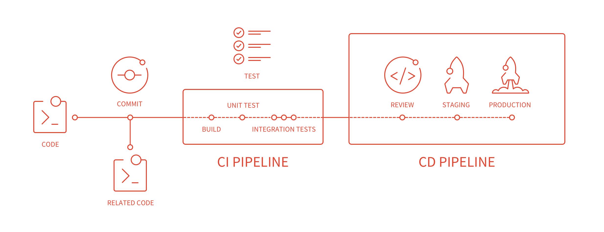

# GitLab Continuous Integration (GitLab CI)

The benefits of Continuous Integration are huge when automation plays an
integral part of your workflow. GitLab comes with built-in Continuous
Integration, Continuous Deployment, and Continuous Delivery support to build,
test, and deploy your application.

Here's some info we've gathered to get you started.

## Getting started

The first steps towards your GitLab CI journey.

- [Getting started with GitLab CI](quick_start/README.md)
- [Pipelines and jobs](pipelines.md)
- [Configure a Runner, the application that runs your jobs](runners/README.md)
- **Articles:**
  - [Getting started with GitLab and GitLab CI - Intro to CI](https://about.gitlab.com/2015/12/14/getting-started-with-gitlab-and-gitlab-ci/)
  - [Continuous Integration, Delivery, and Deployment with GitLab - Intro to CI/CD](https://about.gitlab.com/2016/08/05/continuous-integration-delivery-and-deployment-with-gitlab/)
  - [GitLab CI: Run jobs sequentially, in parallel, or build a custom pipeline](https://about.gitlab.com/2016/07/29/the-basics-of-gitlab-ci/)
  - [Setting up GitLab Runner For Continuous Integration](https://about.gitlab.com/2016/03/01/gitlab-runner-with-docker/)
  - [GitLab CI: Deployment & environments](https://about.gitlab.com/2016/08/26/ci-deployment-and-environments/)
- **Videos:**
  - [Demo (Streamed live on Jul 17, 2017): GitLab CI/CD Deep Dive](https://youtu.be/pBe4t1CD8Fc?t=195)
  - [Demo (March, 2017): how to get started using CI/CD with GitLab](https://about.gitlab.com/2017/03/13/ci-cd-demo/)
  - [Webcast (April, 2016): getting started with CI in GitLab](https://about.gitlab.com/2016/04/20/webcast-recording-and-slides-introduction-to-ci-in-gitlab/)
- **Third-party videos:**
  - [Intégration continue avec GitLab (September, 2016)](https://www.youtube.com/watch?v=URcMBXjIr24&t=13s)
  - [GitLab CI for Minecraft Plugins (July, 2016)](https://www.youtube.com/watch?v=Z4pcI9F8yf8)

## Reference guides

Once you get familiar with the getting started guides, you'll find yourself
digging into specific reference guides.

- [`.gitlab-ci.yml` reference](yaml/README.md) - Learn all about the ins and
  outs of `.gitlab-ci.yml` definitions
- [CI Variables](variables/README.md) - Learn how to use variables defined in
  your `.gitlab-ci.yml` or secured ones defined in your project's settings
- **The permissions model** - Learn about the access levels a user can have for
  performing certain CI actions
  - [User permissions](../user/permissions.md#gitlab-ci)
  - [Job permissions](../user/permissions.md#job-permissions)

## Auto DevOps

- [Auto DevOps](../topics/autodevops/index.md)

## GitLab CI + Docker

Leverage the power of Docker to run your CI pipelines.

- [Use Docker images with GitLab Runner](docker/using_docker_images.md)
- [Use CI to build Docker images](docker/using_docker_build.md)
- [CI services (linked Docker containers)](services/README.md)
- **Articles:**
  - [Setting up GitLab Runner For Continuous Integration](https://about.gitlab.com/2016/03/01/gitlab-runner-with-docker/)

## Advanced use

Once you get familiar with the basics of GitLab CI, it's time to dive in and
learn how to leverage its potential even more.

- [Environments and deployments](environments.md) - Separate your jobs into
  environments and use them for different purposes like testing, building and
  deploying
- [Job artifacts](../user/project/pipelines/job_artifacts.md)
- [Git submodules](git_submodules.md) - How to run your CI jobs when Git
  submodules are involved
- [Auto deploy](autodeploy/index.md)
- [Use SSH keys in your build environment](ssh_keys/README.md)
  and status of each CI environment running on Kubernetes
- [Trigger pipelines through the GitLab API](triggers/README.md)
- [Trigger pipelines on a schedule](../user/project/pipelines/schedules.md)
- [Deploy Boards](../user/project/deploy_boards.md) - Check the current health
- [Kubernetes clusters](../user/project/clusters/index.md) - Integrate one or
  more Kubernetes clusters to your project

## Review Apps

- [Review Apps](review_apps/index.md)
- **Articles:**
  - [Introducing Review Apps](https://about.gitlab.com/2016/11/22/introducing-review-apps/)
  - [Example project that shows how to use Review Apps](https://gitlab.com/gitlab-examples/review-apps-nginx/)

## GitLab CI for GitLab Pages

See the topic on [GitLab Pages](../user/project/pages/index.md).

## Special configuration

You can change the default behavior of GitLab CI in your whole GitLab instance
as well as in each project.

- **Project specific**
  - [Pipelines settings](../user/project/pipelines/settings.md)
  - [Learn how to enable or disable GitLab CI](enable_or_disable_ci.md)
- **Affecting the whole GitLab instance**
  - [Continuous Integration admin settings](../user/admin_area/settings/continuous_integration.md)

## Examples

>**Note:**
A collection of `.gitlab-ci.yml` files is maintained at the
[GitLab CI Yml project][gitlab-ci-templates].
If your favorite programming language or framework is missing we would love
your help by sending a merge request with a `.gitlab-ci.yml`.

Here is an collection of tutorials and guides on setting up your CI pipeline.

- [GitLab CI examples](examples/README.md) for the following languages and frameworks:
  - [PHP](examples/php.md)
  - [Ruby](examples/test-and-deploy-ruby-application-to-heroku.md)
  - [Python](examples/test-and-deploy-python-application-to-heroku.md)
  - [Clojure](examples/test-clojure-application.md)
  - [Scala](examples/test-scala-application.md)
  - [Phoenix](examples/test-phoenix-application.md)
  - [Run PHP Composer & NPM scripts then deploy them to a staging server](examples/deployment/composer-npm-deploy.md)
  - [Analyze code quality with the Code Climate CLI](examples/code_climate.md)
- **Articles**
  - [How to test and deploy Laravel/PHP applications with GitLab CI/CD and Envoy](../articles/laravel_with_gitlab_and_envoy/index.md)
  - [How to deploy Maven projects to Artifactory with GitLab CI/CD](examples/artifactory_and_gitlab/index.md)
  - [Automated Debian packaging](https://about.gitlab.com/2016/10/12/automated-debian-package-build-with-gitlab-ci/)
  - [Spring boot application with GitLab CI and Kubernetes](https://about.gitlab.com/2016/12/14/continuous-delivery-of-a-spring-boot-application-with-gitlab-ci-and-kubernetes/)
  - [Setting up GitLab CI for iOS projects](https://about.gitlab.com/2016/03/10/setting-up-gitlab-ci-for-ios-projects/)
  - [Setting up GitLab CI for Android projects](https://about.gitlab.com/2016/11/30/setting-up-gitlab-ci-for-android-projects/)
  - [Building a new GitLab Docs site with Nanoc, GitLab CI, and GitLab Pages](https://about.gitlab.com/2016/12/07/building-a-new-gitlab-docs-site-with-nanoc-gitlab-ci-and-gitlab-pages/)
  - [CI/CD with GitLab in action](https://about.gitlab.com/2017/03/13/ci-cd-demo/)
  - [Building an Elixir Release into a Docker image using GitLab CI](https://about.gitlab.com/2016/08/11/building-an-elixir-release-into-docker-image-using-gitlab-ci-part-1/)
- **Miscellaneous**
  - [Using `dpl` as deployment tool](examples/deployment/README.md)
  - [Repositories with examples for various languages](https://gitlab.com/groups/gitlab-examples)
  - [The .gitlab-ci.yml file for GitLab itself](https://gitlab.com/gitlab-org/gitlab-ce/blob/master/.gitlab-ci.yml)
  - [Example project that shows how to use Review Apps](https://gitlab.com/gitlab-examples/review-apps-nginx/)

## Integrations

- **Articles:**
  - [Continuous Delivery with GitLab and Convox](https://about.gitlab.com/2016/06/09/continuous-delivery-with-gitlab-and-convox/)
  - [Getting Started with GitLab and Shippable Continuous Integration](https://about.gitlab.com/2016/05/05/getting-started-gitlab-and-shippable/)
  - [GitLab Partners with DigitalOcean to make Continuous Integration faster, safer, and more affordable](https://about.gitlab.com/2016/04/19/gitlab-partners-with-digitalocean-to-make-continuous-integration-faster-safer-and-more-affordable/)

## Why GitLab CI?

- **Articles:**
  - [Why We Chose GitLab CI for our CI/CD Solution](https://about.gitlab.com/2016/10/17/gitlab-ci-oohlala/)
  - [Building our web-app on GitLab CI: 5 reasons why Captain Train migrated from Jenkins to GitLab CI](https://about.gitlab.com/2016/07/22/building-our-web-app-on-gitlab-ci/)

## Breaking changes

- [CI variables renaming for GitLab 9.0](variables/README.md#9-0-renaming) Read about the
  deprecated CI variables and what you should use for GitLab 9.0+.
- [New CI job permissions model](../user/project/new_ci_build_permissions_model.md)
  Read about what changed in GitLab 8.12 and how that affects your jobs.
  There's a new way to access your Git submodules and LFS objects in jobs.

[gitlab-ci-templates]: https://gitlab.com/gitlab-org/gitlab-ci-yml
