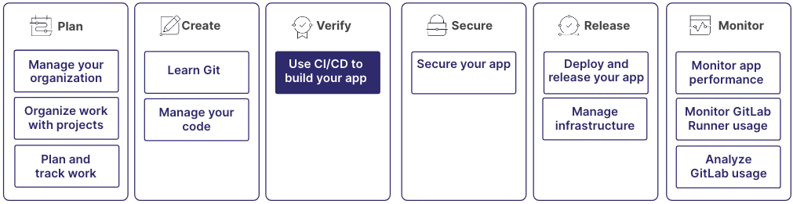

DETAILS:
**Tier:** Free, Premium, Ultimate
**Offering:** GitLab.com, GitLab Self-Managed, GitLab Dedicated

CI/CD is a continuous method of software development, where you continuously build,
test, deploy, and monitor iterative code changes.

This iterative process helps reduce the chance that you develop new code based on
buggy or failed previous versions. GitLab CI/CD can catch bugs early in the development cycle,
and help ensure that the code deployed to production complies with your established code standards.

This process is part of a larger workflow:

## Step 1: Create a `.gitlab-ci.yml` file

To use GitLab CI/CD, you start with a `.gitlab-ci.yml` file at the root of your project.
This file specifies the stages, jobs, and scripts to be executed during your CI/CD pipeline.
It is a YAML file with its own custom syntax.

In this file, you define variables, dependencies between jobs, and specify when
and how each job should be executed.

You can name this file anything you want, but `.gitlab-ci.yml` is the most common name,
and the product documentation refers to it as the `.gitlab-ci.yml` file or the CI/CD configuration file.

For more information, see:

- [Tutorial: Create your first `.gitlab-ci.yml` file](quick_start/_index.md)
- [The CI/CD YAML syntax reference](yaml/_index.md), which lists all possible keywords
- <i class="fa fa-youtube-play youtube" aria-hidden="true"></i> [Continuous Integration overview](https://www.youtube-nocookie.com/embed/eyr5YnkWq_I)
- <i class="fa fa-youtube-play youtube" aria-hidden="true"></i> [Continuous Delivery overview](https://www.youtube-nocookie.com/embed/M7rBDZYsx8U)
- [Basics of CI blog](https://about.gitlab.com/blog/2020/12/10/basics-of-gitlab-ci-updated/)

## Step 2: Find or create runners

Runners are the agents that run your jobs. These agents can run on physical machines or virtual instances.
In your `.gitlab-ci.yml` file, you can specify a container image you want to use when running the job.
The runner loads the image, clones your project, and runs the job either locally or in the container.

If you use GitLab.com, runners on Linux, Windows, and macOS are already available for use. And you can register your own
runners on GitLab.com if you'd like.

If you don't use GitLab.com, you can:

- Register runners or use runners already registered for your GitLab Self-Managed instance.
- Create a runner on your local machine.

For more information, see:

- [Create a runner on your local machine](../tutorials/create_register_first_runner/_index.md)
- [More information about runners](https://docs.gitlab.com/runner/)

## Step 3: Define your pipelines

A pipeline is what you're defining in the `.gitlab-ci.yml` file,
and is what happens when the contents of the file are run on a runner.

Pipelines are made up of jobs and stages:

- Stages define the order of execution. Typical stages might be `build`, `test`, and `deploy`.
- Jobs specify the tasks to be performed in each stage. For example, a job can compile or test code.

Pipelines can be triggered by various events, like commits or merges, or can be on schedule.
In your pipeline, you can integrate with a wide range of tools and platforms.

For more information, see:

- [Pipeline editor](pipeline_editor/_index.md), which you use to edit your configuration
- [Visualize your pipeline](pipeline_editor/_index.md#visualize-ci-configuration)
- [Pipelines](pipelines/_index.md)

## Step 4: Use CI/CD variables as part of jobs

GitLab CI/CD variables are key-value pairs you use to store and pass configuration settings
and sensitive information, like passwords or API keys, to jobs in a pipeline.

Use CI/CD variables to customize jobs by making values defined elsewhere accessible to jobs.
You can hard-code CI/CD variables in your `.gitlab-ci.yml` file, set them in your project settings,
or generate them dynamically. You can define them for the project, group, or instance.

Two types of variables exist: custom variables and predefined.

- Custom variables are user-defined. Create and manage them in the GitLab UI, API, or in configuration files.
- Predefined variables are automatically set by GitLab and provide information about the current job, pipeline, and environment.

Variables can be marked as "protected" or "masked" for added security.

- Protected variables are only available to jobs running on protected branches or tags.
- Masked variables have their values hidden in job logs to prevent sensitive information from being exposed.

For more information, see:

- [CI/CD variables](variables/_index.md)
- [Dynamically generated predefined variables](variables/predefined_variables.md)

## Step 5: Use CI/CD components

A CI/CD component is a reusable pipeline configuration unit.
Use a CI/CD component to compose an entire pipeline configuration or a small part of a larger pipeline.

You can add a component to your pipeline configuration with `include:component`.

Reusable components help reduce duplication, improve maintainability, and promote consistency across projects. Create a component project and publish it to the CI/CD Catalog to share your component across multiple projects.

GitLab also has CI/CD component templates for common tasks and integrations.

For more information, see:

- [CI/CD components](components/_index.md)
