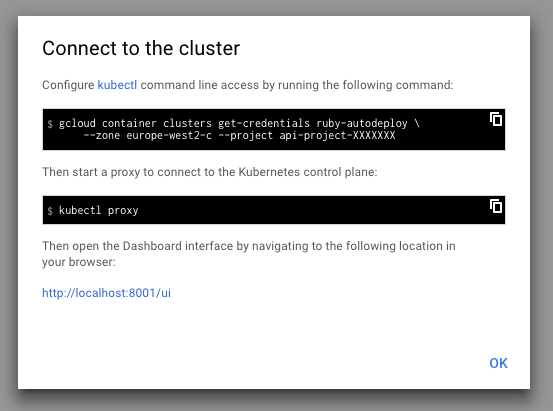
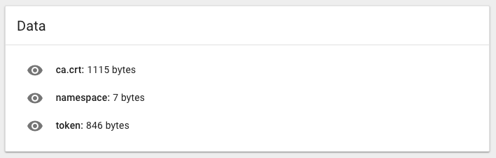
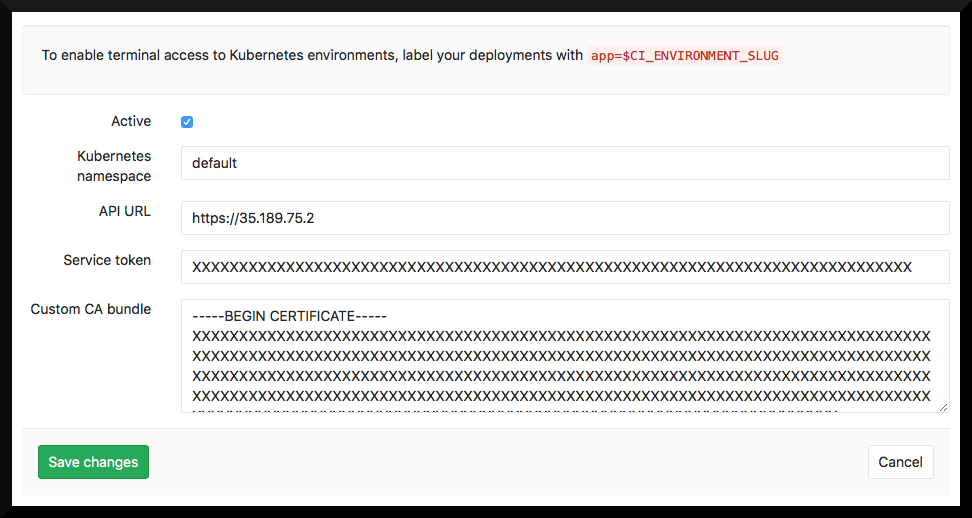

# Auto deploy: quick start guide

This is a step-by-step guide to deploying a project hosted on GitLab.com to Google Cloud, using Auto Deploy.

We made a Ruby application to use as an example for this guide. It contains several files that we need to make auto deploy possible.

* `server.rb` - our application. It will start an HTTP server on port 5000 and render “Hello, world!”
* `Dockerfile` - to build our app into a container image. It will use a ruby base image and run `server.rb`
* `.gitlab-ci.yml` - GitLab CI configuration file with only 2 jobs: build a docker image and deploy it to kubernetes

These are the absolute minimal requirement to have your application automatically build and deploy to Google Container Engine every time you push to the repository.

### Fork sample project on GitLab.com

Let’s start by forking our sample application. Go to [the project page](https://gitlab.com/gitlab-examples/ruby-autodeploy) and press the `Fork` button. In few minutes you should have a project under your namespace with all the necessary files.

### Setup your own cluster on Google Container Engine

We assume you already have account for https://console.cloud.google.com. If not - you need to create one.

Visit the [`Container Engine`](https://console.cloud.google.com/kubernetes/list) tab and create a new cluster. You can change the name and leave the rest of the default settings. Once you have your cluster running, you need to connect to the cluster by following Google interface.

### Connect to Kubernetes cluster

You need to have the Google Cloud SDK installed. e.g.
On OSX, install [homebrew](https://brew.sh):

1. Install Brew Caskroom: `brew install caskroom/cask/brew-cask`
2. Install Google Cloud SDK: `brew cask install google-cloud-sdk`
3. Run: `gcloud components install kubectl`

Connect to the cluster and open Kubernetes Dashboard



### Copy credentials to GitLab.com

Once you have the Kubernetes Dashboard interface running, you should visit `Secrets` under the  `Config` section. There you should find the settings we need for GitLab integration: ca.crt and token.



You need to copy-paste these the ca.crt and token into your project on GitLab.com in the Kubernetes integration page under project `Settings` > `Integrations` > `Project services` > `Kubernetes`. Don't actually copy the namespace though. Each project should have a unique namespace, and by leaving it blank, GitLab will create one for you.



For API URL setting you should use the `Endpoint` IP from your cluster page on Google Cloud Platform. That will ensure GitLab.com can deploy containers to your cluster at Google Container Engine.

### Expose application to the world

In order to be able to visit your application, you need to install an NGINX ingress controller and point your domain name to its external IP address.

#### Set up Ingress controller

You’ll need to make sure you have an ingress controller. If you don’t have one, do:

```sh
brew install kubernetes-helm
helm init
helm install --name production stable/nginx-ingress
```

This should create several services including `production-nginx-ingress-controller`. You can list your services by running `kubectl get svc` to confirm that.

#### Point DNS at Cluster IP

Find out the external IP address of the `production-nginx-ingress-controller` by running:

```sh
kubectl get svc production-nginx-ingress-controller -o jsonpath='{.status.loadBalancer.ingress[0].ip}'
```

Use this IP address to configure your DNS. This part heavily depends on your preferences and domain provider. But in case you are not sure, just create an A record with a wildcard host like `*.<your-domain>`.

Use `nslookup production.<yourdomain>` to confirm that domain is assigned to the cluster IP.

### Build and run your code

Now we are going to make a change in the source code. It will create CI jobs and get your application built and deployed. Visit your project on GitLab.com and edit `.gitlab-ci.yml`. Replace `example.com` and `production.example.com` with your domain names.

Once submitted, your changes should create a new pipeline with 2 jobs: build and deploy. The build job will create a docker image with your new change and push it to the GitLab Container Registry. Deploy job will run this image on your cluster. Once the deploy job succeeds you should be able to see your application by visiting the Kubernetes dashboard. Select the namespace of your project, which will look like `ruby-autodeploy-23`, but with a unique ID for your project, and your app will be listed as “production” under the Deployment tab.

Once its ready - just visit http://production.yourdomain.com to see “Hello, world!”
