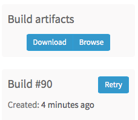
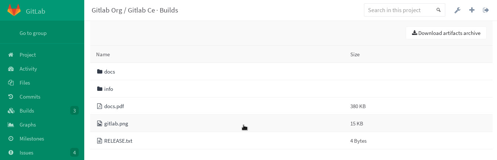

# Introduction to build artifacts

Artifacts is a list of files and directories which are attached to a build
after it completes successfully.  This feature is enabled by default in all GitLab installations.

_If you are searching for ways to use artifacts, jump to
[Defining artifacts in `.gitlab-ci.yml`](#defining-artifacts-in-gitlab-ciyml)._

Since GitLab 8.2 and [GitLab Runner] 0.7.0, build artifacts that are created by
GitLab Runner are uploaded to GitLab and are downloadable as a single archive
(`tar.gz`) using the GitLab UI.

Starting from GitLab 8.4 and GitLab Runner 1.0, the artifacts archive format
changed to `ZIP`, and it is now possible to browse its contents, with the added
ability of downloading the files separately.

**Note:**
The artifacts browser will be available only for new artifacts that are sent
to GitLab using GitLab Runner version 1.0 and up. It will not be possible to
browse old artifacts already uploaded to GitLab.

## Disabling build artifacts

To disable artifacts site-wide, follow the steps below.

---

**In Omnibus installations:**

1. Edit `/etc/gitlab/gitlab.rb` and add the following line:

    ```ruby
    gitlab_rails['artifacts_enabled'] = false
    ```

1. Save the file and [reconfigure GitLab][] for the changes to take effect.

---

**In installations from source:**

1. Edit `/home/git/gitlab/config/gitlab.yml` and add or amend the following lines:

    ```yaml
    artifacts:
      enabled: false
    ```

1. Save the file and [restart GitLab][] for the changes to take effect.

## Defining artifacts in `.gitlab-ci.yml`

A simple example of using the artifacts definition in `.gitlab-ci.yml` would be
the following:

```yaml
pdf:
  script: xelatex mycv.tex
  artifacts:
    paths:
    - mycv.pdf
```

A job named `pdf` calls the `xelatex` command in order to build a pdf file from
the latex source file `mycv.tex`. We then define the `artifacts` paths which in
turn are defined with the `paths` keyword. All paths to files and directories
are relative to the repository that was cloned during the build.

For more examples on artifacts, follow the
[separate artifacts yaml documentation](../yaml/README.md#artifacts).

## Storing build artifacts

After a successful build, GitLab Runner uploads an archive containing the build
artifacts to GitLab.

To change the location where the artifacts are stored, follow the steps below.

---

**In Omnibus installations:**

_The artifacts are stored by default in
`/var/opt/gitlab/gitlab-rails/shared/artifacts`._

1. To change the storage path for example to `/mnt/storage/artifacts`, edit
   `/etc/gitlab/gitlab.rb` and add the following line:

    ```ruby
    gitlab_rails['artifacts_path'] = "/mnt/storage/artifacts"
    ```

1. Save the file and [reconfigure GitLab][] for the changes to take effect.

---

**In installations from source:**

_The artifacts are stored by default in
`/home/git/gitlab/shared/artifacts`._

1. To change the storage path for example to `/mnt/storage/artifacts`, edit
   `/home/git/gitlab/config/gitlab.yml` and add or amend the following lines:

    ```yaml
    artifacts:
      enabled: true
      path: /mnt/storage/artifacts
    ```

1. Save the file and [restart GitLab][] for the changes to take effect.

## Browsing build artifacts

When GitLab receives an artifacts archive, an archive metadata file is also
generated. This metadata file describes all the entries that are located in the
artifacts archive itself. The metadata file is in a binary format, with
additional GZIP compression.

GitLab does not extract the artifacts archive in order to save space, memory
and disk I/O. It instead inspects the metadata file which contains all the
relevant information. This is especially important when there is a lot of
artifacts, or an archive is a very large file.

---

After a successful build, if you visit the build's specific page, you can see
that there are two buttons.

One is for downloading the artifacts archive and the other for browsing its
contents.



---

The archive browser shows the name and the actual file size of each file in the
archive. If your artifacts contained directories, then you are also able to
browse inside them.

Below you can see an image of three different file formats, as well as two
directories.



---

## Downloading build artifacts

If you need to download the whole archive, there are buttons in various places
inside GitLab that make that possible.

1. While on the builds page, you can see the download icon for each build's
   artifacts archive in the right corner

1. While inside a specific build, you are presented with a download button
   along with the one that browses the archive

1. And finally, when browsing an archive you can see the download button at
   the top right corner

---

Note that GitLab does not extract the entire artifacts archive to send just a
single file to the user.

When clicking on a specific file, [GitLab Workhorse] extracts it from the
archive and the download begins.

This implementation saves space, memory and disk I/O.

[gitlab runner]: https://gitlab.com/gitlab-org/gitlab-ci-multi-runner "GitLab Runner repository"
[reconfigure gitlab]: ../../administration/restart_gitlab.md "How to restart GitLab documentation"
[restart gitlab]: ../../administration/restart_gitlab.md "How to restart GitLab documentation"
[gitlab workhorse]: https://gitlab.com/gitlab-org/gitlab-workhorse "GitLab Workhorse repository"
