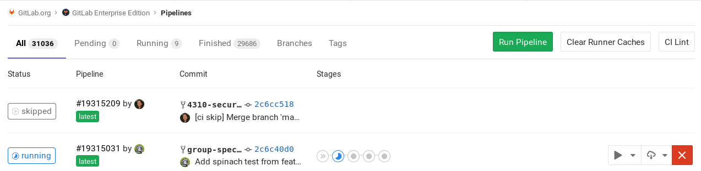

# Cache dependencies in GitLab CI/CD

GitLab CI/CD provides a caching mechanism that can be used to save time
when your jobs are running.

Caching is about speeding the time a job is executed by reusing the same
content of a previous job. It can be particularly useful when you are
developing software that depends on other libraries which are fetched via the
internet during build time.

If caching is enabled, it's shared between pipelines and jobs at the project
level by default, starting from GitLab 9.0. Caches are not shared across
projects.

Make sure you read the [`cache` reference](../yaml/README.md#cache) to learn
how it is defined in `.gitlab-ci.yml`.

## Cache vs artifacts

NOTE: **Note:**
Be careful if you use cache and artifacts to store the same path in your jobs
as **caches are restored before artifacts** and the content could be overwritten.

Don't use caching for passing artifacts between stages, as it is designed to store
runtime dependencies needed to compile the project:

- `cache`: **For storing project dependencies**

  Caches are used to speed up runs of a given job in **subsequent pipelines**, by
  storing downloaded dependencies so that they don't have to be fetched from the
  internet again (like npm packages, Go vendor packages, etc.) While the cache could
  be configured to pass intermediate build results between stages, this should be
  done with artifacts instead.

- `artifacts`: **Use for stage results that will be passed between stages.**

  Artifacts are files generated by a job which are stored and uploaded, and can then
  be fetched and used by jobs in later stages of the **same pipeline**. This data
  will not be available in different pipelines, but is available to be downloaded
  from the UI.

The name `artifacts` sounds like it's only useful outside of the job, like for downloading
a final image, but artifacts are also available in later stages within a pipeline.
So if you build your application by downloading all the required modules, you might
want to declare them as artifacts so that subsequent stages can use them. There are
some optimizations like declaring an [expiry time](../yaml/README.md#artifactsexpire_in)
so you don't keep artifacts around too long, or using [dependencies](../yaml/README.md#dependencies)
to control which jobs fetch the artifacts.

Caches:

- Are disabled if not defined globally or per job (using `cache:`).
- Are available for all jobs in your `.gitlab-ci.yml` if enabled globally.
- Can be used in subsequent pipelines by the same job in which the cache was created (if not defined globally).
- Are stored where the Runner is installed **and** uploaded to S3 if [distributed cache is enabled](https://docs.gitlab.com/runner/configuration/autoscale.html#distributed-runners-caching).
- If defined per job, are used:
  - By the same job in a subsequent pipeline.
  - By subsequent jobs in the same pipeline, if they have identical dependencies.

Artifacts:

- Are disabled if not defined per job (using `artifacts:`).
- Can only be enabled per job, not globally.
- Are created during a pipeline and can be used by the subsequent jobs of that currently active pipeline.
- Are always uploaded to GitLab (known as coordinator).
- Can have an expiration value for controlling disk usage (30 days by default).

NOTE: **Note:**
Both artifacts and caches define their paths relative to the project directory, and
can't link to files outside it.

## Good caching practices

We have the cache from the perspective of the developers (who consume a cache
within the job) and the cache from the perspective of the Runner. Depending on
which type of Runner you are using, cache can act differently.

From the perspective of the developer, to ensure maximum availability of the
cache, when declaring `cache` in your jobs, use one or a mix of the following:

- [Tag your Runners](../runners/README.md#using-tags) and use the tag on jobs
  that share their cache.
- [Use sticky Runners](../runners/README.md#locking-a-specific-runner-from-being-enabled-for-other-projects)
  that will be only available to a particular project.
- [Use a `key`](../yaml/README.md#cachekey) that fits your workflow (for example,
  different caches on each branch). For that, you can take advantage of the
  [CI/CD predefined variables](../variables/README.md#predefined-environment-variables).

TIP: **Tip:**
Using the same Runner for your pipeline, is the most simple and efficient way to
cache files in one stage or pipeline, and pass this cache to subsequent stages
or pipelines in a guaranteed manner.

From the perspective of the Runner, in order for cache to work effectively, one
of the following must be true:

- Use a single Runner for all your jobs.
- Use multiple Runners (in autoscale mode or not) that use
  [distributed caching](https://docs.gitlab.com/runner/configuration/autoscale.html#distributed-runners-caching),
  where the cache is stored in S3 buckets (like shared Runners on GitLab.com).
- Use multiple Runners (not in autoscale mode) of the same architecture that
  share a common network-mounted directory (using NFS or something similar)
  where the cache will be stored.

TIP: **Tip:**
Read about the [availability of the cache](#availability-of-the-cache)
to learn more about the internals and get a better idea how cache works.

### Sharing caches across the same branch

Define a cache with the `key: ${CI_COMMIT_REF_SLUG}` so that jobs of each
branch always use the same cache:

```yaml
cache:
  key: ${CI_COMMIT_REF_SLUG}
```

While this feels like it might be safe from accidentally overwriting the cache,
it means merge requests get slow first pipelines, which might be a bad
developer experience. The next time a new commit is pushed to the branch, the
cache will be re-used.

To enable per-job and per-branch caching:

```yaml
cache:
  key: "$CI_JOB_NAME-$CI_COMMIT_REF_SLUG"
```

To enable per-branch and per-stage caching:

```yaml
cache:
  key: "$CI_JOB_STAGE-$CI_COMMIT_REF_SLUG"
```

### Sharing caches across different branches

If the files you are caching need to be shared across all branches and all jobs,
you can use the same key for all of them:

```yaml
cache:
  key: one-key-to-rule-them-all
```

To share the same cache between branches, but separate them by job:

```yaml
cache:
  key: ${CI_JOB_NAME}
```

### Disabling cache on specific jobs

If you have defined the cache globally, it means that each job will use the
same definition. You can override this behavior per-job, and if you want to
disable it completely, use an empty hash:

```yaml
job:
  cache: {}
```

### Inherit global config, but override specific settings per job

You can override cache settings without overwriting the global cache by using
[anchors](../yaml/README.md#anchors). For example, if you want to override the
`policy` for one job:

```yaml
cache: &global_cache
    key: ${CI_COMMIT_REF_SLUG}
    paths:
      - node_modules/
      - public/
      - vendor/
    policy: pull-push

job:
  cache:
    # inherit all global cache settings
    <<: *global_cache
    # override the policy
    policy: pull
```

For more fine tuning, read also about the
[`cache: policy`](../yaml/README.md#cachepolicy).

## Common use cases

The most common use case of cache is to preserve contents between subsequent
runs of jobs for things like dependencies and commonly used libraries
(Nodejs packages, PHP packages, rubygems, Python libraries, etc.),
so they don't have to be re-fetched from the public internet.

NOTE: **Note:**
For more examples, check out our [GitLab CI/CD
templates](https://gitlab.com/gitlab-org/gitlab-foss/tree/master/lib/gitlab/ci/templates).

### Caching Nodejs dependencies

Assuming your project is using [npm](https://www.npmjs.com/) or
[Yarn](https://yarnpkg.com/en/) to install the Nodejs dependencies, the
following example defines `cache` globally so that all jobs inherit it.
Nodejs modules are installed in `node_modules/` and are cached per-branch:

```yaml
#
# https://gitlab.com/gitlab-org/gitlab-foss/tree/master/lib/gitlab/ci/templates/Nodejs.gitlab-ci.yml
#
image: node:latest

# Cache modules in between jobs
cache:
  key: ${CI_COMMIT_REF_SLUG}
  paths:
  - node_modules/

before_script:
  - npm install

test_async:
  script:
  - node ./specs/start.js ./specs/async.spec.js
```

### Caching PHP dependencies

Assuming your project is using [Composer](https://getcomposer.org/) to install
the PHP dependencies, the following example defines `cache` globally so that
all jobs inherit it. PHP libraries modules are installed in `vendor/` and
are cached per-branch:

```yaml
#
# https://gitlab.com/gitlab-org/gitlab-foss/tree/master/lib/gitlab/ci/templates/PHP.gitlab-ci.yml
#
image: php:7.2

# Cache libraries in between jobs
cache:
  key: ${CI_COMMIT_REF_SLUG}
  paths:
  - vendor/

before_script:
# Install and run Composer
- curl --show-error --silent https://getcomposer.org/installer | php
- php composer.phar install

test:
  script:
  - vendor/bin/phpunit --configuration phpunit.xml --coverage-text --colors=never
```

### Caching Python dependencies

Assuming your project is using [pip](https://pip.pypa.io/en/stable/) to install
the Python dependencies, the following example defines `cache` globally so that
all jobs inherit it. Python libraries are installed in a virtualenv under `venv/`,
pip's cache is defined under `.cache/pip/` and both are cached per-branch:

```yaml
#
# https://gitlab.com/gitlab-org/gitlab-foss/tree/master/lib/gitlab/ci/templates/Python.gitlab-ci.yml
#
image: python:latest

# Change pip's cache directory to be inside the project directory since we can
# only cache local items.
variables:
    PIP_CACHE_DIR: "$CI_PROJECT_DIR/.cache/pip"

# Pip's cache doesn't store the python packages
# https://pip.pypa.io/en/stable/reference/pip_install/#caching
#
# If you want to also cache the installed packages, you have to install
# them in a virtualenv and cache it as well.
cache:
  paths:
    - .cache/pip
    - venv/

before_script:
  - python -V               # Print out python version for debugging
  - pip install virtualenv
  - virtualenv venv
  - source venv/bin/activate

test:
  script:
  - python setup.py test
  - pip install flake8
  - flake8 .
```

### Caching Ruby dependencies

Assuming your project is using [Bundler](https://bundler.io) to install the
gem dependencies, the following example defines `cache` globally so that all
jobs inherit it. Gems are installed in `vendor/ruby/` and are cached per-branch:

```yaml
#
# https://gitlab.com/gitlab-org/gitlab-foss/tree/master/lib/gitlab/ci/templates/Ruby.gitlab-ci.yml
#
image: ruby:2.6

# Cache gems in between builds
cache:
  key: ${CI_COMMIT_REF_SLUG}
  paths:
    - vendor/ruby

before_script:
  - ruby -v                                   # Print out ruby version for debugging
  - bundle install -j $(nproc) --path vendor  # Install dependencies into ./vendor/ruby

rspec:
  script:
  - rspec spec
```

## Availability of the cache

Caching is an optimization, but isn't guaranteed to always work, so you need to
be prepared to regenerate any cached files in each job that needs them.

Assuming you have properly [defined `cache` in `.gitlab-ci.yml`](../yaml/README.md#cache)
according to your workflow, the availability of the cache ultimately depends on
how the Runner has been configured (the executor type and whether different
Runners are used for passing the cache between jobs).

### Where the caches are stored

Since the Runner is the one responsible for storing the cache, it's essential
to know **where** it's stored. All the cache paths defined under a job in
`.gitlab-ci.yml` are archived in a single `cache.zip` file and stored in the
Runner's configured cache location. By default, they are stored locally in the
machine where the Runner is installed and depends on the type of the executor.

| GitLab Runner executor | Default path of the cache |
| ---------------------- | ------------------------- |
| [Shell](https://docs.gitlab.com/runner/executors/shell.html) | Locally, stored under the `gitlab-runner` user's home directory: `/home/gitlab-runner/cache/<user>/<project>/<cache-key>/cache.zip`. |
| [Docker](https://docs.gitlab.com/runner/executors/docker.html) | Locally, stored under [Docker volumes](https://docs.gitlab.com/runner/executors/docker.html#the-builds-and-cache-storage): `/var/lib/docker/volumes/<volume-id>/_data/<user>/<project>/<cache-key>/cache.zip`. |
| [Docker machine](https://docs.gitlab.com/runner/executors/docker_machine.html) (autoscale Runners) | Behaves the same as the Docker executor. |

### How archiving and extracting works

In the most simple scenario, consider that you use only one machine where the
Runner is installed, and all jobs of your project run on the same host.

Let's see the following example of two jobs that belong to two consecutive
stages:

```yaml
stages:
- build
- test

before_script:
- echo "Hello"

job A:
  stage: build
  script:
  - mkdir vendor/
  - echo "build" > vendor/hello.txt
  cache:
    key: build-cache
    paths:
    - vendor/
  after_script:
  - echo "World"

job B:
  stage: test
  script:
  - cat vendor/hello.txt
  cache:
    key: build-cache
```

Here's what happens behind the scenes:

1. Pipeline starts.
1. `job A` runs.
1. `before_script` is executed.
1. `script` is executed.
1. `after_script` is executed.
1. `cache` runs and the `vendor/` directory is zipped into `cache.zip`.
   This file is then saved in the directory based on the
   [Runner's setting](#where-the-caches-are-stored) and the `cache: key`.
1. `job B` runs.
1. The cache is extracted (if found).
1. `before_script` is executed.
1. `script` is executed.
1. Pipeline finishes.

By using a single Runner on a single machine, you'll not have the issue where
`job B` might execute on a Runner different from `job A`, thus guaranteeing the
cache between stages. That will only work if the build goes from stage `build`
to `test` in the same Runner/machine, otherwise, you [might not have the cache
available](#cache-mismatch).

During the caching process, there's also a couple of things to consider:

- If some other job, with another cache configuration had saved its
  cache in the same zip file, it is overwritten. If the S3 based shared cache is
  used, the file is additionally uploaded to S3 to an object based on the cache
  key. So, two jobs with different paths, but the same cache key, will overwrite
  their cache.
- When extracting the cache from `cache.zip`, everything in the zip file is
  extracted in the job's working directory (usually the repository which is
  pulled down), and the Runner doesn't mind if the archive of `job A` overwrites
  things in the archive of `job B`.

The reason why it works this way is because the cache created for one Runner
often will not be valid when used by a different one which can run on a
**different architecture** (e.g., when the cache includes binary files). And
since the different steps might be executed by Runners running on different
machines, it is a safe default.

### Cache mismatch

In the following table, you can see some reasons where you might hit a cache
mismatch and a few ideas how to fix it.

| Reason of a cache mismatch | How to fix it |
| -------------------------- | ------------- |
| You use multiple standalone Runners (not in autoscale mode) attached to one project without a shared cache | Use only one Runner for your project or use multiple Runners with distributed cache enabled |
| You use Runners in autoscale mode without a distributed cache enabled | Configure the autoscale Runner to use a distributed cache |
| The machine the Runner is installed on is low on disk space or, if you've set up distributed cache, the S3 bucket where the cache is stored doesn't have enough space | Make sure you clear some space to allow new caches to be stored. Currently, there's no automatic way to do this. |
| You use the same `key` for jobs where they cache different paths. | Use different cache keys to that the cache archive is stored to a different location and doesn't overwrite wrong caches. |

Let's explore some examples.

#### Examples

Let's assume you have only one Runner assigned to your project, so the cache
will be stored in the Runner's machine by default. If two jobs, A and B,
have the same cache key, but they cache different paths, cache B would overwrite
cache A, even if their `paths` don't match:

We want `job A` and `job B` to re-use their
cache when the pipeline is run for a second time.

```yaml
stages:
- build
- test

job A:
  stage: build
  script: make build
  cache:
    key: same-key
    paths:
    - public/

job B:
  stage: test
  script: make test
  cache:
    key: same-key
    paths:
    - vendor/
```

1. `job A` runs.
1. `public/` is cached as cache.zip.
1. `job B` runs.
1. The previous cache, if any, is unzipped.
1. `vendor/` is cached as cache.zip and overwrites the previous one.
1. The next time `job A` runs it will use the cache of `job B` which is different
   and thus will be ineffective.

To fix that, use different `keys` for each job.

In another case, let's assume you have more than one Runners assigned to your
project, but the distributed cache is not enabled. The second time the
pipeline is run, we want `job A` and `job B` to re-use their cache (which in this case
will be different):

```yaml
stages:
- build
- test

job A:
  stage: build
  script: build
  cache:
    key: keyA
    paths:
    - vendor/

job B:
  stage: test
  script: test
  cache:
    key: keyB
    paths:
    - vendor/
```

In that case, even if the `key` is different (no fear of overwriting), you
might experience that the cached files "get cleaned" before each stage if the
jobs run on different Runners in the subsequent pipelines.

## Clearing the cache

GitLab Runners use [cache](../yaml/README.md#cache) to speed up the execution
of your jobs by reusing existing data. This however, can sometimes lead to an
inconsistent behavior.

To start with a fresh copy of the cache, there are two ways to do that.

### Clearing the cache by changing `cache:key`

All you have to do is set a new `cache: key` in your `.gitlab-ci.yml`. In the
next run of the pipeline, the cache will be stored in a different location.

### Clearing the cache manually

> [Introduced](https://gitlab.com/gitlab-org/gitlab-foss/issues/41249) in GitLab 10.4.

If you want to avoid editing `.gitlab-ci.yml`, you can easily clear the cache
via GitLab's UI:

1. Navigate to your project's **CI/CD > Pipelines** page.
1. Click on the **Clear Runner caches** button to clean up the cache.

   

1. On the next push, your CI/CD job will use a new cache.

Behind the scenes, this works by increasing a counter in the database, and the
value of that counter is used to create the key for the cache by appending an
integer to it: `-1`, `-2`, etc. After a push, a new key is generated and the
old cache is not valid anymore.

<!-- ## Troubleshooting

Include any troubleshooting steps that you can foresee. If you know beforehand what issues
one might have when setting this up, or when something is changed, or on upgrading, it's
important to describe those, too. Think of things that may go wrong and include them here.
This is important to minimize requests for support, and to avoid doc comments with
questions that you know someone might ask.

Each scenario can be a third-level heading, e.g. `### Getting error message X`.
If you have none to add when creating a doc, leave this section in place
but commented out to help encourage others to add to it in the future. -->
