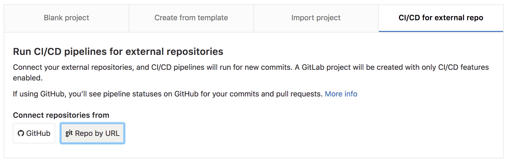
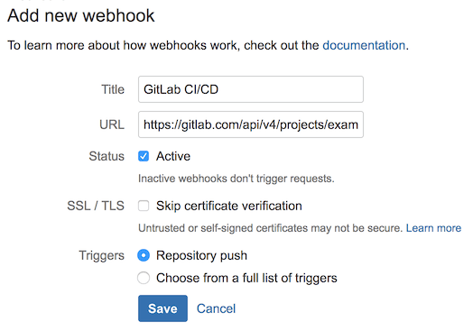
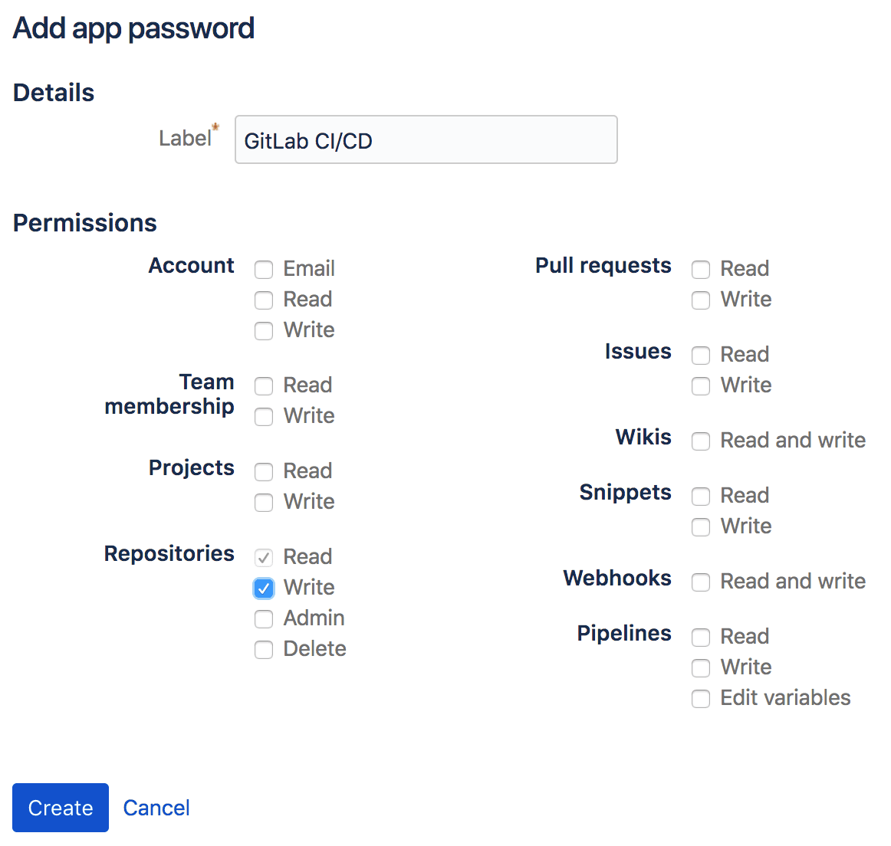

# Using GitLab CI/CD with a Bitbucket Cloud repository

GitLab CI/CD can be used with Bitbucket Cloud by creating a
[CI/CD project](../../user/project/ci_cd_for_external_repo.md) and connecting
your Git repository via URL.

1. In GitLab create a **CI/CD for external repo**, select **Repo by URL** and
   create the project.

    

    GitLab will import the repository and enable [Pull Mirroring][pull-mirroring].
    
1. In GitLab create a
   [Personal Access Token](../../user/profile/personal_access_tokens.md)
   with `api` scope. This will be used to authenticate requests from the web
   hook that will be created in Bitbucket to notify GitLab of new commits.

1. In Bitbucket from **Settings > Webhooks** create a new web hook to notify
   GitLab of new commits.

    The web hook URL should be set to the GitLab API to trigger pull mirroring,
    using the Personal Access Token we just generated for authentication.

    ```
    https://gitlab.com/api/v4/projects/<NAMESPACE>%2F<PROJECT>/mirror/pull?private_token=<PERSONAL_ACCESS_TOKEN>
    ```

    The web hook Trigger should be set to 'Repository Push'.

    

    After saving, test the web hook by pushing a change to your Bitbucket
    repository.

1. In Bitbucket create an **App Password** from **Bitbucket Settings > App
   Passwords** to authenticate the build status script setting commit build
   statuses in Bitbucket. Repository write permissions are required.

    

1. In GitLab from **Settings > CI/CD > Secret variables** add variables to allow
   communication with Bitbucket via the Bitbucket API.

    `BITBUCKET_ACCESS_TOKEN`: the Bitbucket app password created above

    `BITBUCKET_USERNAME`: the username of the Bitbucket account

    `BITBUCKET_NAMESPACE`: set this if your GitLab and Bitbucket namespaces differ

    `BITBUCKET_REPOSITORY`: set this if your GitLab and Bitbucket project names differ

1. In Bitbucket add a script to push the pipeline status to Bitbucket.

    > Note: changes made in GitLab will be overwritten by any changes made
    upstream in Bitbucket.

    Create a file `build_status` and insert the script below and run
    `chmod +x build_status` in your terminal to make the script executable.

    ```bash
    #!/usr/bin/env bash

    # Push GitLab CI/CD build status to Bitbucket Cloud

    if [ -z "$BITBUCKET_ACCESS_TOKEN" ]; then
       echo "ERROR: BITBUCKET_ACCESS_TOKEN is not set"
    exit 1
    fi
    if [ -z "$BITBUCKET_USERNAME" ]; then
        echo "ERROR: BITBUCKET_USERNAME is not set"
    exit 1
    fi
    if [ -z "$BITBUCKET_NAMESPACE" ]; then
        echo "Setting BITBUCKET_NAMESPACE to $CI_PROJECT_NAMESPACE"
        BITBUCKET_NAMESPACE=$CI_PROJECT_NAMESPACE
    fi
    if [ -z "$BITBUCKET_REPOSITORY" ]; then
        echo "Setting BITBUCKET_REPOSITORY to $CI_PROJECT_NAME"
        BITBUCKET_REPOSITORY=$CI_PROJECT_NAME
    fi

    BITBUCKET_API_ROOT="https://api.bitbucket.org/2.0"
    BITBUCKET_STATUS_API="$BITBUCKET_API_ROOT/repositories/$BITBUCKET_NAMESPACE/$BITBUCKET_REPOSITORY/commit/$CI_COMMIT_SHA/statuses/build"
    BITBUCKET_KEY="ci/gitlab-ci/$CI_JOB_NAME"

    case "$BUILD_STATUS" in
    running)
       BITBUCKET_STATE="INPROGRESS"
       BITBUCKET_DESCRIPTION="The build is running!"
       ;;
    passed)
       BITBUCKET_STATE="SUCCESSFUL"
       BITBUCKET_DESCRIPTION="The build passed!"
       ;;
    failed)
       BITBUCKET_STATE="FAILED"
       BITBUCKET_DESCRIPTION="The build failed."
       ;;
    esac

    echo "Pushing status to $BITBUCKET_STATUS_API..."
    curl --request POST $BITBUCKET_STATUS_API \
    --user $BITBUCKET_USERNAME:$BITBUCKET_ACCESS_TOKEN \
    --header "Content-Type:application/json" \
    --silent \
    --data "{ \"state\": \"$BITBUCKET_STATE\", \"key\": \"$BITBUCKET_KEY\", \"description\":
    \"$BITBUCKET_DESCRIPTION\",\"url\": \"$CI_PROJECT_URL/-/jobs/$CI_JOB_ID\" }"
    ```

1. Still in Bitbucket, create a `.gitlab-ci.yml` file to use the script to push
   pipeline success and failures to Bitbucket.

    ```
    stages:
      - test
      - ci_status

    unit-tests
      script:
        - echo "Success. Add your tests!"

    success:
      stage: ci_status
      before_script:
        - ""
      after_script:
        - ""
      script:
        - BUILD_STATUS=passed BUILD_KEY=push ./build_status
      when: on_success

    failure:
      stage: ci_status
      before_script:
        - ""
      after_script:
        - ""
      script:
        - BUILD_STATUS=failed BUILD_KEY=push ./build_status
      when: on_failure
    ```

GitLab is now configured to mirror changes from Bitbucket, run CI/CD pipelines
configured in `.gitlab-ci.yml` and push the status to Bitbucket.

[pull-mirroring]: ../../workflow/repository_mirroring.md#pulling-from-a-remote-repository
